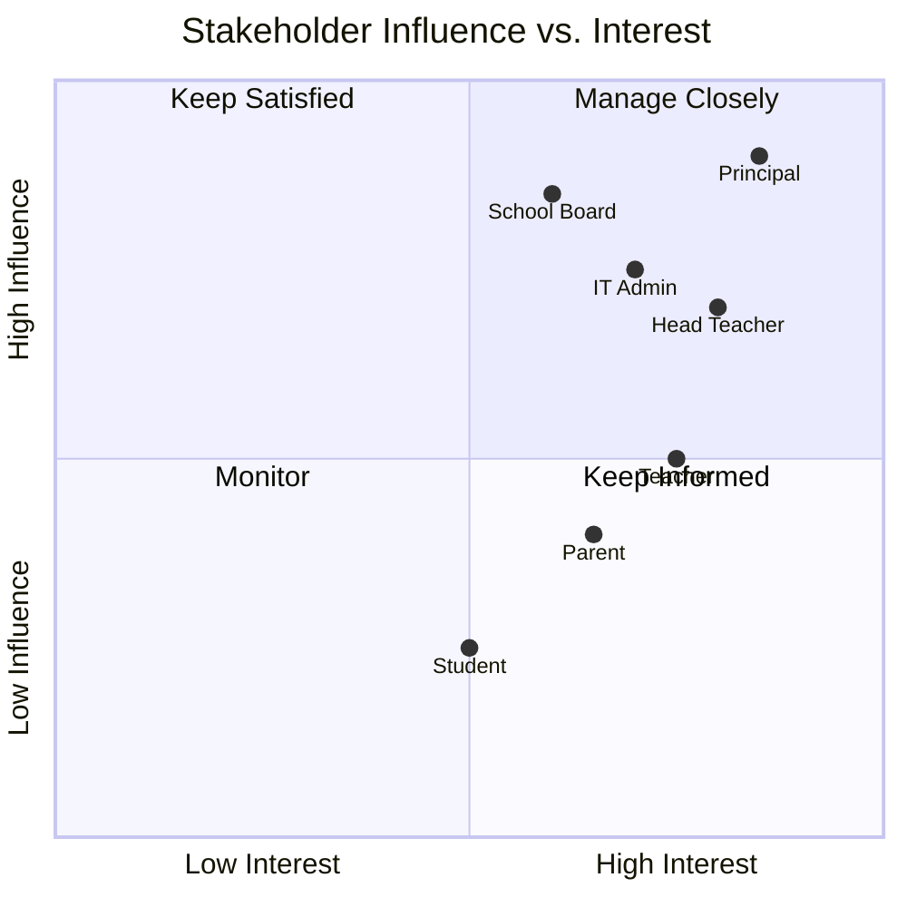

# 2. Stakeholder Analysis

## 2.1 Stakeholder Register

| # | Stakeholder | Role | Interest | Influence | Key Concern |
|---|-------------|------|----------|-----------|-------------|
| 1 | Dr. Sarah Johnson | Principal | Strategic oversight, compliance | High | ROI, adoption rate, data security |
| 2 | Mr. James Chen | Head Teacher | Operations management | High | Ease of use, minimal disruption |
| 3 | Ms. Maria Rodriguez | Teacher | Daily system user | Medium | Time savings, simple grade entry |
| 4 | Jennifer Williams | Parent | Progress monitoring | Medium | Visibility into child's performance |
| 5 | Alex Thompson | Student | Academic tracking | Low | Easy access to grades and assignments |
| 6 | David Kumar | IT Administrator | Technical maintenance | High | Security, maintainability, uptime |
| 7 | Robert Martinez | School Board | Governance and reporting | High | Compliance, budget, reporting |

## 2.2 Stakeholder Map

## 2.3 Stakeholder Needs Summary

**Principal** — Needs real-time dashboards showing school-wide attendance trends, grade distributions, and compliance reports. Wants the system to reduce parent complaints and administrative bottlenecks.

**Teachers** — Need a fast, intuitive interface for daily tasks: taking attendance (under 2 minutes per class), entering grades, creating assignments, and generating report cards without manual calculations.

**Parents** — Need a simple portal to check their child's attendance, current grades, and upcoming assignments without having to call the school.

**IT Administrator** — Needs a system that is easy to deploy, maintain, and back up. Requires role-based access control, audit logging, and FERPA compliance.

**Students** — Need to view their schedules, grades, and assignment details. Must be accessible from personal devices.

---

[← Previous: Introduction](./01-introduction.md) | [Back to Index](./00-index.md) | [Next: Requirements →](./03-requirements.md)
