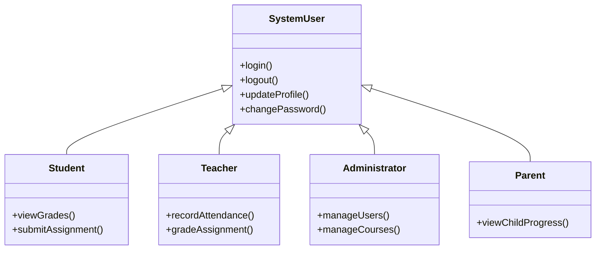
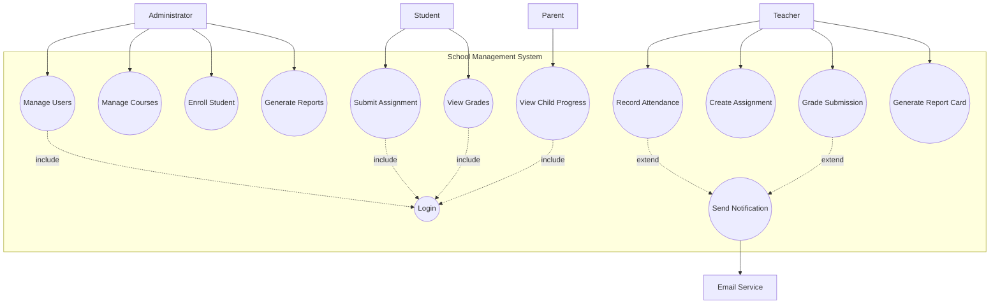

# 4. Use Case Model

## 4.1 Actor Catalog

| Actor | Type | Description | Key Goals |
|-------|------|-------------|-----------|
| Student | Primary | Enrolled learner (100–500 per semester) | View grades, submit assignments, check schedule |
| Teacher | Primary | Faculty member (10–30) | Record attendance, grade work, manage assignments |
| Administrator | Primary | Staff managing operations (2–5) | Manage users, courses, enrollment, reports |
| Parent | Primary | Guardian monitoring student progress (50–300) | View child's grades, attendance, assignments |
| Email Service | Secondary | External SMTP system | Deliver notifications and alerts |

### Actor Generalization

All actors share common authentication behavior (login, logout, profile management). Each role adds specific capabilities.

---

## 4.2 Use Case Diagram

**Relationships explained:**
- **Include (Login):** All primary use cases require authentication before proceeding.
- **Extend (Send Notification):** Grading and absence recording optionally trigger email notifications.

---

## 4.3 Use Case Descriptions

### UC-006: Submit Assignment (Fully Dressed)

| Field | Detail |
|-------|--------|
| **Use Case ID** | UC-006 |
| **Name** | Submit Assignment |
| **Actor** | Student |
| **Description** | A student uploads and submits their completed work for a specific assignment. |
| **Preconditions** | Student is logged in; student is enrolled in the course; assignment exists and is not past the deadline. |
| **Postconditions** | Submission is recorded; file is stored; teacher can view the submission. |
| **Trigger** | Student selects an assignment and clicks "Submit." |

**Main Success Scenario:**

| Step | Action |
|------|--------|
| 1 | Student navigates to their course page. |
| 2 | Student selects the assignment from the assignment list. |
| 3 | System displays assignment details (title, description, due date, max score). |
| 4 | Student clicks "Upload File" and selects a file from their device. |
| 5 | System validates the file (type and size within allowed limits). |
| 6 | Student clicks "Submit." |
| 7 | System records the submission with timestamp and stores the file. |
| 8 | System displays a confirmation message with submission receipt. |

**Alternative Flows:**

| ID | Condition | Steps |
|----|-----------|-------|
| A1 | Student has a previous submission | System shows existing submission. Student can choose to replace it. Previous submission is archived. |
| A2 | Student saves as draft | At step 6, student clicks "Save Draft" instead of "Submit." System saves progress without finalizing. |

**Exception Flows:**

| ID | Condition | Steps |
|----|-----------|-------|
| E1 | File type not allowed | System rejects the upload and displays: "Only PDF, DOCX, and ZIP files are accepted." |
| E2 | File exceeds size limit | System rejects the upload and displays: "File must be under 10 MB." |
| E3 | Deadline has passed | System disables the submit button and displays: "The deadline for this assignment has passed." If teacher allows late submissions, a "Submit Late" option appears. |

**Business Rules:**
- Accepted file types: PDF, DOCX, ZIP (configurable by teacher)
- Maximum file size: 10 MB
- Students may resubmit before the deadline (latest submission counts)
- Late submissions are flagged and may receive a penalty if configured

---

### UC-004: Record Attendance (Fully Dressed)

| Field | Detail |
|-------|--------|
| **Use Case ID** | UC-004 |
| **Name** | Record Attendance |
| **Actor** | Teacher |
| **Description** | A teacher records the attendance status for every student in a class session. |
| **Preconditions** | Teacher is logged in; class is assigned to the teacher; attendance has not already been recorded for this date. |
| **Postconditions** | Attendance records are saved; absent students' parents are notified (if enabled). |
| **Trigger** | Teacher opens the attendance page for a class. |

**Main Success Scenario:**

| Step | Action |
|------|--------|
| 1 | Teacher selects a class from their dashboard. |
| 2 | Teacher clicks "Take Attendance." |
| 3 | System displays the student roster with today's date pre-selected. All students default to "Present." |
| 4 | Teacher changes status for absent or late students (Absent / Late / Excused). |
| 5 | Teacher clicks "Save Attendance." |
| 6 | System validates that all students have a status and saves the records. |
| 7 | System sends email notifications to parents of absent students (if notification is enabled). |
| 8 | System displays confirmation: "Attendance saved for [Class] — [Date]." |

**Alternative Flows:**

| ID | Condition | Steps |
|----|-----------|-------|
| A1 | Attendance already recorded | System shows previously saved records. Teacher can edit and re-save. |
| A2 | Teacher records for a past date | System allows date selection within the current week only. |

**Exception Flows:**

| ID | Condition | Steps |
|----|-----------|-------|
| E1 | No students enrolled | System displays: "No students are enrolled in this class." |

---

### UC-008: View Grades (Brief)

| Field | Detail |
|-------|--------|
| **Use Case ID** | UC-008 |
| **Name** | View Grades |
| **Actors** | Student, Parent |
| **Description** | User views current grades for enrolled courses, including individual assignment scores and calculated course average. |
| **Main Flow** | 1) User logs in → 2) Selects a course → 3) System displays all graded assignments with scores, category weights, and calculated average → 4) User can expand any assignment to see teacher feedback. |
| **Preconditions** | User is authenticated; student is enrolled (or parent is linked to student). |
| **Postconditions** | None (read-only operation). |

---

[← Previous: Requirements](./03-requirements.md) | [Back to Index](./00-index.md) | [Next: User Stories →](./05-user-stories.md)
