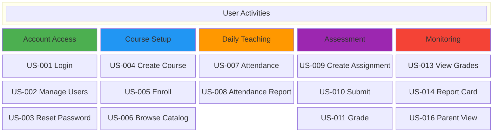

# 5. User Stories & Backlog

## 5.1 Epic Overview

| Epic | Description | Story Count |
|------|-------------|-------------|
| E1: User Management | Account creation, login, roles | 3 |
| E2: Course & Enrollment | Course setup and student enrollment | 3 |
| E3: Attendance | Daily attendance tracking | 2 |
| E4: Assignments | Creation, submission, and grading | 4 |
| E5: Grades & Reports | Grade viewing and report cards | 3 |
| E6: Parent Portal | Parent access to student data | 2 |

---

## 5.2 User Stories with Acceptance Criteria

### Epic 1: User Management

**US-001: User Login**
> As a **system user**, I want to **log in with my email and password** so that I can **access the system based on my role**.

Acceptance Criteria:
- Given valid credentials, when I click Login, then I am redirected to my role-specific dashboard.
- Given invalid credentials, when I click Login, then I see "Invalid email or password" and remain on the login page.
- Given 5 failed attempts, when I try again, then my account is locked for 15 minutes.

Story Points: 3 | Priority: Must

---

**US-002: Manage User Accounts**
> As an **administrator**, I want to **create and manage user accounts** so that **students, teachers, and parents can access the system**.

Acceptance Criteria:
- Given I fill in all required fields (name, email, role), when I click Create, then the account is created and a welcome email is sent.
- Given I deactivate an account, when that user tries to log in, then they see "Account deactivated. Contact administrator."
- Given I search by name or email, when results appear, then I can edit or deactivate any account.

Story Points: 5 | Priority: Must

---

**US-003: Reset Password**
> As a **system user**, I want to **reset my password via email** so that I can **regain access if I forget it**.

Acceptance Criteria:
- Given I enter my registered email, when I click Reset, then I receive a reset link valid for 1 hour.
- Given I click an expired link, when the page loads, then I see "This link has expired. Request a new one."

Story Points: 2 | Priority: Must

---

### Epic 2: Course & Enrollment

**US-004: Create Course**
> As an **administrator**, I want to **create a course with name, description, capacity, and schedule** so that **teachers can be assigned and students can be enrolled**.

Acceptance Criteria:
- Given I fill in all course details, when I click Save, then the course appears in the course catalog.
- Given I set capacity to 30, when 30 students are enrolled, then new enrollment attempts are rejected with a "Course full" message.

Story Points: 3 | Priority: Must

---

**US-005: Enroll Student**
> As an **administrator**, I want to **enroll a student in a course** so that **they appear on the class roster and can access course materials**.

Acceptance Criteria:
- Given I select a student and a course, when I click Enroll, then the student appears on the roster.
- Given the course is full, when I try to enroll, then I see "Course has reached maximum capacity."

Story Points: 3 | Priority: Must

---

**US-006: Browse Course Catalog**
> As a **student**, I want to **browse available courses** so that I can **see what is offered this semester**.

Acceptance Criteria:
- Given I open the catalog, when courses are listed, then I see name, teacher, schedule, and available seats.
- Given I search by keyword, when results appear, then only matching courses are shown.

Story Points: 2 | Priority: Should

---

### Epic 3: Attendance

**US-007: Record Attendance**
> As a **teacher**, I want to **record attendance for my class** so that **the school has accurate daily records**.

Acceptance Criteria:
- Given I open attendance for today, when the roster loads, then all students default to "Present."
- Given I mark a student Absent and save, when a parent is linked, then the parent receives an email notification.
- Given I complete attendance, when I click Save, then the total time from open to save is under 2 minutes for a 30-student class.

Story Points: 5 | Priority: Must

---

**US-008: View Attendance Report**
> As an **administrator**, I want to **generate an attendance report by class and date range** so that I can **monitor patterns and compliance**.

Acceptance Criteria:
- Given I select a class and date range, when I click Generate, then I see a summary table with each student's attendance counts.
- Given I click Export, when the file downloads, then it is a properly formatted CSV.

Story Points: 3 | Priority: Must

---

### Epic 4: Assignments

**US-009: Create Assignment**
> As a **teacher**, I want to **create an assignment with title, instructions, due date, and max score** so that **students know what to submit**.

Acceptance Criteria:
- Given I fill in all fields and click Publish, then students enrolled in the course can see the assignment.
- Given I set a due date in the past, when I try to save, then I see "Due date must be in the future."

Story Points: 3 | Priority: Must

---

**US-010: Submit Assignment**
> As a **student**, I want to **upload and submit my work before the deadline** so that **my teacher can grade it**.

Acceptance Criteria:
- Given I upload a PDF under 10 MB, when I click Submit, then I see a confirmation with timestamp.
- Given the deadline has passed, when I view the assignment, then the Submit button is disabled.
- Given I already submitted, when I upload a new file, then it replaces my previous submission.

Story Points: 5 | Priority: Must

---

**US-011: Grade Submission**
> As a **teacher**, I want to **assign a score and write feedback for a student's submission** so that **students know how they performed**.

Acceptance Criteria:
- Given I enter a score (0 to max) and feedback, when I click Save, then the grade appears on the student's grade page.
- Given I save a grade, when the student has notification enabled, then they receive an email.

Story Points: 3 | Priority: Must

---

**US-012: View Assignment Feedback**
> As a **student**, I want to **see my grade and teacher feedback** so that I can **understand my performance and improve**.

Acceptance Criteria:
- Given my assignment is graded, when I open it, then I see my score, max score, and written feedback.

Story Points: 1 | Priority: Must

---

### Epic 5: Grades & Reports

**US-013: View Current Grades**
> As a **student**, I want to **see my current grades for each course** so that I can **track my academic standing**.

Acceptance Criteria:
- Given I have graded assignments, when I open a course, then I see each score, category weights, and calculated average.

Story Points: 3 | Priority: Must

---

**US-014: Generate Report Card**
> As a **teacher**, I want to **generate report cards for my class** so that **students and parents receive official grade summaries**.

Acceptance Criteria:
- Given all assignments are graded, when I click Generate Report Cards, then a PDF is created for each student with course average and letter grade.

Story Points: 5 | Priority: Must

---

**US-015: School-Wide Reports**
> As an **administrator**, I want to **view grade distribution and attendance summaries across all courses** so that I can **identify trends and issues**.

Acceptance Criteria:
- Given I select a semester, when the dashboard loads, then I see grade distributions and attendance rates per course.

Story Points: 5 | Priority: Should

---

### Epic 6: Parent Portal

**US-016: View Child Progress**
> As a **parent**, I want to **see my child's grades, attendance, and assignments** so that I can **support their learning at home**.

Acceptance Criteria:
- Given my account is linked to my child, when I log in, then I see a dashboard with attendance summary, current grades, and upcoming assignments.

Story Points: 3 | Priority: Must

---

**US-017: Link Parent to Student**
> As an **administrator**, I want to **link a parent account to a student account** so that **the parent can view their child's data**.

Acceptance Criteria:
- Given I select a parent and student, when I click Link, then the parent's dashboard shows that student's information.
- Given a parent has multiple children enrolled, when I link all, then the parent can switch between children.

Story Points: 2 | Priority: Must

---

## 5.3 Story Map Summary

**Release 1 (Sprint 1–4):** Top row — Login, Create Course, Attendance, Create Assignment, View Grades
**Release 2 (Sprint 5–6):** Middle row — Manage Users, Enroll, Reports, Submissions, Report Cards
**Release 3 (Sprint 7–8):** Bottom row — Password Reset, Catalog, Grading, Parent Portal

---

[← Previous: Use Case Model](./04-use-case-model.md) | [Back to Index](./00-index.md) | [Next: Domain Model →](./06-domain-model.md)
