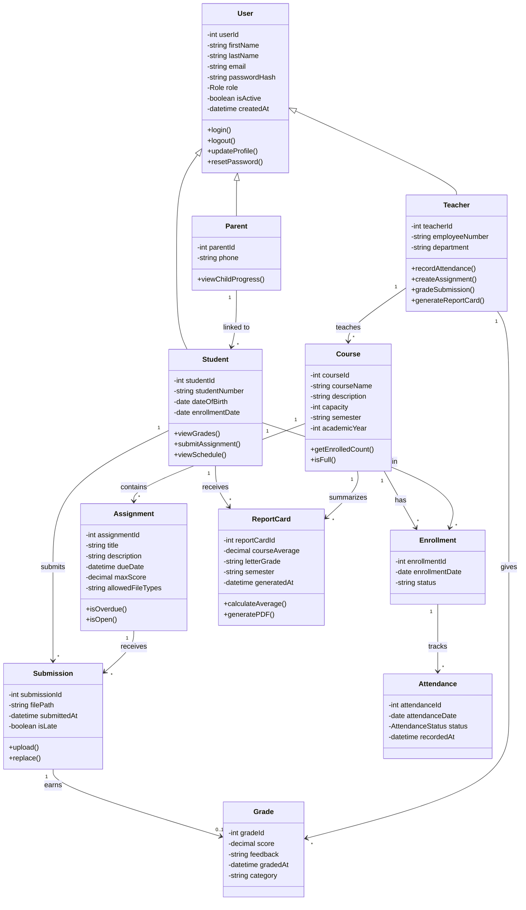
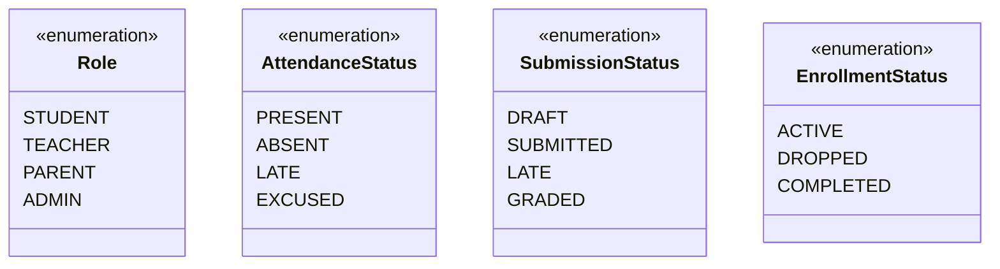

# 6. Domain Model & Class Diagram

## 6.1 Identifying Classes from Use Cases

Domain classes are discovered by extracting nouns from use case descriptions and requirements. The key technique is to examine actors, objects mentioned in scenarios, and data that must be stored.

| Source | Nouns Extracted | Candidate Class |
|--------|----------------|-----------------|
| UC-003: Enroll Student | student, course, enrollment, date | Student, Course, Enrollment |
| UC-006: Submit Assignment | student, assignment, submission, file, deadline | Assignment, Submission |
| UC-004: Record Attendance | teacher, class, student, date, status | Attendance |
| UC-007: Grade Submission | teacher, submission, score, feedback | Grade |
| UC-009: Generate Report Card | student, course, average, letter grade | ReportCard |
| FR-001: Manage Users | user, account, role, email | User |
| FR-023: Parent Portal | parent, child, link | ParentStudentLink |

After filtering out duplicates, attributes, and out-of-scope nouns, the final domain classes are identified below.

---

## 6.2 Domain Model

---

## 6.3 Class Relationship Summary

| Relationship | Type | Description |
|-------------|------|-------------|
| User → Student/Teacher/Parent | **Inheritance** | All users share authentication; each role adds specific behavior. |
| Student → Enrollment → Course | **Association** | Many-to-many resolved through the Enrollment class. A student enrolls in many courses; a course has many students. |
| Course → Assignment | **Composition** | Assignments belong to a course and cannot exist without it. Deleting a course deletes its assignments. |
| Assignment → Submission | **Aggregation** | A submission references an assignment but is owned by the student. |
| Submission → Grade | **Association (1:0..1)** | A submission may or may not be graded. Each grade belongs to exactly one submission. |
| Enrollment → Attendance | **Composition** | Attendance records are tied to a specific enrollment (student + course combination). |
| Parent → Student | **Association** | A parent can be linked to one or more students. |

## 6.4 Enumeration Types

---

[← Previous: User Stories](./05-user-stories.md) | [Back to Index](./00-index.md) | [Next: UML Behavioral Models →](./07-uml-behavioral.md)
