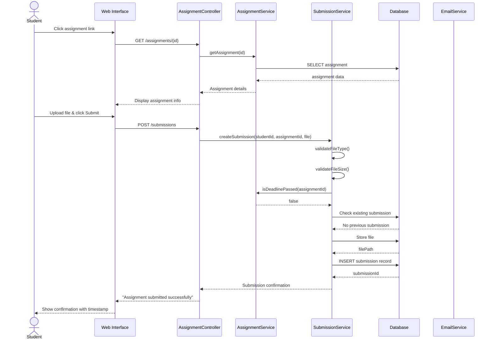
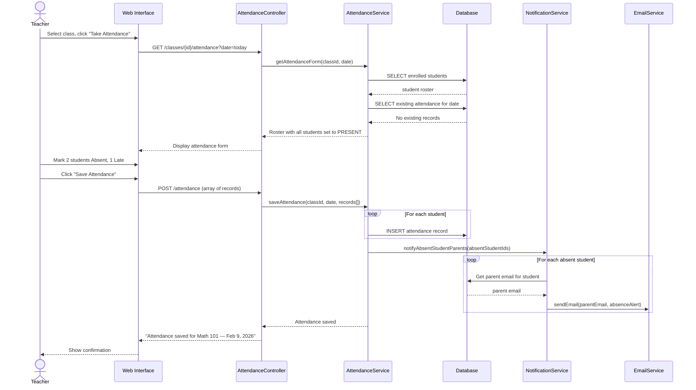
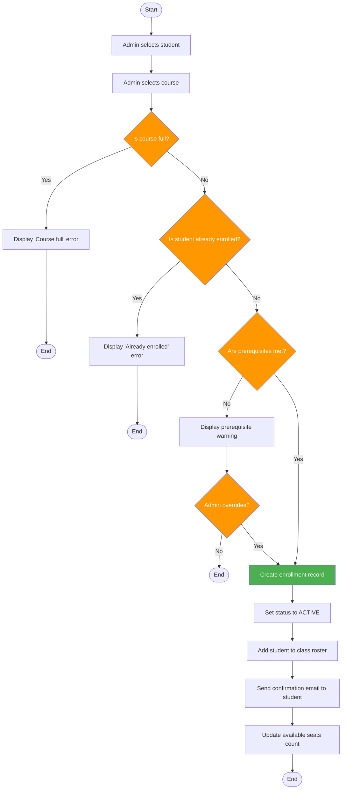
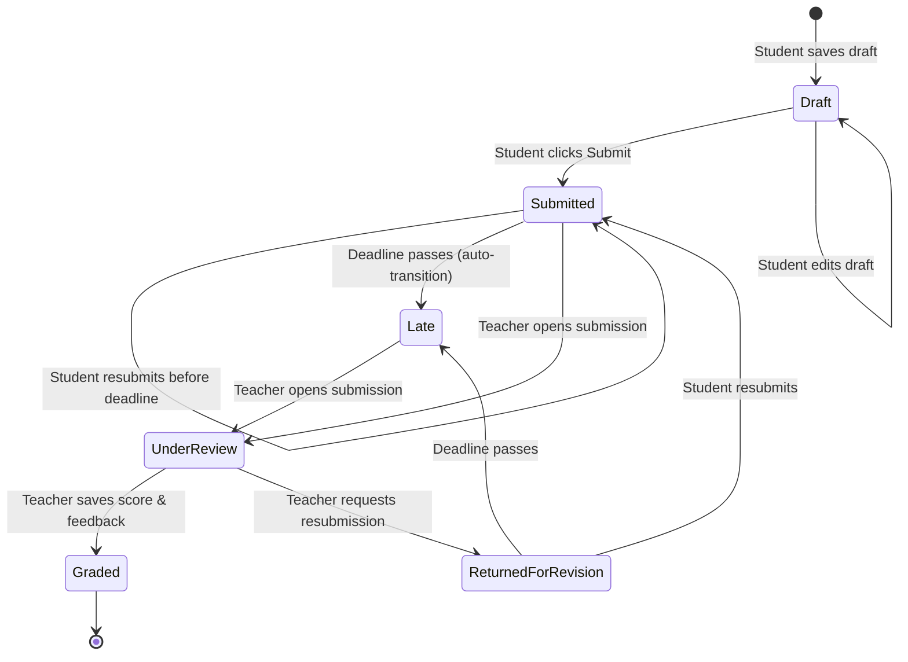
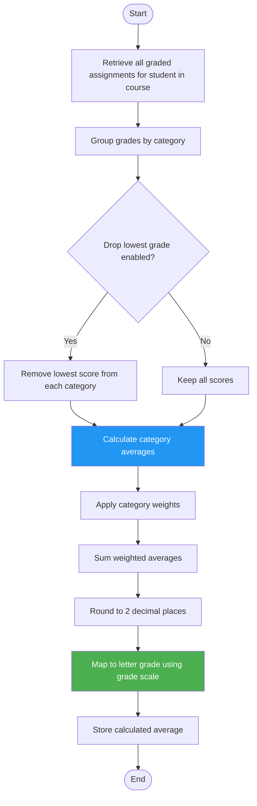

# 7. UML Behavioral Models

## 7.1 Sequence Diagram: Submit Assignment

This diagram shows the interaction between objects when a student submits an assignment (UC-006).

---

## 7.2 Sequence Diagram: Record Attendance

This diagram shows the interaction when a teacher records attendance for a class (UC-004).

---

## 7.3 Activity Diagram: Student Enrollment Process

This diagram models the complete business process when an administrator enrolls a student in a course.

---

## 7.4 State Machine Diagram: Assignment Lifecycle

This diagram tracks the states an assignment submission goes through from creation to completion.

**State Descriptions:**

| State | Description | Allowed Transitions |
|-------|-------------|---------------------|
| Draft | Student has saved work but not submitted. | Edit, Submit |
| Submitted | Work is submitted and awaiting review. | Resubmit, auto-transition to Late |
| Late | Submitted after the deadline. Flagged for teacher awareness. | Teacher review |
| Under Review | Teacher is actively evaluating the submission. | Grade, Return |
| Returned for Revision | Teacher requests changes. Student can resubmit. | Resubmit |
| Graded | Final score and feedback recorded. Terminal state. | None |

---

## 7.5 Activity Diagram: Grade Calculation

This models the business logic for calculating a student's course average (FR-019).

**Example Calculation:**

| Category | Weight | Scores | Average |
|----------|--------|--------|---------|
| Homework | 30% | 85, 90, 78 | 84.33 |
| Quizzes | 20% | 92, 88 | 90.00 |
| Exams | 50% | 75, 82 | 78.50 |

Weighted Average = (84.33 × 0.30) + (90.00 × 0.20) + (78.50 × 0.50) = 25.30 + 18.00 + 39.25 = **82.55 (B)**

---

[← Previous: Domain Model](./06-domain-model.md) | [Back to Index](./00-index.md) | [Next: Database Design →](./08-database-design.md)
