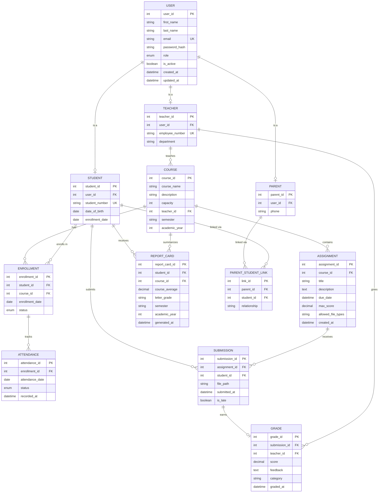

# 8. Database Design

## 8.1 Entity-Relationship Diagram

---

## 8.2 Normalized Schema

The schema is normalized to Third Normal Form (3NF). Each table eliminates redundancy and ensures every non-key column depends only on the primary key.

### Core Tables

**users**

| Column | Type | Constraints | Notes |
|--------|------|-------------|-------|
| user_id | INT | PK, AUTO_INCREMENT | |
| first_name | VARCHAR(50) | NOT NULL | |
| last_name | VARCHAR(50) | NOT NULL | |
| email | VARCHAR(100) | NOT NULL, UNIQUE | Used for login |
| password_hash | VARCHAR(255) | NOT NULL | bcrypt, 12 rounds |
| role | ENUM('STUDENT','TEACHER','PARENT','ADMIN') | NOT NULL | |
| is_active | BOOLEAN | DEFAULT TRUE | Soft delete |
| created_at | DATETIME | DEFAULT CURRENT_TIMESTAMP | |
| updated_at | DATETIME | ON UPDATE CURRENT_TIMESTAMP | |

**students**

| Column | Type | Constraints | Notes |
|--------|------|-------------|-------|
| student_id | INT | PK, AUTO_INCREMENT | |
| user_id | INT | FK → users, UNIQUE | 1:1 with users |
| student_number | VARCHAR(20) | NOT NULL, UNIQUE | e.g., "STU-2026-001" |
| date_of_birth | DATE | NOT NULL | |
| enrollment_date | DATE | NOT NULL | Date admitted to school |

**courses**

| Column | Type | Constraints | Notes |
|--------|------|-------------|-------|
| course_id | INT | PK, AUTO_INCREMENT | |
| course_name | VARCHAR(100) | NOT NULL | |
| description | TEXT | | |
| capacity | INT | NOT NULL, DEFAULT 30 | |
| teacher_id | INT | FK → teachers | |
| semester | VARCHAR(20) | NOT NULL | e.g., "Fall 2026" |
| academic_year | INT | NOT NULL | e.g., 2026 |

**enrollments**

| Column | Type | Constraints | Notes |
|--------|------|-------------|-------|
| enrollment_id | INT | PK, AUTO_INCREMENT | |
| student_id | INT | FK → students | |
| course_id | INT | FK → courses | |
| enrollment_date | DATE | NOT NULL | |
| status | ENUM('ACTIVE','DROPPED','COMPLETED') | DEFAULT 'ACTIVE' | |
| | | UNIQUE(student_id, course_id) | Prevents duplicate enrollment |

**assignments**

| Column | Type | Constraints | Notes |
|--------|------|-------------|-------|
| assignment_id | INT | PK, AUTO_INCREMENT | |
| course_id | INT | FK → courses, ON DELETE CASCADE | |
| title | VARCHAR(200) | NOT NULL | |
| description | TEXT | | |
| due_date | DATETIME | NOT NULL | |
| max_score | DECIMAL(5,2) | NOT NULL | e.g., 100.00 |
| allowed_file_types | VARCHAR(100) | DEFAULT 'pdf,docx,zip' | |
| created_at | DATETIME | DEFAULT CURRENT_TIMESTAMP | |

**submissions**

| Column | Type | Constraints | Notes |
|--------|------|-------------|-------|
| submission_id | INT | PK, AUTO_INCREMENT | |
| assignment_id | INT | FK → assignments | |
| student_id | INT | FK → students | |
| file_path | VARCHAR(500) | NOT NULL | Server storage path |
| submitted_at | DATETIME | DEFAULT CURRENT_TIMESTAMP | |
| is_late | BOOLEAN | DEFAULT FALSE | Set by trigger or app logic |
| | | UNIQUE(assignment_id, student_id) | One submission per student |

**grades**

| Column | Type | Constraints | Notes |
|--------|------|-------------|-------|
| grade_id | INT | PK, AUTO_INCREMENT | |
| submission_id | INT | FK → submissions, UNIQUE | 1:1 with submissions |
| teacher_id | INT | FK → teachers | Who graded it |
| score | DECIMAL(5,2) | NOT NULL | |
| feedback | TEXT | | |
| category | VARCHAR(50) | NOT NULL | e.g., "Homework", "Exam" |
| graded_at | DATETIME | DEFAULT CURRENT_TIMESTAMP | |

**attendance**

| Column | Type | Constraints | Notes |
|--------|------|-------------|-------|
| attendance_id | INT | PK, AUTO_INCREMENT | |
| enrollment_id | INT | FK → enrollments | |
| attendance_date | DATE | NOT NULL | |
| status | ENUM('PRESENT','ABSENT','LATE','EXCUSED') | NOT NULL | |
| recorded_at | DATETIME | DEFAULT CURRENT_TIMESTAMP | |
| | | UNIQUE(enrollment_id, attendance_date) | One record per day |

---

## 8.3 Key Design Decisions

**Inheritance strategy (User → Student/Teacher/Parent):** We use a **joined table** approach. The `users` table holds shared columns (name, email, credentials). Each role has its own table (`students`, `teachers`, `parents`) with a foreign key back to `users`. This keeps each table focused and avoids null-heavy columns.

**Enrollment as an association class:** The many-to-many relationship between Student and Course is resolved through the `enrollments` table, which also carries its own attributes (enrollment date, status). Attendance is linked to enrollment rather than directly to student + course, ensuring records are always in context.

**Soft deletes:** User accounts use an `is_active` flag rather than physical deletion to preserve audit trails and historical data integrity (required by NFR-007 / FERPA).

**Cascade rules:** Deleting a course cascades to its assignments (composition relationship). Submissions and grades are preserved via enrollment even if a student later drops a course (status changes to DROPPED, records remain).

---

[← Previous: UML Models](./07-uml-behavioral.md) | [Back to Index](./00-index.md) | [Next: Architectural Design →](./09-architecture.md)
