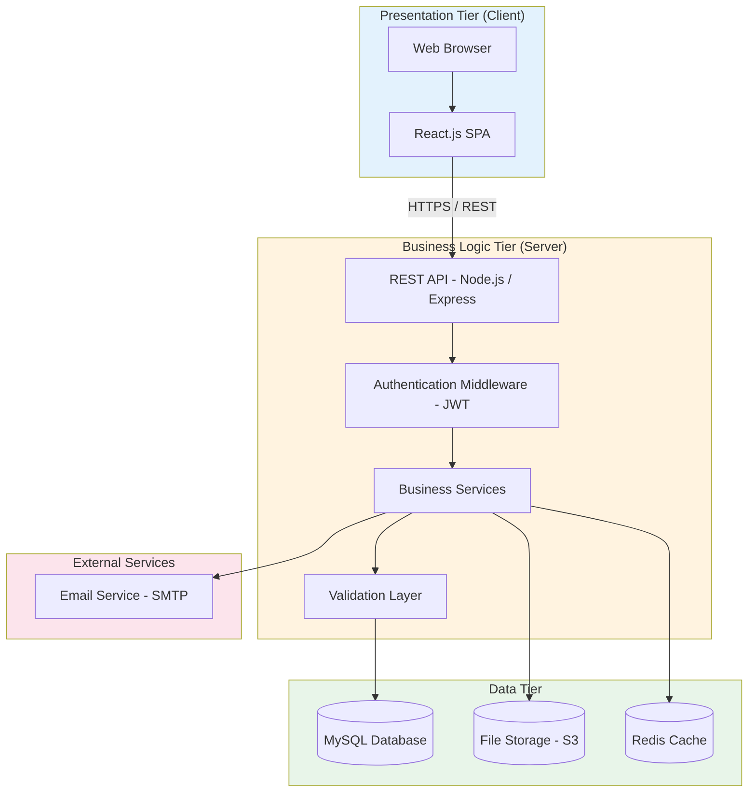
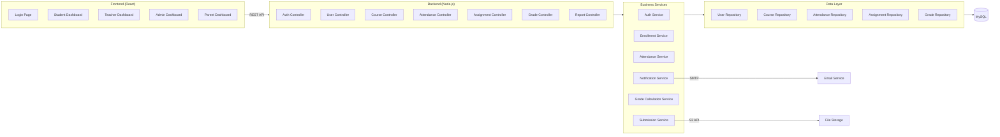
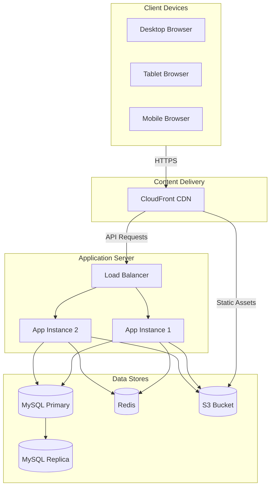

# 9. Architectural Design

## 9.1 Architecture Pattern: Three-Tier

The SMS uses a **three-tier (layered) architecture**, separating the system into Presentation, Business Logic, and Data tiers. This is the most appropriate pattern for a mid-sized web application because it provides clear separation of concerns, allows independent scaling of each tier, and is well-supported by the chosen technology stack.

## 9.2 Technology Stack

| Layer | Technology | Justification |
|-------|-----------|---------------|
| Frontend | React.js | Component-based, large ecosystem, fast rendering |
| Backend | Node.js + Express | Full-stack JavaScript, async I/O, scalable |
| Database | MySQL | Relational data model, ACID compliance, mature tooling |
| Cache | Redis | Session storage, frequently accessed data (dashboards) |
| File Storage | AWS S3 | Scalable, reliable storage for assignment submissions |
| Authentication | JWT + bcrypt | Stateless auth, secure password hashing |
| API Style | RESTful | Industry standard, well-tooled, easy to test |
| Email | SMTP (SendGrid) | Reliable transactional email delivery |

## 9.3 Component Diagram

## 9.4 Architecture Decisions

| Decision | Choice | Alternatives Considered | Rationale |
|----------|--------|------------------------|-----------|
| Architecture style | Three-tier monolith | Microservices | Simpler for a small team; microservices add overhead without clear benefit at this scale. |
| Frontend rendering | Single Page App (SPA) | Server-side rendering | Better user experience for dashboard-heavy app; API reuse for future mobile app. |
| Database | Relational (MySQL) | NoSQL (MongoDB) | Data is highly relational (students → enrollments → courses); ACID needed for grades. |
| Authentication | JWT tokens | Session cookies | Stateless auth scales better; works well with SPA architecture. |
| File storage | S3 (external) | Local file system | Scalable, durable, and separates file storage from application server. |

## 9.5 Deployment View

For version 1.0, a single application instance behind a load balancer is sufficient for 500 concurrent users. The architecture supports horizontal scaling (adding more app instances) to reach the 5,000-user target (NFR-015) without code changes.

---

[← Previous: Database Design](./08-database-design.md) | [Back to Index](./00-index.md) | [Next: Detailed Design →](./10-detailed-design.md)
