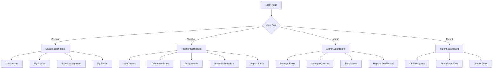

# 11. UI/UX Design

## 11.1 Design Principles

The SMS interface follows these core principles drawn from established usability heuristics:

| Principle | Application in SMS |
|-----------|-------------------|
| **Consistency** | All dashboards use the same layout pattern: top nav, left sidebar, main content area. |
| **Visibility** | Current page is highlighted in navigation. Status badges (Present/Absent) use color coding. |
| **Feedback** | Every action shows a confirmation toast. Save buttons show loading state. |
| **Error Prevention** | Date pickers prevent selecting past dates for assignments. Enrollment blocks when course is full. |
| **Accessibility** | WCAG 2.1 AA compliant. Color is never the only indicator. All images have alt text. |

## 11.2 Navigation Structure



Every function is reachable within **3 clicks** from the dashboard (NFR-010).

## 11.3 Wireframes

### Login Page

```
┌─────────────────────────────────────────────┐
│              School Management System        │
│                   [School Logo]               │
│                                              │
│         ┌──────────────────────────┐         │
│         │  Email                   │         │
│         └──────────────────────────┘         │
│         ┌──────────────────────────┐         │
│         │  Password            [👁] │         │
│         └──────────────────────────┘         │
│                                              │
│         [        Log In          ]           │
│                                              │
│         Forgot password?                     │
│                                              │
└─────────────────────────────────────────────┘
```

### Teacher Dashboard

```
┌─────────────────────────────────────────────────────────────┐
│  [Logo] School Management System    Teacher: Ms. Rodriguez  │
│  Dashboard | My Classes | Attendance | Assignments | Grades │
├─────────────┬───────────────────────────────────────────────┤
│             │                                               │
│ QUICK STATS │  MY CLASSES                                   │
│             │  ┌──────────────┐  ┌──────────────┐           │
│ Classes: 4  │  │ Math 101-A   │  │ Math 102-B   │           │
│ Students:102│  │ 25 students  │  │ 28 students  │           │
│ Pending     │  │ [Attendance] │  │ [Attendance] │           │
│ Grades: 12  │  │ [Grades]     │  │ [Grades]     │           │
│             │  └──────────────┘  └──────────────┘           │
│ TODAY       │  ┌──────────────┐  ┌──────────────┐           │
│ Schedule:   │  │ Algebra-C    │  │ Stats 201    │           │
│  9AM Math101│  │ 22 students  │  │ 30 students  │           │
│ 11AM Math102│  │ [Attendance] │  │ [Attendance] │           │
│  2PM Algebra│  │ [Grades]     │  │ [Grades]     │           │
│             │  └──────────────┘  └──────────────┘           │
│             │                                               │
│ RECENT      │  UPCOMING DEADLINES                           │
│ ACTIVITY    │  • Homework 3 due Feb 12 (Math 101)           │
│ • Graded 15 │  • Quiz 2 due Feb 14 (Math 102)              │
│   submissions│                                              │
│ • 2 absent  │  PENDING GRADING: 12 submissions              │
│   today     │  [Grade Now →]                                │
│             │                                               │
├─────────────┴───────────────────────────────────────────────┤
│  © 2026 School Management System                            │
└─────────────────────────────────────────────────────────────┘
```

### Attendance Page

```
┌─────────────────────────────────────────────────────────────┐
│  [Logo] School Management System    Teacher: Ms. Rodriguez  │
│  Dashboard | My Classes | Attendance | Assignments | Grades │
├─────────────────────────────────────────────────────────────┤
│                                                             │
│  Take Attendance: Math 101-A          Date: [Feb 9, 2026]  │
│                                                             │
│  ┌───┬──────────────────┬─────────┬────────┬──────┬───────┐│
│  │ # │ Student Name     │ Present │ Absent │ Late │Excused││
│  ├───┼──────────────────┼─────────┼────────┼──────┼───────┤│
│  │ 1 │ Adams, Sarah     │   (●)   │  ( )   │ ( )  │  ( )  ││
│  │ 2 │ Chen, Michael    │   ( )   │  (●)   │ ( )  │  ( )  ││
│  │ 3 │ Garcia, Emma     │   (●)   │  ( )   │ ( )  │  ( )  ││
│  │ 4 │ Johnson, Alex    │   ( )   │  ( )   │ (●)  │  ( )  ││
│  │ 5 │ Williams, Jordan │   (●)   │  ( )   │ ( )  │  ( )  ││
│  │...│ ...              │   ...   │  ...   │ ...  │  ...  ││
│  └───┴──────────────────┴─────────┴────────┴──────┴───────┘│
│                                                             │
│  Summary: Present: 23 | Absent: 1 | Late: 1 | Excused: 0  │
│                                                             │
│  [Mark All Present]              [Save Attendance]          │
│                                                             │
└─────────────────────────────────────────────────────────────┘
```

### Parent Dashboard

```
┌─────────────────────────────────────────────────────────────┐
│  [Logo] School Management System      Parent: J. Williams   │
│  Dashboard | My Profile                  Child: [Alex ▼]    │
├─────────────────────────────────────────────────────────────┤
│                                                             │
│  ALEX'S OVERVIEW                                            │
│                                                             │
│  Attendance This Month         Current Grades               │
│  ┌─────────────────┐          ┌──────────────────────┐     │
│  │ Present: 18     │          │ Math 101      B+ 87% │     │
│  │ Absent:  1      │          │ Science 201   A  93% │     │
│  │ Late:    1      │          │ English 101   B  84% │     │
│  │ Rate:   90%     │          │ History 101   A- 91% │     │
│  └─────────────────┘          └──────────────────────┘     │
│                                                             │
│  UPCOMING ASSIGNMENTS                                       │
│  ┌──────────────────────────────────────────────────┐      │
│  │ Homework 3 (Math 101)      Due: Feb 12  ⚠ 3 days│      │
│  │ Essay Draft (English 101)  Due: Feb 15  5 days   │      │
│  │ Lab Report (Science 201)   Due: Feb 18  9 days   │      │
│  └──────────────────────────────────────────────────┘      │
│                                                             │
│  RECENT ACTIVITY                                            │
│  • Feb 8: Homework 2 (Math 101) graded — 85/100            │
│  • Feb 7: Quiz 1 (Science 201) graded — 92/100             │
│  • Feb 5: Marked absent from History 101                    │
│                                                             │
└─────────────────────────────────────────────────────────────┘
```

## 11.4 Accessibility Considerations

| Requirement | Implementation |
|-------------|----------------|
| Color contrast | All text meets 4.5:1 contrast ratio against backgrounds. |
| Color independence | Attendance status uses icons alongside colors (✓ Present, ✗ Absent, ⏰ Late). |
| Keyboard navigation | All interactive elements reachable via Tab. Forms support Enter to submit. |
| Screen readers | All form fields have associated labels. Tables use proper header markup. |
| Responsive design | Layouts adapt from 1920px desktop down to 375px mobile. Teacher attendance form collapses to a list view on small screens. |
| Font sizing | Base font 16px. Users can scale up to 200% without layout breakage. |

## 11.5 UI Component Standards

| Component | Specification |
|-----------|--------------|
| Primary button | Blue (#2196F3), white text, 8px radius, 48px min height |
| Danger button | Red (#F44336), used only for destructive actions (delete, deactivate) |
| Input fields | 40px height, 1px gray border, 4px radius, placeholder text in gray |
| Status badges | Green (Present/Active), Red (Absent/Inactive), Orange (Late/Pending) |
| Toast notifications | Bottom-right, auto-dismiss after 5 seconds, green for success, red for error |
| Cards | White background, 4px shadow, 12px padding, 8px radius |

---

[← Previous: Detailed Design](./10-detailed-design.md) | [Back to Index](./00-index.md) | [Next: Traceability Matrix →](./12-traceability.md)
