# 1.1 Why SDLC Matters

[← Back to README](./chapter-01-README.md) | [Next: 1.2 SDLC Phases →](./1.2-sdlc-phases.md)

---

## 📖 Introduction

Have you ever wondered why some software projects succeed brilliantly while others fail spectacularly? Why do some apps work flawlessly while others crash constantly? The answer often lies in how the software was developed—specifically, whether a structured Software Development Lifecycle (SDLC) was followed.

In this section, you'll discover why SDLC is not just academic theory, but a critical framework that determines project success or failure.

**Reading Time:** 25 minutes  
**Hands-on Activity:** 10 minutes

---

## 🎯 Learning Objectives

By the end of this section, you will be able to:

1. Explain why structured software development processes are essential
2. Identify the consequences of poor planning in real-world projects
3. Analyze case studies of software failures and successes
4. Recognize the financial and human costs of inadequate SDLC
5. Understand the historical context of the "software crisis"

---

## 💥 When Software Goes Wrong: Real-World Disasters

### Case Study 1: Healthcare.gov Launch Disaster (2013)

**The Project:**
The U.S. government's Affordable Care Act (Obamacare) required a website where millions of Americans could shop for health insurance.

**What Happened:**
- **Launch Date:** October 1, 2013
- **Budget:** $840 million initially spent
- **Result:** Complete failure on day one

**The Failure:**

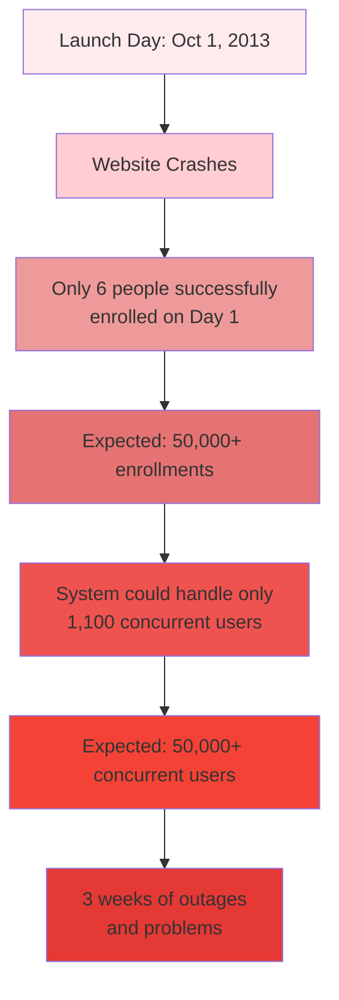

**Root Causes:**
1. ❌ **No Clear Requirements:** Different stakeholders had conflicting visions
2. ❌ **Poor Testing:** Inadequate load testing before launch
3. ❌ **Integration Issues:** 55+ contractors working without coordination
4. ❌ **No Risk Management:** Critical issues ignored until too late
5. ❌ **Changing Requirements:** Constant changes without proper change control
6. ❌ **Unrealistic Deadlines:** Political deadline overrode technical readiness

**The Cost:**

| Cost Category | Amount |
|---------------|---------|
| Initial Development | $840 million |
| Emergency Fixes (3 months) | $175 million |
| Reputation Damage | Immeasurable |
| Political Fallout | Significant |
| **Total Direct Cost** | **$1+ billion** |

**What Was Missing:**
- Proper requirements gathering and documentation
- Comprehensive testing strategy
- Integration testing across all systems
- Risk assessment and mitigation plans
- Realistic project timeline
- **A structured SDLC approach**

---

### Case Study 2: Boeing 737 MAX Software Failure (2018-2019)

**The Project:**
Boeing developed the 737 MAX with new flight control software called MCAS (Maneuvering Characteristics Augmentation System).

**What Happened:**
- **Result:** Two fatal crashes killing 346 people
- **Financial Impact:** $20+ billion in losses
- **Consequence:** Worldwide grounding of all 737 MAX aircraft

**The Failure Chain:**

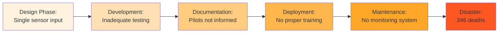

**Root Causes:**
1. ❌ **Requirements Shortcuts:** Cost-cutting led to single-sensor dependency
2. ❌ **Inadequate Testing:** Software not tested under all conditions
3. ❌ **Poor Documentation:** Pilots unaware of critical system behavior
4. ❌ **No Safety Analysis:** Risk assessment insufficient for life-critical software
5. ❌ **Schedule Pressure:** Market competition rushed development

**Lessons Learned:**
- **Safety-critical systems require rigorous SDLC**
- Testing must cover all edge cases
- Documentation is not optional
- Requirements must prioritize safety over cost
- External validation and verification are essential

---

### Case Study 3: Knight Capital Trading Loss (2012)

**The Project:**
Knight Capital, a major stock trading firm, deployed new trading software.

**What Happened:**
- **Date:** August 1, 2012
- **Duration:** 45 minutes
- **Loss:** $440 million
- **Outcome:** Company nearly bankrupt, sold to competitor

**The Timeline:**

```mermaid
gantt
    title Knight Capital Disaster Timeline
    dateFormat HH:mm
    section Trading Day
    Software Deployed           :09:00, 0m
    Erratic Trading Begins      :09:30, 0m
    Problem Detected            :09:35, 0m
    Attempts to Stop System     :09:40, 0m
    System Finally Halted       :10:15, 0m
    section Impact
    $440M Loss Calculated       :11:00, 0m
    Stock Price Crashes         :14:00, 0m
```

**Root Causes:**
1. ❌ **No Proper Testing:** New code deployed without adequate testing
2. ❌ **Failed Deployment:** Code deployed incorrectly to production servers
3. ❌ **No Rollback Plan:** No quick way to revert to previous version
4. ❌ **Insufficient Monitoring:** Took too long to detect the problem
5. ❌ **Poor Change Management:** Old code not properly removed

**The Cost:**

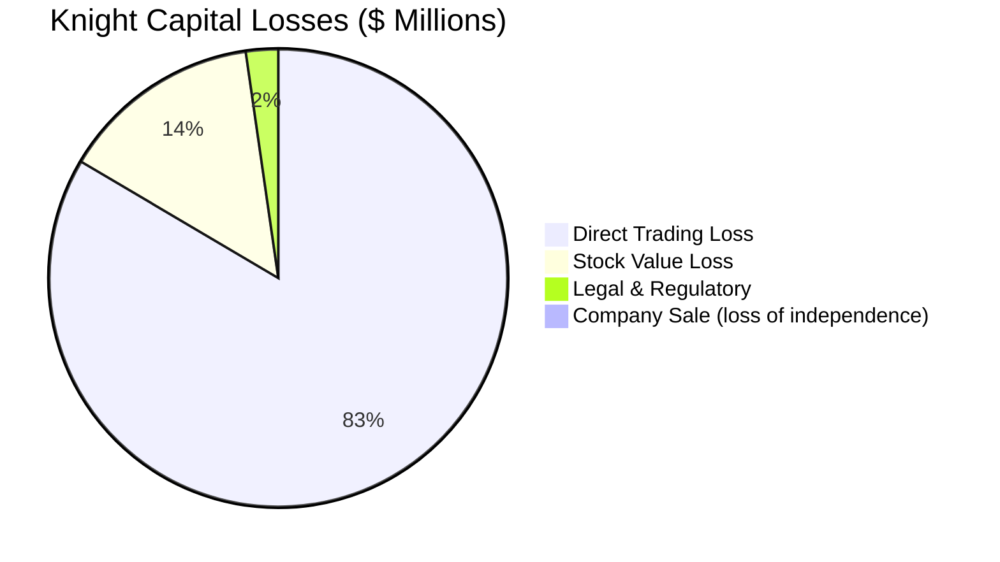

---

## 💰 The Cost of Poor Planning

### Financial Impact Statistics

Research shows the true cost of software project failures:

| Study | Finding |
|-------|---------|
| **Standish Group CHAOS Report** | 66% of software projects fail or are challenged |
| **IBM Study** | Cost to fix a bug in production: **100x more** than fixing in design |
| **Gartner Research** | Poor requirements cost $1M+ per year for average enterprise |
| **McKinsey Study** | Large IT projects run 45% over budget, 7% over time |

### Cost Multiplication by Phase

When defects are found and fixed at different stages:

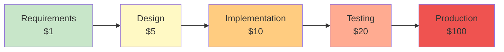

**Example Calculation:**

A simple requirement error (e.g., incorrect data validation rule):
- **Found in Requirements Phase:** $100 to fix (1 hour discussion)
- **Found in Design Phase:** $500 to fix (redesign + documentation update)
- **Found in Implementation:** $1,000 to fix (code changes + retesting)
- **Found in Testing:** $2,000 to fix (code fix + regression testing)
- **Found in Production:** $10,000+ to fix (emergency patch + customer impact + reputation)

---

## ✅ When SDLC Works: Success Stories

### Success Story 1: NASA Mars Rover Projects

**The Project:**
NASA's Mars rovers (Spirit, Opportunity, Curiosity, Perseverance) represent some of the most successful software projects in history.

**The Success:**

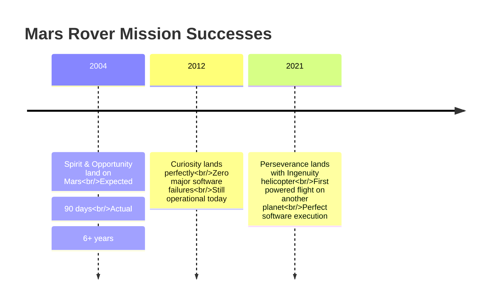

**Why They Succeeded:**

1. ✅ **Rigorous Requirements:** Years spent defining exact mission requirements
2. ✅ **Extensive Testing:** Every component tested in simulated Mars environment
3. ✅ **Risk Management:** Multiple backup systems and contingency plans
4. ✅ **Documentation:** Complete documentation of all systems
5. ✅ **Peer Review:** Every line of code reviewed by multiple engineers
6. ✅ **Structured SDLC:** NASA's strict software development standards

**Key Practice - V&V (Verification & Validation):**

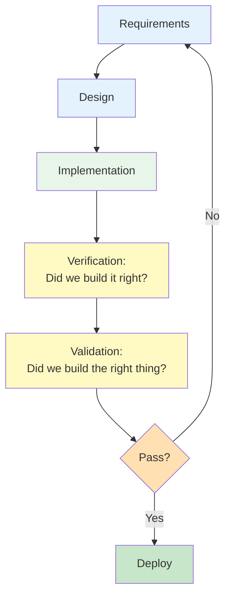

---

### Success Story 2: Spotify's Continuous Delivery

**The Project:**
Spotify evolved from a small startup to serving 500+ million users with minimal downtime.

**The Success Factors:**

| Factor | Implementation | Result |
|--------|----------------|---------|
| **Agile SDLC** | Scrum + Kanban hybrid | Fast feature delivery |
| **Automated Testing** | 80%+ code coverage | 99.9% uptime |
| **CI/CD Pipeline** | Deploy 100+ times per day | Quick bug fixes |
| **Monitoring** | Real-time performance tracking | Proactive issue detection |
| **Squad Model** | Small autonomous teams | High productivity |

**Deployment Frequency:**

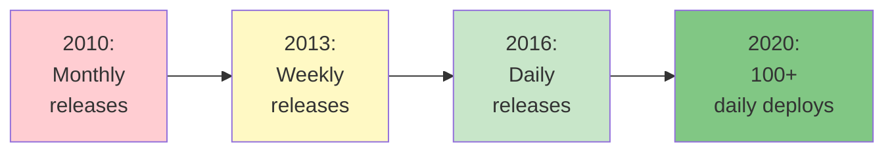

---

## 📚 The Software Crisis: Historical Context

### The Problem (1960s-1980s)

In the early days of computing, software development was chaotic:

**Symptoms of the Software Crisis:**

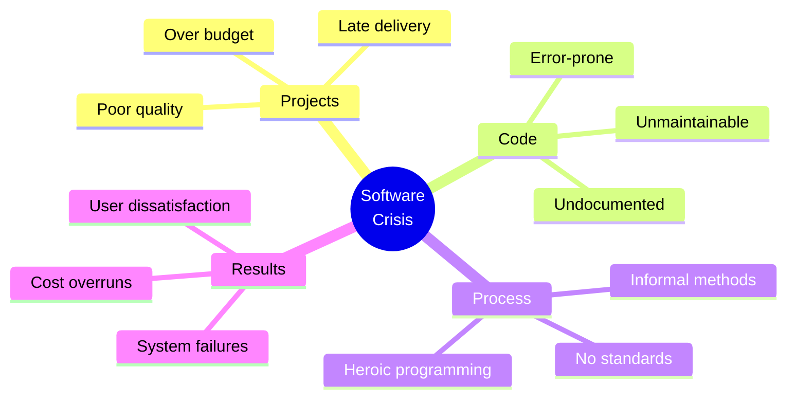

### Famous Early Failures

| Project | Year | Problem | Cost |
|---------|------|---------|------|
| **IBM OS/360** | 1960s | Massive delays, complexity | $500M+ overrun |
| **Mariner 1 Space Probe** | 1962 | Missing hyphen in code | $18M rocket destroyed |
| **Therac-25 Radiation Machine** | 1985-87 | Software bugs | 6 deaths |
| **Ariane 5 Rocket** | 1996 | Integer overflow | $370M rocket explosion |

### The Solution: Structured SDLC

The software engineering community responded by developing structured methodologies:

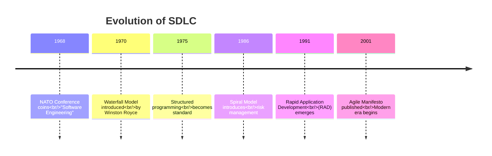

---

## 🎯 Why SDLC Matters: Key Takeaways

### The Evidence

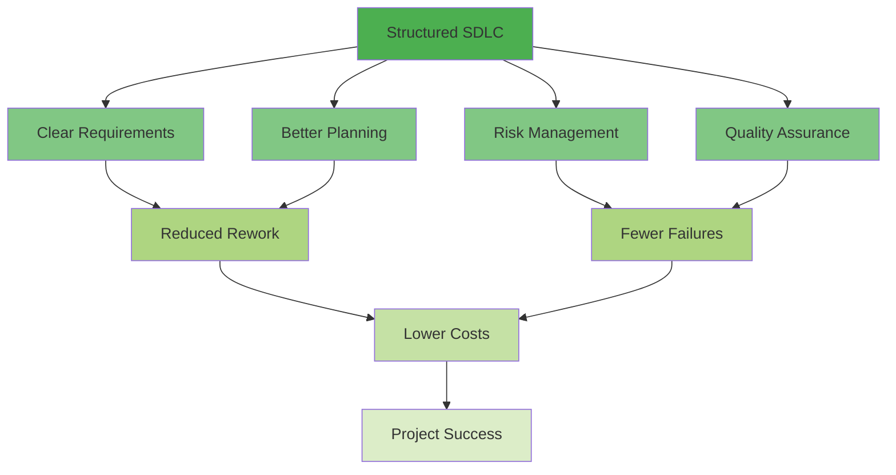

### Benefits of Proper SDLC

1. **Predictability:** Know what to build, when, and how much it costs
2. **Quality:** Catch defects early when they're cheap to fix
3. **Communication:** Everyone understands the plan and their role
4. **Risk Management:** Identify and mitigate problems before they occur
5. **Maintainability:** Create systems that can evolve over time
6. **Team Efficiency:** Reduce wasted effort and rework
7. **Stakeholder Confidence:** Demonstrate professionalism and control

### The Bottom Line

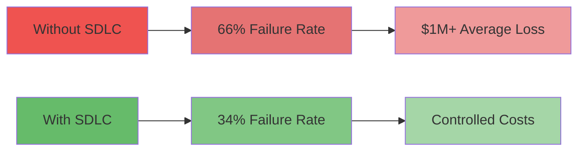

**Without SDLC:**
- ❌ 66% of projects fail or are challenged
- ❌ Average 45% cost overrun
- ❌ 100x more expensive to fix bugs in production
- ❌ Poor user satisfaction
- ❌ Unmaintainable code

**With SDLC:**
- ✅ 2x higher success rate
- ✅ Controlled budgets and timelines
- ✅ Early defect detection (10-100x cheaper)
- ✅ Happy users and stakeholders
- ✅ Maintainable, evolvable systems

---

## 💡 Real-World Insight

### What Industry Professionals Say

> **"The biggest mistake in software development is not having a clear plan. Every hour spent planning saves ten hours in development and a hundred hours in maintenance."**
> — Senior Software Architect, Microsoft

> **"We've learned the hard way that skipping requirements gathering to 'save time' actually costs us months in rework. Now we never start coding without solid requirements."**
> — Tech Lead, Startup (after $2M pivot)

> **"SDLC isn't about bureaucracy—it's about making sure we build the right thing, the right way, the first time."**
> — Project Manager, Fortune 500 Company

---

## 🎓 Hands-On Activity: Analyze a Failure

### Activity: "What Went Wrong?"

**Time:** 10 minutes  
**Format:** Individual or small groups

**Scenario:**
A mobile banking app was released with the following issues:
- App crashes when users try to transfer more than $1,000
- Users can see other customers' account balances
- App works only on newest phones, crashes on older devices
- Forgot password feature doesn't work
- No way to contact customer support from the app

**Your Task:**
1. Identify at least 5 SDLC failures that led to these issues
2. In which phase(s) could each issue have been prevented?
3. Estimate the cost impact (low/medium/high/critical)

**Template:**

| Issue | SDLC Failure | Phase to Fix | Cost Impact |
|-------|--------------|--------------|-------------|
| Crashes on transfers > $1000 | | | |
| Security breach (seeing others' data) | | | |
| Device compatibility | | | |
| Password reset broken | | | |
| No support contact | | | |

**Discussion Questions:**
1. Which issue is most critical? Why?
2. What would have prevented these issues?
3. How much do you think these failures cost the bank?
4. What should the bank do now?

---

## 🔑 Key Concepts Summary

### Critical Points to Remember

1. **Software failures are expensive:** $1M+ average cost, 100x multiplier for late fixes
2. **History repeats:** The software crisis of the 1960s-80s taught us SDLC is essential
3. **Real consequences:** Poor software has caused deaths, bankruptcies, and disasters
4. **Success is possible:** Projects with structured SDLC have 2x higher success rates
5. **Prevention beats cure:** Time spent on requirements and planning prevents costly rework

### SDLC Value Proposition

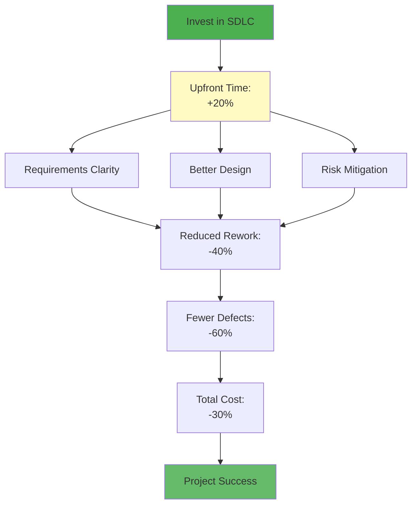

---

## ✅ Self-Check Questions

Test your understanding:

1. What was the primary cost of the Healthcare.gov failure? (Financial and non-financial)
2. Why does it cost 100x more to fix a bug in production vs. requirements phase?
3. Name three benefits of using a structured SDLC approach.
4. What was the "software crisis" and how did SDLC help solve it?
5. In the Knight Capital case, what single SDLC practice could have prevented the disaster?

**Answers at the end of Section 1.10**

---

## 🚀 What's Next?

Now that you understand WHY SDLC matters, the next section explores WHAT the software development lifecycle actually consists of. You'll learn the specific phases that every software project goes through.

**Next Section:** [1.2 SDLC Phases Explained →](./1.2-sdlc-phases.md)

---

## 📚 Additional Resources

**For Deeper Learning:**
- **Book:** "The Mythical Man-Month" by Fred Brooks (software crisis insights)
- **Article:** Standish Group CHAOS Report (annual project statistics)
- **Documentary:** "Code Rush" (real software development documentary)
- **Video:** "Why Software Projects Fail" (YouTube, various channels)

**Case Study Sources:**
- Healthcare.gov Post-Mortem Reports (government archives)
- Boeing 737 MAX Investigation Reports (FAA documents)
- Knight Capital SEC Filings (public financial records)

---

[← Back to README](./chapter-01-README.md) | [Next: 1.2 SDLC Phases →](./1.2-sdlc-phases.md)

---

*Last Updated: November 2025*  
*Version: 1.0*
