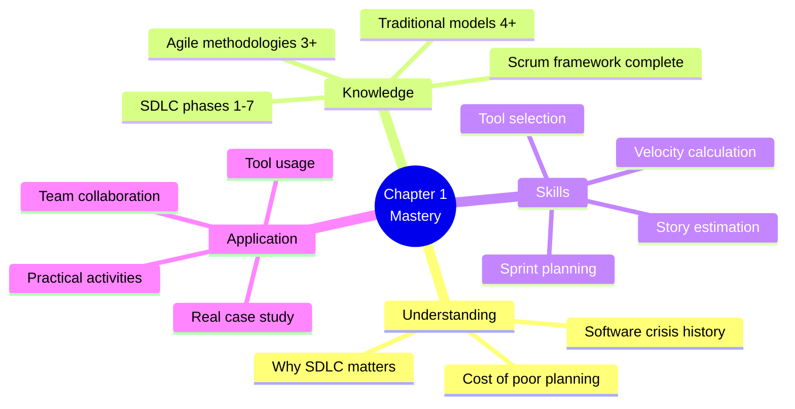
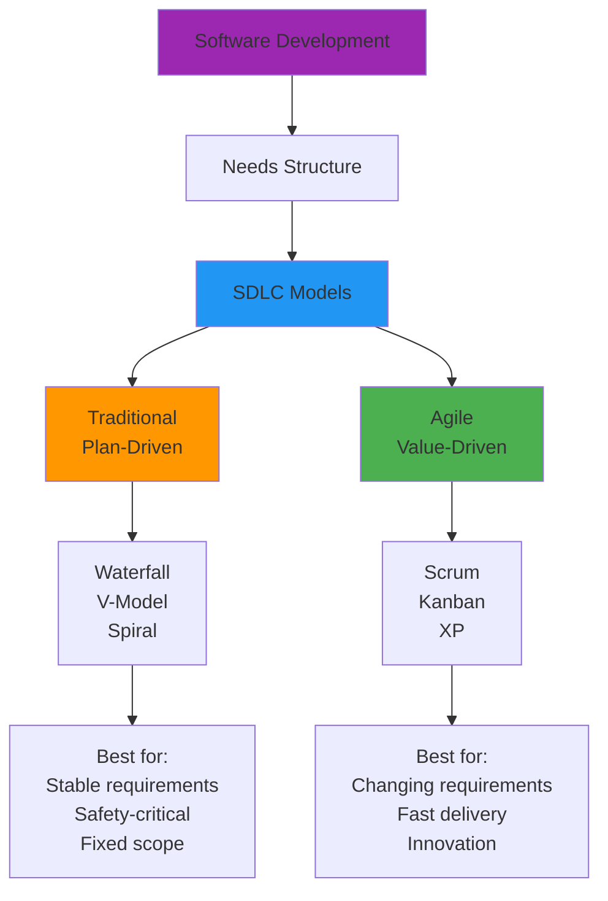
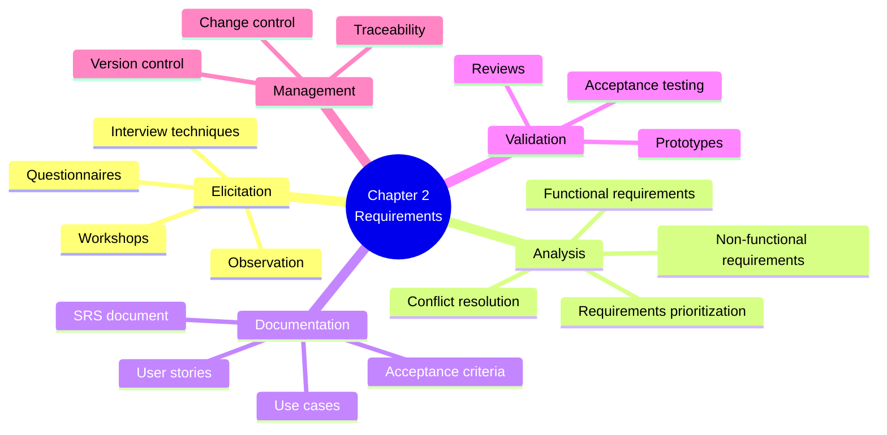

# 1.10 Chapter Summary and Assessment

[← Previous: 1.9 Hands-on Activities](./1.9-hands-on-activities.md) | [Back to README](./chapter-01-README.md)

---

## 📖 Introduction

Congratulations! You've completed Chapter 1: Introduction to Software Development Lifecycle. This section provides a comprehensive review of everything you've learned, answers to all self-check questions, a glossary of key terms, and a final assessment to test your knowledge.

**Reading Time:** 30 minutes  
**Assessment Time:** 45 minutes

---

## 🎯 Chapter Learning Objectives Review

At the start of this chapter, we set out to help you:



**Let's review what you've accomplished:**

✅ **Section 1.1:** Understood why SDLC matters through real failure cases  
✅ **Section 1.2:** Learned all 7 phases of software development  
✅ **Section 1.3:** Compared 4 traditional SDLC models  
✅ **Section 1.4:** Explored Agile methodologies and principles  
✅ **Section 1.5:** Mastered Scrum framework in detail  
✅ **Section 1.6:** Analyzed a complete business case study  
✅ **Section 1.7:** Planned 7 sprints with detailed user stories  
✅ **Section 1.8:** Explored essential development tools  
✅ **Section 1.9:** Completed 7 hands-on activities  

---

## 📚 Key Concepts Recap

### The Big Picture



### Critical Principles

**1. Software Failures Are Expensive**
- 66% of projects fail or are challenged
- Bugs cost 100× more in production vs. requirements phase
- Poor planning causes most failures
- Healthcare.gov: $1B+ due to lack of SDLC

**2. Structured Approach Increases Success**
- Projects with SDLC have 2× higher success rate
- Early planning prevents costly rework
- Regular inspection and adaptation catch issues early
- Documentation enables knowledge transfer

**3. SDLC Phases Are Universal**
```
Planning → Requirements → Design → Implementation 
→ Testing → Deployment → Maintenance
```
Every model includes these, but orders/iterates differently.

**4. Context Determines Methodology**
- Stable requirements → Traditional (Waterfall/V-Model)
- Changing requirements → Agile (Scrum)
- High risk → Spiral
- Continuous delivery → Incremental/Kanban
- No silver bullet—choose based on context

**5. Agile Values Over Processes**
```
Individuals & Interactions > Processes & Tools
Working Software > Comprehensive Documentation
Customer Collaboration > Contract Negotiation
Responding to Change > Following a Plan
```

**6. Scrum is Empirical**
```
Transparency → Inspection → Adaptation
```
Make work visible, inspect regularly, adapt based on findings.

**7. Estimation Is Relative**
- Story points, not hours
- Team-specific scale
- Velocity emerges over time (3-5 sprints)
- Use for planning, not performance measurement

**8. Tools Enable, Not Replace, Process**
- Git for version control (essential)
- Jira/Trello for project management
- CI/CD for quality and speed
- Slack for communication
- Tools serve the team, not vice versa

---

## 📊 Comprehensive Comparison Tables

### SDLC Models Comparison

| Aspect | Waterfall | V-Model | Spiral | Incremental | Scrum | Kanban |
|--------|-----------|---------|--------|-------------|-------|--------|
| **Structure** | Sequential | Sequential | Iterative | Incremental | Iterative | Continuous |
| **Requirements** | Fixed upfront | Fixed upfront | Evolving | Known priorities | Evolving | Flowing |
| **Flexibility** | Very Low | Very Low | High | Medium | High | Very High |
| **Risk Management** | Late | Medium | Excellent | Good | Good | Medium |
| **Time to Value** | Slow | Slow | Medium | Fast | Fast | Very Fast |
| **Quality Focus** | Medium | Very High | High | Medium | High | Medium |
| **Documentation** | Extensive | Extensive | Medium | Medium | Light | Light |
| **Team Size** | Any | Any | Large | Medium | 3-9 | Any |
| **Customer Involvement** | Low | Low | High | High | Very High | Medium |
| **Best For** | Stable scope | Safety-critical | High risk | Clear priorities | Innovation | Support/Ops |

### Scrum Ceremonies Quick Reference

| Ceremony | Duration | Frequency | Participants | Purpose |
|----------|----------|-----------|--------------|---------|
| **Sprint Planning** | 4-8 hours | Every sprint | Whole team | Plan sprint work |
| **Daily Scrum** | 15 minutes | Daily | Dev team (PO/SM optional) | Synchronize, identify blocks |
| **Sprint Review** | 2-4 hours | End of sprint | Team + stakeholders | Demo, gather feedback |
| **Sprint Retrospective** | 1.5-3 hours | End of sprint | Whole team only | Improve process |
| **Backlog Refinement** | 1-2 hours | Weekly | PO + team subset | Prepare upcoming stories |

### Tool Selection Matrix

| Need | Free Option | Paid Option | Enterprise |
|------|-------------|-------------|------------|
| **Version Control** | GitHub | GitHub Pro | GitHub Enterprise |
| **Project Mgmt** | Trello | Jira Standard | Jira Premium + Confluence |
| **CI/CD** | GitHub Actions | CircleCI | Jenkins (self-hosted) |
| **Communication** | Slack Free | Slack Pro | Microsoft Teams |
| **Documentation** | GitHub Wiki | Notion | Confluence + SharePoint |
| **Monitoring** | Free tier providers | Datadog | New Relic Enterprise |

---

## ✅ Answers to Self-Check Questions

### Section 1.1: Why SDLC Matters

1. **What was the primary cost of the Healthcare.gov failure?**
   - Direct cost: $1+ billion ($840M initial + $175M fixes)
   - Indirect: Reputation damage, political fallout, delayed benefits to citizens

2. **Why does it cost 100× more to fix a bug in production vs. requirements phase?**
   - Requirements: Quick discussion/change (1 hour)
   - Production: Code fix + testing + emergency deploy + customer impact + rollback plan + reputation damage

3. **Name three benefits of using a structured SDLC approach.**
   - Early defect detection (cheaper to fix)
   - Clear communication (everyone knows the plan)
   - Risk management (identify problems before they occur)
   - Predictability (know timeline and budget)
   - Quality (built-in checkpoints)
   - (Any 3 are correct)

4. **What was the "software crisis" and how did SDLC help solve it?**
   - Crisis (1960s-80s): Projects chronically late, over budget, poor quality, no process
   - SDLC solution: Structured approaches, defined phases, quality gates, systematic testing
   - Result: Higher success rates, predictable outcomes

5. **In the Knight Capital case, what single SDLC practice could have prevented the disaster?**
   - Proper deployment process/change management
   - Testing in production-like environment
   - Rollback plan
   - Automated deployment (preventing manual errors)
   - (Any of these acceptable)

---

### Section 1.2: SDLC Phases

1. **What are the seven phases of SDLC in order?**
   1. Planning
   2. Requirements Analysis
   3. Design
   4. Implementation
   5. Testing
   6. Deployment
   7. Maintenance

2. **Which phase answers "What should we build?" vs. "How should we build it?"**
   - "What": Requirements Analysis
   - "How": Design

3. **What is the difference between corrective and preventive maintenance?**
   - Corrective: Fixing bugs/issues that occurred
   - Preventive: Proactive improvements to prevent future problems (e.g., refactoring, security patches, dependency updates)

4. **Why is it important to create documentation in each phase?**
   - Knowledge transfer (team changes)
   - Input for next phase (requirements → design → implementation)
   - Audit trail (compliance, decisions)
   - Future maintenance (understanding why things were built)
   - Communication (stakeholders, future team members)

5. **In which phase would you create an Entity-Relationship Diagram?**
   - Design phase (specifically database design)

6. **What happens if requirements are poorly defined in Phase 2?**
   - Wrong system built
   - Extensive rework in later phases
   - Cost multiplies (10-100×)
   - Project delays
   - Stakeholder dissatisfaction
   - Potential project failure

7. **Name three types of testing that occur in the Testing phase.**
   - Unit testing
   - Integration testing
   - System testing
   - Acceptance testing (UAT)
   - Performance testing
   - Security testing
   - (Any 3 are correct)

8. **What is the purpose of a rollback plan in the Deployment phase?**
   - Quick recovery if deployment fails
   - Minimize downtime
   - Restore service to users
   - Reduce impact of failed deployment
   - Safety net for risky changes

---

### Section 1.3: Traditional SDLC Models

1. **What is the main difference between Waterfall and V-Model?**
   - V-Model adds testing emphasis at each phase
   - V-Model maps each development phase to corresponding test level
   - V-Model has verification and validation built in
   - Otherwise similar sequential structure

2. **Why is the Spiral model called "risk-driven"?**
   - Each spiral iteration focuses on identifying and addressing highest risks
   - Risk analysis drives what to do next
   - Prototypes built to mitigate risks
   - Continue spiraling until risks acceptable

3. **What's the key advantage of the Incremental model over Waterfall?**
   - Earlier delivery of working software (increments)
   - Can get feedback on early increments
   - Users see value sooner
   - Lower risk (prove concept early)
   - Can stop if budget runs out (have some working software)

4. **When would you NOT use Waterfall model?**
   - Requirements unclear or changing
   - Need early user feedback
   - High risk/uncertainty
   - Long project duration
   - Innovation required
   - Market conditions volatile

5. **Which model emphasizes testing the most?**
   - V-Model (testing is core focus, not afterthought)

6. **Can multiple increments be developed in parallel? Why or why not?**
   - Yes, if:
     - Different teams available
     - No dependencies between increments
     - Clear interfaces defined
   - Benefit: Faster total delivery

7. **What type of projects is Spiral model best suited for?**
   - Large, complex projects
   - High risk/uncertainty
   - R&D projects
   - New technology
   - Expensive failures
   - Long duration (can afford multiple spirals)

8. **What's the difference between verification and validation in V-Model?**
   - Verification: "Are we building the product right?" (matches specifications)
   - Validation: "Are we building the right product?" (meets user needs)

---

### Section 1.4: Agile Methodologies

1. **Name the four values of the Agile Manifesto.**
   1. Individuals and interactions over processes and tools
   2. Working software over comprehensive documentation
   3. Customer collaboration over contract negotiation
   4. Responding to change over following a plan

2. **What does "working software over comprehensive documentation" mean?**
   - Prioritize delivering functional software first
   - Documentation serves working software (not vice versa)
   - "Just enough" documentation
   - Does NOT mean zero documentation
   - Focus on value delivery

3. **How does Agile handle changing requirements differently than Waterfall?**
   - Waterfall: Change is problem, controlled via change requests
   - Agile: Change is expected, welcomed as competitive advantage
   - Waterfall: Expensive to change
   - Agile: Product Backlog continuously refined, easy to adjust

4. **What is the main difference between Scrum and Kanban?**
   - Scrum: Fixed-length sprints, defined roles, prescribed ceremonies
   - Kanban: Continuous flow, no sprints, no prescribed roles
   - Scrum: Commitment to sprint goal
   - Kanban: No commitments, pull from backlog as capacity allows
   - Scrum: Velocity metrics
   - Kanban: Cycle time, throughput metrics

5. **What is TDD and why is it important in XP?**
   - TDD: Test-Driven Development
   - Process: Write test → Write code to pass test → Refactor
   - Important because:
     - Ensures testability
     - Prevents bugs
     - Better design
     - Confidence to refactor
     - Living documentation

6. **Name three scenarios where traditional methods might be better than Agile.**
   - Fixed regulatory requirements (FDA, etc.)
   - Safety-critical systems requiring extensive documentation
   - Fixed-price contracts with locked scope
   - Very large teams (50+) without Agile experience
   - Distributed teams with poor communication infrastructure
   - Stable, well-understood requirements
   - (Any 3 are correct)

7. **What does "self-organizing team" mean?**
   - Team decides HOW to do work (not told by manager)
   - Collective ownership of work
   - Team members collaborate to solve problems
   - No task assignment from outside
   - Team accountability for results

8. **How often should working software be delivered in Agile?**
   - Every sprint (1-4 weeks, typically 2 weeks)
   - Scrum: End of each sprint
   - Kanban: Continuously as items complete
   - Principle: "Weeks not months"

---

### Section 1.5: Scrum Deep Dive

1. **What are the three Scrum roles and their primary responsibilities?**
   - **Product Owner:** Maximize product value, manage backlog, prioritize work
   - **Scrum Master:** Servant leader, remove impediments, coach team on Scrum
   - **Development Team:** Build increment, self-organize, cross-functional

2. **How long should a Daily Scrum last? What are the three questions?**
   - **Duration:** 15 minutes (timeboxed)
   - **Questions:**
     1. What did I do yesterday?
     2. What will I do today?
     3. Are there any impediments?

3. **What's the difference between Sprint Review and Sprint Retrospective?**
   - **Sprint Review:** WHAT was built (demo increment, gather feedback on product)
   - **Sprint Retrospective:** HOW we worked (process improvement, team dynamics)

4. **Who can cancel a Sprint and why would they?**
   - **Who:** Only the Product Owner
   - **Why:** Sprint Goal becomes obsolete (major market change, company pivot, requirements invalidated)
   - **Rare:** Should be exceptional circumstance

5. **What is velocity and how is it calculated?**
   - **Velocity:** Amount of work team completes per sprint (story points)
   - **Calculation:** Sum of story points for completed stories in sprint
   - **Average:** Typically average last 3-5 sprints for planning

6. **Explain the concept of story points vs. hours.**
   - **Story Points:** Relative sizing, considers complexity/effort/uncertainty, team-specific, doesn't change
   - **Hours:** Absolute time, varies by person, less accurate for estimation
   - **Story Points better for:** Estimation, long-term planning, avoiding micro-management

7. **What is Definition of Done and why does it matter?**
   - **Definition:** Shared understanding of "complete" (code + tests + review + docs + deployed)
   - **Why:** Prevents "done but not really," ensures quality, enables transparency, creates shippable increments

8. **How does the Sprint Backlog differ from the Product Backlog?**
   - **Product Backlog:** All work for entire product (prioritized, evolving)
   - **Sprint Backlog:** Work selected for current sprint only (fixed during sprint, includes tasks)

---

### Section 1.6: Case Study

1. **What is the annual cost impact of Greenfield Academy's current manual system?**
   - **$116,000** in direct measurable costs
   - Plus immeasurable opportunity costs (teacher time not teaching, etc.)

2. **Name the five main stakeholder groups and their primary concerns.**
   1. **Teachers:** Save time, easy to use, reliable
   2. **Administrators:** Visibility, reports, compliance
   3. **Parents:** Access to child's progress, notifications
   4. **Students:** See grades, track progress
   5. **Principal:** ROI, operational efficiency, accreditation

3. **What is the project's vision statement?**
   - "Transform Greenfield Academy from paper-based chaos to digital excellence by providing a comprehensive, intuitive School Management System that saves time, improves communication, ensures compliance, and enhances educational outcomes."

4. **What are the must-have features for Phase 1 (MVP)?**
   - User authentication and management
   - Student and class management
   - Attendance tracking
   - Grade management
   - Parent portal
   - Basic reporting/dashboard

5. **What is the target response time for the system?**
   - **< 2 seconds** for 95th percentile of page loads
   - **< 500ms** for API responses (95th percentile)

6. **How does our solution differentiate from PowerSchool?**
   - Purpose-built for small schools (not one-size-fits-all)
   - Modern UI/UX (competitor uses 10-15 year old code)
   - Affordable pricing ($10/student vs $15-30)
   - Rapid deployment (2-3 weeks vs 3-6 months)
   - Personal support (dedicated manager vs call center)

7. **What is the expected payback period for the investment?**
   - **2.25 years**
   - Initial investment: $180,000
   - Annual benefit: $104,000
   - Annual operating cost: $24,000

8. **Name three non-functional requirements and their targets.**
   - **Performance:** < 2 sec page load, 500+ concurrent users
   - **Security:** HTTPS only, RBAC, FERPA compliant, encryption at rest
   - **Availability:** 99.5% uptime during school hours
   - **Usability:** < 2 hours teacher training, mobile responsive, WCAG 2.1 AA
   - **Scalability:** Handle 2× current load without changes
   - (Any 3 are correct)

---

### Section 1.7: Sprint Planning

1. **Why did we start with Sprint 0 (Foundation) before feature development?**
   - Establish infrastructure (CI/CD, environments)
   - Setup development standards
   - Create database schema
   - Build design system
   - Enable team to move fast in Sprint 1+
   - Avoid technical debt from rushed setup

2. **What is the Sprint Goal for Sprint 3 and how does it guide story selection?**
   - **Goal:** "Classes can be created, students enrolled, and teachers assigned"
   - **Guides selection:** Only select stories related to class management, exclude unrelated features
   - **Provides focus:** Team knows priority is class functionality

3. **Why is Sprint 2 slightly over-committed (42 points), and what should the team do?**
   - US-015 (Bulk Import) added 8 extra points
   - **Options:**
     - Move US-015 to later sprint (recommended)
     - Accept 42 points and work efficiently
     - Reduce scope of US-015
   - **Decision:** Move US-015 (nice-to-have) to keep sprint realistic

4. **How many total story points are planned across all 7 sprints?**
   - **~280 story points** total
   - Sprint 0: 35, Sprint 1: 34, Sprint 2: 34, Sprint 3: 35, Sprint 4: 37, Sprint 5: 34, Sprint 6: 29, Sprint 7: 42

5. **Which sprint delivers the most critical user-facing value? Why?**
   - **Sprint 4: Attendance Tracking**
   - Why: Addresses biggest teacher pain point (15-20 min per class saved)
   - First feature that provides daily value
   - Parent notifications provide immediate communication benefit
   - (Alternative answer: Sprint 1 authentication - nothing works without it)

6. **What is the purpose of making Sprint 7 flexible/over-committed?**
   - Buffer for unknowns and carry-over work
   - Bug fixes can expand/contract as needed
   - Final polish and adjustments
   - Ensures launch readiness
   - Better to have extra capacity than be short

7. **Why must US-018 (Enroll Students) come after US-016 (Create Classes)?**
   - **Dependency:** Can't enroll students in non-existent classes
   - Technical: Database foreign key requires classes table populated
   - Logical: Classes must exist before enrollment

8. **How does the burn-up chart help track project progress?**
   - Shows cumulative work completed over time
   - Visualizes progress toward total scope
   - Identifies if team is on track for completion
   - Shows velocity trends
   - Helps forecast completion date

---

### Section 1.8: Tools and Practices

1. **What are the three states of a file in Git?**
   1. **Working Directory** (modified)
   2. **Staging Area** (staged)
   3. **Repository** (committed)

2. **What is the difference between CI and CD?**
   - **CI (Continuous Integration):** Automatically build and test every code change
   - **CD (Continuous Deployment/Delivery):** Automatically deploy tested code to production/staging
   - CI ensures code integrates cleanly
   - CD ensures code reaches users quickly

3. **Name three benefits of using pull requests for code review.**
   - Knowledge sharing (team sees all changes)
   - Quality gate (catches bugs before merge)
   - Documentation (discussion captured)
   - Learning (junior devs learn from feedback)
   - Collective ownership (team reviews together)
   - (Any 3 are correct)

4. **When would you choose Trello over Jira?**
   - Small team (< 10 people)
   - Simple project (not complex)
   - Budget constraints (Trello free tier generous)
   - Non-technical stakeholders (easier UI)
   - Visual thinkers
   - Quick setup needed

5. **What should trigger a CI/CD pipeline to run?**
   - Every commit/push to repository
   - Pull request creation/update
   - Merge to main/develop branch
   - Scheduled (nightly builds)
   - Manual trigger when needed

6. **Why is it important to write good commit messages?**
   - Understand WHY change was made (not just what)
   - Help future debugging
   - Code review context
   - Release notes generation
   - Team communication
   - Project history documentation

7. **What is a .gitignore file and what should it contain?**
   - **Purpose:** Tell Git which files NOT to track
   - **Should contain:**
     - node_modules/, dependencies
     - .env files (secrets)
     - Build outputs (dist/, build/)
     - IDE config (.vscode/, .idea/)
     - OS files (.DS_Store)
     - Logs (*.log)
     - Personal config files

8. **Name three types of tests that should run in a CI pipeline.**
   - Unit tests (test components in isolation)
   - Integration tests (test components together)
   - Linting (code style checks)
   - Security scans
   - End-to-end tests (full workflows)
   - Performance tests
   - (Any 3 are correct)

---

## 📖 Glossary of Key Terms

### A

**Acceptance Criteria:** Specific conditions that must be met for a user story to be considered complete.

**Agile:** Family of methodologies emphasizing iterative development, customer collaboration, and responding to change.

**Artifact:** In Scrum, one of three key items: Product Backlog, Sprint Backlog, or Increment.

### B

**Backlog:** Prioritized list of work items (user stories, bugs, tasks).

**Backlog Refinement:** Activity of adding detail, estimates, and order to Product Backlog items.

**Burndown Chart:** Graph showing remaining work over time in a sprint.

**Burn-up Chart:** Graph showing completed work over time across multiple sprints.

### C

**CI/CD:** Continuous Integration and Continuous Deployment—automation of build, test, and deploy processes.

**Code Review:** Systematic examination of code by peers before merging.

**Commit:** Saving changes to version control with a message describing the change.

### D

**Daily Scrum:** 15-minute daily meeting where Development Team synchronizes work.

**Definition of Done (DoD):** Shared understanding of what "complete" means for an increment.

**Definition of Ready (DoR):** Checklist indicating when a backlog item is ready for sprint planning.

**Development Team:** Cross-functional group that builds the increment in Scrum.

### E

**Epic:** Large user story that must be broken into smaller stories.

**Estimation:** Process of determining the size/effort of work items (typically story points).

### F

**Feature Branch:** Git branch created for developing a specific feature.

**Functional Requirement:** What the system should do (features, capabilities).

### G

**Git:** Distributed version control system for tracking code changes.

**Git Flow:** Branching strategy with main, develop, feature, hotfix, and release branches.

### I

**Impediment:** Obstacle preventing the team from progressing (Scrum Master removes).

**Increment:** Sum of all completed Product Backlog items in a sprint plus previous sprints.

**Integration Testing:** Testing how components work together.

**Iteration:** Time-boxed period for development work (same as sprint in Scrum).

### J

**Jira:** Popular project management tool for Agile teams.

### K

**Kanban:** Agile methodology focused on continuous flow and visualizing work.

### M

**Merge:** Combining code from one Git branch into another.

**MVP (Minimum Viable Product):** Smallest feature set that delivers value.

### N

**Non-Functional Requirement:** How well the system performs (performance, security, usability).

### P

**Planning Poker:** Estimation technique using cards to achieve consensus.

**Product Backlog:** Ordered list of everything needed in the product (maintained by Product Owner).

**Product Owner:** Scrum role responsible for maximizing product value and managing backlog.

**Pull Request (PR):** Request to merge code from one branch to another (includes code review).

### R

**Refactoring:** Improving code structure without changing functionality.

**Retrospective:** Meeting at end of sprint where team reflects and plans improvements.

**RBAC (Role-Based Access Control):** Security model where permissions based on user roles.

### S

**Scrum:** Agile framework with roles, events, and artifacts for iterative development.

**Scrum Master:** Servant leader who helps team understand and implement Scrum.

**SDLC:** Software Development Lifecycle—phases from concept to retirement.

**Sprint:** Time-boxed period (1-4 weeks) to create an increment (Scrum term for iteration).

**Sprint Backlog:** Product Backlog items selected for the sprint plus plan for delivering them.

**Sprint Goal:** Objective set for the sprint to guide the team.

**Sprint Planning:** Event at start of sprint to plan the work.

**Sprint Review:** Event at end of sprint to inspect increment and adapt backlog.

**Sprint Retrospective:** Event at end of sprint to inspect process and plan improvements.

**Stakeholder:** Anyone with interest in the project (users, sponsors, etc.).

**Story Points:** Unit of measure for expressing relative effort of user stories.

### T

**Technical Debt:** Cost of rework caused by choosing quick/easy solution over better approach.

**Test-Driven Development (TDD):** Writing tests before code.

**Three Pillars of Scrum:** Transparency, Inspection, Adaptation.

### U

**Unit Testing:** Testing individual components in isolation.

**User Story:** Short description of feature from user perspective: "As a [role], I want [feature] so that [benefit]."

### V

**Velocity:** Amount of work (story points) a team completes per sprint.

**Version Control:** System for tracking changes to code over time (e.g., Git).

**V-Model:** SDLC model emphasizing verification and validation at each phase.

### W

**Waterfall:** Sequential SDLC model where each phase completed before next begins.

**WIP (Work In Progress):** Work currently being done (Kanban limits this).

---

## 🎯 Final Assessment

### Part 1: Multiple Choice (20 questions)

**Instructions:** Select the best answer for each question.

**1. What was the main cause of the Healthcare.gov failure?**
   - a) Lack of budget
   - b) No structured SDLC approach
   - c) Poor programming language choice
   - d) Not enough developers

**2. Which SDLC phase answers "What should we build?"**
   - a) Planning
   - b) Requirements Analysis
   - c) Design
   - d) Implementation

**3. When is the Waterfall model most appropriate?**
   - a) Requirements are unclear
   - b) Need early user feedback
   - c) Requirements are stable and well-defined
   - d) Innovation is required

**4. Which Agile value is: "______ over processes and tools"?**
   - a) Documentation
   - b) Planning
   - c) Individuals and interactions
   - d) Customer collaboration

**5. In Scrum, who is responsible for maximizing product value?**
   - a) Scrum Master
   - b) Development Team
   - c) Product Owner
   - d) Stakeholders

**6. How long should a Daily Scrum last?**
   - a) 5 minutes
   - b) 15 minutes
   - c) 30 minutes
   - d) 1 hour

**7. What is the purpose of a Sprint Retrospective?**
   - a) Demo the increment
   - b) Plan the next sprint
   - c) Improve the process
   - d) Estimate user stories

**8. What does "velocity" measure in Scrum?**
   - a) How fast code is written
   - b) Story points completed per sprint
   - c) Number of bugs fixed
   - d) Team happiness

**9. What is the main difference between Scrum and Kanban?**
   - a) Scrum has sprints, Kanban is continuous flow
   - b) Scrum is for software, Kanban for manufacturing
   - c) Scrum is faster than Kanban
   - d) Kanban requires more documentation

**10. In Git, what does "git commit" do?**
   - a) Uploads code to GitHub
   - b) Saves changes to staging area
   - c) Saves changes to local repository
   - d) Merges branches

**11. What is CI/CD?**
   - a) Customer Integration and Customer Deployment
   - b) Continuous Integration and Continuous Deployment
   - c) Code Inspection and Code Delivery
   - d) Complete Integration and Complete Documentation

**12. Which is NOT one of the three Scrum artifacts?**
   - a) Product Backlog
   - b) Sprint Backlog
   - c) Sprint Goal
   - d) Increment

**13. What is "story points"?**
   - a) Lines of code to write
   - b) Relative measure of effort
   - c) Number of features
   - d) Hours to complete

**14. The V-Model emphasizes:**
   - a) Speed over quality
   - b) Testing at every phase
   - c) No documentation
   - d) Agile practices

**15. Who can cancel a Sprint?**
   - a) Scrum Master
   - b) Development Team
   - c) Product Owner
   - d) Any team member

**16. What is the Definition of Done?**
   - a) When code is written
   - b) When tests pass
   - c) Shared understanding of "complete"
   - d) When deployed to production

**17. In Planning Poker, what does a "?" card mean?**
   - a) Don't know the estimate
   - b) Don't understand the story
   - c) Refuse to estimate
   - d) Need more information

**18. Which tool is best for version control?**
   - a) Jira
   - b) Slack
   - c) Git
   - d) Trello

**19. What is the Agile Manifesto's stance on documentation?**
   - a) No documentation needed
   - b) Working software over comprehensive documentation
   - c) Documentation is most important
   - d) Only internal documentation

**20. The Spiral model is best for:**
   - a) Small, simple projects
   - b) Well-defined requirements
   - c) High-risk, complex projects
   - d) Rapid prototypes only

### Part 2: Short Answer (5 questions)

**1. Explain the difference between functional and non-functional requirements with examples.** (3-4 sentences)

**2. Describe the three Scrum roles and their primary responsibilities.** (3-4 sentences)

**3. Why is it important to have a Sprint Goal rather than just a list of stories?** (2-3 sentences)

**4. What are the four values of the Agile Manifesto?** (List them)

**5. Explain how velocity helps with sprint planning.** (2-3 sentences)

### Part 3: Case Study Application (10 points)

**Scenario:**
You're hired to develop a mobile app for a restaurant delivery service. The startup has:
- $50,000 budget
- 3-month timeline
- Requirements are rough ideas that will evolve
- Need to launch quickly to compete
- Team: 4 developers
- Investors want to see progress monthly

**Questions:**

**1. Which SDLC model would you recommend? Justify your choice.** (3 points)

**2. How would you structure the project (sprints, phases, etc.)?** (3 points)

**3. What tools would you use and why?** (2 points)

**4. What risks would you identify and how would you mitigate them?** (2 points)

---

## 📝 Assessment Answer Key

### Part 1 Answers:
1. b, 2. b, 3. c, 4. c, 5. c, 6. b, 7. c, 8. b, 9. a, 10. c, 11. b, 12. c, 13. b, 14. b, 15. c, 16. c, 17. b, 18. c, 19. b, 20. c

### Part 2 Sample Answers:

**1. Functional vs Non-Functional:**
Functional requirements define what the system does (features/capabilities), like "users can log in" or "system calculates grades automatically." Non-functional requirements define how well the system performs, like "page loads in < 2 seconds" or "supports 500 concurrent users" or "99.5% uptime."

**2. Three Scrum Roles:**
Product Owner maximizes product value and manages the prioritized backlog. Scrum Master serves the team by removing impediments and coaching Scrum practices. Development Team (3-9 people) is cross-functional and self-organizing, responsible for delivering the increment.

**3. Sprint Goal Importance:**
A Sprint Goal provides focus and coherence to the sprint, guiding daily decisions. It allows flexibility in HOW to achieve the goal while maintaining the WHAT. It also helps the team make trade-offs if issues arise during the sprint.

**4. Agile Manifesto Values:**
- Individuals and interactions over processes and tools
- Working software over comprehensive documentation
- Customer collaboration over contract negotiation
- Responding to change over following a plan

**5. Velocity and Planning:**
Velocity (average story points completed per sprint) helps teams forecast capacity for sprint planning. Teams use historical velocity to commit to realistic amounts of work, avoiding over-commitment and ensuring sustainable pace.

### Part 3 Sample Answer:

**1. SDLC Model:** Scrum/Agile
- Requirements are evolving (not fixed)
- Need rapid feedback and iterations
- Small team fits Scrum perfectly
- Monthly investor demos align with sprint reviews
- Time to market critical in competitive space
- Budget-conscious (fail fast, pivot quickly)

**2. Project Structure:**
- 2-week sprints (6 sprints total in 3 months)
- Sprint 0: Setup (1 week) - infrastructure, design
- Sprint 1-2: MVP features (authentication, restaurant listings, basic ordering)
- Sprint 3-4: Payment and delivery tracking
- Sprint 5: Polish and performance
- Sprint 6: Final testing and launch prep
- Monthly stakeholder demos (every 2 sprints)

**3. Tools:**
- Git/GitHub: Version control (free)
- Trello: Project management (simple, free)
- GitHub Actions: CI/CD (free tier sufficient)
- Slack: Team communication (free)
- VS Code: Development environment (free)
- Total budget for tools: ~$0-200/month (mostly free)

**4. Risks and Mitigation:**
- Risk: Requirements unclear → Mitigation: Weekly Product Owner meetings, frequent demos
- Risk: Small team, key person leaves → Mitigation: Pair programming, documentation
- Risk: 3-month deadline aggressive → Mitigation: MVP focus, cut nice-to-haves
- Risk: Technical challenges → Mitigation: Proof-of-concept in Sprint 0, early integration testing

---

## 🎓 Certificate of Completion

```
═══════════════════════════════════════════════════════════
               CERTIFICATE OF COMPLETION
               
                  Chapter 1: Introduction to
              Software Development Lifecycle (SDLC)
               
        This certifies that ____________________
        
        has successfully completed Chapter 1, demonstrating
        understanding of:
        
        ✓ Software Development Lifecycle phases and models
        ✓ Traditional and Agile methodologies
        ✓ Scrum framework and practices
        ✓ Project planning and estimation
        ✓ Development tools and best practices
        
        Completion Date: ____________________
        
        Total Learning Hours: 15-20 hours
        Hands-on Activities: 7 completed
        
═══════════════════════════════════════════════════════════
```

---

## 🚀 What's Next: Chapter 2 Preview

### Chapter 2: Requirements Engineering

In Chapter 2, you'll learn:



**Chapter 2 Topics:**
- Requirements elicitation techniques
- Stakeholder analysis
- Functional vs. non-functional requirements
- Writing user stories and use cases
- Requirements prioritization (MoSCoW, Kano)
- Requirements traceability
- Managing changing requirements
- Creating Software Requirements Specification (SRS)

**Chapter 2 Case Study:**
We'll continue with the School Management System, creating a complete SRS document with detailed requirements for all features.

---

## 🎉 Congratulations!

You've completed Chapter 1! You now have a solid foundation in:

✅ Understanding why SDLC matters  
✅ Knowing all SDLC phases  
✅ Comparing traditional and Agile models  
✅ Mastering Scrum framework  
✅ Planning and estimating projects  
✅ Using essential development tools  
✅ Applying practices through hands-on activities  

**You're ready to:**
- Participate effectively in Scrum teams
- Plan and estimate software projects
- Select appropriate SDLC models
- Use industry-standard tools
- Gather and document requirements (Chapter 2!)

---

## 📚 Additional Resources for Continued Learning

### Books
- "Scrum: The Art of Doing Twice the Work in Half the Time" - Jeff Sutherland
- "User Story Mapping" - Jeff Patton
- "The Lean Startup" - Eric Ries
- "Agile Estimating and Planning" - Mike Cohn

### Online Courses
- Scrum.org: Professional Scrum Master (PSM) certification
- Coursera: Agile Development Specialization
- Udemy: Complete Agile Scrum Master course

### Websites & Communities
- Scrum.org - Official Scrum resources
- Agile Alliance - Agile community and resources
- Mountain Goat Software - Mike Cohn's blog
- Martin Fowler's blog - Software development insights

### Practice
- Contribute to open-source projects on GitHub
- Join local Agile/Scrum meetups
- Practice sprint planning with study groups
- Build your own project using Scrum

---

**Ready for Chapter 2?** [Proceed to Chapter 2: Requirements Engineering →](../02-requirements-engineering/README.md)

---

[← Previous: 1.9 Hands-on Activities](./1.9-hands-on-activities.md) | [Back to README](./chapter-01-README.md)

---

*Last Updated: November 2025*  
*Version: 1.0*  
*Total Chapter Hours: 15-20*  
*Thank you for your dedication to learning!*
