# 1.3 Traditional SDLC Models

[← Previous: 1.2 SDLC Phases](./1.2-sdlc-phases.md) | [Back to README](./chapter-01-README.md) | [Next: 1.4 Agile Methodologies →](./1.4-agile-methodologies.md)

---

## 📖 Introduction

Understanding the phases of SDLC is essential, but how do we organize and execute these phases in real projects? That's where SDLC models come in. Think of SDLC models as different "recipes" for software development—each with its own sequence, emphasis, and best use cases.

In this section, we'll explore traditional SDLC models that dominated software development for decades and are still used today in specific contexts. These models provide structured, predictable approaches to software development.

**Reading Time:** 35 minutes  
**Activity Time:** 15 minutes

---

## 🎯 Learning Objectives

By the end of this section, you will be able to:

1. Describe the four major traditional SDLC models
2. Explain the strengths and weaknesses of each model
3. Identify appropriate use cases for each model
4. Compare and contrast different traditional models
5. Recognize when traditional models are preferable to agile approaches
6. Apply model selection criteria to project scenarios

---

## 📊 Overview of Traditional Models

### The Four Traditional Models

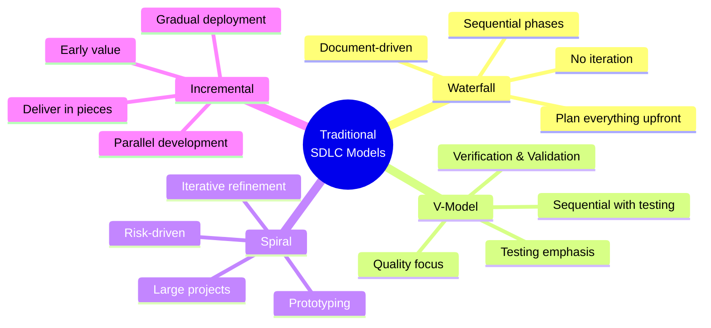
```mermaid
mindmap
  root((Traditional<br/>SDLC Models))
    Waterfall
      Sequential phases
      Document-driven
      No iteration
      Plan everything upfront
    V-Model
      Testing emphasis
      Verification & Validation
      Sequential with testing
      Quality focus
    Spiral
      Risk-driven
      Iterative refinement
      Prototyping
      Large projects
    Incremental
      Deliver in pieces
      Parallel development
      Gradual deployment
      Early value
```

### Quick Comparison Table

| Model | Flexibility | Risk Management | Time to Market | Best For |
|-------|-------------|-----------------|----------------|----------|
| **Waterfall** | Low | Late | Slow | Well-defined, stable requirements |
| **V-Model** | Low | Medium | Slow | Safety-critical, quality-focused |
| **Spiral** | High | Excellent | Medium | Large, complex, risky projects |
| **Incremental** | Medium | Good | Fast | Projects needing early delivery |

---

## 🌊 The Waterfall Model

### Overview

The Waterfall model is the oldest and most straightforward SDLC model. Like water flowing down a waterfall, development flows sequentially through each phase, moving forward only when the current phase is complete.

**Creator:** Dr. Winston W. Royce (1970)  
**Philosophy:** Plan everything upfront, execute in sequence

### The Waterfall Flow

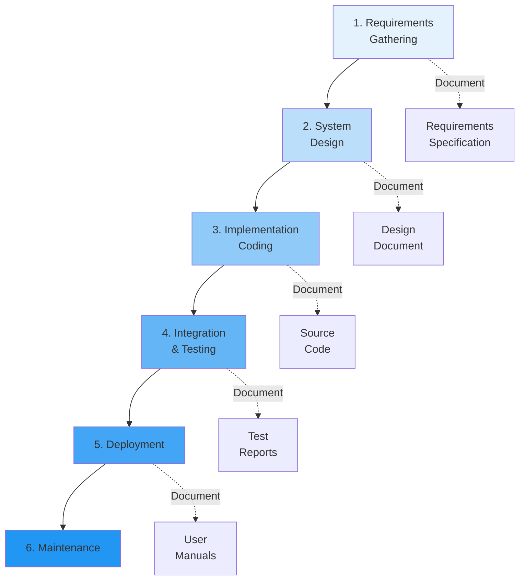
```mermaid
graph TD
    A[1. Requirements<br/>Gathering] --> B[2. System<br/>Design]
    B --> C[3. Implementation<br/>Coding]
    C --> D[4. Integration<br/>& Testing]
    D --> E[5. Deployment]
    E --> F[6. Maintenance]
    
    A -.Document.-> G[Requirements<br/>Specification]
    B -.Document.-> H[Design<br/>Document]
    C -.Document.-> I[Source<br/>Code]
    D -.Document.-> J[Test<br/>Reports]
    E -.Document.-> K[User<br/>Manuals]
    
    style A fill:#e3f2fd
    style B fill:#bbdefb
    style C fill:#90caf9
    style D fill:#64b5f6
    style E fill:#42a5f5
    style F fill:#2196f3
```

### Detailed Phase Breakdown

#### Phase 1: Requirements Gathering and Analysis
**Duration:** 3-4 weeks (School System example)

**Activities:**
- Conduct stakeholder interviews
- Document all functional requirements
- Define non-functional requirements
- Create requirements traceability matrix
- Obtain sign-off from all stakeholders

**Exit Criteria:**
- ✅ Complete Requirements Specification Document
- ✅ All stakeholders approve requirements
- ✅ No ambiguous requirements remain
- ✅ Requirements are testable

**School System Example:**
```
Requirement FR-019: Attendance Tracking

Description: Teachers shall be able to record daily attendance 
for each student in their assigned classes.

Detailed Specifications:
- Attendance options: Present, Absent, Late, Excused
- Recording time: Within 30 minutes of class start
- Bulk selection allowed for efficiency
- Historical attendance viewable for past 2 years
- Automatic parent notification for absences
- Attendance cannot be modified after 24 hours without admin approval

Acceptance Criteria:
- Teacher can mark attendance for entire class in < 2 minutes
- Parents receive SMS/email within 1 hour of absence
- System maintains 100% data integrity
```

#### Phase 2: System Design
**Duration:** 4-6 weeks

**Activities:**
- Create system architecture
- Design database schema
- Define API specifications
- Design user interfaces
- Create detailed component designs
- Security architecture

**Deliverables:**

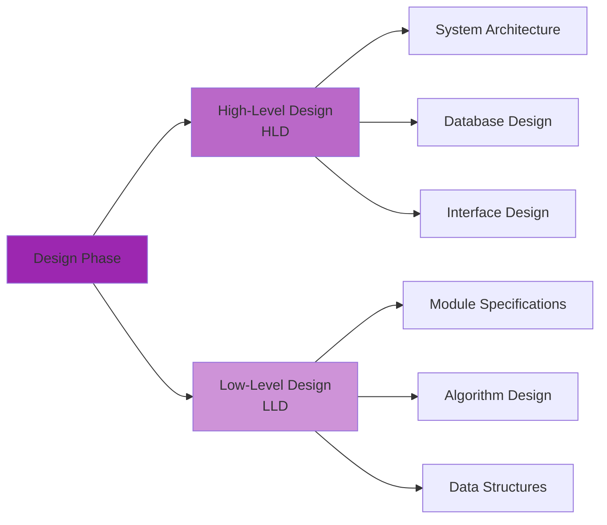
```mermaid
graph LR
    A[Design Phase] --> B[High-Level Design<br/>HLD]
    A --> C[Low-Level Design<br/>LLD]
    
    B --> B1[System Architecture]
    B --> B2[Database Design]
    B --> B3[Interface Design]
    
    C --> C1[Module Specifications]
    C --> C2[Algorithm Design]
    C --> C3[Data Structures]
    
    style A fill:#9c27b0
    style B fill:#ba68c8
    style C fill:#ce93d8
```

#### Phase 3: Implementation (Coding)
**Duration:** 10-16 weeks

**Activities:**
- Setup development environment
- Code all modules according to design
- Follow coding standards
- Create unit tests
- Code documentation
- Peer code reviews

**Code Freeze:** No new features after implementation phase ends

#### Phase 4: Integration and Testing
**Duration:** 4-6 weeks

**Testing Levels:**

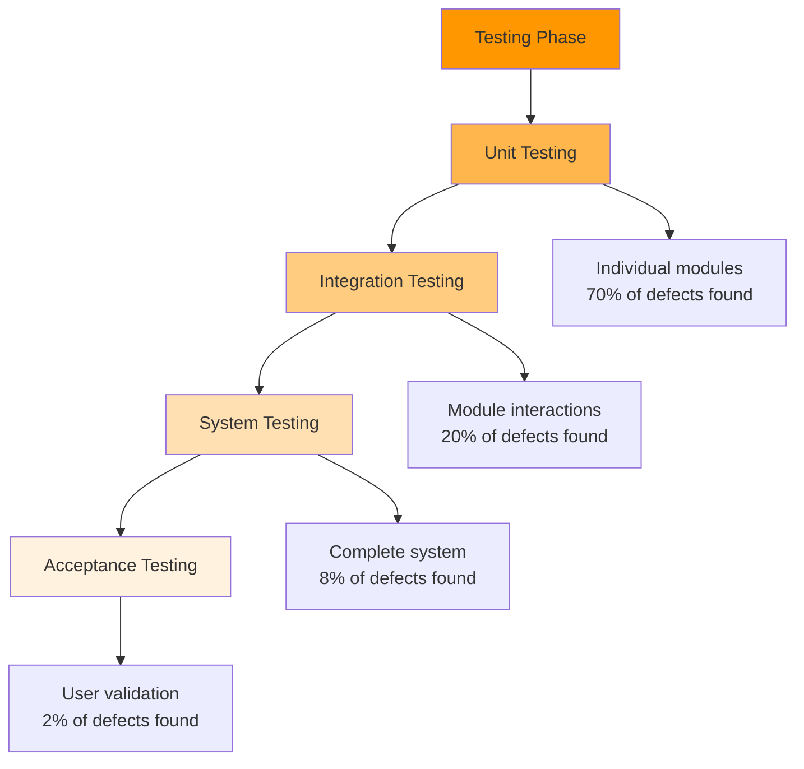
```mermaid
graph TD
    A[Testing Phase] --> B[Unit Testing]
    B --> C[Integration Testing]
    C --> D[System Testing]
    D --> E[Acceptance Testing]
    
    B --> B1[Individual modules<br/>70% of defects found]
    C --> C1[Module interactions<br/>20% of defects found]
    D --> D1[Complete system<br/>8% of defects found]
    E --> E1[User validation<br/>2% of defects found]
    
    style A fill:#ff9800
    style B fill:#ffb74d
    style C fill:#ffcc80
    style D fill:#ffe0b2
    style E fill:#fff3e0
```

#### Phase 5: Deployment
**Duration:** 1-2 weeks

**Deployment Steps:**
1. Prepare production environment
2. Data migration (if applicable)
3. User training
4. Go-live
5. Post-deployment support

#### Phase 6: Maintenance
**Duration:** Ongoing

**Maintenance in Waterfall:**
- Bug fixes only
- No feature changes (requires new project)
- Documentation updates
- Performance monitoring

### Waterfall Characteristics

#### ✅ Advantages

| Advantage | Explanation | Example Benefit |
|-----------|-------------|-----------------|
| **Simple & Easy** | Linear, straightforward process | Junior developers can understand quickly |
| **Clear Milestones** | Well-defined stages and deliverables | Easy progress tracking |
| **Heavy Documentation** | Comprehensive docs at each phase | Knowledge transfer, audit trail |
| **Upfront Planning** | All requirements known before coding | Accurate cost/time estimates |
| **Well-Structured** | Clear roles and responsibilities | Team knows exactly what to do |
| **Easy Management** | Progress is measurable | Stakeholders see clear progress |

#### ❌ Disadvantages

| Disadvantage | Problem | Impact |
|--------------|---------|--------|
| **No Flexibility** | Cannot accommodate changes | User needs may change during development |
| **Late Testing** | Testing happens after full implementation | Bugs expensive to fix |
| **No Working Software** | No product until end | Stakeholders can't see progress |
| **High Risk** | All eggs in one basket | If requirements wrong, entire project fails |
| **Long Delivery** | Months/years before deployment | Market conditions may change |
| **Assumes Stability** | Requires unchanging requirements | Rarely realistic in modern business |

### When to Use Waterfall

✅ **Ideal Scenarios:**

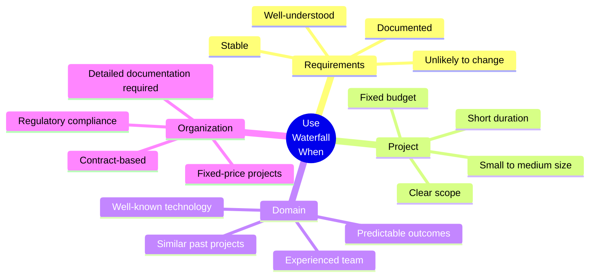
```mermaid
mindmap
  root((Use<br/>Waterfall<br/>When))
    Requirements
      Well-understood
      Documented
      Stable
      Unlikely to change
    Project
      Small to medium size
      Short duration
      Clear scope
      Fixed budget
    Domain
      Well-known technology
      Experienced team
      Similar past projects
      Predictable outcomes
    Organization
      Regulatory compliance
      Contract-based
      Fixed-price projects
      Detailed documentation required
```

**Real-World Examples:**

1. **Government Compliance System**
   - Fixed regulatory requirements
   - Must meet exact specifications
   - Detailed documentation required
   - No room for interpretation

2. **Embedded Medical Device**
   - Safety-critical requirements
   - FDA approval needed
   - Complete documentation mandatory
   - Changes very expensive

3. **Banking Core System Migration**
   - Requirements clearly defined
   - Must maintain exact functionality
   - Zero tolerance for errors
   - Regulatory oversight

❌ **Avoid Waterfall When:**
- Requirements are unclear or evolving
- Users need to see working software early
- Market conditions change rapidly
- Innovation and experimentation needed
- Startup or new product development

### Waterfall Success Story: NASA Space Shuttle Software

**Project:** Space Shuttle Primary Avionics Software System (PASS)

**Context:**
- 420,000 lines of code
- Controlled 50+ critical functions
- Zero tolerance for failure

**Why Waterfall Worked:**
- Requirements absolutely clear and stable
- Safety-critical (human lives at stake)
- Extensive testing mandatory
- Complete documentation required
- Changes extremely expensive

**Results:**
- Only 1 error found in 11 versions
- 99.9999% reliability achieved
- Industry benchmark for quality

**Key Factors:**
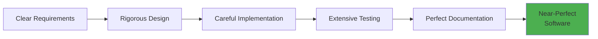
```mermaid
graph LR
    A[Clear Requirements] --> B[Rigorous Design]
    B --> C[Careful Implementation]
    C --> D[Extensive Testing]
    D --> E[Perfect Documentation]
    E --> F[Near-Perfect<br/>Software]
    
    style F fill:#4caf50
```

### Waterfall Failure Story: FBI Virtual Case File (VCF)

**Project:** FBI's case management system  
**Timeline:** 2000-2005  
**Budget:** $170 million  
**Result:** Complete failure, project abandoned

**What Went Wrong:**

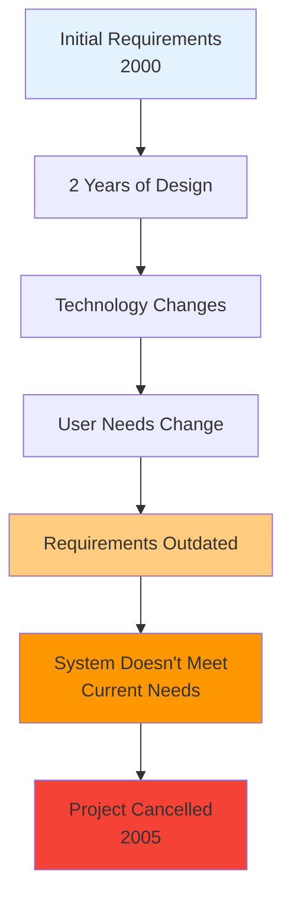
```mermaid
graph TD
    A[Initial Requirements<br/>2000] --> B[2 Years of Design]
    B --> C[Technology Changes]
    C --> D[User Needs Change]
    D --> E[Requirements Outdated]
    E --> F[System Doesn't Meet<br/>Current Needs]
    F --> G[Project Cancelled<br/>2005]
    
    style A fill:#e3f2fd
    style E fill:#ffcc80
    style F fill:#ff9800
    style G fill:#f44336
```

**Root Causes:**
1. ❌ Requirements took too long to finalize
2. ❌ Technology evolved during 5-year timeline
3. ❌ User needs changed post-9/11
4. ❌ No feedback until end
5. ❌ Waterfall couldn't adapt to changes

**Lesson Learned:** Waterfall fails when requirements change or project duration is long

---

## ✅ The V-Model (Verification & Validation Model)

### Overview

The V-Model is an extension of Waterfall that emphasizes testing and quality assurance. It's called "V-Model" because the process forms a V-shape when diagrammed, with development phases on the left descending, and testing phases on the right ascending.

**Philosophy:** Test planning happens alongside development planning

### The V-Shape Diagram

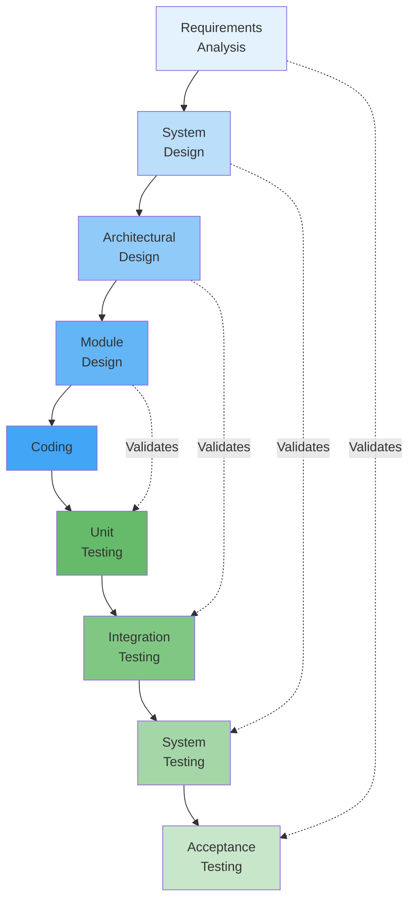
```mermaid
graph TD
    A[Requirements<br/>Analysis] --> B[System<br/>Design]
    B --> C[Architectural<br/>Design]
    C --> D[Module<br/>Design]
    D --> E[Coding]
    
    E --> F[Unit<br/>Testing]
    F --> G[Integration<br/>Testing]
    G --> H[System<br/>Testing]
    H --> I[Acceptance<br/>Testing]
    
    A -.Validates.-> I
    B -.Validates.-> H
    C -.Validates.-> G
    D -.Validates.-> F
    
    style A fill:#e3f2fd
    style B fill:#bbdefb
    style C fill:#90caf9
    style D fill:#64b5f6
    style E fill:#42a5f5
    style F fill:#66bb6a
    style G fill:#81c784
    style H fill:#a5d6a7
    style I fill:#c8e6c9
```

### Key Concept: Verification vs. Validation

**Verification:** "Are we building the product right?"
- Checking against specifications
- Reviews, inspections, walkthroughs
- Happens during development

**Validation:** "Are we building the right product?"
- Checking against user needs
- Testing with actual usage
- Happens with working software

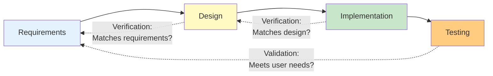
```mermaid
graph LR
    A[Requirements] --> B[Design]
    B --> C[Implementation]
    
    B -.Verification:<br/>Matches requirements?.-> A
    C -.Verification:<br/>Matches design?.-> B
    
    D[Testing] -.Validation:<br/>Meets user needs?.-> A
    
    C --> D
    
    style A fill:#e3f2fd
    style B fill:#fff9c4
    style C fill:#c8e6c9
    style D fill:#ffcc80
```

### V-Model Phases with Testing Mapping

#### Left Side: Development Phases

**1. Requirements Analysis → Acceptance Test Planning**
```
Requirement: Teachers can record attendance
Acceptance Test: Verify teacher can mark 30 students in < 2 minutes
```

**2. System Design → System Test Planning**
```
Design: RESTful API for attendance
System Test: Verify API handles 100 concurrent requests
```

**3. Architectural Design → Integration Test Planning**
```
Architecture: Frontend calls Backend API calls Database
Integration Test: Verify end-to-end data flow
```

**4. Module Design → Unit Test Planning**
```
Module: calculateAttendancePercentage()
Unit Test: Verify calculation with various inputs
```

#### Bottom: Implementation
- Coding happens here
- Following all design specifications
- Unit tests written alongside code

#### Right Side: Testing Phases

**5. Unit Testing**
- Test individual functions/methods
- Verify against module design
- 80%+ code coverage target

**6. Integration Testing**
- Test module interactions
- Verify against architectural design
- Test API contracts

**7. System Testing**
- Test complete system
- Verify against system design
- Performance, security, usability testing

**8. Acceptance Testing**
- User validates system
- Verify against requirements
- Real-world scenarios

### Testing Documentation in V-Model

Each phase produces test artifacts:

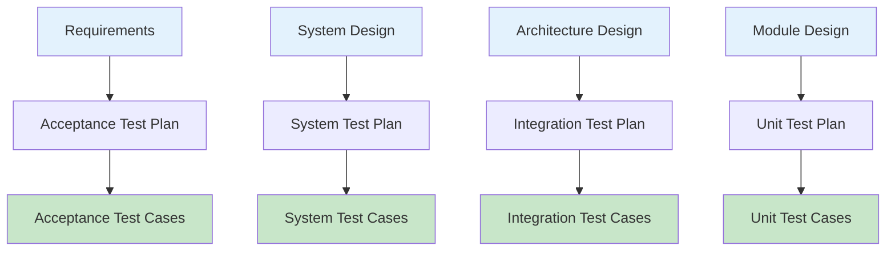
```mermaid
graph TD
    A[Requirements] --> B[Acceptance Test Plan]
    C[System Design] --> D[System Test Plan]
    E[Architecture Design] --> F[Integration Test Plan]
    G[Module Design] --> H[Unit Test Plan]
    
    B --> I[Acceptance Test Cases]
    D --> J[System Test Cases]
    F --> K[Integration Test Cases]
    H --> L[Unit Test Cases]
    
    style A fill:#e3f2fd
    style C fill:#e3f2fd
    style E fill:#e3f2fd
    style G fill:#e3f2fd
    style I fill:#c8e6c9
    style J fill:#c8e6c9
    style K fill:#c8e6c9
    style L fill:#c8e6c9
```

### V-Model Characteristics

#### ✅ Advantages

| Advantage | Benefit | Example |
|-----------|---------|---------|
| **Early Test Planning** | Defects caught early | Test cases ready before coding |
| **High Quality** | Emphasis on testing | Fewer production bugs |
| **Clear Test Objectives** | Each phase has test criteria | No ambiguity in testing |
| **Structured Approach** | Well-defined process | Easy to follow and teach |
| **Traceability** | Requirements map to tests | Complete coverage verification |
| **Verification & Validation** | Both checked systematically | Builds right product correctly |

#### ❌ Disadvantages

| Disadvantage | Problem |
|--------------|---------|
| **Rigid Like Waterfall** | Hard to accommodate changes |
| **No Early Prototype** | No working software until late |
| **Expensive Testing** | Extensive test documentation |
| **Sequential** | Phases cannot overlap |
| **Not for Complex Projects** | Best for well-understood systems |

### When to Use V-Model

✅ **Ideal Scenarios:**

1. **Safety-Critical Systems**
   - Medical devices
   - Aviation software
   - Nuclear plant control systems
   - Automotive safety features

2. **High Reliability Requirements**
   - Banking transaction systems
   - Military applications
   - Aerospace systems

3. **Regulated Industries**
   - Pharmaceutical systems
   - Financial reporting systems
   - Healthcare systems (HIPAA compliance)

4. **Quality is Priority #1**
   - Zero defect tolerance
   - High cost of failure
   - Reputation-critical systems

### V-Model Example: Automotive Engine Control Unit (ECU)

**Project:** Electronic Control Unit for vehicle engine management

**Why V-Model:**

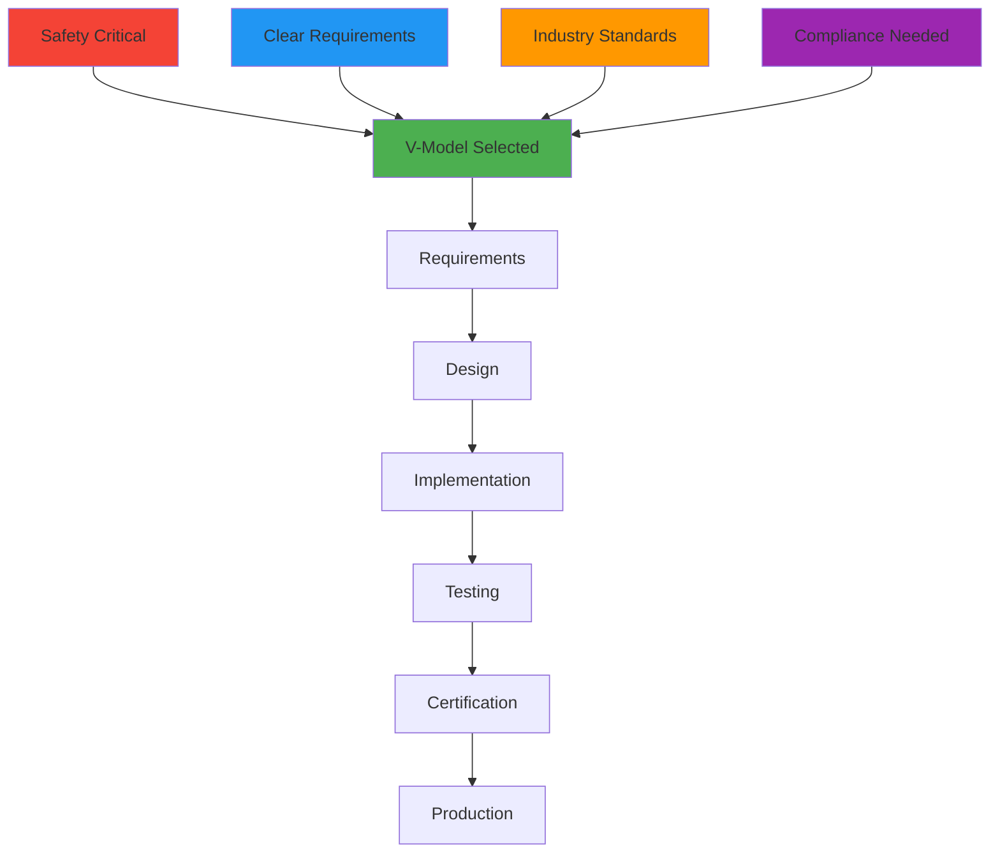
```mermaid
graph TD
    A[Safety Critical] --> E[V-Model Selected]
    B[Clear Requirements] --> E
    C[Industry Standards] --> E
    D[Compliance Needed] --> E
    
    E --> F[Requirements]
    F --> G[Design]
    G --> H[Implementation]
    H --> I[Testing]
    I --> J[Certification]
    J --> K[Production]
    
    style A fill:#f44336
    style B fill:#2196f3
    style C fill:#ff9800
    style D fill:#9c27b0
    style E fill:#4caf50
```

**Testing Levels:**
1. **Unit Tests:** Individual sensor algorithms
2. **Integration Tests:** Sensor → ECU → Actuator
3. **System Tests:** Complete vehicle testing
4. **Acceptance Tests:** Certification testing (ISO 26262)

**Outcome:**
- Zero safety defects in production
- Met all regulatory requirements
- Achieved industry certification
- Successful product launch

---

## 🌀 The Spiral Model

### Overview

The Spiral Model combines iterative development with the systematic aspects of Waterfall. It emphasizes risk management and is particularly suitable for large, complex, and high-risk projects.

**Creator:** Barry Boehm (1986)  
**Philosophy:** Incremental refinement with continuous risk assessment

### The Spiral Diagram

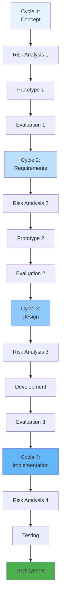
```mermaid
graph TD
    A[Cycle 1:<br/>Concept] --> B[Risk Analysis 1]
    B --> C[Prototype 1]
    C --> D[Evaluation 1]
    
    D --> E[Cycle 2:<br/>Requirements]
    E --> F[Risk Analysis 2]
    F --> G[Prototype 2]
    G --> H[Evaluation 2]
    
    H --> I[Cycle 3:<br/>Design]
    I --> J[Risk Analysis 3]
    J --> K[Development]
    K --> L[Evaluation 3]
    
    L --> M[Cycle 4:<br/>Implementation]
    M --> N[Risk Analysis 4]
    N --> O[Testing]
    O --> P[Deployment]
    
    style A fill:#e3f2fd
    style E fill:#bbdefb
    style I fill:#90caf9
    style M fill:#64b5f6
    style P fill:#4caf50
```

### Four Quadrants of Each Spiral

Each iteration through the spiral involves four key activities:

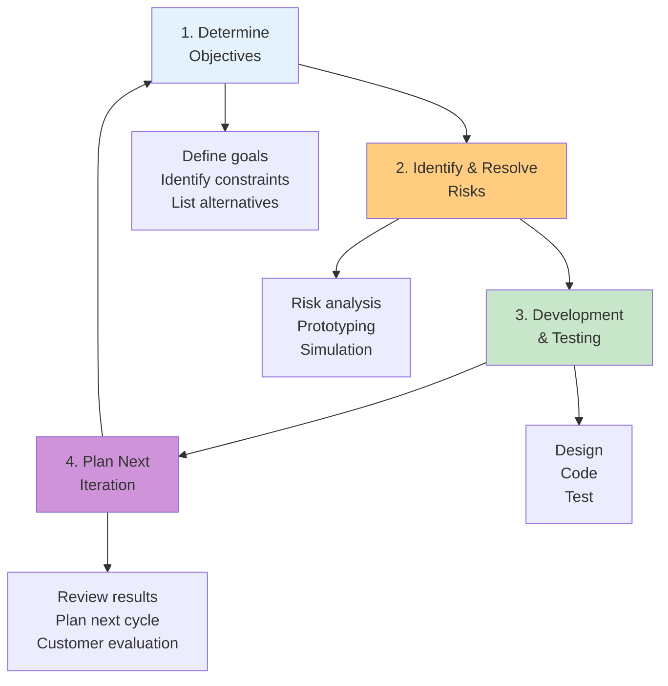
```mermaid
graph TD
    A[1. Determine<br/>Objectives] --> B[2. Identify & Resolve<br/>Risks]
    B --> C[3. Development<br/>& Testing]
    C --> D[4. Plan Next<br/>Iteration]
    D --> A
    
    A --> A1[Define goals<br/>Identify constraints<br/>List alternatives]
    B --> B1[Risk analysis<br/>Prototyping<br/>Simulation]
    C --> C1[Design<br/>Code<br/>Test]
    D --> D1[Review results<br/>Plan next cycle<br/>Customer evaluation]
    
    style A fill:#e3f2fd
    style B fill:#ffcc80
    style C fill:#c8e6c9
    style D fill:#ce93d8
```

### Detailed Spiral Phases

#### Quadrant 1: Determine Objectives
**Activities:**
- Identify objectives for this iteration
- Consider alternative approaches
- Define constraints (time, budget, technology)

**Example - School System Spiral 1:**
```
Objective: Validate attendance tracking concept
Alternatives: 
  - Mobile app attendance
  - Web-based attendance
  - Tablet-based attendance
Constraints:
  - 2-week timeline
  - $5,000 budget
  - Must work offline
```

#### Quadrant 2: Identify and Resolve Risks

**Risk Assessment Process:**

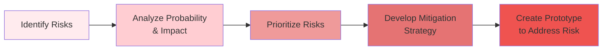
```mermaid
graph LR
    A[Identify Risks] --> B[Analyze Probability<br/>& Impact]
    B --> C[Prioritize Risks]
    C --> D[Develop Mitigation<br/>Strategy]
    D --> E[Create Prototype<br/>to Address Risk]
    
    style A fill:#ffebee
    style B fill:#ffcdd2
    style C fill:#ef9a9a
    style D fill:#e57373
    style E fill:#ef5350
```

**Common Risks Addressed:**

| Risk | Probability | Impact | Mitigation Strategy |
|------|-------------|--------|---------------------|
| Technology unfamiliar | High | High | Build proof-of-concept prototype |
| Performance concerns | Medium | High | Conduct performance testing early |
| User resistance | Medium | Medium | Early user involvement, usability testing |
| Integration complexity | Low | High | Build integration prototype |
| Schedule overrun | High | Medium | Frequent checkpoints, adjust scope |

#### Quadrant 3: Development and Testing
**Activities:**
- Design system/component
- Implement prototype or increment
- Test thoroughly
- Document findings

**Prototyping Focus:**

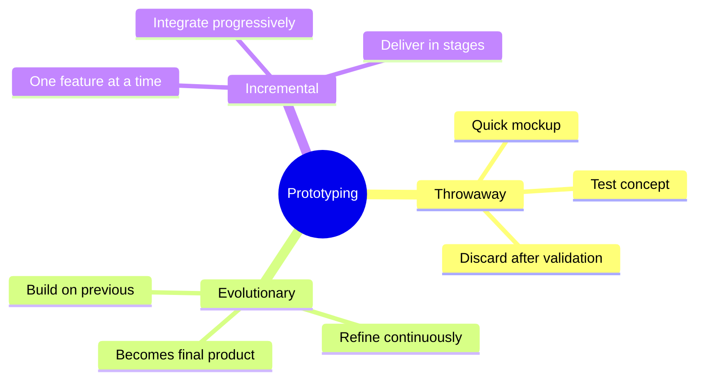
```mermaid
mindmap
  root((Prototyping))
    Throwaway
      Quick mockup
      Test concept
      Discard after validation
    Evolutionary
      Build on previous
      Refine continuously
      Becomes final product
    Incremental
      One feature at a time
      Integrate progressively
      Deliver in stages
```

#### Quadrant 4: Plan Next Iteration
**Activities:**
- Evaluate current iteration results
- Review with stakeholders
- Plan next spiral objectives
- Update project plan

**Evaluation Criteria:**
- Did we address key risks?
- Is the prototype acceptable?
- Should we continue?
- What should the next iteration focus on?

### Spiral Model Example: Microsoft Windows Development

**Project:** Windows Operating System evolution

**Spiral Iterations:**

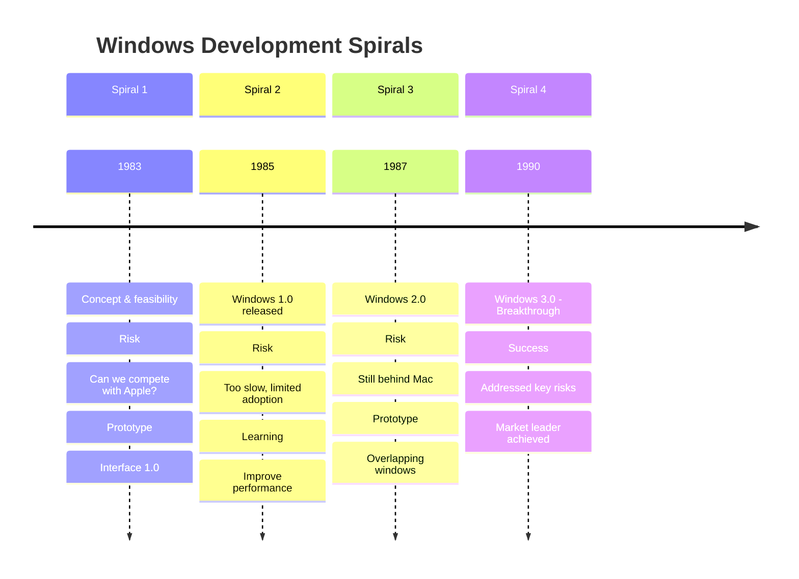
```mermaid
timeline
    title Windows Development Spirals
    section Spiral 1
        1983 : Concept & feasibility
             : Risk: Can we compete with Apple?
             : Prototype: Interface 1.0
    section Spiral 2
        1985 : Windows 1.0 released
             : Risk: Too slow, limited adoption
             : Learning: Improve performance
    section Spiral 3
        1987 : Windows 2.0
             : Risk: Still behind Mac
             : Prototype: Overlapping windows
    section Spiral 4
        1990 : Windows 3.0 - Breakthrough
             : Success: Addressed key risks
             : Market leader achieved
```

**How Spiral Helped:**
1. Early prototypes validated GUI concept
2. Each version addressed major risks
3. Customer feedback incorporated continuously
4. Incremental improvement rather than one big bet
5. Risks managed through iterative releases

### Spiral Model Characteristics

#### ✅ Advantages

| Advantage | Benefit | Example |
|-----------|---------|---------|
| **Risk Management** | Risks addressed early | Build prototype to test feasibility |
| **Flexibility** | Can accommodate changes | Adjust each iteration based on learning |
| **Customer Involvement** | Continuous feedback | Stakeholders review each iteration |
| **Early Delivery** | Working prototypes early | Users see progress regularly |
| **Quality Focus** | Testing in each iteration | Defects caught and fixed early |
| **Large Project Suitability** | Manages complexity well | Break down into manageable spirals |

#### ❌ Disadvantages

| Disadvantage | Challenge |
|--------------|-----------|
| **Complex Management** | Requires expertise to manage spirals effectively |
| **Expensive** | More resource-intensive than linear models |
| **Time-Consuming** | Multiple iterations take time |
| **Requires Risk Expert** | Risk analysis needs skilled professionals |
| **Not for Small Projects** | Overhead not justified for simple projects |
| **Uncertain Timeline** | Hard to predict total time needed |

### When to Use Spiral Model

✅ **Ideal Scenarios:**

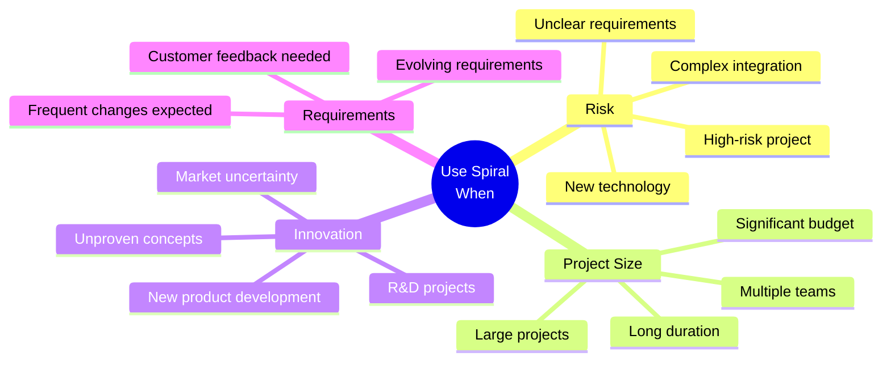
```mermaid
mindmap
  root((Use Spiral<br/>When))
    Risk
      High-risk project
      New technology
      Unclear requirements
      Complex integration
    Project Size
      Large projects
      Multiple teams
      Long duration
      Significant budget
    Innovation
      R&D projects
      New product development
      Unproven concepts
      Market uncertainty
    Requirements
      Evolving requirements
      Customer feedback needed
      Frequent changes expected
```

**Real-World Examples:**

1. **SpaceX Rocket Development**
   - High risk (explosions possible)
   - Iterative testing and refinement
   - Each test addresses specific risks
   - Continuous improvement cycle

2. **New Gaming Console**
   - Hardware/software co-development
   - Market requirements evolving
   - Technology risks (performance, heat)
   - Iterative prototyping essential

3. **Enterprise ERP System**
   - Complex integration requirements
   - Multiple stakeholder groups
   - High implementation risk
   - Phased rollout needed

---

## 📈 The Incremental Model

### Overview

The Incremental Model delivers the system in parts (increments), with each increment adding more functionality. Unlike Spiral (which focuses on risk), Incremental focuses on delivering value early and often.

**Philosophy:** Deliver working software in pieces, each increment is fully functional

### Incremental Development Flow

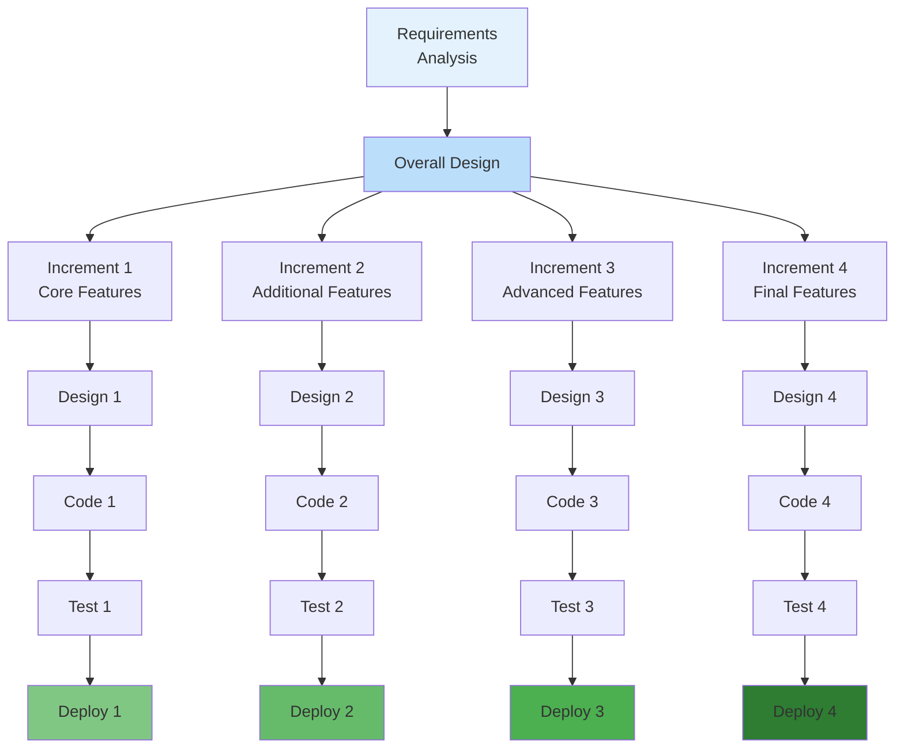
```mermaid
graph TD
    A[Requirements<br/>Analysis] --> B[Overall Design]
    
    B --> C1[Increment 1<br/>Core Features]
    B --> C2[Increment 2<br/>Additional Features]
    B --> C3[Increment 3<br/>Advanced Features]
    B --> C4[Increment 4<br/>Final Features]
    
    C1 --> D1[Design 1]
    D1 --> E1[Code 1]
    E1 --> F1[Test 1]
    F1 --> G1[Deploy 1]
    
    C2 --> D2[Design 2]
    D2 --> E2[Code 2]
    E2 --> F2[Test 2]
    F2 --> G2[Deploy 2]
    
    C3 --> D3[Design 3]
    D3 --> E3[Code 3]
    E3 --> F3[Test 3]
    F3 --> G3[Deploy 3]
    
    C4 --> D4[Design 4]
    D4 --> E4[Code 4]
    E4 --> F4[Test 4]
    F4 --> G4[Deploy 4]
    
    style A fill:#e3f2fd
    style B fill:#bbdefb
    style G1 fill:#81c784
    style G2 fill:#66bb6a
    style G3 fill:#4caf50
    style G4 fill:#2e7d32
```

### Increment Planning Strategy

**Prioritization Criteria:**

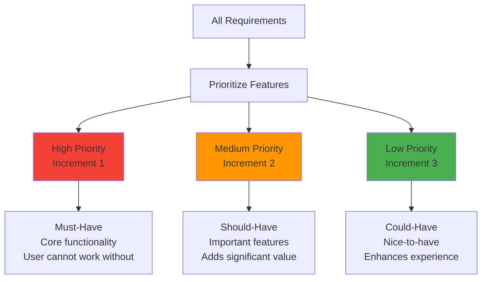
```mermaid
graph TD
    A[All Requirements] --> B[Prioritize Features]
    
    B --> C[High Priority<br/>Increment 1]
    B --> D[Medium Priority<br/>Increment 2]
    B --> E[Low Priority<br/>Increment 3]
    
    C --> F[Must-Have<br/>Core functionality<br/>User cannot work without]
    D --> G[Should-Have<br/>Important features<br/>Adds significant value]
    E --> H[Could-Have<br/>Nice-to-have<br/>Enhances experience]
    
    style C fill:#f44336
    style D fill:#ff9800
    style E fill:#4caf50
```

### School Management System - Incremental Approach

**Increment 1: Core Operations (Month 1-2)**
- ✅ User authentication
- ✅ Student enrollment
- ✅ Class management
- ✅ Basic attendance tracking

**Value:** School can start using system for daily operations

---

**Increment 2: Academic Management (Month 3-4)**
- ✅ Grade entry
- ✅ Report card generation
- ✅ Teacher dashboard
- ✅ Student dashboard

**Value:** Complete academic tracking functional

---

**Increment 3: Communication (Month 5)**
- ✅ Parent portal
- ✅ Email notifications
- ✅ SMS alerts
- ✅ Messaging system

**Value:** Parents connected to school

---

**Increment 4: Analytics & Reporting (Month 6)**
- ✅ Admin dashboard
- ✅ Custom reports
- ✅ Data export
- ✅ Analytics charts

**Value:** Data-driven decision making

### Parallel Development

Key advantage: Multiple increments can be developed simultaneously by different teams

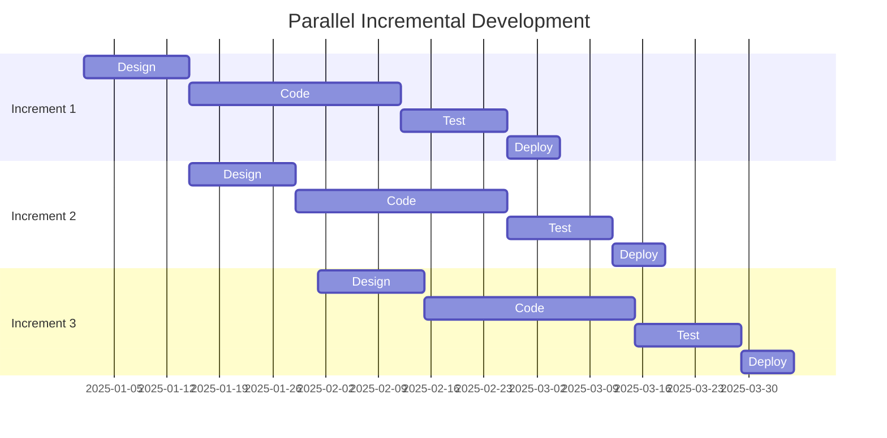
```mermaid
gantt
    title Parallel Incremental Development
    dateFormat YYYY-MM-DD
    section Increment 1
    Design          :i1d, 2025-01-01, 2w
    Code            :i1c, after i1d, 4w
    Test            :i1t, after i1c, 2w
    Deploy          :i1p, after i1t, 1w
    
    section Increment 2
    Design          :i2d, 2025-01-15, 2w
    Code            :i2c, after i2d, 4w
    Test            :i2t, after i2c, 2w
    Deploy          :i2p, after i2t, 1w
    
    section Increment 3
    Design          :i3d, 2025-02-01, 2w
    Code            :i3c, after i3d, 4w
    Test            :i3t, after i3c, 2w
    Deploy          :i3p, after i3t, 1w
```

### Incremental Model Characteristics

#### ✅ Advantages

| Advantage | Benefit | Example |
|-----------|---------|---------|
| **Early Delivery** | Users get value quickly | Increment 1 deployed in 2 months |
| **Parallel Development** | Faster overall delivery | Multiple teams work simultaneously |
| **Risk Mitigation** | Core features proven first | Critical functionality validated early |
| **Customer Feedback** | Early user input shapes later increments | Adjust Increment 3 based on Increment 1 usage |
| **Flexible Priorities** | Can adjust later increments | Reprioritize based on business needs |
| **Revenue Generation** | Can start charging earlier | SaaS can launch with basic features |

#### ❌ Disadvantages

| Disadvantage | Challenge |
|--------------|-----------|
| **Integration Complexity** | Increments must work together seamlessly |
| **Architecture Upfront** | Overall design needed before increments |
| **Requires Modularity** | System must be decomposable into increments |
| **Coordination Overhead** | Multiple teams need synchronization |
| **Incomplete System** | Early increments have limited functionality |

### When to Use Incremental Model

✅ **Ideal Scenarios:**

1. **SaaS Products**
   - Launch MVP quickly
   - Add features based on usage
   - Continuous delivery model

2. **Projects with Clear Core**
   - Well-defined core functionality
   - Additional features can wait
   - Prioritization is clear

3. **Resource Constraints**
   - Limited team size initially
   - Can scale team for later increments
   - Budget released in phases

4. **Market Pressure**
   - Need to launch quickly
   - Competitive pressure
   - "Time to market" critical

### Incremental Success Story: Gmail

**Launch Strategy:**

```mermaid
timeline
    title Gmail Incremental Rollout
    2004 : Increment 1: Beta launch<br/>Invitation-only<br/>1GB storage (core value)<br/>Fast search
    2005 : Increment 2: Conversations<br/>Keyboard shortcuts<br/>Better spam filter
    2006 : Increment 3: Chat integration<br/>Mobile access<br/>Increased storage
    2007 : Increment 4: IMAP support<br/>Public availability<br/>Multiple languages
    2009 : Increment 5: Labs features<br/>Themes<br/>Offline access
```

**Why It Worked:**
- Core value (storage + search) delivered first
- Each increment added meaningful features
- User feedback shaped later increments
- Gradual rollout managed risk
- Became market leader through iteration

---

## 📊 Comprehensive Model Comparison

### Selection Matrix

```mermaid
graph TD
    A{Requirements<br/>Clear?} -->|Yes| B{Need High<br/>Quality?}
    A -->|No| C{High<br/>Risk?}
    
    B -->|Yes| D[V-Model]
    B -->|No| E[Waterfall]
    
    C -->|Yes| F[Spiral Model]
    C -->|No| G{Need Early<br/>Delivery?}
    
    G -->|Yes| H[Incremental]
    G -->|No| I[Consider Agile]
    
    style D fill:#4caf50
    style E fill:#2196f3
    style F fill:#ff9800
    style H fill:#9c27b0
    style I fill:#f44336
```

### Detailed Comparison Table

| Criteria | Waterfall | V-Model | Spiral | Incremental |
|----------|-----------|---------|--------|-------------|
| **Requirements** | Must be complete upfront | Must be complete upfront | Can evolve | Known but prioritizable |
| **Flexibility** | ⭐ Very Low | ⭐ Very Low | ⭐⭐⭐⭐ High | ⭐⭐⭐ Medium |
| **Risk Management** | ⭐⭐ Low | ⭐⭐⭐ Medium | ⭐⭐⭐⭐⭐ Excellent | ⭐⭐⭐ Medium |
| **Time to Market** | ⭐ Slow | ⭐ Slow | ⭐⭐ Medium | ⭐⭐⭐⭐ Fast |
| **Cost** | ⭐⭐⭐⭐ Low | ⭐⭐⭐ Medium | ⭐⭐ High | ⭐⭐⭐ Medium |
| **Quality Focus** | ⭐⭐⭐ Medium | ⭐⭐⭐⭐⭐ Excellent | ⭐⭐⭐⭐ High | ⭐⭐⭐ Medium |
| **Customer Involvement** | ⭐⭐ Low (end only) | ⭐⭐ Low (testing) | ⭐⭐⭐⭐ High | ⭐⭐⭐⭐ High |
| **Documentation** | ⭐⭐⭐⭐⭐ Extensive | ⭐⭐⭐⭐⭐ Extensive | ⭐⭐⭐ Medium | ⭐⭐⭐ Medium |
| **Parallel Development** | ❌ No | ❌ No | ⚠️ Limited | ✅ Yes |
| **Project Size** | Small-Medium | Small-Medium | Large | Medium-Large |

### Cost-Time-Quality Triangle

```mermaid
graph TD
    A[Project Constraints] --> B[Cost]
    A --> C[Time]
    A --> D[Quality]
    
    B --> E[Waterfall:<br/>Lowest cost,<br/>but high risk of rework]
    C --> F[Incremental:<br/>Fastest to first delivery,<br/>longer total time]
    D --> G[V-Model:<br/>Highest quality,<br/>highest cost]
    
    H[Spiral:<br/>Balances all three<br/>through iterations] --> B
    H --> C
    H --> D
    
    style E fill:#4caf50
    style F fill:#2196f3
    style G fill:#ff9800
    style H fill:#9c27b0
```

---

## 🎓 Hands-On Activity: Model Selection

### Activity: "Choose the Right Model"

**Time:** 15 minutes  
**Format:** Individual or small groups

**Scenarios:** For each project scenario, select the most appropriate SDLC model and justify your choice.

#### Scenario 1: E-Commerce Website
**Context:**
- Startup company
- Competitive market
- Need to launch quickly
- Requirements will evolve based on user behavior
- Limited initial budget
- Plan to add features incrementally

**Your Selection:**  
Model: _____________  
Justification: _____________

---

#### Scenario 2: Medical Device Software
**Context:**
- Insulin pump controller
- FDA approval required
- Zero tolerance for errors
- Complete documentation mandatory
- Requirements are well-defined and stable
- Safety is paramount

**Your Selection:**  
Model: _____________  
Justification: _____________

---

#### Scenario 3: Banking Core System Replacement
**Context:**
- Replacing 30-year-old system
- Requirements well understood
- Exact functionality must be maintained
- Cannot afford any downtime
- Regulatory compliance critical
- $50M budget, 3-year timeline

**Your Selection:**  
Model: _____________  
Justification: _____________

---

#### Scenario 4: Innovative AI Product
**Context:**
- New machine learning application
- Unproven market
- High technical risk
- Need customer feedback early
- Requirements uncertain
- R&D focused

**Your Selection:**  
Model: _____________  
Justification: _____________

---

#### Scenario 5: Government Tax Filing System
**Context:**
- Must support 10 million users
- Taxpayer portal needed first (priority)
- Payment processing later
- Analytics dashboard final phase
- 12-month deadline
- Multiple contractor teams available

**Your Selection:**  
Model: _____________  
Justification: _____________

**Suggested Answers at end of Section 1.10**

---

## 🔑 Key Concepts Summary

### Critical Points to Remember

1. **Waterfall** = Sequential, document-heavy, low flexibility
   - Use when: Requirements stable, regulatory compliance needed

2. **V-Model** = Waterfall + extensive testing emphasis
   - Use when: Quality critical, safety-critical systems

3. **Spiral** = Iterative, risk-driven, prototype-focused
   - Use when: High risk, large complex projects, R&D

4. **Incremental** = Deliver in pieces, parallel development
   - Use when: Need early delivery, clear priorities, modular system

5. **No "best" model** = Context determines appropriateness

6. **Traditional models** = Predictable, structured, documentation-heavy
   - vs. Agile (next section) = Flexible, adaptive, collaboration-heavy

### Model Selection Framework

```mermaid
graph TD
    A[Analyze Project] --> B[Requirements Clarity]
    A --> C[Risk Level]
    A --> D[Time Constraints]
    A --> E[Quality Needs]
    A --> F[Team Experience]
    
    B --> G{Model<br/>Selection}
    C --> G
    D --> G
    E --> G
    F --> G
    
    G --> H[Waterfall/<br/>V-Model/<br/>Spiral/<br/>Incremental/<br/>Agile]
    
    style A fill:#e3f2fd
    style G fill:#fff9c4
    style H fill:#c8e6c9
```

---

## ✅ Self-Check Questions

Test your understanding:

1. What is the main difference between Waterfall and V-Model?
2. Why is the Spiral model called "risk-driven"?
3. What's the key advantage of the Incremental model over Waterfall?
4. When would you NOT use Waterfall model?
5. Which model emphasizes testing the most?
6. Can multiple increments be developed in parallel? Why or why not?
7. What type of projects is Spiral model best suited for?
8. What's the difference between verification and validation in V-Model?

**Answers at the end of Section 1.10**

---

## 🚀 What's Next?

You've now learned the traditional SDLC models that dominated software development for decades. However, the software industry evolved to need more flexibility and faster delivery. This led to the Agile revolution.

In the next section, we'll explore Agile methodologies—the modern approach that has transformed how most software is developed today.

**Next Section:** [1.4 Agile Methodologies →](./1.4-agile-methodologies.md)

---

## 📚 Additional Resources

**For Deeper Learning:**
- **Original Paper:** Winston Royce's "Managing the Development of Large Software Systems" (1970)
- **Book:** "Software Engineering" by Ian Sommerville - Chapters on Process Models
- **Research:** Barry Boehm's "A Spiral Model of Software Development and Enhancement" (1988)
- **Case Studies:** IEEE Software journal - Process Model case studies

**Historical Context:**
- NATO Software Engineering Conference reports (1968, 1969)
- "The Mythical Man-Month" by Fred Brooks (Waterfall limitations)

---

[← Previous: 1.2 SDLC Phases](./1.2-sdlc-phases.md) | [Back to README](./chapter-01-README.md) | [Next: 1.4 Agile Methodologies →](./1.4-agile-methodologies.md)

---

*Last Updated: November 2025*  
*Version: 1.0*
