# 1.6 School System Case Study

[← Previous: 1.5 Scrum Deep Dive](./1.5-scrum-deep-dive.md) | [Back to README](./chapter-01-README.md) | [Next: 1.7 Sprint Planning →](./1.7-sprint-planning.md)

---

## 📖 Introduction

Throughout this course, we'll use a consistent, realistic case study to demonstrate software analysis and design concepts. Meet the **School Management System (SMS)**—a comprehensive solution for small-to-medium educational institutions.

This isn't just a theoretical example. Every requirement, user story, and design decision reflects real-world challenges that schools face daily. By the end of this chapter, you'll understand not just how to build software, but why we make specific design and planning decisions.

**Reading Time:** 30 minutes  
**Activity Time:** 15 minutes

---

## 🎯 Learning Objectives

By the end of this section, you will be able to:

1. Analyze real business problems and translate them into software requirements
2. Identify and categorize stakeholders
3. Quantify business value and justify software investments
4. Create a compelling project vision
5. Understand market positioning and competitive analysis
6. Map business problems to technical solutions
7. Define project scope and success criteria

---

## 🏫 The Business Problem

### Current State: Greenfield Academy

**Greenfield Academy** is a private K-12 school with 500 students, 40 teachers, and 5 administrative staff. Like many small schools, they're drowning in paperwork and manual processes.

#### A Day in the Life

**7:45 AM - Ms. Sarah Chen, Math Teacher**


"I spend the first 20 minutes of every class taking attendance and recording it. That's 100 minutes per week just on attendance—time I could spend actually teaching."

**9:30 AM - Mrs. Rodriguez, School Administrator**


"I get 50+ calls per day from parents asking about grades, attendance, and schedules. Each call takes 5-10 minutes to look up information in our filing cabinets."

**2:00 PM - Mr. Johnson, Principal**

"We just failed our accreditation audit because our attendance records weren't complete. We're spending $15,000 on a consultant to help us get back into compliance. If we had digital records with audit trails, this wouldn't have happened."

**4:00 PM - David's Mom, Parent**

"My son David got a D in Math, but I had no idea he was struggling until report cards came out. If I'd known earlier, I could have gotten him a tutor. Why don't teachers communicate with parents anymore?"

### Pain Points Quantified


#### Cost of Current System

**Annual Impact for Greenfield Academy (500 students):**

| Problem Category | Cost/Impact | Details |
|------------------|-------------|---------|
| **Teacher Time Lost** | $35,000 | 15 hrs/week × 40 teachers × $35/hr loaded rate |
| **Administrative Overhead** | $45,000 | Manual record keeping, phone calls |
| **Parent Communication** | $12,000 | Staff time responding to inquiries |
| **Compliance Risk** | $10,000 | Consultant fees, audit preparation |
| **Errors & Rework** | $6,000 | Grade calculation errors, data entry mistakes |
| **Paper & Printing** | $8,000 | Forms, report cards, filing |
| **Opportunity Cost** | Immeasurable | Teachers not teaching, admins not planning |
| **TOTAL ANNUAL IMPACT** | **$116,000** | Direct measurable costs only |

#### Strategic Concerns

Beyond immediate costs, the Principal faces strategic challenges:


**Market Reality:**
- Competing schools have modern systems
- Tech-savvy parents expect digital access
- Teacher recruitment harder without modern tools
- 20% of inquiring parents choose other schools

---

## 🎯 The Solution: School Management System

### Vision Statement

> **"Transform Greenfield Academy from paper-based chaos to digital excellence by providing a comprehensive, intuitive School Management System that saves time, improves communication, ensures compliance, and enhances educational outcomes."**

### Solution Overview


### Value Proposition

**For Teachers:**
- ✅ Save 15 hours per week on administrative tasks
- ✅ Take attendance in 2 minutes instead of 20
- ✅ Automatic grade calculations (no more errors)
- ✅ Easy parent communication
- ✅ More time for actual teaching

**For Administrators:**
- ✅ Real-time visibility into all school operations
- ✅ Instant answers to parent questions
- ✅ Automated compliance reporting
- ✅ Data-driven decision making
- ✅ Reduce phone calls by 60%

**For Parents:**
- ✅ 24/7 access to child's grades and attendance
- ✅ Instant notifications of absences
- ✅ Direct messaging with teachers
- ✅ See problems early, intervene proactively
- ✅ Digital report cards and progress reports

**For Students:**
- ✅ Always know current grades
- ✅ See upcoming assignments
- ✅ Track their own progress
- ✅ Access from any device

### Expected Outcomes

**Year 1 Metrics:**

```mermaid
graph LR
    A[Administrative Time] --> B[60% Reduction<br/>30 hrs → 12 hrs/week]
    C[Teacher Non-Teaching Time] --> D[40% Reduction<br/>15 hrs → 9 hrs/week]
    E[Parent Satisfaction] --> F[40% Increase<br/>Survey scores]
    G[Data Accuracy] --> H[99%+ Accuracy<br/>from ~85%]
    I[Compliance Audit] --> J[Pass First Time]
    
    style B fill:#4caf50
    style D fill:#4caf50
    style F fill:#4caf50
    style H fill:#4caf50
    style J fill:#4caf50
```



**Return on Investment:**

| Category | Annual Benefit |
|----------|----------------|
| **Time Savings** | $80,000 |
| **Error Reduction** | $6,000 |
| **Compliance** | $10,000 |
| **Paper Reduction** | $8,000 |
| **Total Annual Benefit** | **$104,000** |
| | |
| **Initial Investment** | $180,000 |
| **Annual Operating Cost** | $24,000 |
| | |
| **Payback Period** | **2.25 years** |
| **5-Year ROI** | **188%** |

---

## 👥 Stakeholder Analysis

### Stakeholder Identification


### Detailed Stakeholder Profiles

#### 1. Teachers (40 users)

**Profile:**
- Age range: 25-65
- Tech comfort: Low to Medium
- Primary device: Desktop/Laptop in classroom
- Usage frequency: Daily, multiple times

**Needs:**
- Quick attendance entry (< 2 minutes per class)
- Easy grade entry and calculation
- View student history
- Communicate with parents
- Minimal training required

**Pain Points:**
- Current paper system time-consuming
- Grade calculation errors
- Difficulty reaching parents
- No access to historical data

**Success Criteria:**
- System faster than paper
- Intuitive interface (< 1 hour training)
- Works on school computers
- Reliable (no data loss)

**User Story Examples:**
```
US-019: As a teacher, I want to take attendance quickly 
so that I can start teaching without wasting class time.

US-026: As a teacher, I want to enter grades easily 
so that I can keep student records up to date.

US-038: As a teacher, I want to send messages to parents 
so that I can communicate important information quickly.
```

#### 2. School Administrators (5 users)

**Profile:**
- Age range: 35-60
- Tech comfort: Medium
- Primary device: Desktop computer
- Usage frequency: Constantly throughout day

**Needs:**
- Real-time visibility into operations
- Quick answers to parent inquiries
- Generate reports for board meetings
- Manage student enrollment
- System administration capabilities

**Pain Points:**
- Spend hours looking up information
- Can't answer parent questions immediately
- Report generation takes days
- No trend analysis or insights

**Success Criteria:**
- Instant access to any student's information
- One-click report generation
- Dashboard with key metrics
- Audit-ready records

**User Story Examples:**
```
US-006: As an admin, I want to add new students quickly 
so that enrollment is efficient.

US-044: As an admin, I want to generate various reports 
so that I can provide data to the school board.

US-040: As an admin, I want a dashboard with key metrics 
so that I can monitor school performance at a glance.
```

#### 3. Parents (500 families)

**Profile:**
- Age range: 30-55
- Tech comfort: Varied (must be simple)
- Primary device: Smartphone
- Usage frequency: Weekly or as needed

**Needs:**
- View child's grades anytime
- See attendance records
- Receive absence notifications
- View class schedule
- Message teachers
- Multiple children on one account

**Pain Points:**
- No visibility into daily performance
- Only learn about problems at report cards
- Hard to reach teachers
- Can't track trends over time

**Success Criteria:**
- Mobile-friendly interface
- Real-time updates
- Instant notifications
- Easy to understand

**User Story Examples:**
```
US-033: As a parent, I want to view my child's grades 
so that I can monitor their academic progress.

US-036: As a parent, I want to receive notifications 
so that I'm immediately aware if my child is absent.

US-039: As a parent, I want to link multiple children 
so that I can manage all my children in one account.
```

#### 4. Students (500 users)

**Profile:**
- Age range: 5-18 (focus on 12+)
- Tech comfort: High
- Primary device: Smartphone, tablet
- Usage frequency: Daily

**Needs:**
- View current grades
- See upcoming assignments
- Check class schedule
- View attendance record
- Track progress over time

**Pain Points:**
- Uncertain about current grade
- Forget assignment due dates
- Don't know if attendance recorded correctly

**Success Criteria:**
- Works on phones
- Easy to navigate
- Always shows current information
- Visually appealing

**User Story Examples:**
```
US-031: As a student, I want to view my current grades 
so that I know where I stand in each class.

US-042: As a student, I want to see my class schedule 
so that I know where to go next.

US-023: As a student, I want to view my attendance 
so that I can ensure it's recorded correctly.
```

#### 5. Principal (1 user - Primary Decision Maker)

**Profile:**
- Name: Dr. Michael Johnson
- Age: 52
- Tech comfort: Medium
- Role: Final authority on system

**Priorities:**
1. Improve operational efficiency
2. Enhance parent satisfaction
3. Ensure compliance and accreditation
4. Support teacher effectiveness
5. Stay within budget

**Concerns:**
- Will teachers actually use it?
- What if the system fails?
- Can we afford the ongoing costs?
- How long until we see ROI?

**Decision Criteria:**
- Proven track record
- Strong vendor support
- Reasonable total cost of ownership
- Minimal disruption during rollout

### Stakeholder Power-Interest Matrix


**Engagement Strategy:**

| Quadrant | Stakeholders | Strategy |
|----------|--------------|----------|
| **Manage Closely** | Principal, Teachers, Admin Staff | Daily communication, involve in all decisions, sprint reviews |
| **Keep Satisfied** | School Board, IT Dept, Accreditation | Monthly updates, address concerns proactively |
| **Keep Informed** | Parents, Students | Regular newsletters, portal updates, training materials |
| **Monitor** | External parties | Quarterly check-ins, ensure compliance |

---

## 📋 High-Level Requirements

### Functional Requirements Overview


### Must-Have Features (MVP)

**Phase 1 - Core Operations (Sprints 1-3):**

1. **User Authentication & Management**
   - Login/logout
   - Password reset
   - Role-based access (Admin, Teacher, Parent, Student)
   - User profile management

2. **Student & Class Management**
   - Add/edit students
   - Create classes with sections
   - Enroll students in classes
   - Assign teachers to classes

3. **Attendance Tracking**
   - Daily attendance entry
   - Multiple attendance types
   - Attendance history
   - Parent notifications

**Phase 2 - Academic Features (Sprints 4-6):**

4. **Grade Management**
   - Enter grades by category
   - Define grading scale and weights
   - Automatic final grade calculation
   - Grade history and trends

5. **Parent Portal**
   - View child's grades
   - View attendance
   - View class schedule
   - Receive notifications
   - Link multiple children

6. **Reporting & Dashboard**
   - Admin dashboard with KPIs
   - Teacher dashboard
   - Generate standard reports
   - Export capabilities

### Non-Functional Requirements

#### Performance


| Metric | Target | Justification |
|--------|--------|---------------|
| **Page Load Time** | < 2 seconds (95th percentile) | User patience threshold |
| **API Response** | < 500ms (95th percentile) | Snappy user experience |
| **Database Query** | < 100ms (average) | Fast data retrieval |
| **Concurrent Users** | 500+ simultaneous | Entire school at peak |
| **Uptime** | 99.5% (7am-6pm school days) | Mission-critical hours |

#### Security


**Security Measures:**
- Password complexity requirements (8+ chars, mixed case, number)
- Session timeout after 30 minutes
- Failed login lockout (5 attempts)
- All data encrypted at rest (AES-256)
- All connections over HTTPS
- Regular security updates
- Role-based access control (RBAC)
- Audit trail of all data changes
- FERPA compliance (student privacy)

#### Usability


**Usability Targets:**
- 90% of teachers can take attendance without training
- New administrator productive in < 1 day
- Parent portal requires zero training
- Works on IE11+ (school computers), Chrome, Safari, Firefox
- Responsive design (phone, tablet, desktop)
- WCAG 2.1 AA accessibility compliance

#### Reliability

| Aspect | Requirement | How Achieved |
|--------|-------------|--------------|
| **Uptime** | 99.5% during school hours (7am-6pm) | Load balancing, redundancy |
| **Data Integrity** | 100% - no data loss | Daily backups, transactions |
| **Backup** | Daily automated, 30-day retention | Automated backup system |
| **Recovery** | RTO: 4 hours, RPO: 24 hours | Disaster recovery plan |
| **Error Rate** | < 0.1% of transactions | Extensive testing, monitoring |

#### Scalability


**Scalability Requirements:**
- Handle 2x current load without code changes
- Support 10x load with horizontal scaling
- Database designed for multi-tenant future
- Modular architecture for feature additions

---

## 💼 Market Analysis

### Target Market

**Primary Market Segment:**


**Market Size:**
- Total addressable market: ~15,000 schools in USA
- Serviceable market: ~5,000 schools (with internet/computers)
- Target first year: 50 schools

**Customer Profile:**
- Enrollment: 200-1,000 students
- Annual budget: $2M-$10M
- Current system: Paper-based or outdated software
- Decision cycle: 3-6 months
- Budget cycle: Annual (July-August planning)

### Competitive Analysis


#### Competitor Analysis

| Competitor | Strengths | Weaknesses | Price | Market Share |
|------------|-----------|------------|-------|--------------|
| **PowerSchool** | Market leader, comprehensive | Expensive, complex | $15-30/student/yr | 35% |
| **Blackbaud** | Premium features, strong support | Very expensive, enterprise focus | $25-50/student/yr | 15% |
| **Gradelink** | Affordable, cloud-based | Limited features, dated UI | $3-6/student/yr | 10% |
| **ThinkWave** | Free tier available | Very basic, ads | Free-$5/student/yr | 8% |
| **Our SMS** | Modern, intuitive, right-sized | New entrant | $8-12/student/yr | 0% (launch) |

### Our Competitive Advantages


**Why We'll Win:**

1. **Not Adapted, Built For Purpose**
   - Competitors use one-size-fits-all platforms
   - We focus exclusively on small school needs
   - Features chosen specifically for 200-1,000 student schools

2. **Modern Technology Stack**
   - Competitors use 10-15 year old codebases
   - We use latest web technologies
   - Mobile-first, cloud-native design

3. **Rapid Deployment**
   - Competitors: 3-6 months implementation
   - Us: 2-3 weeks from contract to go-live
   - School operational mid-year if needed

4. **Transparent, Affordable Pricing**
   - Competitors hide pricing, customized quotes
   - Us: $10/student/year (500 students = $5,000/year)
   - No hidden fees, no long-term contracts

5. **Personal Support**
   - Competitors: Ticket-based support, call centers
   - Us: Dedicated account manager
   - Local presence, in-person training available

### Market Trends


**Key Trends Favoring Our Entry:**

1. **Digital Transformation Acceleration**
   - COVID-19 forced schools to go digital
   - No going back to paper
   - Budget allocated for technology

2. **Parent Engagement Priority**
   - Parents expect real-time access
   - Communication is competitive differentiator
   - Mobile access non-negotiable

3. **Cloud Adoption**
   - 65% of schools moving to cloud
   - On-premise solutions declining
   - SaaS model preferred

4. **Dissatisfaction with Legacy Systems**
   - 40% of schools want to switch
   - Dated interfaces frustrate users
   - Poor mobile experience

---

## 🎯 Project Success Criteria

### Definition of Success


### Success Metrics

#### Technical Metrics

| Metric | Target | Measurement Method |
|--------|--------|-------------------|
| **Code Quality** | Test coverage > 80% | Automated code coverage tools |
| **Performance** | 95% of requests < 2s | Application monitoring |
| **Reliability** | 99.5% uptime | Uptime monitoring |
| **Security** | Zero critical vulnerabilities | Security scanning |
| **Bug Rate** | < 5 critical bugs at launch | Bug tracking system |

#### Business Metrics

| Metric | Target | Measurement Method |
|--------|--------|-------------------|
| **Time Savings** | 60% reduction in admin time | Time-motion study |
| **User Adoption** | 90% daily active users | Analytics tracking |
| **User Satisfaction** | > 4.0/5.0 rating | Quarterly surveys |
| **Parent Engagement** | 70% weekly portal logins | Usage analytics |
| **Support Tickets** | < 20 tickets/month after month 2 | Support system |

#### Project Metrics

| Metric | Target | Status Tracking |
|--------|--------|-----------------|
| **Timeline** | 16 weeks (7 sprints) | Gantt chart, burn-up |
| **Budget** | $180,000 | Financial tracking |
| **Velocity** | 38-42 points/sprint | Sprint reports |
| **Sprint Success** | > 90% committed work done | Sprint retrospectives |
| **Stakeholder Satisfaction** | > 4.5/5.0 | Post-sprint surveys |

---

## 🎓 Hands-On Activity: Stakeholder Interview

### Activity: "Understanding User Needs"

**Time:** 15 minutes  
**Format:** Pairs (one interviewer, one stakeholder)

**Scenario:**
You're gathering requirements for the School Management System. Interview a stakeholder to understand their needs.

#### Role Play Options

**Option 1: Teacher Interview**
```
Stakeholder: Ms. Sarah Chen, 8th Grade Math Teacher
Context: Currently takes attendance on paper, spends hours grading

Interview Questions:
1. Walk me through your current attendance process
2. What frustrates you most about the current system?
3. How much time do you spend on administrative tasks vs teaching?
4. What would make your day easier?
5. What features are absolutely essential for you?
```

**Option 2: Parent Interview**
```
Stakeholder: Mrs. Jennifer Martinez, Parent of 2 students
Context: Frustrated by lack of communication, surprised by poor grades

Interview Questions:
1. How do you currently stay informed about your children's progress?
2. When was the last time you felt surprised by their grades?
3. How often do you wish you could check on their status?
4. What information would be most valuable to you?
5. How would you prefer to access this information?
```

**Option 3: Administrator Interview**
```
Stakeholder: Mrs. Rodriguez, School Administrator
Context: Spends hours answering parent calls, looking up records

Interview Questions:
1. What takes up most of your time each day?
2. What parent questions are you asked most frequently?
3. How long does it take to answer a typical parent question?
4. What reports does the principal ask you for?
5. What would save you the most time?
```

#### Documentation Template

```
Stakeholder Interview Notes

Date: _______________
Stakeholder: _______________
Role: _______________
Interviewer: _______________

Current Process:
_________________________________
_________________________________

Pain Points:
1. _________________________________
2. _________________________________
3. _________________________________

Desired Features:
1. _________________________________
2. _________________________________
3. _________________________________

Success Criteria (in their words):
_________________________________
_________________________________

User Stories Identified:
1. As a _______, I want _______ so that _______
2. As a _______, I want _______ so that _______
3. As a _______, I want _______ so that _______

Priority (Must/Should/Could Have):
_________________________________

Follow-up Questions:
_________________________________
```

#### Debrief Questions

1. What surprised you most about the stakeholder's needs?
2. How do their needs differ from what you assumed?
3. What conflicting requirements did you identify?
4. How would you prioritize their requests?
5. What additional questions should you have asked?

---

## 🔑 Key Concepts Summary

### Critical Points to Remember

1. **Business Context is Essential**
   - Software solves business problems
   - Always quantify the pain and value
   - Understand before solving

2. **Stakeholder Management**
   - Different stakeholders have different needs
   - Some needs conflict—prioritization required
   - Engage stakeholders throughout project

3. **Requirements Must Be Specific**
   - Vague: "System should be fast"
   - Specific: "Page load < 2 seconds, 95th percentile"

4. **Success Criteria Beyond "It Works"**
   - Technical success (no bugs) ≠ project success
   - Business outcomes matter most
   - User adoption is key metric

5. **Competitive Advantage Matters**
   - Understand the market
   - Know your competitors
   - Differentiate clearly

### Project Foundation Checklist

```
Before starting development:
□ Business problem clearly defined
□ Pain points quantified
□ Stakeholders identified and prioritized
□ User needs documented
□ Success criteria established
□ ROI calculated and justified
□ Competitive landscape understood
□ Project vision compelling and shared
□ Scope defined with must-haves clear
□ Risks identified and mitigation planned
```

---

## ✅ Self-Check Questions

Test your understanding:

1. What is the annual cost impact of Greenfield Academy's current manual system?
2. Name the five main stakeholder groups and their primary concerns.
3. What is the project's vision statement?
4. What are the must-have features for Phase 1 (MVP)?
5. What is the target response time for the system?
6. How does our solution differentiate from PowerSchool?
7. What is the expected payback period for the investment?
8. Name three non-functional requirements and their targets.

**Answers at the end of Section 1.10**

---

## 🚀 What's Next?

Now that you understand the business context and requirements for our School Management System, the next section will show you how to plan the actual development work. You'll learn how to break down this project into sprints, create user stories, estimate work, and build a realistic project timeline.

**Next Section:** [1.7 Sprint Planning Workshop →](./1.7-sprint-planning.md)

---

## 📚 Additional Resources

**For Deeper Learning:**
- **Article:** "How to Conduct Effective Stakeholder Interviews"
- **Book:** "User Story Mapping" by Jeff Patton
- **Template:** Business Case Template for Software Projects
- **Video:** "Quantifying Business Value" (YouTube)

**Market Research:**
- **Report:** EdTech Market Analysis 2024
- **Survey:** Parent Engagement in K-12 Education
- **Study:** ROI of School Management Systems

---

[← Previous: 1.5 Scrum Deep Dive](./1.5-scrum-deep-dive.md) | [Back to README](./chapter-01-README.md) | [Next: 1.7 Sprint Planning →](./1.7-sprint-planning.md)

---

*Last Updated: November 2025*  
*Version: 1.0*
