# 1.8 Tools and Practices

[← Previous: 1.7 Sprint Planning](./1.7-sprint-planning.md) | [Back to README](./chapter-01-README.md) | [Next: 1.9 Hands-on Activities →](./1.9-hands-on-activities.md)

---

## 📖 Introduction

Having a great methodology and plan is only half the battle. To execute effectively, development teams need the right tools and practices. Think of these tools as your software development toolkit—each serves a specific purpose in making your team more productive, collaborative, and successful.

In this section, we'll explore the essential tools that professional development teams use daily, and more importantly, how to use them effectively to support your SDLC.

**Reading Time:** 20 minutes  
**Hands-on Setup:** 30 minutes (optional)

---

## 🎯 Learning Objectives

By the end of this section, you will be able to:

1. Understand the purpose and benefits of essential development tools
2. Use Git for version control and collaboration
3. Manage projects with tools like Jira or Trello
4. Set up CI/CD pipelines for automated testing and deployment
5. Choose appropriate collaboration tools for distributed teams
6. Apply best practices for tool usage
7. Integrate tools into your development workflow

---

## 🗂️ Categories of Development Tools

### The Essential Tool Stack


---

## 📦 Version Control: Git and GitHub

### Why Version Control?


### Git Fundamentals

#### Core Concepts


#### Essential Git Commands

**Daily Workflow:**

```bash
# 1. Clone repository (first time only)
git clone https://github.com/school/sms.git
cd sms

# 2. Create new branch for feature
git checkout -b feature/attendance-tracking

# 3. Make changes to files
# ... edit code ...

# 4. Check what changed
git status
git diff

# 5. Stage changes
git add src/components/Attendance.jsx
# Or stage all changes:
git add .

# 6. Commit with descriptive message
git commit -m "Add attendance tracking UI component"

# 7. Push to remote
git push origin feature/attendance-tracking

# 8. Create Pull Request on GitHub
# (Done through web interface)

# 9. After PR merged, update main branch
git checkout main
git pull origin main

# 10. Delete old branch
git branch -d feature/attendance-tracking
```

#### Git Branching Strategy: Git Flow


**Branch Types:**

| Branch | Purpose | Naming | Lifetime |
|--------|---------|--------|----------|
| **main** | Production-ready code | `main` | Permanent |
| **develop** | Integration branch | `develop` | Permanent |
| **feature** | New features | `feature/attendance-tracking` | Temporary |
| **bugfix** | Bug fixes | `bugfix/login-error` | Temporary |
| **hotfix** | Urgent production fixes | `hotfix/security-patch` | Temporary |
| **release** | Release preparation | `release/v1.0.0` | Temporary |

### GitHub Workflow

#### Creating a Pull Request

**School System Example:**

```
Title: Add Attendance Tracking Feature

Description:
Implements US-024: Take Attendance

Changes:
- Created Attendance.jsx component for UI
- Added POST /api/attendance endpoint
- Implemented database schema for attendance records
- Added unit tests (85% coverage)
- Updated API documentation

Testing:
- All unit tests pass
- Integration tests pass
- Manually tested with 30-student class
- Tested on Chrome, Firefox, Safari
- Mobile responsive verified

Screenshots:
[Attach screenshots of attendance UI]

Closes #24
```

#### Code Review Process


**Code Review Checklist:**

```
Code Quality:
□ Follows coding standards
□ No code duplication
□ Appropriate naming
□ Comments where needed
□ No console.log() or debug code

Functionality:
□ Meets acceptance criteria
□ Handles edge cases
□ Error handling present
□ No obvious bugs

Testing:
□ Unit tests included
□ Tests pass locally
□ Test coverage adequate
□ Integration tests if needed

Security:
□ No hardcoded secrets
□ Input validation present
□ SQL injection prevention
□ XSS prevention

Performance:
□ No N+1 queries
□ Appropriate caching
□ No memory leaks
□ Optimized algorithms

Documentation:
□ API docs updated
□ README updated if needed
□ Comments explain complex logic
```

### Git Best Practices

#### Commit Messages

**Bad Commit Messages:**
```bash
git commit -m "fix"
git commit -m "update"
git commit -m "changes"
git commit -m "asdfasdf"
```

**Good Commit Messages:**
```bash
git commit -m "Fix login authentication timeout bug"
git commit -m "Add attendance percentage calculation"
git commit -m "Refactor user profile component for better performance"
git commit -m "Update API documentation for grade endpoints"
```

**Conventional Commits Format:**
```bash
<type>(<scope>): <subject>

feat(attendance): add bulk attendance entry
fix(auth): resolve JWT token expiration issue
docs(api): update authentication endpoints
refactor(grades): simplify grade calculation logic
test(attendance): add unit tests for attendance service
chore(deps): update React to v18.2.0
```

#### .gitignore File

**Essential Exclusions:**

```bash
# Node.js
node_modules/
npm-debug.log
yarn-error.log

# Environment variables
.env
.env.local
.env.production

# Build outputs
dist/
build/
*.log

# IDE files
.vscode/
.idea/
*.swp

# OS files
.DS_Store
Thumbs.db

# Test coverage
coverage/

# Sensitive data
config/secrets.json
*.pem
*.key
```

---

## 📊 Project Management Tools

### Jira: The Industry Standard


#### Jira Project Setup

**1. Create Project**
- Type: Scrum
- Name: School Management System
- Key: SMS (for issue IDs like SMS-001)

**2. Configure Board**

```
Columns:
- Backlog
- To Do (Sprint committed)
- In Progress (WIP limit: 5)
- Code Review (WIP limit: 3)
- Testing (WIP limit: 3)
- Done

Swimlanes:
- By Assignee
- By Priority
- By Story Type
```

**3. Create Issue Types**

| Type | Icon | Use Case |
|------|------|----------|
| **Epic** | 📚 | Large feature (e.g., Attendance Module) |
| **Story** | 📘 | User story (e.g., US-024) |
| **Task** | ✅ | Technical task (e.g., Setup database) |
| **Bug** | 🐛 | Defect to fix |
| **Sub-task** | 📝 | Part of a story/task |

#### Story in Jira

**Example: US-024 Take Attendance**

```
Summary: Teachers can take attendance quickly

Story Points: 8
Priority: High
Sprint: Sprint 4
Assignee: Sarah Chen
Labels: frontend, backend, priority-high

Description:
As a teacher
I want to quickly record student attendance
So that I can track attendance patterns and parents stay informed

Acceptance Criteria:
✓ Teacher can see list of students in their class
✓ Teacher can mark students as Present, Absent, Late, Excused
✓ Bulk selection available
✓ Changes save immediately
✓ Attendance timestamp recorded automatically
✓ Parents notified of absences within 1 hour
✓ Teacher can edit attendance for up to 24 hours

Sub-tasks:
□ Design attendance UI (4h)
□ Create database schema (2h)
□ Build API endpoint (6h)
□ Implement frontend form (8h)
□ Add validation logic (4h)
□ Integrate notifications (4h)
□ Write unit tests (6h)
□ Write integration tests (4h)

Attachments:
- attendance-mockup.png
- attendance-wireframe.pdf

Comments:
Sarah: Started work on UI mockup
Mike: Database schema looks good
Sarah: PR ready for review: #245
```

#### Jira Reports

**1. Sprint Burndown**
```
Shows remaining work vs. ideal burndown
Identifies if sprint is on track
Updated daily based on story points
```

**2. Velocity Report**
```
Shows story points completed per sprint
Helps predict future capacity
Identifies trends (improving/declining)
```

**3. Cumulative Flow Diagram**
```
Shows work distribution across columns
Identifies bottlenecks
Monitors work in progress
```

### Trello: Lightweight Alternative


**Trello Advantages:**
- ✅ Simple, visual interface
- ✅ Free for small teams
- ✅ Quick setup (minutes)
- ✅ Mobile apps excellent
- ✅ Easy for non-technical users

**Trello Limitations:**
- ❌ No built-in story points
- ❌ Limited reporting
- ❌ No sprint management
- ❌ Basic search
- ❌ Limited automation

**Best For:**
- Small teams (< 10 people)
- Simple projects
- Non-technical stakeholders
- Visual thinkers

---

## 🔄 CI/CD: Continuous Integration and Deployment

### What is CI/CD?


### Benefits of CI/CD


### GitHub Actions Example

**School System CI/CD Pipeline:**

```yaml
# .github/workflows/ci-cd.yml
name: School Management System CI/CD

on:
  push:
    branches: [ main, develop ]
  pull_request:
    branches: [ main, develop ]

jobs:
  # Job 1: Build and Test
  test:
    runs-on: ubuntu-latest
    
    steps:
    - name: Checkout code
      uses: actions/checkout@v3
    
    - name: Setup Node.js
      uses: actions/setup-node@v3
      with:
        node-version: '18'
    
    - name: Install dependencies
      run: |
        npm ci
        cd backend && npm ci
    
    - name: Lint code
      run: |
        npm run lint
        cd backend && npm run lint
    
    - name: Run unit tests
      run: |
        npm test -- --coverage
        cd backend && npm test -- --coverage
    
    - name: Run integration tests
      run: |
        npm run test:integration
    
    - name: Upload coverage
      uses: codecov/codecov-action@v3
      with:
        files: ./coverage/lcov.info
  
  # Job 2: Deploy to Staging
  deploy-staging:
    needs: test
    runs-on: ubuntu-latest
    if: github.ref == 'refs/heads/develop'
    
    steps:
    - name: Deploy to staging
      run: |
        echo "Deploying to staging server"
        # Deployment commands here
    
    - name: Run smoke tests
      run: |
        npm run test:smoke -- --env=staging
  
  # Job 3: Deploy to Production
  deploy-production:
    needs: test
    runs-on: ubuntu-latest
    if: github.ref == 'refs/heads/main'
    
    steps:
    - name: Deploy to production
      run: |
        echo "Deploying to production"
        # Deployment commands here
    
    - name: Run smoke tests
      run: |
        npm run test:smoke -- --env=production
    
    - name: Notify team
      run: |
        echo "Deployment successful! 🎉"
```

### Pipeline Stages Explained

```mermaid
graph TD
    A[Code Commit] --> B[Build<br/>Compile, Bundle]
    B --> C[Lint<br/>Code Style Check]
    C --> D[Unit Tests<br/>Test Components]
    D --> E[Integration Tests<br/>Test Together]
    E --> F{All Pass?}
    F -->|No| G[❌ Pipeline Fails<br/>Notify Developer]
    F -->|Yes| H[Deploy to Staging]
    H --> I[Smoke Tests<br/>Basic Health Checks]
    I --> J{Staging OK?}
    J -->|Yes| K[✅ Ready for Production]
    J -->|No| G
    
    style F fill:#fff9c4
    style J fill:#ffcc80
    style K fill:#4caf50
    style G fill:#ef5350
```



### Deployment Strategies

**1. Blue-Green Deployment**


**2. Canary Deployment**


---

## 💬 Collaboration Tools

### Communication Platforms

#### Slack: Team Communication

**Channel Structure for School System Project:**

```
#general - Team-wide announcements
#development - Dev team discussions
#sprint-planning - Sprint planning prep
#standup - Daily standup async updates
#pull-requests - PR notifications
#deployments - Deployment notifications
#bugs - Bug reports and discussions
#random - Non-work chat
```

**Best Practices:**


**Example Slack Integration:**

```
GitHub Bot in #pull-requests:
🔀 New Pull Request: Add attendance tracking
    By: @sarah
    Branch: feature/attendance-tracking
    [View PR] [View Changes]

Jira Bot in #development:
📘 SMS-024 moved to "In Progress"
    Assignee: @sarah
    Sprint: Sprint 4
    [View Issue]

CI/CD Bot in #deployments:
✅ Deployment to staging successful
    Commit: abc123f
    Branch: develop
    Duration: 3m 24s
    [View Logs]
```

#### Microsoft Teams

**Similar to Slack but with:**
- Better Office 365 integration
- Built-in video calling
- Enterprise features
- Free for basic use

**Choose Teams if:**
- Organization uses Office 365
- Need integrated video conferencing
- Enterprise security requirements
- Prefer Microsoft ecosystem

### Video Conferencing

**Essential for Distributed Teams:**

| Tool | Best For | Key Features |
|------|----------|--------------|
| **Zoom** | Large meetings | Breakout rooms, recording, large capacity |
| **Google Meet** | Google Workspace | Easy scheduling, good quality, simple |
| **Microsoft Teams** | Office 365 users | Integrated with Teams chat, screen share |
| **Discord** | Casual teams | Always-on voice, good for gaming teams |

**Video Call Best Practices:**

```
Before Meeting:
□ Test audio/video beforehand
□ Prepare agenda
□ Share materials in advance
□ Join 2 minutes early

During Meeting:
□ Mute when not speaking
□ Use video when possible
□ Share screen for demos
□ Take notes/record (with permission)
□ Keep to schedule

After Meeting:
□ Share meeting notes
□ Follow up on action items
□ Record decisions in Jira
```

---

## 🛠️ Development Tools

### Integrated Development Environments (IDEs)

#### Visual Studio Code (Most Popular)

**Essential Extensions for Web Development:**

```
JavaScript/TypeScript:
- ESLint (code linting)
- Prettier (code formatting)
- JavaScript (ES6) code snippets

React:
- ES7+ React/Redux/React-Native snippets
- React Developer Tools

Git:
- GitLens (enhanced Git)
- Git Graph

Productivity:
- Path Intellisense
- Auto Rename Tag
- Bracket Pair Colorizer

Testing:
- Jest
- Testing Library

Utilities:
- Live Server
- REST Client
- TODO Highlight
```

**VS Code Setup for School System:**

```json
// .vscode/settings.json
{
  "editor.formatOnSave": true,
  "editor.defaultFormatter": "esbenp.prettier-vscode",
  "editor.codeActionsOnSave": {
    "source.fixAll.eslint": true
  },
  "eslint.validate": [
    "javascript",
    "javascriptreact",
    "typescript",
    "typescriptreact"
  ],
  "files.exclude": {
    "node_modules": true,
    "dist": true,
    "build": true
  }
}
```

### Testing Tools


**Jest Unit Test Example:**

```javascript
// attendance.test.js
import { calculateAttendancePercentage } from './attendance';

describe('calculateAttendancePercentage', () => {
  test('calculates percentage correctly', () => {
    const present = 18;
    const total = 20;
    const result = calculateAttendancePercentage(present, total);
    expect(result).toBe(90);
  });
  
  test('handles perfect attendance', () => {
    const result = calculateAttendancePercentage(20, 20);
    expect(result).toBe(100);
  });
  
  test('handles zero attendance', () => {
    const result = calculateAttendancePercentage(0, 20);
    expect(result).toBe(0);
  });
  
  test('handles division by zero', () => {
    const result = calculateAttendancePercentage(0, 0);
    expect(result).toBe(0);
  });
});
```

---

## 📚 Documentation Tools

### Types of Documentation


### Swagger/OpenAPI for API Documentation

**Automatic API Docs Example:**

```javascript
/**
 * @swagger
 * /api/attendance:
 *   post:
 *     summary: Record attendance
 *     description: Teachers can record attendance for their class
 *     tags: [Attendance]
 *     security:
 *       - bearerAuth: []
 *     requestBody:
 *       required: true
 *       content:
 *         application/json:
 *           schema:
 *             type: object
 *             required:
 *               - class_id
 *               - attendance_date
 *               - records
 *             properties:
 *               class_id:
 *                 type: integer
 *                 example: 101
 *               attendance_date:
 *                 type: string
 *                 format: date
 *                 example: "2025-11-10"
 *               records:
 *                 type: array
 *                 items:
 *                   type: object
 *                   properties:
 *                     student_id:
 *                       type: integer
 *                     status:
 *                       type: string
 *                       enum: [present, absent, late, excused]
 *     responses:
 *       200:
 *         description: Attendance recorded successfully
 *       401:
 *         description: Unauthorized
 *       403:
 *         description: Not authorized for this class
 */
router.post('/attendance', recordAttendance);
```

**Generated Documentation:**
- Interactive API explorer
- Try out endpoints directly
- See request/response examples
- Export to Postman

---

## 🔑 Tool Selection Guide

### Decision Matrix

| Need | Small Team | Medium Team | Enterprise |
|------|------------|-------------|------------|
| **Version Control** | GitHub | GitHub | GitHub Enterprise |
| **Project Mgmt** | Trello | Jira | Jira + Confluence |
| **CI/CD** | GitHub Actions | GitHub Actions | Jenkins |
| **Communication** | Slack Free | Slack Paid | Teams |
| **Docs** | GitHub Wiki | Confluence | SharePoint |
| **IDE** | VS Code | VS Code | JetBrains |

### Budget Considerations

**Free Tier Capabilities:**

| Tool | Free Tier | Limitations |
|------|-----------|-------------|
| **GitHub** | Unlimited repos, Actions minutes | Public repos, 2000 min/month |
| **Jira** | Up to 10 users | Limited features |
| **Trello** | Unlimited boards | 10 boards, basic features |
| **Slack** | Unlimited users | 90-day message history |
| **Heroku** | 1 app | Sleeps after inactivity |

**School System Project (Budget: $200/month):**

```
GitHub Team: $4/user × 7 = $28/month
Jira Standard: $7/user × 7 = $49/month
Slack Pro: $8/user × 7 = $56/month
AWS/Heroku: ~$50/month
Misc (domains, etc): ~$17/month

Total: $200/month
```

---

## ✅ Best Practices Summary

### Version Control

```
✅ DO:
- Commit frequently (daily)
- Write descriptive commit messages
- Use feature branches
- Review code before merging
- Keep commits focused (one change)

❌ DON'T:
- Commit directly to main
- Use vague commit messages
- Commit broken code
- Commit sensitive data
- Skip code reviews
```

### Project Management

```
✅ DO:
- Keep tickets updated
- Link PRs to tickets
- Use story points consistently
- Update sprint board daily
- Close completed tickets promptly

❌ DON'T:
- Let tickets go stale
- Create tickets without details
- Skip sprint planning
- Leave unclear acceptance criteria
- Work on unplanned items
```

### CI/CD

```
✅ DO:
- Run all tests on every commit
- Keep builds fast (< 10 minutes)
- Fix broken builds immediately
- Monitor deployment success
- Maintain staging environment

❌ DON'T:
- Skip tests to go faster
- Deploy without testing
- Ignore failing tests
- Deploy on Fridays (unless necessary)
- Lack rollback plan
```

---

## 🎓 Hands-On Setup Activity

### Activity: "Setup Your Development Environment"

**Time:** 30 minutes  
**Format:** Individual

**Goal:** Configure essential tools for the School System project

**Step 1: Git and GitHub (10 minutes)**

```bash
# Install Git (if not installed)
# macOS: brew install git
# Windows: Download from git-scm.com
# Linux: sudo apt-get install git

# Configure Git
git config --global user.name "Your Name"
git config --global user.email "your.email@example.com"

# Create GitHub account (if needed)
# https://github.com/join

# Generate SSH key for GitHub
ssh-keygen -t ed25519 -C "your.email@example.com"
# Add to GitHub: Settings → SSH Keys

# Verify connection
ssh -T git@github.com
```

**Step 2: VS Code Setup (10 minutes)**

```
1. Download VS Code: https://code.visualstudio.com
2. Install essential extensions:
   - ESLint
   - Prettier
   - GitLens
   - React snippets
3. Configure settings:
   - Enable format on save
   - Set default formatter to Prettier
4. Install Node.js: https://nodejs.org (LTS version)
```

**Step 3: Create Sample Project (10 minutes)**

```bash
# Create new project
mkdir school-management-system
cd school-management-system

# Initialize Git
git init

# Create .gitignore
cat > .gitignore << EOF
node_modules/
.env
dist/
*.log
.DS_Store
EOF

# Create README
cat > README.md << EOF
# School Management System

## Setup
\`\`\`bash
npm install
npm start
\`\`\`
EOF

# Initial commit
git add .
git commit -m "Initial commit: Project setup"

# Create GitHub repo and push
# (Follow GitHub instructions to add remote and push)
```

**Verification Checklist:**

```
□ Git installed and configured
□ GitHub account created
□ SSH key added to GitHub
□ VS Code installed with extensions
□ Node.js installed
□ Sample project created and committed
□ Project pushed to GitHub
```

---

## 🔑 Key Concepts Summary

1. **Version Control is Essential**
   - Never code without it
   - Commit frequently
   - Use branches for features

2. **Automate Everything**
   - CI/CD prevents human error
   - Tests run automatically
   - Deployments are consistent

3. **Choose Tools for Your Team**
   - Small team: Simple tools (Trello, GitHub)
   - Large team: Enterprise tools (Jira, Teams)
   - Budget constraints: Free tiers work well

4. **Documentation Matters**
   - Code comments explain why
   - API docs auto-generated
   - User guides help adoption

5. **Collaboration is Key**
   - Use appropriate channels
   - Integrate tools together
   - Keep team informed

---

## ✅ Self-Check Questions

1. What are the three states of a file in Git?
2. What is the difference between CI and CD?
3. Name three benefits of using pull requests for code review.
4. When would you choose Trello over Jira?
5. What should trigger a CI/CD pipeline to run?
6. Why is it important to write good commit messages?
7. What is a .gitignore file and what should it contain?
8. Name three types of tests that should run in a CI pipeline.

**Answers at the end of Section 1.10**

---

## 🚀 What's Next?

You now understand the tools that support modern software development. In the next section, we'll put everything together with hands-on activities that simulate real development scenarios—from planning sprints to conducting retrospectives.

**Next Section:** [1.9 Hands-on Activities →](./1.9-hands-on-activities.md)

---

[← Previous: 1.7 Sprint Planning](./1.7-sprint-planning.md) | [Back to README](./chapter-01-README.md) | [Next: 1.9 Hands-on Activities →](./1.9-hands-on-activities.md)

---

*Last Updated: November 2025*  
*Version: 1.0*
