# Chapter 2: Requirements Gathering and Analysis

**Course:** Software Analysis and Design  
**Target Audience:** Software Development Diploma Students  
**Chapter Duration:** 4-5 hours  
**Prerequisites:** Chapter 1 (SDLC fundamentals)

---

## 📋 Chapter Overview

Welcome to Chapter 2! This chapter dives deep into one of the most critical phases of software development: gathering and analyzing requirements. You'll learn how to extract what stakeholders really need, document it clearly, and manage changing requirements throughout the project lifecycle.

Poor requirements are the #1 cause of project failure. This chapter teaches you the skills to get requirements right from the start, saving time, money, and frustration later.

By the end of this chapter, you'll understand:
- How to identify and analyze stakeholders effectively
- Professional techniques for eliciting requirements from various sources
- The difference between functional and non-functional requirements
- How to prioritize requirements using industry-standard methods
- How to document requirements professionally in an SRS document
- How to manage requirement changes throughout a project

---

## 🎯 Learning Objectives

By completing this chapter, you will be able to:

1. **Identify** all relevant stakeholders and analyze their needs
2. **Apply** multiple requirement elicitation techniques (interviews, surveys, workshops, observation)
3. **Distinguish** between functional and non-functional requirements
4. **Write** clear, unambiguous, and testable requirements
5. **Prioritize** requirements using MoSCoW and Kano methods
6. **Create** a professional Software Requirements Specification (SRS) document
7. **Trace** requirements to business objectives and test cases
8. **Manage** requirement changes using change control processes
9. **Validate** requirements with stakeholders effectively

---

## 📚 Chapter Contents

### Core Content Sections

| Section | Title | Pages | Time | Topics |
|---------|-------|-------|------|--------|
| **[2.1](./2_1-requirements-fundamentals.md)** | Requirements Fundamentals | 5 | 30 min | What are requirements, types, characteristics, requirements vs. design |
| **[2.2](./2_2-stakeholder-analysis.md)** | Stakeholder Analysis | 5 | 35 min | Identification, power/interest grid, RACI matrix, communication planning |
| **[2.3](./2_3-elicitation-techniques.md)** | Elicitation Techniques | 6 | 40 min | Interviews, surveys, workshops, observation, document analysis, prototyping |
| **[2.4](./2_4-functional-requirements.md)** | Functional Requirements | 5 | 35 min | Definition, writing techniques, examples, traceability |
| **[2.5](./2_5-non-functional-requirements.md)** | Non-Functional Requirements | 5 | 35 min | Categories (URPS), quality attributes, measurable NFRs |
| **[2.6](./2_6-requirements-prioritization.md)** | Requirements Prioritization | 5 | 35 min | MoSCoW method, Kano model, value vs. effort matrix |
| **[2.7](./2_7-srs-documentation.md)** | SRS Documentation | 6 | 40 min | SRS structure, writing standards, templates, IEEE 830 |
| **[2.8](./2_8-requirements-validation.md)** | Requirements Validation | 4 | 30 min | Review techniques, validation criteria, sign-off process |
| **[2.9](./2_9-change-management.md)** | Requirements Change Management | 4 | 30 min | Change control process, impact analysis, version control |
| **[2.10](./2_10-hands-on-activities.md)** | Hands-on Activities | 5 | 50 min | Stakeholder interviews, requirements workshop, SRS creation |
| **[2.11](./2_11-chapter-summary.md)** | Summary & Assessment | 4 | 30 min | Recap, quiz, assignments, next steps |

**Total:** ~54 pages | ~5 hours

---

## 🗺️ Learning Path

```mermaid
graph LR
    A[2.1: Requirements<br/>Fundamentals] --> B[2.2: Stakeholder<br/>Analysis]
    B --> C[2.3: Elicitation<br/>Techniques]
    C --> D[2.4: Functional<br/>Requirements]
    D --> E[2.5: Non-Functional<br/>Requirements]
    E --> F[2.6: Requirements<br/>Prioritization]
    F --> G[2.7: SRS<br/>Documentation]
    G --> H[2.8: Requirements<br/>Validation]
    H --> I[2.9: Change<br/>Management]
    I --> J[2.10: Hands-on<br/>Activities]
    J --> K[2.11: Summary &<br/>Assessment]
    
    style A fill:#e3f2fd
    style B fill:#e3f2fd
    style C fill:#fff3e0
    style D fill:#e8f5e9
    style E fill:#e8f5e9
    style F fill:#fce4ec
    style G fill:#fce4ec
    style H fill:#f3e5f5
    style I fill:#f3e5f5
    style J fill:#fff9c4
    style K fill:#e0f2f1
```

---

## 📖 How to Use This Chapter

### For Students

1. **Sequential Learning**: Follow sections in order - each builds on previous knowledge
2. **Practice Elicitation**: The interview and workshop activities are critical - don't skip them
3. **Write Requirements**: Practice writing both functional and non-functional requirements
4. **Use Templates**: Download and use the SRS template provided
5. **Case Study Focus**: Apply techniques to the School Management System throughout

### For Instructors

1. **Interactive Delivery**: Heavy emphasis on role-playing and simulations
2. **Real Stakeholders**: Invite guest "stakeholders" if possible (administrators, teachers)
3. **Iterative Practice**: Students should write, review, and rewrite requirements multiple times
4. **Tool Introduction**: Introduce requirements management tools (Jira, Azure DevOps)
5. **Assessment Variety**: Use quiz, practical exercises, and peer reviews

---

## ⏱️ Suggested Teaching Schedule

### **Session 1: Foundations & Stakeholders (2 hours)**
- **0:00-0:30** - Section 2.1: Requirements Fundamentals
- **0:30-1:05** - Section 2.2: Stakeholder Analysis
- **1:05-1:15** - *Break*
- **1:15-1:55** - Section 2.3: Elicitation Techniques (interactive demos)
- **1:55-2:00** - Quick recap + Q&A

### **Session 2: Writing Requirements (2 hours)**
- **0:00-0:35** - Section 2.4: Functional Requirements
- **0:35-1:10** - Section 2.5: Non-Functional Requirements
- **1:10-1:20** - *Break*
- **1:20-1:55** - Section 2.6: Requirements Prioritization (workshop)
- **1:55-2:00** - Review and homework assignment

### **Session 3: Documentation & Management (1.5 hours)**
- **0:00-0:40** - Section 2.7: SRS Documentation
- **0:40-1:10** - Section 2.8: Requirements Validation
- **1:10-1:30** - Section 2.9: Change Management

### **Session 4: Practice & Assessment (1.5 hours - can be separate)**
- **0:00-0:50** - Section 2.10: Hands-on Activities
- **0:50-1:00** - *Break*
- **1:00-1:30** - Section 2.11: Summary & Assessment

---

## 🎓 Prerequisites Check

Before starting this chapter, ensure you understand:

- [x] SDLC phases and their purposes (Chapter 1)
- [x] What happens in the Requirements Analysis phase
- [x] Basic project management concepts
- [x] The School Management System case study context

**Missing these?** Review Chapter 1, sections 1.2 and 1.6 before proceeding.

---

## 🛠️ Required Tools & Resources

### Essential Tools (Free)

1. **Requirements Management**:
   - Jira (free tier) - for user stories and requirements tracking
   - Trello or Notion - for simpler requirements organization
   - Excel/Google Sheets - for requirements matrices

2. **Documentation**:
   - Google Docs or Microsoft Word - for SRS creation
   - Confluence or Notion - for collaborative documentation

3. **Diagramming**:
   - Draw.io or Lucidchart - for stakeholder maps and diagrams
   - Miro - for collaborative workshop activities

### Templates & Resources

Download before starting:
- ✅ SRS Template (IEEE 830 format)
- ✅ Stakeholder Analysis Template
- ✅ Interview Question Template
- ✅ Requirements Traceability Matrix Template
- ✅ MoSCoW Prioritization Template
- ✅ Change Request Form Template

---

## 📦 Chapter Materials & Files

All files to be created for this chapter:

### Core Content Files (Markdown)
1. `2_1-requirements-fundamentals.md` - What requirements are, characteristics, types
2. `2_2-stakeholder-analysis.md` - Identifying and analyzing stakeholders
3. `2_3-elicitation-techniques.md` - Interviews, surveys, workshops, observation
4. `2_4-functional-requirements.md` - Writing functional requirements
5. `2_5-non-functional-requirements.md` - Quality attributes and NFRs
6. `2_6-requirements-prioritization.md` - MoSCoW, Kano, value/effort
7. `2_7-srs-documentation.md` - Creating SRS documents
8. `2_8-requirements-validation.md` - Validation and review techniques
9. `2_9-change-management.md` - Managing requirement changes
10. `2_10-hands-on-activities.md` - Practical exercises and workshops
11. `2_11-chapter-summary.md` - Summary, quiz, and next steps

### Presentation Files
12. `chapter-02-presentation-01.json` - Presentation Part 1 (Slides 1-20, 60 min)
    - Requirements fundamentals
    - Stakeholder analysis
    - Elicitation techniques
    
13. `chapter-02-presentation-02.json` - Presentation Part 2 (Slides 21-40, 60 min)
    - Functional requirements
    - Non-functional requirements
    - Requirements prioritization

14. `chapter-02-presentation-03.json` - Presentation Part 3 (Slides 41-60, 60 min)
    - SRS documentation
    - Validation and change management
    - Hands-on workshop guidance

### Case Study Materials
15. `2_case-study-stakeholders.md` - School System stakeholder profiles
16. `2_case-study-interview-scripts.md` - Sample interview transcripts
17. `2_case-study-srs-example.md` - Complete SRS for School System

### Templates & Resources
18. `2_template-srs.md` - IEEE 830 SRS template
19. `2_template-stakeholder-register.md` - Stakeholder documentation template
20. `2_template-requirements-traceability-matrix.md` - RTM template
21. `2_template-interview-guide.md` - Interview preparation template
22. `2_template-change-request.md` - Requirements change request form

### Assessment Materials
23. `2_quiz-requirements-engineering.md` - Chapter assessment quiz
24. `2_assignment-srs-creation.md` - Main chapter assignment
25. `2_rubric-srs-grading.md` - Grading criteria for SRS assignment

### Additional Resources
26. `chapter-02-README.md` - This file (chapter overview and navigation)
27. `2_glossary.md` - Key terms and definitions
28. `2_additional-reading.md` - Further learning resources
29. `2_real-world-examples.md` - Industry case studies

**Total Files to Create:** 29 files

---

## 🎯 Chapter Outcomes & Assessment

### Knowledge Assessment

After completing this chapter, you will be assessed on:

1. **Multiple Choice Quiz** (30 questions, 20%)
   - Requirements terminology and concepts
   - Stakeholder analysis techniques
   - Elicitation methods
   - Prioritization approaches
   - SRS structure and standards

2. **Stakeholder Interview Roleplay** (20%)
   - Conduct a 15-minute stakeholder interview
   - Prepare interview guide beforehand
   - Document findings properly
   - Demonstrate active listening and elicitation skills

3. **Requirements Writing Exercise** (30%)
   - Write 10 functional requirements
   - Write 5 non-functional requirements
   - All must be clear, unambiguous, testable
   - Proper format and numbering
   - Include acceptance criteria

4. **SRS Document Creation** (30%)
   - Create complete SRS for a given scenario
   - Proper structure following IEEE 830
   - All requirement types included
   - Prioritization clearly indicated
   - Professional formatting and presentation

### Portfolio Deliverable

**Main Deliverable:** Software Requirements Specification (SRS) Document

**For School Management System - Student Portal Module:**
- Complete stakeholder analysis (5+ stakeholder types)
- 20+ functional requirements with acceptance criteria
- 10+ non-functional requirements (categorized)
- Requirements prioritized using MoSCoW
- Traceability matrix linking requirements to business goals
- Properly formatted following IEEE 830 standard
- 15-25 pages professional documentation

**Grading Criteria:**
- Completeness (30%)
- Clarity and unambiguous language (25%)
- Proper formatting and structure (20%)
- Traceability and prioritization (15%)
- Professional presentation (10%)

---

## 🔗 Quick Navigation

**Start Learning:**
- 👉 **[Begin with Section 2.1: Requirements Fundamentals](./2_1-requirements-fundamentals.md)**

**Jump to Specific Topics:**
- [Stakeholder Analysis](./2_2-stakeholder-analysis.md) - Who needs what?
- [Elicitation Techniques](./2_3-elicitation-techniques.md) - How to gather requirements
- [Functional Requirements](./2_4-functional-requirements.md) - What the system does
- [Non-Functional Requirements](./2_5-non-functional-requirements.md) - Quality attributes
- [Prioritization](./2_6-requirements-prioritization.md) - What to build first
- [SRS Documentation](./2_7-srs-documentation.md) - Professional documentation
- [Activities](./2_10-hands-on-activities.md) - Practice exercises

**Resources:**
- [Validation Techniques](./2_8-requirements-validation.md)
- [Change Management](./2_9-change-management.md)
- [Summary & Quiz](./2_11-chapter-summary.md)

---

## 💡 Learning Tips

**For This Chapter:**

1. **Practice Interviews**: The best way to learn elicitation is by doing it. Practice with classmates.

2. **Write, Review, Rewrite**: Your first requirements will be poor. That's normal. Iterate!

3. **Be Specific**: Vague requirements like "system should be fast" are useless. Quantify everything.

4. **Think Like Users**: Put yourself in stakeholders' shoes. What would make their job easier?

5. **Document As You Go**: Don't wait to document requirements. Capture them immediately.

6. **Use Real Examples**: Practice on real systems you use (social media, banking apps, etc.)

---

## ❓ FAQ

**Q: Why spend so much time on requirements? Can't we just start coding?**
A: Requirements errors found after development cost 100x more to fix than errors found during requirements phase. Getting this right saves massive time and money.

**Q: What if stakeholders don't know what they want?**
A: That's normal! Your job is to help them discover what they need through elicitation techniques like prototyping and workshops.

**Q: How detailed should requirements be?**
A: Detailed enough that developers can implement and testers can verify. If it's ambiguous, it's not detailed enough.

**Q: What if requirements keep changing?**
A: That's why we have change management processes! You'll learn to handle this professionally in Section 2.9.

**Q: Do I need to memorize the SRS template?**
A: No, but you should understand the sections and be able to populate them appropriately.

---

## 🎓 Real-World Connection

### Why This Matters for Your Career

**Software Developer:**
- You'll receive requirements documents and need to understand them
- You'll often need to clarify ambiguous requirements with analysts
- Understanding requirements helps you write better code

**Business Analyst:**
- This is your core job! Requirements gathering and documentation
- Strong elicitation skills set great BAs apart from average ones
- Salary: $65k-$95k entry level

**Systems Analyst:**
- Bridge between business and technical teams
- Requirements analysis is 60% of the job
- High demand in enterprise organizations

**Project Manager:**
- Need to review and approve requirements
- Manage scope changes through requirements
- Requirements quality affects project success

---

## 🌟 Success Stories

**Case Study: Why Requirements Matter**

**Healthcare.gov (2013) - Poor Requirements:**
- Unclear requirements from multiple stakeholders
- No proper prioritization
- Requirements changed constantly without control
- Result: $1.7 billion system failed at launch

**WhatsApp (2009) - Excellent Requirements:**
- Crystal clear: "messaging that works like SMS"
- Simple prioritization: reliability > features
- NFRs clearly defined: must work on old phones
- Result: 450 million users with 50-person team

**Your future project success depends on mastering these skills!**

---

## 📊 Progress Tracker

Track your progress through the chapter:

- [ ] 2.1 - Requirements Fundamentals
- [ ] 2.2 - Stakeholder Analysis
- [ ] 2.3 - Elicitation Techniques
- [ ] 2.4 - Functional Requirements
- [ ] 2.5 - Non-Functional Requirements
- [ ] 2.6 - Requirements Prioritization
- [ ] 2.7 - SRS Documentation
- [ ] 2.8 - Requirements Validation
- [ ] 2.9 - Change Management
- [ ] 2.10 - Hands-on Activities
- [ ] 2.11 - Chapter Summary & Assessment

**Completion Status:** 0/11 sections

---

## 🔄 Integration with Course Project

Throughout this chapter, you'll continue developing the **School Management System** introduced in Chapter 1:

**Chapter 2 Deliverables for Course Project:**

1. **Stakeholder Register**: Document all stakeholders with their needs and concerns
2. **Interview Results**: Conduct mock interviews with 3+ stakeholder types
3. **Complete SRS Document**: For the Student Portal module including:
   - Executive summary
   - Overall description
   - Specific requirements (functional and non-functional)
   - System features organized by priority
   - External interface requirements
   - Other requirements (legal, regulatory, etc.)

This SRS will be the foundation for Chapter 3 (Use Case Modeling) and beyond!

---

## 🚀 Ready to Begin?

Requirements engineering is where great software begins. Master these skills and you'll:
- Save projects from costly failures
- Build what users actually need
- Communicate effectively with all stakeholders
- Create professional documentation that developers and testers can use
- Manage changing requirements without chaos

**Let's dive in!**

### 👉 **[Proceed to Section 2.1: Requirements Fundamentals →](./2_1-requirements-fundamentals.md)**

---

**Previous Chapter:** [← Chapter 1: SDLC Introduction](../chapter-01/chapter-01-README.md)

**Next Chapter:** [Chapter 3: Use Case Modeling →](../chapter-03/chapter-03-README.md)

**Course Home:** [Back to Course Overview](../README.md)

---

*Last Updated: November 2025*  
*Version: 1.0*
*Estimated Study Time: 5-6 hours*
*Hands-on Practice: 2-3 hours*
