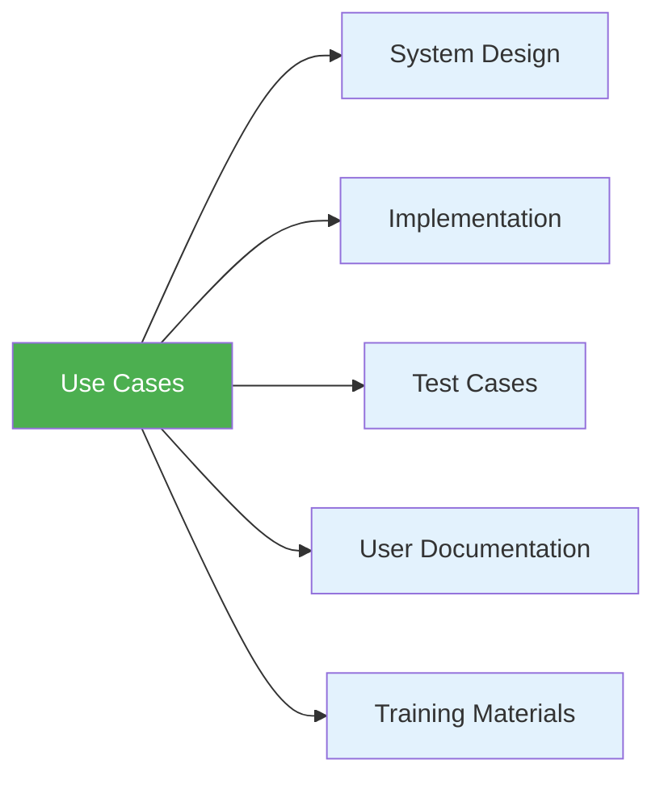

# 3.1 Use Case Fundamentals

[← Back to Chapter 3 README](./chapter-03-README.md) | [Next: 3.2 Actors and System Boundary →](./3_2-actors-system-boundary.md)

---

## 📖 Introduction

Imagine you're building a new online banking system. Your requirements document lists hundreds of features: "The system shall allow users to transfer funds," "The system shall provide transaction history," "The system shall send notifications." But **how do users actually accomplish these tasks?** What steps do they take? What can go wrong?

**Use cases answer these questions.** They describe how actors (users and external systems) interact with your system to achieve specific goals.

---

## 🎯 Learning Objectives

After completing this section, you will be able to:

- ✅ Define what a use case is and explain its purpose
- ✅ Distinguish between use cases and other requirement types
- ✅ Identify when to use use case modeling
- ✅ Understand the key components of use cases
- ✅ Apply use case thinking to real-world scenarios

---

## 🤔 What is a Use Case?

### Formal Definition

> **Use Case**: A description of how an actor uses a system to accomplish a particular goal.

Breaking this down:
- **Actor**: Someone or something that interacts with the system (user, external system, timer)
- **System**: The software you're building
- **Goal**: A meaningful outcome the actor wants to achieve
- **Interaction**: The sequence of steps between actor and system

### Simple Example

**Use Case:** Withdraw Cash (from ATM)

**Actor:** Bank Customer

**Goal:** Get cash from account

**Main Steps:**
1. Customer inserts card
2. System validates card
3. System prompts for PIN
4. Customer enters PIN
5. System validates PIN
6. System displays menu
7. Customer selects "Withdraw Cash"
8. Customer enters amount
9. System checks balance
10. System dispenses cash
11. System prints receipt
12. Customer takes cash and card

This describes the **interaction** between customer and ATM to accomplish the goal.

---

## 🔍 Why Use Cases Matter

### 1. **Bridge Between Business and Technology**

Use cases translate business needs into system behavior:

```
Business Need: "Customers need faster checkout"
        ↓
Functional Requirement: "System shall process payments in under 2 seconds"
        ↓
Use Case: "Process Customer Payment"
        - Shows exact steps
        - Shows what can go wrong
        - Shows how to handle errors
```

### 2. **Foundation for Development**

Use cases drive multiple downstream activities:



### 3. **Communication Tool**

Different stakeholders use the same use case:
- **Business analysts** validate requirements
- **Developers** understand what to build
- **Testers** know what to test
- **Product owners** define sprint goals
- **Technical writers** create user manuals
- **Trainers** develop training programs

### 4. **Early Error Detection**

Use cases reveal problems early:

| Problem Type | Example | Discovered When |
|--------------|---------|-----------------|
| **Missing Requirements** | "What if payment fails?" | Writing alternative flows |
| **Ambiguous Requirements** | "What does 'process order' mean exactly?" | Detailing steps |
| **Conflicting Requirements** | "Users want speed vs. want extensive validation" | Sequencing steps |
| **Incomplete Requirements** | "How does system recover from crash?" | Exception handling |

**Real Example:**
The Healthcare.gov website failure (2013) could have been prevented by thorough use case modeling. Issues like "What if 10,000 people register simultaneously?" were never modeled as use cases.

---

## 📊 Use Case vs. Other Artifacts

Understanding what use cases are NOT helps clarify what they ARE:

### Use Cases vs. Functional Requirements

| Functional Requirement | Use Case |
|------------------------|----------|
| **"What" the system does** | **"How" users do it** |
| "System shall send email" | "Administrator sends notification email to users" |
| Single capability | Series of interactions |
| Implementation-focused | User-goal-focused |
| Atomic | Process-oriented |

**Example:**

**Functional Requirement:**
- FR-001: The system shall allow instructors to create assignments
- FR-002: The system shall allow students to submit assignments
- FR-003: The system shall allow instructors to grade submissions

**Use Case: "Submit Assignment"**
1. Student logs into system
2. System displays enrolled courses
3. Student selects course
4. System shows active assignments
5. Student clicks on assignment
6. System displays submission form
7. Student uploads file
8. System validates file type and size
9. System confirms submission
10. System sends confirmation email

**Key Difference:** The use case shows the USER'S JOURNEY, not just system features.

### Use Cases vs. User Stories

| User Story | Use Case |
|------------|----------|
| **Agile/Scrum artifact** | **UML artifact** |
| 1-2 sentences | Multiple pages |
| "As a... I want... So that..." | Structured template |
| Placeholder for conversation | Complete specification |
| Sprint-sized | Feature-sized |

**Example:**

**User Story:**
> "As a student, I want to submit assignments online so that I don't have to print them."

**Corresponding Use Case:** "Submit Assignment Online"
- 2-3 pages detailed description
- Preconditions, postconditions
- Main flow + 5 alternative flows
- Exception handling
- Business rules

**Relationship:**
- One use case typically breaks into 3-10 user stories
- User stories are derived FROM use cases for sprint planning

### Use Cases vs. Process Flows

| Business Process | Use Case |
|------------------|----------|
| **Organization-wide** | **System-specific** |
| Multiple systems | Single system |
| Can be manual | Always system interaction |
| BPMN notation | UML notation |

**Example:**

**Business Process: "Order Fulfillment"**
- Customer places order (CRM system)
- Finance approves payment (Accounting system)
- Warehouse picks items (Manual)
- Shipping creates label (Shipping system)
- Carrier delivers (External)
- Customer service follows up (CRM system)

**Use Case in E-commerce System: "Place Order"**
- Only covers the first step
- Only describes customer's interaction with your e-commerce system
- Doesn't include warehouse operations or shipping

---

## 🧩 Key Components of Use Cases

Every use case has these essential elements:

### 1. **Actor**
The entity (person, system, device) interacting with your system

**Examples:**
- Customer (primary actor)
- Payment Gateway (external system)
- Scheduler (automated timer)

### 2. **System Boundary**
What's inside your system vs. outside

```
┌─────────────────────────────────┐
│   Your E-commerce System        │  ← Inside boundary
│                                 │
│  [Place Order] [Track Shipment] │  ← Use cases
│                                 │
└─────────────────────────────────┘
         ↑           ↑
     Customer   Payment API  ← Outside boundary (actors)
```

### 3. **Goal**
What the actor wants to accomplish (not system features)

**Good Goals:**
- "Withdraw cash from account"
- "Purchase concert tickets"
- "Submit tax return"

**Bad Goals:**
- "Click on button" (too technical)
- "Validate data" (system internal)
- "Update database" (implementation detail)

### 4. **Interaction Steps**
The back-and-forth between actor and system

**Pattern:**
1. Actor does something
2. System responds
3. Actor does something else
4. System responds
... until goal is achieved

### 5. **Preconditions**
What must be true BEFORE use case starts

**Examples:**
- User is logged in
- Product is in stock
- Payment method is on file

### 6. **Postconditions**
What must be true AFTER use case completes successfully

**Examples:**
- Order is placed in system
- Email confirmation is sent
- Inventory is updated

---

## 🎯 When to Use Use Case Modeling

### ✅ Use Case Modeling is EXCELLENT for:

1. **Interactive Systems**
   - Web applications
   - Mobile apps
   - Desktop software
   - Embedded systems with user interfaces

2. **Complex User Workflows**
   - Multi-step processes
   - Decision points
   - Alternative paths
   - Error handling

3. **Requirements Validation**
   - Walking through scenarios with stakeholders
   - Ensuring completeness
   - Identifying edge cases

4. **Communication with Non-Technical Stakeholders**
   - Business users understand use cases
   - Easy to review and validate
   - No technical jargon required

### ❌ Use Case Modeling is LESS USEFUL for:

1. **Simple CRUD Operations**
   - Basic create/read/update/delete
   - Might be overkill

2. **Backend Services**
   - No direct user interaction
   - API contracts better suited

3. **Real-Time Systems**
   - Continuous data processing
   - Event-driven architecture better

4. **Data Analytics/Reporting**
   - Query-focused systems
   - Better modeled with data flows

**Rule of Thumb:**
If users directly interact with the system to accomplish goals, use case modeling is probably valuable.

---

## 📝 Use Case Levels

Not all use cases are created equal. They exist at different levels of abstraction:

### Kite Level (Cloud Level) - Very High
Strategic business goals

**Example:** "Run Successful E-commerce Business"
- Too broad for system modeling
- Business strategy level

### Sea Level (User Goal Level) - Standard ⭐
User-level goals accomplished in one sitting

**Example:** "Purchase Product"
- This is the sweet spot for most use cases
- Complete, meaningful user goal
- Takes 2-20 minutes typically

### Fish Level (Subfunction Level) - Low
Small steps that support user goals

**Example:** "Validate Credit Card"
- Too granular for primary use cases
- Becomes a step in "Purchase Product"
- Sometimes extracted as "included" use case

**Best Practice:** Focus on **Sea Level** use cases for your primary analysis. These are the most useful.

---

## 🏫 School Management System Example

Let's identify some use cases for our ongoing project:

### Context
We're building a School Management System with these stakeholders:
- Students
- Instructors
- Administrators
- Parents

### Sample Use Cases (Sea Level)

1. **Enroll in Course**
   - Actor: Student
   - Goal: Register for a course for the semester
   - Typical Duration: 5-10 minutes

2. **Submit Assignment**
   - Actor: Student
   - Goal: Turn in completed homework
   - Typical Duration: 3-5 minutes

3. **Grade Assignment**
   - Actor: Instructor
   - Goal: Evaluate and provide feedback on student submission
   - Typical Duration: 10-15 minutes

4. **Generate Progress Report**
   - Actor: Administrator
   - Goal: Create summary report of student performance
   - Typical Duration: 5 minutes

5. **View Student Grades**
   - Actor: Parent
   - Goal: Check child's academic progress
   - Typical Duration: 2-3 minutes

Notice each one:
- Has a clear actor
- Describes a complete goal
- Takes minutes, not seconds or hours
- Results in meaningful outcome

---

## 🧪 Self-Check Questions

Test your understanding:

### Question 1
Which of the following is a properly scoped use case?
- A. Click Submit Button
- B. Update Database Record
- C. Transfer Funds Between Accounts ✓
- D. Run Banking Software

**Answer:** C. It's at the right level (sea level) - a complete user goal accomplished in one session.

### Question 2
What's the main difference between a functional requirement and a use case?
- A. Use cases are more technical
- B. Functional requirements describe system capabilities, use cases describe user interactions ✓
- C. There is no difference
- D. Use cases are for documentation only

**Answer:** B. Functional requirements say WHAT the system does, use cases say HOW users do it.

### Question 3
Which stakeholder would LEAST benefit from use cases?
- A. Business Analyst
- B. Software Developer
- C. Database Administrator ✓
- D. QA Tester

**Answer:** C. While DBAs can use them, they benefit more from data models. All others heavily rely on use cases.

---

## 💡 Key Takeaways

✅ **Use cases describe user-system interactions to achieve goals**

✅ **Use cases bridge business needs and technical implementation**

✅ **Use cases drive design, development, testing, and documentation**

✅ **Focus on "sea level" use cases - complete user goals in one sitting**

✅ **Use cases show the HOW, requirements show the WHAT**

✅ **Use cases are excellent for interactive systems with complex workflows**

---

## 🔗 Real-World Impact

**Case Study: Amazon's Checkout Process**

Amazon's famous "1-Click Purchase" use case revolutionized e-commerce:

**Traditional Use Case (10+ steps):**
1. Add to cart
2. View cart
3. Proceed to checkout
4. Enter shipping address
5. Select shipping method
6. Enter payment info
7. Review order
8. Submit order

**Amazon's Simplified Use Case (1 step):**
1. Click "Buy Now"

This use case modeling led to:
- 📈 Higher conversion rates
- 💰 Billions in additional revenue
- 🏆 Competitive advantage
- ⚖️ Patent (now expired)

**Lesson:** Thorough use case modeling can reveal opportunities to simplify user experience dramatically.

---

## 📚 Further Reading

- Alistair Cockburn - "Writing Effective Use Cases" (definitive guide)
- UML 2.0 specification - Use case diagrams section
- Ivar Jacobson - Original use case inventor's writings

---

## ✏️ Practice Exercise

**Exercise: Identify Use Cases**

For a **Library Management System**, identify 5 use cases at the sea level:

**Your Turn:**
1. ________________________________
2. ________________________________
3. ________________________________
4. ________________________________
5. ________________________________

**Sample Answers:**
1. Borrow Book
2. Return Book
3. Search Catalog
4. Reserve Book
5. Pay Fine

---

## 🚀 Next Steps

Now that you understand what use cases are, let's dive deeper into **who** interacts with your system and **where** the system boundaries are.

**Continue to:** [3.2 Actors and System Boundary →](./3_2-actors-system-boundary.md)

---

[← Back to Chapter 3 README](./chapter-03-README.md) | [Next: 3.2 Actors and System Boundary →](./3_2-actors-system-boundary.md)
