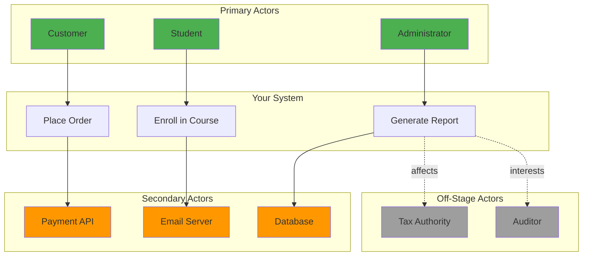

# 3.2 Actors and System Boundary

[← Previous: 3.1 Use Case Fundamentals](./3_1-use-case-fundamentals.md) | [Back to Chapter 3 README](./chapter-03-README.md) | [Next: 3.3 Use Case Diagrams →](./3_3-use-case-diagrams.md)

---

## 📖 Introduction

Before modeling how your system works, you must answer two critical questions:

1. **WHO (or WHAT) interacts with your system?** → **Actors**
2. **WHERE does your system end and the outside world begin?** → **System Boundary**

Getting these right ensures your use cases focus on the right interactions and avoid scope creep.

---

## 🎯 Learning Objectives

After completing this section, you will be able to:

- ✅ Identify and categorize different types of actors
- ✅ Define clear system boundaries
- ✅ Map stakeholders to actors appropriately
- ✅ Use actor generalization and specialization
- ✅ Avoid common mistakes in actor identification

---

## 👤 What is an Actor?

### Definition

> **Actor**: Anyone or anything that interacts with the system to exchange information.

**Key Characteristics:**
- External to the system (outside the system boundary)
- Initiates interactions OR receives information from the system
- Represents a **role**, not a specific person or system
- Can be human, another system, hardware device, or time

### Important: Actor ≠ Stakeholder

| Stakeholder | Actor |
|-------------|-------|
| Anyone interested in the system | Only those who INTERACT with it |
| May never touch the system | Must exchange information with system |
| Example: CEO (wants reports) | Example: Administrator (generates reports) |
| Example: Investor | Example: External Auditing System |

**Rule:** All actors are stakeholders, but NOT all stakeholders are actors.

---

## 🎭 Types of Actors

### 1. **Primary Actors**

Users with main goals that drive use cases.

**Characteristics:**
- Initiate use cases
- Have goals to accomplish
- System exists primarily to serve them

**Examples:**
- **E-commerce:** Customer placing orders
- **Banking:** Account holder transferring funds
- **School System:** Student enrolling in courses

**Test:** Ask "Does the system exist for this person to accomplish their goals?"

### 2. **Secondary Actors** (Supporting Actors)

Provide services that support primary actors' goals.

**Characteristics:**
- Help the system accomplish primary actor's goals
- Don't initiate primary use cases
- System relies on them

**Examples:**
- **Payment Gateway** (processes credit card payments)
- **Email Service** (sends notifications)
- **Database System** (stores data)
- **Authentication Server** (validates credentials)

**Test:** Ask "Does the system need this to complete use cases?"

### 3. **Off-Stage Actors**

Have an interest in use case behavior but don't interact directly.

**Characteristics:**
- Don't exchange information with system
- Benefit or are affected by use cases
- Important for understanding requirements

**Examples:**
- **Tax Authority** (wants accurate records, never interacts)
- **Auditor** (reviews reports generated by admin)
- **Government Regulator** (sets compliance rules)

**Test:** Ask "Do they care about results but never touch the system?"

### Actor Type Comparison



---

## 🔍 Identifying Actors: Systematic Approach

### Step 1: Review Stakeholders

Start with your stakeholder list from Chapter 2:

**School Management System Stakeholders:**
- Students
- Instructors
- Administrators
- Parents
- IT Staff
- School Board
- Government Education Department
- Software Vendor

### Step 2: Ask Key Questions

For each stakeholder, ask:

| Question | If YES → Actor |
|----------|----------------|
| Do they use the system directly? | Primary Actor |
| Does the system use them/it? | Secondary Actor |
| Do they only care about outcomes? | Off-Stage (not actor) |
| Are they building/maintaining the system? | NOT an actor (unless they also use it) |

### Step 3: Identify External Systems

Don't forget non-human actors:

**Examples:**
- **Payment processors** (Stripe, PayPal)
- **Authentication services** (Google OAuth, Active Directory)
- **Reporting systems** (send data to)
- **Scheduling services** (trigger time-based operations)
- **Hardware devices** (card readers, biometric scanners)

### School System Example

**Stakeholder → Actor Mapping:**

| Stakeholder | Actor Type | Rationale |
|-------------|------------|-----------|
| Student | Primary | Uses system to enroll, submit assignments |
| Instructor | Primary | Uses system to post content, grade |
| Administrator | Primary | Uses system to manage courses, generate reports |
| Parent | Primary | Uses system to view student progress |
| IT Staff | NOT ACTOR | Maintains system, doesn't use functionality |
| School Board | Off-Stage | Cares about outcomes, doesn't interact |
| Gov't Dept | Off-Stage | Receives reports, sets policies |
| Email Server | Secondary | Sends notifications on behalf of system |
| Student Info System | Secondary | Provides enrollment data |

---

## 🏛️ System Boundary

### Definition

> **System Boundary**: The line separating what's inside your system from what's outside.

Everything inside = what you're building  
Everything outside = actors and external systems

### Why Boundaries Matter

**Clear boundaries prevent:**
- ❌ Scope creep ("Let's also build the payment gateway!")
- ❌ Missing actors ("Oh, we forgot the payment gateway exists!")
- ❌ Confusion about responsibilities ("Who handles email delivery?")

### Defining Your Boundary

Ask these questions:

1. **What are you building?**
   - School Management System ← Inside
   - Not email server ← Outside

2. **What are you integrating with?**
   - Payment API ← Outside (actor)
   - Your payment processing logic ← Inside

3. **What's out of scope?**
   - Building authentication from scratch ← Outside
   - Using existing authentication service ← Inside (use case), Outside (the service itself)

### Boundary Diagram

```
╔═══════════════════════════════════════════════╗
║     School Management System (Inside)         ║
║                                               ║
║  ┌─────────────┐  ┌──────────────┐          ║
║  │ Enrollment  │  │  Assignment  │          ║
║  │   Module    │  │   Module     │          ║
║  └─────────────┘  └──────────────┘          ║
║                                               ║
║  ┌─────────────┐  ┌──────────────┐          ║
║  │   Grading   │  │   Reporting  │          ║
║  │   Module    │  │   Module     │          ║
║  └─────────────┘  └──────────────┘          ║
║                                               ║
╚═══════════════════════════════════════════════╝
        ↑                ↑               ↑
        │                │               │
    Student          Instructor      Email API
   (Primary)         (Primary)      (Secondary)
```

### Example: E-commerce System

**Inside Boundary:**
- Product catalog
- Shopping cart
- Order management
- Customer accounts
- Your checkout logic

**Outside Boundary (Actors):**
- Customer (primary)
- Payment gateway (secondary)
- Shipping API (secondary)
- Email service (secondary)
- Inventory system (might be secondary or internal)

**Boundary Decision Example:**

❓ **Inventory Management?**

**Option A:** Inside boundary
- You build the inventory system
- More control, more work
- Tighter integration

**Option B:** Outside boundary (actor)
- Use existing inventory system
- Less control, less work
- Integration through API

**Decision depends on:** Project scope, timeline, resources

---

## 👥 Actor Relationships

### Actor Generalization

When actors share common behavior, you can model inheritance:

```
           [User]
              △
              │
     ┌────────┴────────┐
     │                 │
 [Student]       [Instructor]
```

**Meaning:**
- Both Students and Instructors are Users
- Both can login, update profile, view announcements
- Each has unique use cases too

**UML Notation:**
- Solid line with hollow triangle pointing to general actor

**When to Use:**
- Multiple actors share significant common behavior
- Reduces duplication in use case descriptions
- Makes model clearer

### Example: School System Actors

```
                    [System User]
                         △
         ┌───────────────┼───────────────┐
         │               │               │
    [Student]      [Instructor]   [Administrator]
         △
         │
    ┌────┴────┐
    │         │
[Undergrad] [Grad]
```

**Common Use Cases (System User):**
- Login
- Update Profile
- Change Password
- View Notifications

**Student-Specific:**
- Enroll in Course
- Submit Assignment
- View Grades

**Instructor-Specific:**
- Post Assignment
- Grade Submission
- Manage Course

**Undergrad-Specific:**
- Declare Major

**Grad-Specific:**
- Select Thesis Advisor

### Specialization Example

**Banking System:**

```
        [Account Holder]
              △
              │
     ┌────────┴────────┬──────────┐
     │                 │          │
[Individual]    [Business]   [Joint]

Individual can:
- File individual tax return
- Apply for personal loan

Business can:
- File business tax return
- Apply for business loan
- Manage employee accounts

Joint can:
- Both holders must approve large transactions
```

---

## 🎯 From Stakeholders to Actors

Let's do a complete mapping:

### Healthcare Appointment System

**Stakeholders Identified (Chapter 2):**
1. Patients
2. Doctors
3. Nurses
4. Receptionists
5. Insurance Companies
6. Hospital Administrators
7. IT Department
8. Billing Department
9. Regulatory Agencies
10. Medical Equipment Vendors

**Actor Analysis:**

| Stakeholder | Actor? | Type | Rationale |
|-------------|--------|------|-----------|
| Patient | ✅ | Primary | Books appointments, views records |
| Doctor | ✅ | Primary | Reviews schedules, accesses patient records |
| Nurse | ✅ | Primary | Updates patient info, manages visits |
| Receptionist | ✅ | Primary | Schedules appointments, checks in patients |
| Insurance Company API | ✅ | Secondary | Validates coverage, processes claims |
| Hospital Admin | ✅ | Primary | Generates reports, manages resources |
| IT Department | ❌ | - | Maintains system, doesn't use features |
| Billing System | ✅ | Secondary | Receives billing data from our system |
| Regulatory Agencies | ❌ | Off-Stage | Care about compliance, never interact |
| Equipment Vendors | ❌ | - | Not relevant to appointment system |

**Final Actor List:**
- **Primary:** Patient, Doctor, Nurse, Receptionist, Administrator
- **Secondary:** Insurance API, Billing System, Email Service
- **Possible Generalization:** 
  - Medical Staff (Doctor, Nurse)
  - Staff (Doctor, Nurse, Receptionist, Administrator)

---

## ⚠️ Common Mistakes

### Mistake 1: Confusing Actors with Job Titles

❌ **Wrong:**
- "Manager"
- "Employee"

✅ **Right:**
- "Leave Approver" (the role in THIS system)
- "Leave Requester"

**Why:** Same person can be multiple actors depending on context.

### Mistake 2: Making Internal Components Actors

❌ **Wrong:**
- Database actor
- Session Manager actor
- Logger actor

✅ **Right:**
- These are INSIDE your system
- Not actors, they're components

**Exception:** If database is EXTERNAL (you don't control it), it might be an actor.

### Mistake 3: Too Many Actors

❌ **Wrong:** 47 actors for a small system

✅ **Right:** 5-15 actors typically

**Fix:** Use generalization to group similar actors.

### Mistake 4: Including Developers/Testers as Actors

❌ **Wrong:**
- Software Developer (testing features)
- QA Engineer (running test cases)

✅ **Right:**
- These are not business actors
- They're building/testing the system

**Exception:** If system has an admin interface for managing itself, then "System Administrator" is an actor.

### Mistake 5: Vague Actor Names

❌ **Wrong:**
- "User"
- "Person"
- "System"

✅ **Right:**
- "Registered Customer"
- "Premium Subscriber"
- "Payment Gateway"

---

## 🏫 School System: Complete Actor Model

Let's finalize our School Management System actors:

### Primary Actors

**Student**
- Role: Learns through system
- Goals: Access content, submit work, track progress
- Example Use Cases: Enroll in Course, Submit Assignment

**Instructor**
- Role: Teaches through system
- Goals: Deliver content, assess students
- Example Use Cases: Create Assignment, Grade Submission

**Administrator**
- Role: Manages system operations
- Goals: Oversee courses, users, data
- Example Use Cases: Create Course, Generate Report

**Parent/Guardian**
- Role: Monitors student progress
- Goals: View student performance, communicate with instructors
- Example Use Cases: View Student Grades, Send Message

### Secondary Actors

**Email Service**
- Sends notifications and confirmations

**Student Information System (SIS)**
- Provides enrollment and demographic data

**Learning Management System (LMS) - if integrating**
- Syncs course content

**Payment Gateway - if applicable**
- Processes course fees

### Actor Generalization

```
                    [System User]
                         △
         ┌───────────────┼────────────┬─────────────┐
         │               │            │             │
    [Student]      [Instructor]  [Admin]      [Parent]
                                     
    Common to all:
    - Login/Logout
    - Update Profile
    - View Announcements
    - Change Password
```

---

## 🧪 Self-Check Questions

### Question 1
Your IT support staff needs to reset user passwords. Are they actors?

**Answer:** Yes, they're primary actors. Even though they maintain the system, password reset is a USE of the system, not maintenance of the system infrastructure.

### Question 2
You're building an e-commerce site. Is the product database an actor?

**Answer:** No, if you control and build the database. It's inside your system boundary. However, if you're integrating with an external product catalog API, then that external system is a secondary actor.

### Question 3
Can one person be multiple actors?

**Answer:** Yes! For example, an instructor might also be a student taking professional development courses. They act as "Instructor" when teaching and "Student" when learning.

---

## 💡 Key Takeaways

✅ **Actors are roles that interact with your system, not people**

✅ **Primary actors have goals, secondary actors provide services**

✅ **System boundary defines what you're building vs. what you're using**

✅ **Use generalization to group actors with common behavior**

✅ **Stakeholders ≠ Actors (all actors are stakeholders, but not vice versa)**

✅ **Typical system has 5-15 actors, not 50+**

---

## 📋 Actor Identification Checklist

Use this when starting a new project:

- [ ] Listed all stakeholders from Chapter 2
- [ ] Identified who USES the system directly (primary actors)
- [ ] Identified what external systems interact (secondary actors)
- [ ] Checked for human actors (users, customers, admins)
- [ ] Checked for system actors (APIs, databases, services)
- [ ] Checked for time-based actors (schedulers, timers)
- [ ] Defined clear system boundary
- [ ] Verified no internal components are marked as actors
- [ ] Looked for generalization opportunities
- [ ] Validated actor list with stakeholders

---

## 🚀 Next Steps

Now that you know WHO interacts with your system and WHERE the boundaries are, let's learn how to VISUALIZE these actors and their use cases using **UML Use Case Diagrams**.

**Continue to:** [3.3 Use Case Diagrams →](./3_3-use-case-diagrams.md)

---

[← Previous: 3.1 Use Case Fundamentals](./3_1-use-case-fundamentals.md) | [Back to Chapter 3 README](./chapter-03-README.md) | [Next: 3.3 Use Case Diagrams →](./3_3-use-case-diagrams.md)
