# 3.2 Use Case Diagram Elements

## Introduction

Now that you understand what use cases are, it's time to learn the visual language for communicating them: **Use Case Diagrams**. Think of these diagrams as a visual index or table of contents for your system's functionality. At a glance, anyone should be able to see:
- Who uses the system (actors)
- What the system does (use cases)
- How actors and use cases relate

Use case diagrams are one of the most accessible UML diagrams - business stakeholders without technical backgrounds can understand them, making them perfect for discussions and validation.

---

## The Four Core Elements

Every use case diagram consists of four fundamental elements:


Let's explore each element in detail.

---

## 1. Actors

### What is an Actor?

**Definition:** An actor represents a role played by someone or something that interacts with the system.

**Key Points:**
- Actors are EXTERNAL to the system
- Actors represent ROLES, not specific people
- One person can play multiple roles
- Actors can be humans, other systems, or devices

### Actor Notation

Actors are represented by **stick figures** in UML:

```
     👤
  Student

     👤
   Teacher
```

**Alternative Notation:** For non-human actors (systems, devices), you can use:
```
   ┌──────┐
   │<system>│
   │Payment │
   │Gateway │
   └──────┘
```

### Types of Actors

#### 1. Primary Actors (Active)
**Definition:** Actors who initiate use cases to achieve goals

**Examples:**
- Student (initiates "Enroll in Course")
- Customer (initiates "Place Order")
- Bank Customer (initiates "Withdraw Cash")

**Characteristic:** They START the interaction

#### 2. Secondary Actors (Passive)
**Definition:** Actors who provide services to the system

**Examples:**
- Payment Gateway (provides payment processing)
- Email Service (sends notifications)
- External Database (provides data)

**Characteristic:** They RESPOND to system requests

#### 3. System Actors
**Definition:** Other systems that interact with your system

**Examples:**
- CRM System
- Authentication Server
- Inventory Management System
- Third-party API

### Actor Naming Conventions

✅ **Good Actor Names:**
- Student (role, not specific person)
- System Administrator (clear role)
- Guest User (status-based role)
- Payment Processor (system actor)
- Mobile App (external system)

❌ **Poor Actor Names:**
- John Smith (specific person)
- User (too generic)
- Database (internal component)
- Button (UI element)

### Identifying Actors

**Ask these questions:**

1. **Who uses the main functions of the system?**
   - Student, Teacher, Administrator

2. **Who maintains and administers the system?**
   - System Admin, IT Support

3. **What external systems does this system interact with?**
   - Payment Gateway, Email Service

4. **What hardware devices interact with the system?**
   - Barcode Scanner, Card Reader

5. **Who gets information from this system?**
   - Report Viewer, Auditor

---

## 2. Use Cases

### What is a Use Case (in diagrams)?

In the diagram, a use case is represented as an **oval** containing a brief description of functionality.

### Use Case Notation

```
   ┌─────────────┐
   │ Enroll in   │
   │   Course    │
   └─────────────┘
```

### Naming Use Cases

Use cases should be named with **verb phrases** that describe what the system does.

#### Naming Rules:

1. **Start with a verb**
   - ✅ "Enroll in Course"
   - ✅ "Submit Assignment"
   - ✅ "Generate Report"
   - ❌ "Enrollment" (noun)
   - ❌ "Course Registration System" (too broad)

2. **Be specific but concise**
   - ✅ "Reset Password"
   - ❌ "Reset Password After Forgetting It and Receiving Email Link" (too detailed)
   - ❌ "Manage Passwords" (too vague)

3. **Describe from actor's perspective**
   - ✅ "View Grade Report"
   - ❌ "Display Grades" (system perspective)

4. **Each use case = one goal**
   - ✅ "Place Order"
   - ✅ "Cancel Order"
   - ❌ "Place or Cancel Order" (two goals)

#### Naming Examples

**Good Use Case Names:**
- Withdraw Cash
- Transfer Funds
- Check Balance
- Apply for Loan
- Update Profile
- Search Products
- Process Payment
- Generate Invoice

**Poor Use Case Names:**
- Banking (too broad)
- Login Screen (UI element)
- validateUser() (implementation detail)
- User Management Module (component name)

### Use Case Granularity

**Too Large (System-Level):**
```
┌──────────────┐
│   Manage     │
│   Students   │
└──────────────┘
```
Problem: Too vague, includes many separate goals

**Just Right (Goal-Level):**
```
┌──────────────┐    ┌──────────────┐    ┌──────────────┐
│   Register   │    │   Update     │    │   Delete     │
│   Student    │    │   Student    │    │   Student    │
└──────────────┘    └──────────────┘    └──────────────┘
```
Sweet spot: Each achieves one complete goal

**Too Small (Function-Level):**
```
┌──────────────┐
│   Validate   │
│    Email     │
└──────────────┘
```
Problem: Too fine-grained, part of larger goal

---

## 3. System Boundary

### What is the System Boundary?

**Definition:** A rectangle that defines the scope of your system, separating what's inside (the system) from what's outside (actors).

### Boundary Notation

```
                 ┌─────────────────────────────────┐
                 │  School Management System       │
                 │                                 │
  Student ─────→ │  ┌──────────────┐              │
                 │  │ Enroll in    │              │
                 │  │   Course     │              │
                 │  └──────────────┘              │
                 │                                 │
                 └─────────────────────────────────┘
```

### Why System Boundary Matters

1. **Defines Scope:**
   - Everything inside = your system builds/maintains
   - Everything outside = external entities

2. **Clarifies Responsibility:**
   - Use cases inside = you implement
   - Actors outside = you integrate with

3. **Aids Communication:**
   - Shows stakeholders exactly what's included
   - Prevents scope creep

### System Boundary Best Practices

✅ **Do:**
- Give the boundary a clear name
- Place all use cases inside
- Place all actors outside
- Make boundary clearly visible

❌ **Don't:**
- Put actors inside the boundary
- Mix multiple systems in one boundary
- Forget to label the system
- Make boundary optional (always show it)

---

## 4. Relationships

### Association Relationship

**Purpose:** Shows which actors interact with which use cases

**Notation:** Simple solid line

```
  Student ──────── Enroll in Course
```

**Rules:**
- Connects actor to use case
- No arrow needed (bidirectional communication)
- Actor outside boundary, use case inside

### Multiple Associations Example

```
                ┌─────────────────────────────┐
                │  Online Shopping System     │
                │                             │
   Customer ────│─── Place Order              │
       │        │       │                     │
       │        │       │                     │
       └────────│─── Track Order              │
                │       │                     │
       ┌────────│─── Cancel Order             │
       │        │                             │
  Admin ────────│─── Manage Products          │
                │                             │
                └─────────────────────────────┘
```

### Advanced Relationships (Preview)

We'll cover these in detail in later sections:

1. **Include Relationship** (<<include>>)
   - Mandatory reuse
   - Dotted arrow

2. **Extend Relationship** (<<extend>>)
   - Optional behavior
   - Dotted arrow

3. **Generalization**
   - Inheritance between actors or use cases
   - Solid arrow with hollow head

---

## Complete Example: ATM System

Let's put it all together with a simple but complete use case diagram:


**Text Representation:**
```
┌─────────────────────────────────────────────┐
│             ATM System                      │
│                                             │
│   ┌────────────┐   ┌────────────┐         │
│   │ Withdraw   │   │   Check    │         │
│   │   Cash     │   │  Balance   │         │
│   └────────────┘   └────────────┘         │
│                                             │
│   ┌────────────┐   ┌────────────┐         │
│   │ Transfer   │   │   Change   │         │
│   │   Funds    │   │    PIN     │         │
│   └────────────┘   └────────────┘         │
│                                             │
└─────────────────────────────────────────────┘
      ↑                               ↑
      │                               │
   Customer                    Bank System
  (Primary Actor)             (Secondary Actor)
```

---

## School Management System - Basic Diagram

Here's our case study with just the basic elements:

```mermaid
graph TB
    subgraph "School Management System"
        UC1((Enroll in Course))
        UC2((Submit Assignment))
        UC3((View Grades))
        UC4((Grade Assignment))
        UC5((Take Attendance))
        UC6((Generate Report Card))
        UC7((Manage User Accounts))
        UC8((Process Payment))
    end
    
    Student[👤 Student]
    Teacher[👤 Teacher]
    Admin[👤 Administrator]
    Parent[👤 Parent]
    
    Student --> UC1
    Student --> UC2
    Student --> UC3
    
    Teacher --> UC4
    Teacher --> UC5
    Teacher --> UC6
    
    Admin --> UC7
    
    Parent --> UC8
```



**Count the elements:**
- 4 Actors (Student, Teacher, Admin, Parent)
- 8 Use Cases (various functions)
- 1 System Boundary (School Management System)
- Multiple Association relationships

---

## Diagram Layout Best Practices

### 1. Actor Placement

**Recommended Layout:**
```
Primary Actors     │  System Boundary  │  Secondary Actors
    (left)         │   (use cases)     │     (right)
                   │                   │
   Customer ───────│→ Use Cases ←──────│─── Payment API
   Student ────────│→ Use Cases ←──────│─── Email Service
```

**Why?**
- Primary actors on left (initiators)
- Secondary actors on right (services)
- Easy to read left-to-right flow

### 2. Use Case Organization

**Group related use cases together:**
```
┌────────────────────────────┐
│  E-commerce System         │
│                            │
│  ┌ Student Functions ─┐   │
│  │ - Enroll           │   │
│  │ - Submit Work      │   │
│  └────────────────────┘   │
│                            │
│  ┌ Teacher Functions ─┐   │
│  │ - Grade Work       │   │
│  │ - Take Attendance  │   │
│  └────────────────────────┘│
└────────────────────────────┘
```

### 3. Avoid Crossing Lines

**Poor Layout:**
```
   Actor1 ───┐
             │ ╳ (lines cross - confusing!)
   Actor2 ───┼─→ Use Case 1
             │
             └─→ Use Case 2
```

**Good Layout:**
```
   Actor1 ────→ Use Case 1
   
   Actor2 ────→ Use Case 2
```

### 4. Size and Spacing

- Keep use case ovals similar size
- Maintain consistent spacing
- Don't cram too many use cases in one diagram
- Split complex systems into multiple diagrams

---

## Drawing Tools

### Free Tools for Students

1. **Lucidchart** (Recommended)
   - Free education account
   - UML templates included
   - Cloud-based, shareable
   - Professional output

2. **Draw.io / diagrams.net**
   - Completely free
   - Desktop or web version
   - UML shape libraries
   - Integrates with Google Drive

3. **PlantUML**
   - Text-based (code to diagram)
   - Version control friendly
   - Great for quick diagrams
   - Learning curve

4. **Miro**
   - Collaborative
   - Free for students
   - Good for workshops
   - Sticky note feel

### Quick Start with Lucidchart

1. Sign up with student email
2. Create new document
3. Select "UML" from templates
4. Choose "Use Case Diagram"
5. Drag and drop elements
6. Export as PNG or PDF

---

## Common Mistakes to Avoid

### ❌ Mistake 1: Putting Actors Inside Boundary
```
┌─────────────────────┐
│  System             │
│   ┌───┐            │
│   │👤 │ ← WRONG!   │
│   └───┘            │
└─────────────────────┘
```
**Fix:** Actors are ALWAYS outside the system boundary

### ❌ Mistake 2: Using Implementation Names
```
┌──────────────────┐
│ loginButton()    │ ← Technical/code name
└──────────────────┘
```
**Fix:** Use business terminology: "Log In"

### ❌ Mistake 3: Too Much Detail in Diagram
```
┌───────────────────────────────────┐
│ Submit Assignment with Validation │
│ and Email Notification and File   │
│ Upload and Deadline Check         │
└───────────────────────────────────┘
```
**Fix:** Keep use case names concise: "Submit Assignment"  
*Details go in the use case description, not the diagram*

### ❌ Mistake 4: Missing System Boundary
```
   Student ──── Enroll ← Where's the system?
```
**Fix:** Always include and label the system boundary

### ❌ Mistake 5: Including UI Elements
```
┌─────────────────┐
│ Login Dialog    │ ← UI element, not functionality
└─────────────────┘
```
**Fix:** Focus on behavior: "Authenticate User"

---

## Diagram Checklist

Before finalizing your use case diagram, verify:

### Actors
- [ ] All actors are outside the system boundary
- [ ] Actors represent roles, not specific people
- [ ] Actor names are nouns (roles)
- [ ] Both human and system actors identified

### Use Cases
- [ ] All use cases are inside the system boundary
- [ ] Use case names are verb phrases
- [ ] Each use case achieves one goal
- [ ] Names are from user perspective
- [ ] Appropriate granularity (not too big/small)

### System Boundary
- [ ] Clearly drawn and visible
- [ ] Has a descriptive name
- [ ] Encloses all use cases
- [ ] Excludes all actors

### Relationships
- [ ] Each actor connects to relevant use cases
- [ ] Lines don't cross unnecessarily
- [ ] Layout is clean and readable
- [ ] Primary actors on left, secondary on right

### Overall
- [ ] Diagram is easy to understand
- [ ] No implementation details showing
- [ ] Consistent notation used
- [ ] Properly labeled and titled

---

## Practice Exercise 1: Identify the Errors

Find and correct the mistakes in this diagram:

```
┌─────────────────────────────────────┐
│  Library System                     │
│                                     │
│  ┌────────────┐                    │
│  │   John     │  ← Person name     │
│  └────────────┘                    │
│                                     │
│  ┌────────────┐                    │
│  │ Database   │  ← Internal comp.  │
│  └────────────┘                    │
│                                     │
│  ┌─────────────────────────────┐  │
│  │ bookCheckoutButton.click()  │  │← Tech detail
│  └─────────────────────────────┘  │
│                                     │
└─────────────────────────────────────┘
```

**Errors:**
1. "John" is a specific person, should be "Library Member"
2. "Database" is internal, should be outside as system actor if needed
3. Technical method name should be "Check Out Book"
4. Missing proper actors outside boundary

---

## Practice Exercise 2: Create Your First Diagram

**Scenario:** Simple Coffee Shop Ordering System

**Requirements:**
- Customers can order drinks
- Customers can pay for orders
- Baristas can view orders
- Baristas can mark orders complete
- Managers can view sales reports

**Your Task:** Create a use case diagram with:
1. Identify all actors
2. Identify all use cases
3. Draw the system boundary
4. Connect actors to use cases

**Solution:**
```
   Customer ────────┐
                    │
                    ├─→ Place Order
                    │
                    └─→ Make Payment
                    
   Barista ─────────┐
                    │
                    ├─→ View Orders
                    │
                    └─→ Complete Order
                    
   Manager ─────────┼─→ View Sales Report
                    
   [All use cases inside "Coffee Shop System" boundary]
```

---

## Self-Check Questions

1. **What notation is used for actors in use case diagrams?**
   - a) Rectangles
   - b) Circles
   - c) Stick figures
   - d) Diamonds

2. **Use cases should be named with:**
   - a) Noun phrases
   - b) Verb phrases
   - c) Technical method names
   - d) UI element names

3. **The system boundary:**
   - a) Contains actors and use cases
   - b) Contains only actors
   - c) Contains only use cases
   - d) Is optional

4. **Which is a good use case name?**
   - a) UserAuthentication
   - b) Login()
   - c) Authenticate User
   - d) Login Button

5. **Primary actors are:**
   - a) Internal to the system
   - b) Always human users
   - c) Initiators of use cases
   - d) Database systems

**Answers:** 1-c, 2-b, 3-c, 4-c, 5-c

---

## Coming Up Next

In **3.3 Identifying Actors and Use Cases**, you'll learn:
- Systematic techniques for finding actors
- Methods for discovering use cases from requirements
- Scoping and granularity decisions
- Real-world identification practice

**Prepare by:** Take a system you use (like YouTube, Amazon, or WhatsApp) and try to list all the different types of users and what each can do. Bring your list to compare!

---

**Navigation:**
- **Previous:** [3.1 Use Case Fundamentals](3_1-use-case-fundamentals.md)
- **Next:** [3.3 Identifying Actors and Use Cases](3_3-identifying-actors-use-cases.md)
- **Up:** [Chapter 3 README](chapter-03-README.md)
