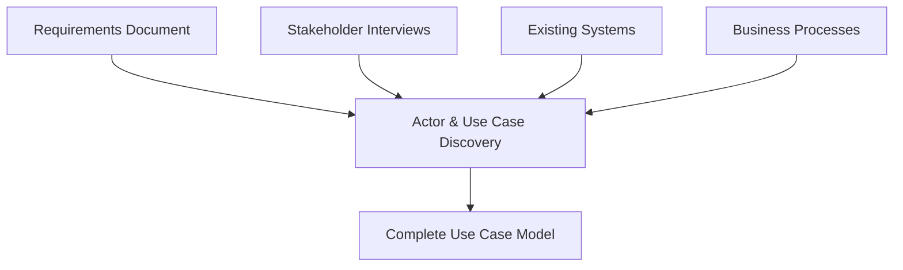
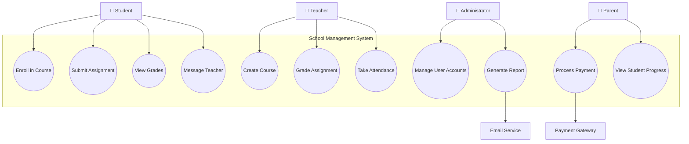
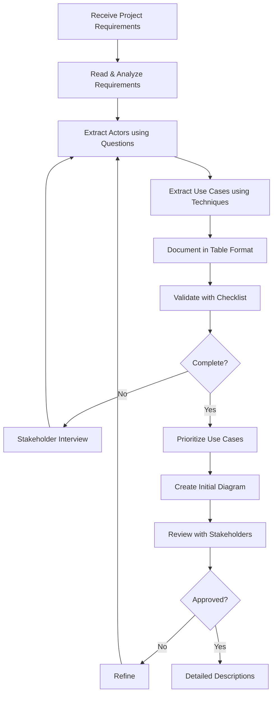

# 3.3 Identifying Actors and Use Cases

## Introduction

You now know what actors and use cases are, and how to draw them. But how do you actually FIND them? When you're handed a project like "Build a hospital management system," where do you start? Which actors matter? Which use cases are essential?

This is where many students struggle. It's one thing to draw a diagram, but quite another to identify what belongs in it. This section teaches you systematic techniques for discovering actors and use cases from requirements, stakeholder interviews, and business documents.

**Goal:** By the end of this section, you'll have a repeatable process for identifying all relevant actors and use cases for any system.

---

## The Discovery Process

Think of identifying actors and use cases as detective work. You're gathering clues from multiple sources:



Let's explore each source and technique.

---

## Part 1: Identifying Actors

### The Actor Discovery Questions

Ask these questions systematically:

#### 1. Who Uses the System?
**Purpose:** Find primary actors (users who achieve goals)

**Questions:**
- Who will use the main functions?
- Who benefits from the system?
- Who needs information from the system?
- Who enters data into the system?

**Example - School System:**
- Students (take courses, submit assignments)
- Teachers (create content, grade work)
- Parents (monitor progress)

#### 2. Who Administers the System?
**Purpose:** Find administrative actors

**Questions:**
- Who manages user accounts?
- Who configures the system?
- Who handles security?
- Who maintains the system?

**Example - School System:**
- System Administrator (manages accounts)
- IT Support (troubleshoots issues)
- School Administrator (configures policies)

#### 3. What External Systems Interact?
**Purpose:** Find system actors

**Questions:**
- Does the system connect to other software?
- Are there third-party services?
- Does it integrate with existing systems?
- Are there hardware devices?

**Example - School System:**
- Payment Gateway (processes fees)
- Email Service (sends notifications)
- SMS Gateway (sends alerts)
- Student Information System (legacy data)

#### 4. Who Provides Information?
**Purpose:** Find secondary actors

**Questions:**
- Who responds to system requests?
- What systems provide data?
- What external authorities are involved?

**Example - School System:**
- Accreditation Body (validates credentials)
- Background Check Service (verifies teachers)
- Cloud Storage Service (stores files)

#### 5. Who Receives Reports?
**Purpose:** Find reporting actors (might overlap with primary)

**Questions:**
- Who needs regular reports?
- Who monitors system activity?
- Who audits the system?

**Example - School System:**
- Principal (receives academic reports)
- Board of Education (receives compliance reports)
- Auditor (receives financial reports)

### Actor Discovery Technique: Role Analysis

Create a table to systematically identify actors:

| Question | Identified Actors | Type | Notes |
|----------|------------------|------|-------|
| Who uses main functions? | Student, Teacher, Parent | Primary | Direct users |
| Who administers? | Admin, IT Support | Primary | Management |
| What external systems? | Payment Gateway, Email Service | System | Integration |
| Who provides info? | Previous School, Accreditation | Secondary | Data providers |
| Who gets reports? | Principal, Board | Primary | May overlap |

### Actor Consolidation

After initial identification, consolidate and refine:

#### Merge Similar Actors
**Before:**
- Freshman Student
- Sophomore Student
- Junior Student
- Senior Student

**After:**
- Student (one actor, different data)

#### Separate Truly Different Roles
**Before:**
- User (too general)

**After:**
- Student
- Teacher
- Administrator
(Each has different goals and permissions)

#### Consider Role Hierarchies
```
          User
            │
    ┌───────┴────────┐
 Student          Teacher
    │                 │
    │            ┌────┴─────┐
    │       Faculty    Adjunct Teacher
    │
Graduate Student
```

*Note: We'll model this with generalization relationships in section 3.5*

### Actor Documentation Template

For each identified actor, document:

**Actor Name:** Student
**Type:** Primary (human user)
**Description:** A person enrolled in courses at the school
**Goals:**
- Enroll in courses
- Submit assignments
- View grades
- Communicate with teachers
**Frequency of Use:** Daily
**Technical Expertise:** Low to medium
**Special Needs:** Mobile access required

---

## Part 2: Identifying Use Cases

### The Use Case Discovery Questions

#### 1. What Are the Actor's Goals?
**Purpose:** Find primary use cases

**For each actor, ask:**
- What does this actor need to accomplish?
- What tasks does this actor perform?
- What information does this actor need?
- What information does this actor provide?

**Example - Student Actor:**
- Goal: Get enrolled in classes → Use Case: "Enroll in Course"
- Goal: Complete coursework → Use Cases: "Submit Assignment", "Take Quiz"
- Goal: Track progress → Use Case: "View Grades"

#### 2. What Events Must the System Handle?
**Purpose:** Find event-driven use cases

**Questions:**
- What external events occur?
- What time-based events happen?
- What triggers system actions?

**Example - School System:**
- Event: Assignment deadline passes → Use Case: "Send Late Notification"
- Event: Semester ends → Use Case: "Generate Report Cards"
- Event: Payment due → Use Case: "Send Payment Reminder"

#### 3. What Business Processes Exist?
**Purpose:** Find process-based use cases

**Map business processes to use cases:**

**Process:** Course Registration
1. Student browses catalog
2. Student selects courses
3. System checks prerequisites
4. System checks capacity
5. Student confirms enrollment
6. System processes payment

**Use Cases:**
- Browse Course Catalog
- Enroll in Course
- Process Enrollment Payment

#### 4. What Information Needs Managing?
**Purpose:** Find CRUD (Create, Read, Update, Delete) use cases

**For each major entity:**

**Entity: Student**
- Create → "Register Student"
- Read → "View Student Profile"
- Update → "Update Student Information"
- Delete → "Archive Student Record"

**Warning:** Don't create use cases for every CRUD operation! Consolidate when appropriate:
- Instead of: "Create Course", "Read Course", "Update Course", "Delete Course"
- Consider: "Manage Courses" (if admin-only, simple operations)

#### 5. What Are the Maintenance Needs?
**Purpose:** Find administrative use cases

**Questions:**
- What system settings exist?
- What needs configuration?
- What requires backup?
- What needs monitoring?

**Example:**
- Manage User Accounts
- Configure System Settings
- Generate Backup
- View System Logs

### Use Case Discovery Technique: Verb Extraction

**From Requirements Document:**

"Students shall be able to register for courses, view their schedules, submit assignments, and check their grades. Teachers can create courses, post assignments, grade student work, and communicate with students. The system will automatically send email notifications for important events."

**Extract Verbs → Identify Use Cases:**

| Verb/Phrase | Actor | Use Case |
|-------------|-------|----------|
| register for courses | Student | Enroll in Course |
| view schedules | Student | View Schedule |
| submit assignments | Student | Submit Assignment |
| check grades | Student | View Grades |
| create courses | Teacher | Create Course |
| post assignments | Teacher | Post Assignment |
| grade work | Teacher | Grade Assignment |
| communicate | Teacher/Student | Send Message |
| send notifications | System (automatic) | Send Notification |

### Use Case Scoping Decisions

#### Too Broad (Epic-Level)
**Problem:** "Manage Student Academics"
- Too vague
- Multiple goals mixed together
- Can't estimate or implement

**Solution:** Break down into specific use cases:
- Enroll in Course
- Submit Assignment
- View Grades
- Request Transcript

#### Just Right (Goal-Level)
**Characteristics:**
- Achieves one complete user goal
- Has clear beginning and end
- Takes 3-15 steps typically
- Can be completed in one session

**Examples:**
- Place Order (not too big, not too small)
- Transfer Funds
- Submit Assignment

#### Too Small (Sub-Function)
**Problem:** "Validate Email Format"
- Not a complete goal
- Part of a larger use case
- Too implementation-focused

**Solution:** Include as part of larger use case:
- "Register Student" includes email validation

### The "Complete Transaction" Test

A use case should represent a **complete transaction** that leaves the system in a consistent state.

**Good Use Case - "Process Order":**
```
Start: Cart with items, no order
End: Order placed, inventory updated, payment processed
Result: Complete, consistent state
```

**Bad Use Case - "Add to Cart":**
```
Start: Product selected
End: Item in cart
Result: Incomplete transaction (user might abandon cart)
```

*Note: "Add to Cart" might be OK in certain contexts, but consider if it's really part of "Place Order"*

---

## Part 3: The School Management System - Complete Example

Let's apply everything we've learned to our case study.

### Step 1: Identify Actors

Using our discovery questions:

#### Primary Actors (Users achieving goals)
1. **Student** - Takes courses, completes work
2. **Teacher** - Teaches, grades, manages courses
3. **Parent** - Monitors child's progress
4. **Administrator** - Manages school operations
5. **Registrar** - Handles enrollment, transcripts
6. **Counselor** - Advises students

#### System Actors (External systems)
1. **Payment Gateway** - Processes payments
2. **Email Service** - Sends notifications
3. **SMS Gateway** - Sends text alerts
4. **Document Storage** - Stores files (Google Drive, etc.)
5. **Authentication Service** - Verifies credentials

### Step 2: Identify Use Cases by Actor

#### Student Use Cases
**Academic:**
- Enroll in Course
- Drop Course
- View Schedule
- View Course Catalog

**Coursework:**
- Submit Assignment
- Take Quiz
- Take Exam
- View Assignment Feedback

**Progress Tracking:**
- View Grades
- View Attendance Record
- Generate Unofficial Transcript
- View Degree Progress

**Communication:**
- Message Teacher
- Join Discussion Forum
- View Announcements

#### Teacher Use Cases
**Course Management:**
- Create Course
- Update Course Information
- Manage Course Materials
- Set Course Schedule

**Assessment:**
- Create Assignment
- Grade Assignment
- Create Quiz/Exam
- Record Grades
- Calculate Final Grades

**Student Interaction:**
- Take Attendance
- Message Students
- Post Announcements
- Provide Feedback

**Reporting:**
- Generate Grade Report
- View Class Statistics
- Generate Report Cards

#### Parent Use Cases
- View Student Progress
- View Attendance
- View Assignments
- Message Teacher
- Make Payment
- Update Contact Information
- Authorize Permissions

#### Administrator Use Cases
- Manage User Accounts
- Configure Academic Terms
- Manage Course Catalog
- Generate Reports
- Process Enrollments
- Handle Transfers
- Manage School Calendar

#### Registrar Use Cases
- Enroll Student
- Process Transfer Credits
- Generate Official Transcript
- Verify Graduation Requirements
- Manage Student Records

### Step 3: Organize and Prioritize

**Critical Path (Must-Have):**
1. Manage User Accounts
2. Manage Course Catalog
3. Enroll in Course
4. Submit Assignment
5. Grade Assignment
6. View Grades

**Important (Should-Have):**
1. Take Attendance
2. Message Teacher/Student
3. Generate Reports
4. Process Payment
5. View Schedule

**Enhancement (Nice-to-Have):**
1. Discussion Forums
2. Mobile notifications
3. Calendar integration
4. Grade analytics

### Step 4: Initial Use Case Diagram



---

## Practical Technique: Requirements Mapping

Transform requirements directly into actors and use cases.

### Example Requirements Document Excerpt

**Functional Requirements:**
1. FR-001: Students must be able to register for courses online
2. FR-002: The system shall verify prerequisites before enrollment
3. FR-003: Teachers shall be able to post assignments with due dates
4. FR-004: Students shall receive email notifications for new assignments
5. FR-005: Parents shall be able to view their child's grades
6. FR-006: The system shall integrate with the payment gateway for fee collection

### Mapping to Use Cases

| Requirement | Actor(s) | Use Case(s) | Notes |
|-------------|----------|-------------|-------|
| FR-001 | Student | Enroll in Course | Primary use case |
| FR-002 | - | (part of FR-001) | Validation within Enroll |
| FR-003 | Teacher | Post Assignment | Create + publish |
| FR-004 | Email Service | Send Assignment Notification | Auto-triggered |
| FR-005 | Parent | View Student Grades | Separate from student view |
| FR-006 | Payment Gateway | Process Fee Payment | System actor |

---

## Common Identification Mistakes

### ❌ Mistake 1: Including Internal Components as Actors

**Wrong:**
- Database
- Business Logic Layer
- Cache Service

**Why Wrong:** These are internal to the system, not external actors

**Right:** Only include external entities that interact with system boundary

### ❌ Mistake 2: Too Many Fine-Grained Use Cases

**Wrong:**
- Validate Email
- Check Password Strength
- Format Phone Number
- Save to Database

**Why Wrong:** These are implementation details, not complete goals

**Right:** Include these as steps within larger use cases

### ❌ Mistake 3: UI-Driven Use Cases

**Wrong:**
- Click Login Button
- Display Home Screen
- Open Menu
- Navigate to Settings

**Why Wrong:** These are UI actions, not business goals

**Right:** Focus on what users accomplish:
- Authenticate User
- Update Preferences

### ❌ Mistake 4: Missing Secondary Actors

**Wrong:** Only identifying users (Student, Teacher) and missing system actors

**Why Wrong:** Integration points are crucial for complete picture

**Right:** Include:
- Payment Gateway
- Email Service
- External APIs
- Legacy Systems

### ❌ Mistake 5: Inconsistent Granularity

**Wrong Mix:**
- Manage All Student Records (too big)
- Update Student Email Address (too small)
- Enroll in Course (just right)

**Why Wrong:** Makes estimation, implementation, and testing difficult

**Right:** Maintain consistent level of detail across all use cases

---

## Validation Checklist

Before finalizing your actor and use case list:

### Actor Validation
- [ ] Each actor represents a role, not a person
- [ ] All actors are external to the system
- [ ] No internal components listed as actors
- [ ] Both human and system actors identified
- [ ] No duplicate or overlapping actors
- [ ] Each actor has at least one use case

### Use Case Validation
- [ ] Each use case represents a complete goal
- [ ] Use case names are verb phrases
- [ ] No UI elements as use cases
- [ ] No implementation details as use cases
- [ ] Consistent granularity across use cases
- [ ] Coverage of all main requirements
- [ ] Each use case has at least one actor

### Coverage Validation
- [ ] All functional requirements mapped
- [ ] All actors have relevant use cases
- [ ] All business processes covered
- [ ] CRUD operations addressed (if relevant)
- [ ] Administrative functions included
- [ ] Integration points identified
- [ ] Exception handling considered

---

## Practice Exercise 1: E-Commerce System

**Scenario:** You're building an online shopping platform.

**Given Requirements:**
- Customers can browse products, add to cart, and checkout
- Sellers can list products and manage inventory
- Customers can track orders and request returns
- Admin manages user accounts and product categories
- System integrates with payment processor and shipping API
- Customers receive email confirmations

**Your Tasks:**
1. Identify all actors (minimum 5)
2. Identify all use cases (minimum 10)
3. Categorize by priority
4. Create initial use case diagram

**Solution Guide:**

**Actors:**
- Customer (primary)
- Seller (primary)
- Administrator (primary)
- Payment Processor (system)
- Shipping Service (system)
- Email Service (system)

**Use Cases:**
- Browse Products
- Add to Cart
- Checkout
- Track Order
- Request Return
- List Product
- Manage Inventory
- Update Product
- Manage User Accounts
- Manage Categories
- Process Payment
- Calculate Shipping
- Send Confirmation Email

---

## Practice Exercise 2: Hospital Management System

**Your Task:** Given just the system name, identify actors and use cases.

**Think about:**
- Who uses a hospital system?
- What are the main processes?
- What external systems integrate?

**Hint - Actor Categories:**
- Patients
- Medical staff (doctors, nurses)
- Administrative staff
- Billing
- External systems (lab, pharmacy, insurance)

**Challenge:** Identify at least 8 actors and 15 use cases before checking solution.

**Sample Solution:**

**Actors:**
- Patient
- Doctor
- Nurse
- Receptionist
- Billing Clerk
- Lab System
- Pharmacy System
- Insurance System

**Use Cases:**
- Schedule Appointment
- Check-In Patient
- Update Medical Record
- Prescribe Medication
- Order Lab Test
- View Test Results
- Process Insurance Claim
- Generate Bill
- Admit Patient
- Discharge Patient
- Request Prescription Refill
- Review Patient History
- Assign Room
- Manage Ward
- Process Payment

---

## Workflow: From Requirements to Use Case Diagram



---

## Self-Check Questions

1. **Which is the BEST source for identifying actors?**
   - a) Source code
   - b) Database schema
   - c) Requirements document and stakeholder interviews
   - d) UI mockups

2. **A use case should represent:**
   - a) A single button click
   - b) A complete user goal
   - c) A database operation
   - d) A UI screen

3. **Secondary actors typically:**
   - a) Initiate use cases
   - b) Provide services to the system
   - c) Are always human users
   - d) Don't need to be in the diagram

4. **"Validate Email Format" should probably be:**
   - a) Its own use case
   - b) Part of a larger use case
   - c) An actor
   - d) Ignored completely

5. **When consolidating actors, combine:**
   - a) All users into one "User" actor
   - b) Similar roles with same goals
   - c) Primary and secondary actors
   - d) Human and system actors

**Answers:** 1-c, 2-b, 3-b, 4-b, 5-b

---

## Key Takeaways

### Actor Identification
1. Use systematic questions (who uses, who administers, what integrates)
2. Include both human and system actors
3. Focus on roles, not individuals
4. Don't forget secondary actors

### Use Case Identification
1. Start with actor goals
2. Extract verbs from requirements
3. Map business processes
4. Maintain consistent granularity
5. Validate completeness

### Success Formula
```
Good Requirements → Systematic Discovery → 
Validated Actors & Use Cases → Clear Diagram
```

---

## Coming Up Next

In **3.4 Include and Extend Relationships**, you'll learn:
- When use cases share common behavior (include)
- When use cases have optional extensions (extend)
- How to model reuse and variations
- Advanced diagram techniques

**Prepare by:** Look at your favorite app and think about which features have common behavior (like authentication) and which features are optional (like premium features).

---

**Navigation:**
- **Previous:** [3.2 Use Case Diagram Elements](3_2-diagram-elements.md)
- **Next:** [3.4 Include and Extend Relationships](3_4-include-extend-relationships.md)
- **Up:** [Chapter 3 README](chapter-03-README.md)
