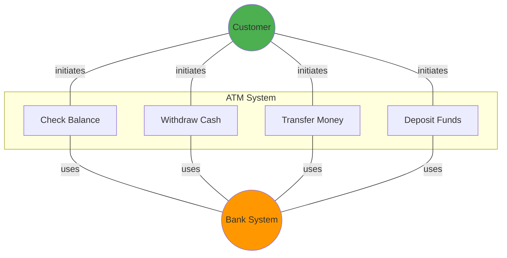
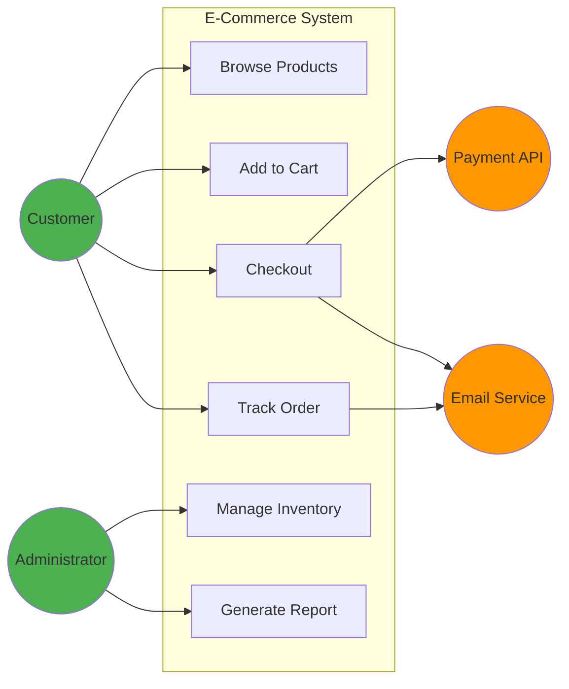
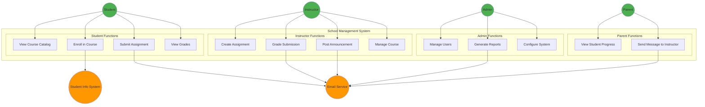
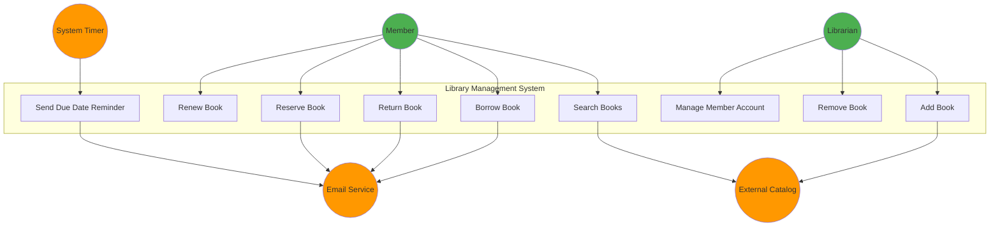

# 3.3 Use Case Diagrams

[← Previous: 3.2 Actors and System Boundary](./3_2-actors-system-boundary.md) | [Back to Chapter 3 README](./chapter-03-README.md) | [Next: 3.4 Use Case Relationships →](./3_4-use-case-relationships.md)

---

## 📖 Introduction

A picture is worth a thousand words. **Use case diagrams** provide a visual overview of your system's functionality from the user's perspective. They're the "30,000 foot view" that helps everyone quickly understand:
- Who uses the system
- What they can do with it
- How the system fits into its environment

---

## 🎯 Learning Objectives

After completing this section, you will be able to:

- ✅ Read and interpret UML use case diagrams
- ✅ Create use case diagrams using proper notation
- ✅ Organize use cases effectively in diagrams
- ✅ Apply diagramming best practices
- ✅ Avoid common diagramming mistakes

---

## 📐 UML Use Case Diagram Notation

### Basic Elements

#### 1. **Actor** (Stick Figure)

```
    ┌─┐
    │ │  ← Head
    └─┘
     │   ← Body
    ╱│╲
   ╱ │ ╲  ← Arms
    ╱ ╲   ← Legs
   ╱   ╲
   
   Customer
```

**Rules:**
- Name below the figure
- Singular noun preferred ("Student" not "Students")
- Descriptive role name

**Alternative Notation for Systems:**

```
┌──────────────┐
│<<external>>  │
│ Payment API  │
└──────────────┘
```

#### 2. **Use Case** (Oval/Ellipse)

```
╭─────────────────╮
│  Enroll in      │
│  Course         │
╰─────────────────╯
```

**Rules:**
- Verb phrase describing the action
- User's perspective, not system's
- Concise but descriptive

**Good Names:**
- "Purchase Product"
- "Generate Report"
- "Submit Assignment"

**Bad Names:**
- "Product" (not an action)
- "Click Button" (too technical)
- "Update Database" (system internals)

#### 3. **System Boundary** (Box)

```
┌───────────────────────────────────────────┐
│ School Management System                  │
│                                           │
│   ╭──────────╮      ╭──────────╮        │
│   │ Enroll   │      │ Submit   │        │
│   │ Course   │      │Assignment│        │
│   ╰──────────╯      ╰──────────╯        │
│                                           │
└───────────────────────────────────────────┘
```

**Rules:**
- Box with system name at top or inside
- Contains all use cases
- Actors are OUTSIDE the box

#### 4. **Association** (Line)

```
Customer ───────────── Purchase Product
  (Actor)                (Use Case)
```

**Rules:**
- Solid line connecting actor to use case
- Shows actor can initiate or participate in use case
- No arrowheads (unless showing initiation direction)

### Complete Simple Example



---

## 🎨 Creating Your First Use Case Diagram

### Step-by-Step Process

#### Step 1: Identify Actors
From section 3.2, list your actors:
- Primary: Customer, Administrator
- Secondary: Payment Gateway, Email Service

#### Step 2: Identify Use Cases
From requirements, what can actors do?
- Customer: Browse Products, Add to Cart, Checkout, Track Order
- Administrator: Manage Inventory, Generate Sales Report

#### Step 3: Draw System Boundary
```
┌─────────────────────────────────┐
│   E-Commerce System             │
│                                 │
│                                 │
│                                 │
└─────────────────────────────────┘
```

#### Step 4: Place Use Cases Inside Boundary
```
┌─────────────────────────────────────┐
│   E-Commerce System                 │
│                                     │
│  ╭──────────╮    ╭───────────╮    │
│  │ Browse   │    │ Add to    │    │
│  │ Products │    │ Cart      │    │
│  ╰──────────╯    ╰───────────╯    │
│                                     │
│  ╭──────────╮    ╭───────────╮    │
│  │ Checkout │    │ Track     │    │
│  │          │    │ Order     │    │
│  ╰──────────╯    ╰───────────╯    │
│                                     │
│  ╭──────────╮    ╭───────────╮    │
│  │ Manage   │    │ Generate  │    │
│  │Inventory │    │ Report    │    │
│  ╰──────────╯    ╰───────────╯    │
└─────────────────────────────────────┘
```

#### Step 5: Place Actors Outside Boundary

```
    ┌─┐                                        ┌─┐
    │ │                                        │ │
    └─┘                                        └─┘
     │                                          │
    ╱│╲                                        ╱│╲
   ╱ │ ╲                                      ╱ │ ╲
  Customer         System Boundary      Administrator
  
            ┌─────────────────────────────────────┐
            │   E-Commerce System                 │
            │                                     │
            │  Use Cases Here                    │
            │                                     │
            └─────────────────────────────────────┘
            
                    ┌──────────────┐
                    │<<external>>  │
                    │ Payment API  │
                    └──────────────┘
```

#### Step 6: Draw Associations

Connect each actor to their use cases:

```
Customer ─────── Browse Products
Customer ─────── Add to Cart
Customer ─────── Checkout
Customer ─────── Track Order

Administrator ─────── Manage Inventory
Administrator ─────── Generate Report

Checkout ─────── Payment API
```

### Complete Example



---

## 🏗️ Organization Strategies

### Strategy 1: By User Type

Group use cases by primary actor:

```
┌──────────────────────────────────────────────────┐
│   School Management System                       │
│                                                  │
│  Student Area        Instructor Area            │
│  ┌───────────┐      ┌──────────────┐           │
│  │ Enroll    │      │ Create       │           │
│  │ Course    │      │ Assignment   │           │
│  └───────────┘      └──────────────┘           │
│  ┌───────────┐      ┌──────────────┐           │
│  │ Submit    │      │ Grade        │           │
│  │Assignment │      │ Submission   │           │
│  └───────────┘      └──────────────┘           │
│                                                  │
│  Admin Area                                     │
│  ┌───────────┐      ┌──────────────┐           │
│  │ Manage    │      │ Generate     │           │
│  │ Users     │      │ Report       │           │
│  └───────────┘      └──────────────┘           │
└──────────────────────────────────────────────────┘
```

### Strategy 2: By Business Process

Group related use cases:

```
┌──────────────────────────────────────────────────┐
│   E-Commerce System                              │
│                                                  │
│  Shopping            Order Management           │
│  ┌───────────┐      ┌──────────────┐           │
│  │ Browse    │      │ Process      │           │
│  │ Products  │      │ Order        │           │
│  └───────────┘      └──────────────┘           │
│  ┌───────────┐      ┌──────────────┐           │
│  │ Add to    │      │ Track        │           │
│  │ Cart      │      │ Shipment     │           │
│  └───────────┘      └──────────────┘           │
│                                                  │
│  Inventory           Reporting                  │
│  ┌───────────┐      ┌──────────────┐           │
│  │ Update    │      │ Sales        │           │
│  │ Stock     │      │ Report       │           │
│  └───────────┘      └──────────────┘           │
└──────────────────────────────────────────────────┘
```

### Strategy 3: By Frequency/Priority

Emphasize important use cases:

```
┌──────────────────────────────────────────────────┐
│   Banking System                                 │
│                                                  │
│  Core Functions (Daily Use)                     │
│  ╭─────────────╮  ╭─────────────╮              │
│  │ Transfer    │  │ Check       │              │
│  │ Funds       │  │ Balance     │              │
│  ╰─────────────╯  ╰─────────────╯              │
│                                                  │
│  Administrative (Monthly)                       │
│  ╭─────────────╮  ╭─────────────╮              │
│  │ Download    │  │ Order       │              │
│  │ Statement   │  │ Checkbook   │              │
│  ╰─────────────╯  ╰─────────────╯              │
└──────────────────────────────────────────────────┘
```

---

## 🏫 School Management System: Complete Diagram

Let's create a comprehensive use case diagram for our ongoing project:

### Actors (from 3.2):
- **Primary:** Student, Instructor, Administrator, Parent
- **Secondary:** Email Service, Student Info System

### Use Cases by Actor:

**Student:**
- View Course Catalog
- Enroll in Course
- Drop Course
- View Schedule
- Submit Assignment
- View Grades
- Send Message

**Instructor:**
- Create Course
- Manage Course Content
- Create Assignment
- Grade Submission
- Post Announcement
- View Student Roster
- Generate Grade Report

**Administrator:**
- Manage Users
- Manage Courses
- Generate System Reports
- Configure System Settings
- Monitor System Activity

**Parent:**
- View Student Progress
- View Student Schedule
- Communicate with Instructor

### Diagram



---

## ✅ Diagramming Best Practices

### DO:

1. **Keep it Simple**
   - One diagram per business area if system is large
   - 5-15 use cases per diagram maximum
   - Focus on primary actors

2. **Use Clear Names**
   - Verb phrases for use cases
   - Role names for actors
   - Avoid abbreviations unless universal

3. **Show Important Relationships**
   - Actor-to-use-case associations
   - Key system interactions
   - Primary vs. secondary actors distinction

4. **Maintain Consistency**
   - Same actor appears the same everywhere
   - Same use case name throughout documentation
   - Consistent layout across diagrams

5. **Align Elements Neatly**
   - Use tools' alignment features
   - Group related use cases
   - Balance left/right actor placement

### DON'T:

1. **Don't Overcrowd**
   - ❌ 50 use cases in one diagram
   - ✅ Create multiple focused diagrams

2. **Don't Show Sequence**
   - ❌ Use case diagrams show WHAT, not WHEN
   - ✅ Use sequence diagrams for timing

3. **Don't Include Internal Details**
   - ❌ Showing database operations
   - ❌ Showing calculations
   - ✅ Focus on user-visible functionality

4. **Don't Make It Too Abstract**
   - ❌ "Use System" (too vague)
   - ✅ "Enroll in Course" (specific)

5. **Don't Duplicate Use Cases**
   - ❌ "Student Enrolls" and "Enroll Student"
   - ✅ One use case: "Enroll in Course"

---

## ⚠️ Common Mistakes

### Mistake 1: Showing Navigation

❌ **Wrong:**
```
Login ──> View Dashboard ──> Click Menu ──> Select Option
```

✅ **Right:**
```
Login (separate use case)
View Dashboard (separate use case)
Manage Profile (separate use case)
```

**Why:** Use case diagrams show capabilities, not clicks.

### Mistake 2: Showing Data Flow

❌ **Wrong:**
```
Enter Data ──> Validate Data ──> Store Data ──> Confirm
```

✅ **Right:**
```
Create Student Record (one use case covering all steps)
```

**Why:** Use case diagrams are not flowcharts.

### Mistake 3: Including Implementation Details

❌ **Wrong:**
```
Use Cases:
- Connect to Database
- Parse JSON
- Validate Input
- Call API
```

✅ **Right:**
```
Use Cases:
- Process Payment
- Generate Report
```

**Why:** Focus on business value, not technical operations.

### Mistake 4: Too Many Actors

❌ **Wrong:** 30 actors around the system

✅ **Right:** 5-10 primary actors, a few secondary

**Fix:** Use actor generalization

### Mistake 5: Misplaced Actors

❌ **Wrong:** Actors inside system boundary

✅ **Right:** Actors outside, use cases inside

### Mistake 6: Missing Secondary Actors

❌ **Wrong:** Only showing human actors

✅ **Right:** Include external systems

---

## 🛠️ Tools for Creating Use Case Diagrams

### Recommended Tools

1. **Lucidchart** (Recommended)
   - Web-based
   - Excellent UML support
   - Free education account
   - Real-time collaboration

2. **Draw.io / diagrams.net**
   - Free and open-source
   - Desktop or web versions
   - Good UML library
   - Integrates with Google Drive

3. **Visual Paradigm**
   - Professional tool
   - Free community edition
   - Comprehensive UML support
   - Model-driven

4. **PlantUML**
   - Text-based diagrams
   - Version control friendly
   - Fast for simple diagrams
   - Learning curve

5. **Microsoft Visio**
   - Industry standard
   - Expensive
   - Windows only
   - Comprehensive features

### Tool Selection Criteria

| Need | Recommended Tool |
|------|------------------|
| Quick sketches | Draw.io |
| Team collaboration | Lucidchart |
| Professional documentation | Visual Paradigm |
| Version control | PlantUML |
| Corporate environment | Visio |

---

## 📝 Practice Exercise

### Exercise: Create Use Case Diagram

**Scenario:** Online Library System

**Requirements:**
- Members can search, borrow, and return books
- Members can reserve books that are checked out
- Members can renew borrowed books
- Librarians can add new books, remove old books
- Librarians can manage member accounts
- System sends email reminders for due dates
- System integrates with external catalog for book info

**Your Task:**
1. Identify actors (primary and secondary)
2. Identify use cases
3. Create a use case diagram

**Try it yourself before looking at the solution!**

---

<details>
<summary><strong>Click to see solution</strong></summary>

**Actors:**
- Primary: Member, Librarian
- Secondary: Email Service, External Catalog

**Use Cases:**
- Member: Search Books, Borrow Book, Return Book, Reserve Book, Renew Book
- Librarian: Add Book, Remove Book, Manage Member Account
- System: Send Reminder (triggered by timer)

**Diagram Structure:**



</details>

---

## 🧪 Self-Check Questions

### Question 1
Where should actors be placed in a use case diagram?
- A. Inside the system boundary
- B. Outside the system boundary ✓
- C. On top of the system boundary
- D. It doesn't matter

**Answer:** B. Actors are external to the system.

### Question 2
What does an association line (solid line) between an actor and use case represent?
- A. The actor creates the use case
- B. The actor participates in the use case ✓
- C. Data flows from actor to use case
- D. The sequence of operations

**Answer:** B. It shows the actor can initiate or participate in that use case.

### Question 3
How many use cases should typically be in one diagram?
- A. As many as possible
- B. Exactly 10
- C. 5-15 for clarity ✓
- D. Only 3-4

**Answer:** C. Keep diagrams focused and readable.

---

## 💡 Key Takeaways

✅ **Use case diagrams provide high-level view of system functionality**

✅ **Basic elements: Actors (outside), Use Cases (inside), System Boundary**

✅ **Keep diagrams simple: 5-15 use cases, clear organization**

✅ **Focus on WHAT users can do, not HOW system does it**

✅ **Use proper UML notation for consistency**

✅ **Group related use cases for better organization**

✅ **Don't show sequence, navigation, or implementation details**

---

## 🚀 Next Steps

You now know how to create basic use case diagrams. But what about relationships BETWEEN use cases? Sometimes use cases share behavior or extend each other. Let's learn about **Use Case Relationships**.

**Continue to:** [3.4 Use Case Relationships →](./3_4-use-case-relationships.md)

---

[← Previous: 3.2 Actors and System Boundary](./3_2-actors-system-boundary.md) | [Back to Chapter 3 README](./chapter-03-README.md) | [Next: 3.4 Use Case Relationships →](./3_4-use-case-relationships.md)
