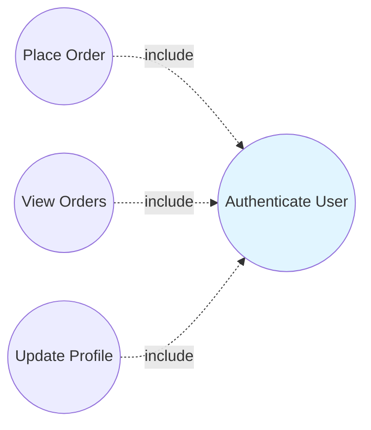
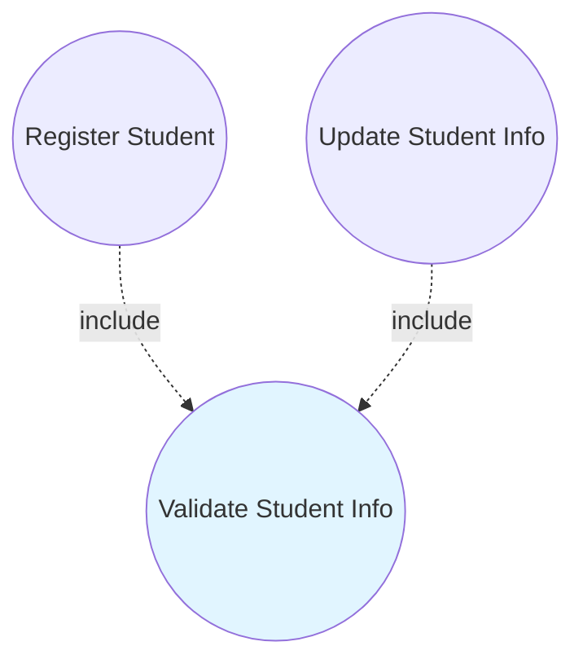
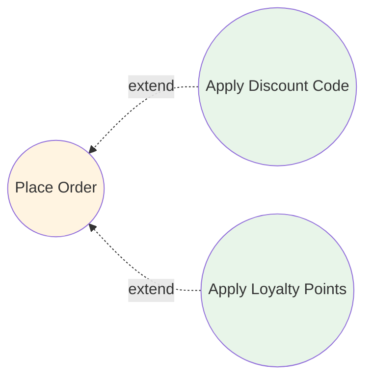
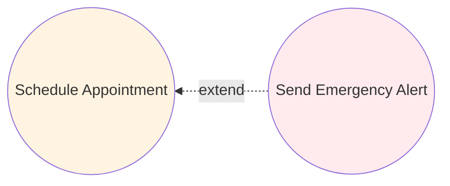
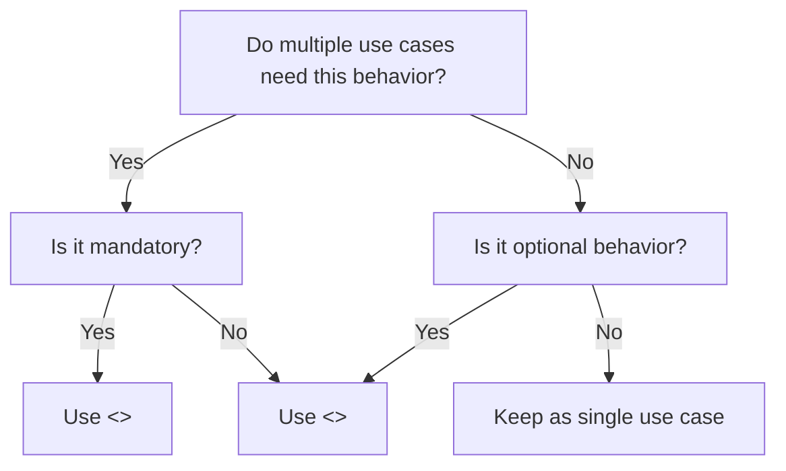
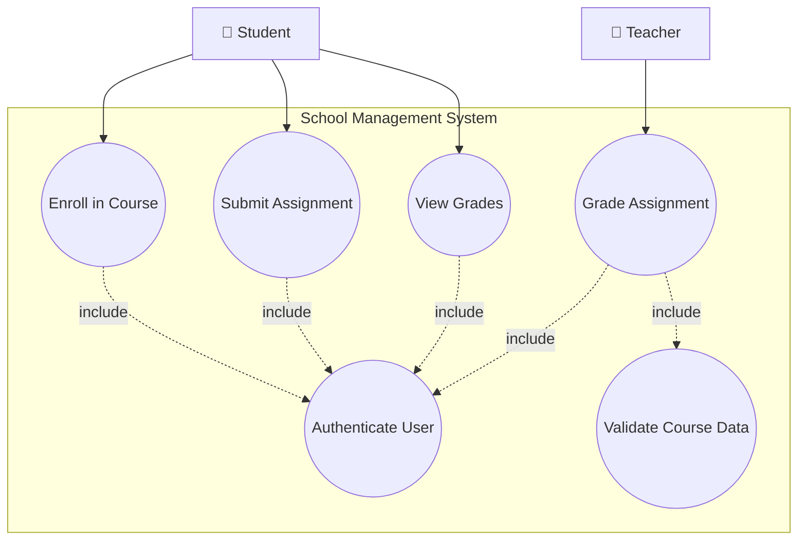
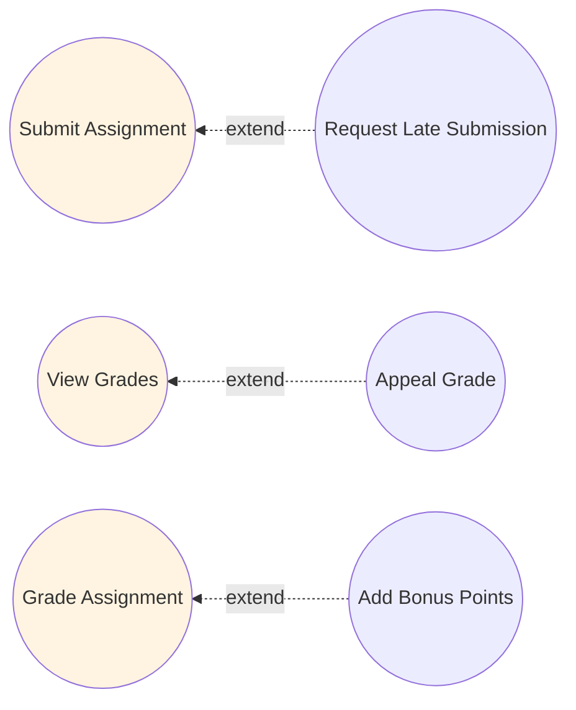

# 3.4 Include and Extend Relationships

## Introduction

You've learned to identify actors and use cases. But what happens when multiple use cases share common behavior? Or when a use case has optional features that only apply sometimes? This is where **use case relationships** become powerful tools for managing complexity.

Imagine you're modeling an e-commerce system. "Place Order," "Track Order," and "Return Order" all need to verify the user is logged in. Do you write "authenticate user" as steps in each use case? What if authentication logic changes? You'd need to update every use case!

**Use case relationships** solve this problem by allowing use cases to **reuse** and **extend** other use cases.

---

## The Two Main Relationships

### Quick Overview

```
<<include>> Relationship
Purpose: Mandatory reuse of common behavior
Example: "Place Order" includes "Process Payment"
Notation: Dashed arrow from base to included use case

<<extend>> Relationship  
Purpose: Optional behavior added under conditions
Example: "Place Order" extended by "Apply Discount Code"
Notation: Dashed arrow from extension to base use case
```

**Key Difference:**
- **Include** = "This use case ALWAYS uses that one"
- **Extend** = "That use case SOMETIMES adds to this one"

---

## Include Relationship (<<include>>)

### What is Include?

**Definition:** An include relationship shows that a base use case **always** incorporates the behavior of another use case.

**Think of it as:** Calling a function in programming - every time you run the main use case, it calls the included use case.

### When to Use Include

✅ **Use include when:**
1. **Common behavior** appears in multiple use cases
2. Behavior is **mandatory** (not optional)
3. Want to **avoid duplication** in specifications
4. Need to **centralize** shared logic

### Include Notation

```
Base Use Case ----<<include>>----> Included Use Case
  (dashed arrow pointing to included)
```

**UML Diagram:**
```
┌─────────────────┐                    ┌──────────────────┐
│  Place Order    │----<<include>>---->│ Process Payment  │
└─────────────────┘                    └──────────────────┘
```

**Reading:** "Place Order includes Process Payment"  
**Meaning:** Every time someone places an order, payment processing MUST happen

### Include Example 1: Authentication

Many use cases require authentication:



**Why Include?**
- Authentication is mandatory for all three
- Authentication logic is centralized
- Changes to authentication update all use cases automatically

**Detailed Flow:**

**Place Order Use Case:**
1. System **includes Authenticate User**
2. Customer selects items
3. System **includes Process Payment**
4. System confirms order

**Authenticate User Use Case (Reused):**
1. System prompts for credentials
2. User enters username/password
3. System validates credentials
4. System grants access

### Include Example 2: Validate Input



**Why?** Both registration and updates need validation:
- Check email format
- Verify phone number
- Validate date of birth
- Check required fields

### Include Example 3: School Management System

```
                ┌──────────────────────────┐
                │ School Management System │
                │                          │
                │  ┌────────────────┐     │
   Student ─────│──│ Enroll in      │     │
                │  │ Course         │     │
                │  └────────────────┘     │
                │          │               │
                │          │ <<include>>  │
                │          ↓               │
                │  ┌────────────────┐     │
                │  │ Check          │     │
                │  │ Prerequisites  │     │
                │  └────────────────┘     │
                │                          │
                └──────────────────────────┘
```

**Explanation:**
- Cannot enroll without checking prerequisites
- Prerequisite check happens EVERY time
- Logic centralized in one place

---

## Extend Relationship (<<extend>>)

### What is Extend?

**Definition:** An extend relationship shows that an extending use case **may** add behavior to a base use case under specific conditions.

**Think of it as:** An if-statement or plugin - the base use case works fine alone, but sometimes extra behavior gets added.

### When to Use Extend

✅ **Use extend when:**
1. Behavior is **optional** or conditional
2. Behavior happens only in **special cases**
3. Base use case works fine **without** the extension
4. Want to keep base use case simple
5. Modeling **exception flows** or **variants**

### Extend Notation

```
Extending Use Case ----<<extend>>----> Base Use Case
  (dashed arrow pointing to base)
```

**UML Diagram:**
```
┌──────────────────┐                    ┌─────────────────┐
│ Apply Discount   │----<<extend>>----> │  Place Order    │
│      Code        │                    └─────────────────┘
└──────────────────┘
```

**Reading:** "Apply Discount Code extends Place Order"  
**Meaning:** Placing an order works normally, but IF customer has discount code, apply discount behavior gets added

### Extend Example 1: Discount Codes



**Base: Place Order**
1. Customer selects items
2. System calculates total
3. Customer enters shipping
4. **Extension Point: "payment calculation"**
   - IF discount code → apply discount
   - IF loyalty points → apply points
5. System processes payment

**Extension: Apply Discount Code**
- **Condition:** Customer has discount code
- **Behavior:** Validate code, calculate discount, adjust total
- **When:** At "payment calculation" extension point

### Extend Example 2: Emergency Alerts



**Base: Schedule Appointment**
1. Patient selects doctor
2. System shows available times
3. Patient selects time
4. System confirms appointment
5. **Extension Point: "after confirmation"**

**Extension: Send Emergency Alert**
- **Condition:** Appointment marked urgent
- **Behavior:** Alert on-call staff, escalate priority
- **When:** After confirmation if urgent flag set

### Extend Example 3: School Management System

```
                ┌──────────────────────────┐
                │ School Management System │
                │                          │
                │  ┌────────────────┐     │
                │  │ Request        │     │
                │  │ Grade Change   │     │
                │  └────────────────┘     │
                │          ↑               │
                │          │ <<extend>>   │
   Student ─────│──────────┘              │
                │  ┌────────────────┐     │
                │  │ Submit         │     │
                │  │ Assignment     │     │
                │  └────────────────┘     │
                │                          │
                └──────────────────────────┘
```

**Explanation:**
- Normal flow: Submit assignment → get graded
- Optional: IF student disagrees with grade → Request grade change
- Base use case works fine without extension

---

## Include vs. Extend: Key Differences

### Visual Comparison

```
INCLUDE (Mandatory)
────────────────────
Base ----include----> Included
       (always runs)

"Place Order" includes "Process Payment"
Every order MUST process payment

EXTEND (Optional)
────────────────────
Extension ----extend----> Base
          (sometimes runs)

"Apply Discount" extends "Place Order"
Discount only applied if code provided
```

### Detailed Comparison Table

| Aspect | Include | Extend |
|--------|---------|--------|
| **Purpose** | Reuse common behavior | Add optional behavior |
| **Frequency** | Always happens | Sometimes happens |
| **Direction** | Base → Included | Extension → Base |
| **Independence** | Base needs included | Base works without extension |
| **Analogy** | Function call | Plugin/add-on |
| **Arrow Direction** | Points to what's included | Points to what's extended |
| **Condition** | Unconditional | Conditional |
| **Example** | "Login includes Validate Credentials" | "Apply Discount extends Checkout" |

### Decision Flowchart



---

## Extension Points (for Extend)

### What are Extension Points?

**Extension points** specify WHERE in the base use case the extension can plug in.

**Syntax in Use Case Description:**
```
Use Case: Place Order
Extension Points:
- "payment calculation" (after step 4)
- "order confirmation" (after step 8)
```

### Example with Extension Point

**Base Use Case: Submit Assignment**

1. Student selects course
2. Student selects assignment
3. Student uploads file
4. System validates file format
5. **Extension Point: "late submission check"**
6. System confirms submission
7. System notifies teacher

**Extending Use Case: Apply Late Penalty**

**Condition:** Current date > assignment deadline  
**Extension Point:** "late submission check"  
**Behavior:**
- Calculate days late
- Calculate penalty percentage
- Apply penalty to grade
- Display late warning to student

### Multiple Extension Points

```mermaid
graph RL
    E1((Send Late Warning)) -.->|extend at<br/>"late check"| A((Submit Assignment))
    E2((Request Extension)) -.->|extend at<br/>"late check"| A
    E3((Submit as Group)) -.->|extend at<br/>"file upload"| A
    
    style A fill:#fff4e1
```

---

## Common Patterns and Best Practices

### Pattern 1: Authentication Include

**Problem:** Many use cases need authentication

**Solution:**
```
Multiple Use Cases ----include----> Authenticate User
```

**Examples:**
- Place Order includes Authenticate
- View Profile includes Authenticate  
- Make Payment includes Authenticate

### Pattern 2: Validation Include

**Problem:** Multiple use cases need same validation

**Solution:**
```
Register Student ----include----> Validate Student Data
Update Student ----include----> Validate Student Data
```

### Pattern 3: Exception Extend

**Problem:** Need to handle exceptional cases

**Solution:**
```
Handle Payment Failure ----extend----> Process Payment
Request Refund ----extend----> Complete Order
```

### Pattern 4: Variant Behavior Extend

**Problem:** Different user types have different options

**Solution:**
```
Apply Employee Discount ----extend----> Place Order
Apply Student Discount ----extend----> Place Order
Apply VIP Benefits ----extend----> Place Order
```

---

## School Management System - Complete Example

### Authentication & Validation (Include)



### Extensions (Extend)



**Complete Diagram Elements:**
- **Include:** All main use cases include authentication
- **Extend:** Optional behaviors for special cases

---

## Anti-Patterns (What NOT to Do)

### ❌ Anti-Pattern 1: Include for Optional Behavior

**Wrong:**
```
Place Order ----include----> Apply Discount
```

**Why Wrong:** Discount is optional, not mandatory

**Right:**
```
Apply Discount ----extend----> Place Order
```

### ❌ Anti-Pattern 2: Extend for Mandatory Behavior

**Wrong:**
```
Process Payment ----extend----> Place Order
```

**Why Wrong:** Can't place order without payment

**Right:**
```
Place Order ----include----> Process Payment
```

### ❌ Anti-Pattern 3: Too Many Includes

**Wrong:**
```
Place Order includes:
- Validate Cart
- Check Inventory
- Calculate Tax
- Calculate Shipping
- Validate Address
- Process Payment
- Send Confirmation
```

**Why Wrong:** Over-fragmentation, hard to understand

**Right:** Only extract truly reusable behavior

### ❌ Anti-Pattern 4: Circular Relationships

**Wrong:**
```
A ----include----> B
B ----include----> A
```

**Why Wrong:** Infinite loop, logically impossible

**Right:** Review use case granularity

### ❌ Anti-Pattern 5: Including from Extension

**Wrong:**
```
Extension ----include----> Shared
Extension ----extend----> Base
```

**Why Wrong:** Extensions shouldn't have their own includes

**Right:** Keep extensions simple

---

## Documentation Guidelines

### Documenting Include Relationships

**In Use Case Description:**

**Use Case: Enroll in Course**
**Included Use Cases:** Authenticate User, Check Prerequisites
**Main Flow:**
1. **Include: Authenticate User**
2. Student searches course catalog
3. Student selects course
4. **Include: Check Prerequisites**
5. System registers student
6. System confirms enrollment

### Documenting Extend Relationships

**In Use Case Description:**

**Use Case: Submit Assignment**
**Extension Points:**
- "deadline check" (after step 3)
- "file validation" (after step 4)

**Main Flow:**
1. Student selects assignment
2. Student uploads file
3. System validates format
4. **Extension Point: "deadline check"**
5. System confirms submission

**Extending Use Cases:**
- Apply Late Penalty (at "deadline check")
- Request Deadline Extension (at "deadline check")

---

## Practice Exercise 1: Identify Relationship Type

For each scenario, determine if you should use include or extend:

1. **Multiple use cases need to send email notifications**
   - [ ] Include  
   - [ ] Extend

2. **VIP customers get express shipping option**
   - [ ] Include  
   - [ ] Extend

3. **All transactions must log to audit trail**
   - [ ] Include  
   - [ ] Extend

4. **Premium users can export reports to Excel**
   - [ ] Include  
   - [ ] Extend

5. **Creating account requires validating email**
   - [ ] Include  
   - [ ] Extend

**Answers:**
1. Include (mandatory, reusable)
2. Extend (optional, condition: VIP status)
3. Include (mandatory for all)
4. Extend (optional, condition: premium)
5. Include (mandatory step)

---

## Practice Exercise 2: Fix the Diagram

**This diagram has errors - find and fix them:**

```
Checkout ----extend----> Process Payment
Checkout ----include----> Apply Discount
Authenticate ----include----> View Profile
```

**Errors:**
1. Payment is mandatory for checkout → should be include
2. Discount is optional → should be extend
3. Include arrow direction wrong → should point TO authenticate

**Corrected:**
```
Checkout ----include----> Process Payment
Apply Discount ----extend----> Checkout
View Profile ----include----> Authenticate
```

---

## Practice Exercise 3: School Library System

**Scenario:** Design use cases for a school library system

**Requirements:**
- Students can borrow books (must authenticate)
- Students can reserve books (must authenticate)
- Overdue books trigger late fee (only when overdue)
- Students can renew books (must check if renewable)
- Premium members can borrow more books (special privilege)

**Your Task:**
1. Identify base use cases
2. Identify common behavior (include candidates)
3. Identify optional behavior (extend candidates)
4. Draw the diagram

**Solution:**

**Base Use Cases:**
- Borrow Book
- Reserve Book
- Renew Book

**Includes:**
- All include "Authenticate User"
- Renew includes "Check Renewal Eligibility"

**Extends:**
- "Apply Late Fee" extends "Return Book"
- "Grant Extended Loan" extends "Borrow Book"

---

## Self-Check Questions

1. **Include relationships are used when:**
   - a) Behavior is optional
   - b) Behavior is mandatory
   - c) Behavior rarely occurs
   - d) Creating extension points

2. **The arrow in an extend relationship points:**
   - a) From base to extension
   - b) From extension to base
   - c) Both directions
   - d) No arrow needed

3. **"Apply Discount Code" should ___ "Checkout"**
   - a) include
   - b) extend
   - c) generalize
   - d) associate

4. **Extension points are used with:**
   - a) Include relationships
   - b) Extend relationships
   - c) Both
   - d) Neither

5. **Which indicates mandatory reuse?**
   - a) <<extend>>
   - b) <<include>>
   - c) <<uses>>
   - d) <<requires>>

**Answers:** 1-b, 2-b, 3-b, 4-b, 5-b

---

## Key Takeaways

### Include Relationship
- Mandatory behavior
- Reusable across multiple use cases
- Arrow points TO the included use case
- Use for authentication, validation, etc.

### Extend Relationship
- Optional/conditional behavior
- Base works fine without it
- Arrow points TO the base use case
- Use for exceptions, premium features, variants

### Decision Rule
```
Is it always needed? → Include
Is it sometimes added? → Extend
```

---

## Coming Up Next

In **3.5 Generalization and Other Relationships**, you'll learn:
- Actor generalization (inheritance)
- Use case generalization
- Organizing hierarchies
- Advanced modeling techniques

**Prepare by:** Think about how different user types (free user, premium user, admin) might share common behaviors but also have unique capabilities.

---

**Navigation:**
- **Previous:** [3.3 Identifying Actors and Use Cases](3_3-identifying-actors-use-cases.md)
- **Next:** [3.5 Generalization Relationships](3_5-generalization-relationships.md)
- **Up:** [Chapter 3 README](chapter-03-README.md)
