# 3.4 Use Case Relationships

[← Previous: 3.3 Use Case Diagrams](./3_3-use-case-diagrams.md) | [Back to Chapter 3 README](./chapter-03-README.md) | [Next: 3.5 Writing Use Case Descriptions →](./3_5-use-case-descriptions.md)

---

## 📖 Introduction

Real systems have use cases that share behavior or have conditional paths. Rather than duplicating descriptions, UML provides three relationship types to model these situations:

- **Include**: Shared, mandatory behavior
- **Extend**: Optional, conditional behavior  
- **Generalization**: Inheritance between use cases

Understanding when and how to use each is crucial for creating maintainable models.

---

## 🎯 Learning Objectives

- ✅ Understand the three use case relationship types
- ✅ Know when to use include vs. extend vs. generalization
- ✅ Create diagrams with relationships using proper notation
- ✅ Avoid over-complicating models with unnecessary relationships
- ✅ Apply relationships to real-world scenarios

---

## 🔗 1. Include Relationship

### Definition

> **Include**: When a use case ALWAYS uses behavior from another use case.

### Notation

```
Base Use Case -------<<include>>-------> Included Use Case
```

### When to Use

Use **include** when:
- Multiple use cases need the SAME behavior
- The behavior is MANDATORY (always happens)
- You want to avoid duplication
- The extracted behavior is substantial

### Example 1: Authentication

Many use cases require login:

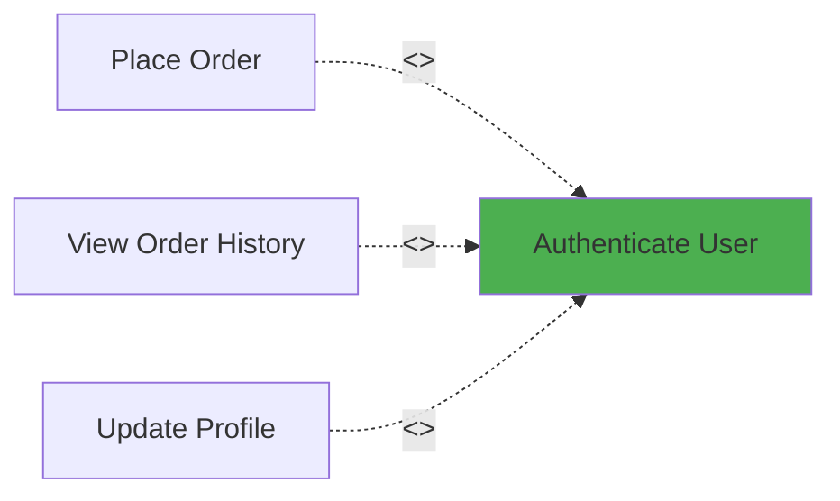

**Why Include?**
- Every use case MUST authenticate
- Authentication steps are identical
- Avoids repeating login steps in each use case

### Example 2: Payment Processing

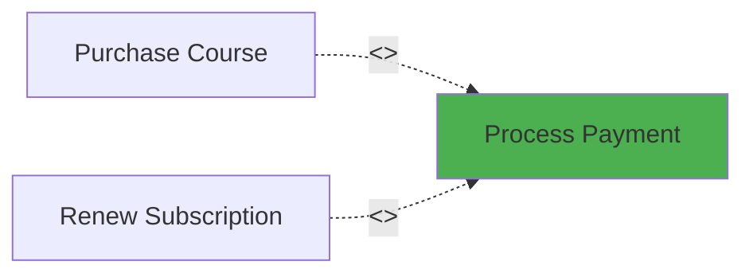

**Use Case: "Purchase Course"**
1. Student selects course
2. System displays price
3. **INCLUDE: Process Payment**
4. System confirms enrollment

**Use Case: "Process Payment" (Included)**
1. System validates payment info
2. System contacts payment gateway
3. System receives confirmation
4. System records transaction

### School System Example

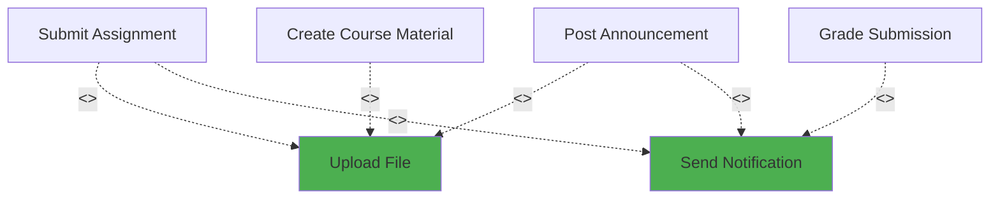

---

## 🔀 2. Extend Relationship

### Definition

> **Extend**: When a use case MAY optionally add behavior to another use case under certain conditions.

### Notation

```
Extending Use Case -------<<extend>>-------> Base Use Case
```

**Important:** Arrow points FROM extending TO base (opposite of include!)

### When to Use

Use **extend** when:
- Behavior is OPTIONAL (doesn't always happen)
- Behavior depends on CONDITIONS
- You're modeling variations or exceptions
- Main use case can complete without the extension

### Example 1: Order Processing

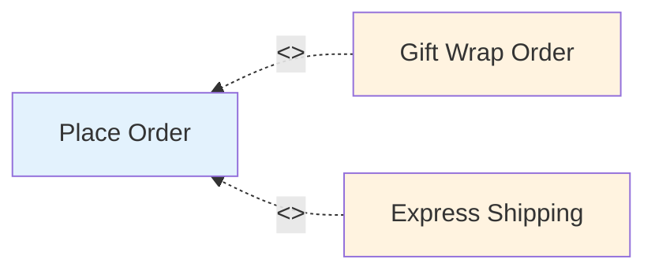

**Base Use Case: "Place Order"**
1. Customer adds items to cart
2. Customer proceeds to checkout
3. System calculates total
4. **EXTEND: Gift Wrap** (if customer requests)
5. **EXTEND: Express Shipping** (if customer selects)
6. Customer completes payment
7. System confirms order

**Extension Point:** After calculating total, before payment

### Example 2: Course Enrollment

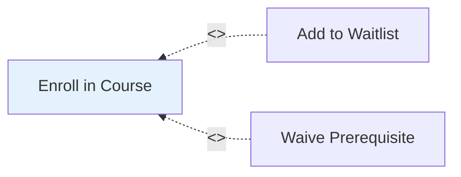

**Conditions:**
- **Wait list**: Course is full
- **Waive prereq**: Student lacks prerequisite but has permission

### School System Example

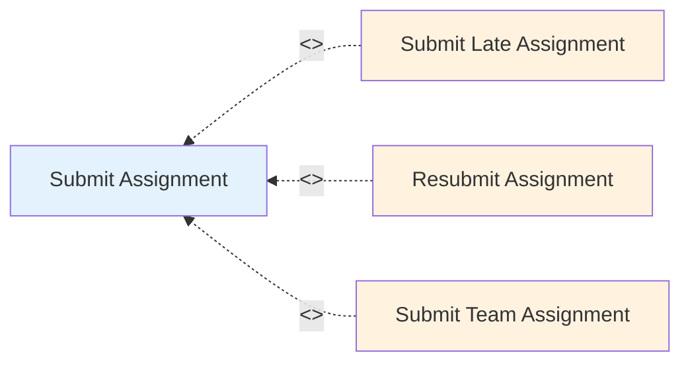

**Extension Points:**
- Late submission: After deadline
- Resubmission: Assignment already submitted
- Team: Group project flag set

---

## 🔼 3. Generalization (Inheritance)

### Definition

> **Generalization**: When specialized use cases inherit behavior from a general use case.

### Notation

```
Specialized UC -------△-------> General UC
```

Hollow triangle pointing to parent (general) use case.

### When to Use

Use **generalization** when:
- Multiple use cases share structure but have variations
- You want parent-child relationship
- Specialized use cases are complete scenarios themselves

### Example 1: Payment Methods

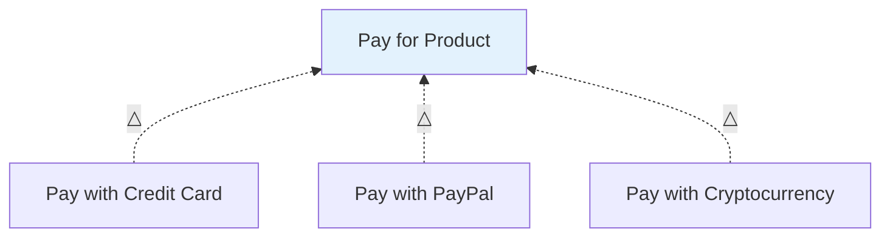

**General Use Case: "Pay for Product"**
- Common steps: Select items, calculate total, confirm payment

**Specializations:**
- Credit Card: Enter card details, CVV validation
- PayPal: Redirect to PayPal, OAuth flow
- Bitcoin: Generate wallet address, wait for confirmations

### Example 2: Report Generation

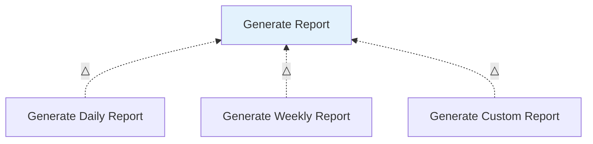

### School System Example

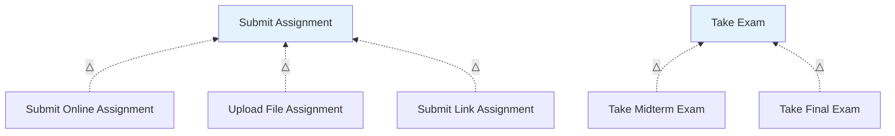

---

## 🔍 Include vs. Extend vs. Generalization

### Quick Comparison

| Aspect | Include | Extend | Generalization |
|--------|---------|--------|----------------|
| **Direction** | Base → Included | Extending → Base | Child → Parent |
| **Frequency** | Always happens | Sometimes happens | Alternative variations |
| **Dependency** | Base needs included | Base independent | Child IS-A parent |
| **Example** | Login (required) | Gift wrap (optional) | Credit card payment (type of payment) |
| **Arrow** | Dashed → | Dashed → | Solid △ |

### Decision Tree

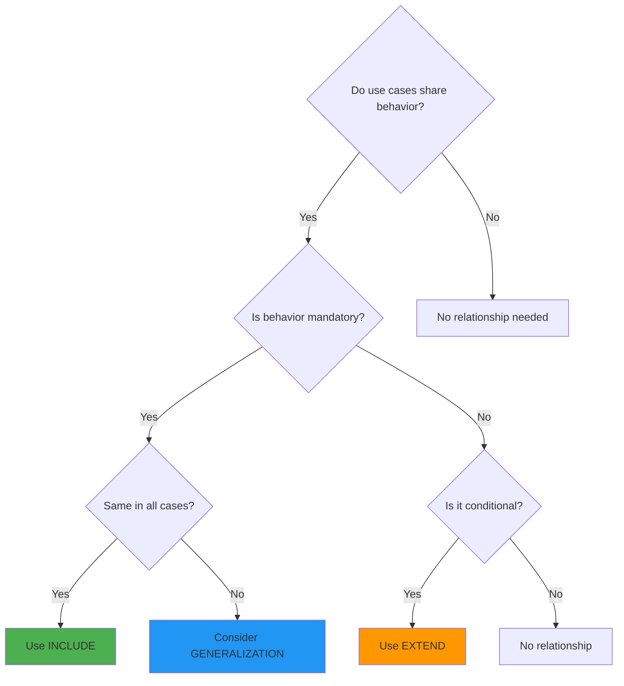

### Examples Side by Side

**Scenario:** Student Assignment Submission

**Include:**
```
Submit Assignment --<<include>>--> Authenticate User
(Always need to login first)
```

**Extend:**
```
Request Extension --<<extend>>--> Submit Assignment  
(Only if past deadline)
```

**Generalization:**
```
Submit Text Assignment --△--> Submit Assignment
Submit File Assignment --△--> Submit Assignment
(Different types of submissions)
```

---

## ⚖️ When NOT to Use Relationships

### Over-Engineering Warning

Too many relationships make models complex and hard to maintain.

### Anti-Pattern 1: Include Everything

❌ **Bad:**
```
Place Order --include--> Validate Cart
Place Order --include--> Calculate Tax
Place Order --include--> Check Inventory
Place Order --include--> Update Database
Place Order --include--> Send Email
```

✅ **Good:**
```
Place Order (contains all these steps internally)
Place Order --include--> Process Payment (only substantial shared behavior)
```

**Rule:** Only extract includes if used by 2+ use cases AND substantial.

### Anti-Pattern 2: Extend for Every Variation

❌ **Bad:**
```
Cancel order within 1 hour --extend--> Place Order
Cancel order within 1 day --extend--> Place Order
Cancel order within 1 week --extend--> Place Order
```

✅ **Good:**
```
Cancel Order (separate use case with business rules in description)
```

### Anti-Pattern 3: Deep Inheritance

❌ **Bad:**
```
Submit → Submit with File → Submit PDF → Submit Scanned PDF → Submit Scanned Graded PDF
```

✅ **Good:**
```
Submit Assignment (1-2 levels max)
  → Submit Online
  → Submit Upload
```

**Rule:** Max 2 levels of generalization.

---

## 🏫 School System: Complete with Relationships

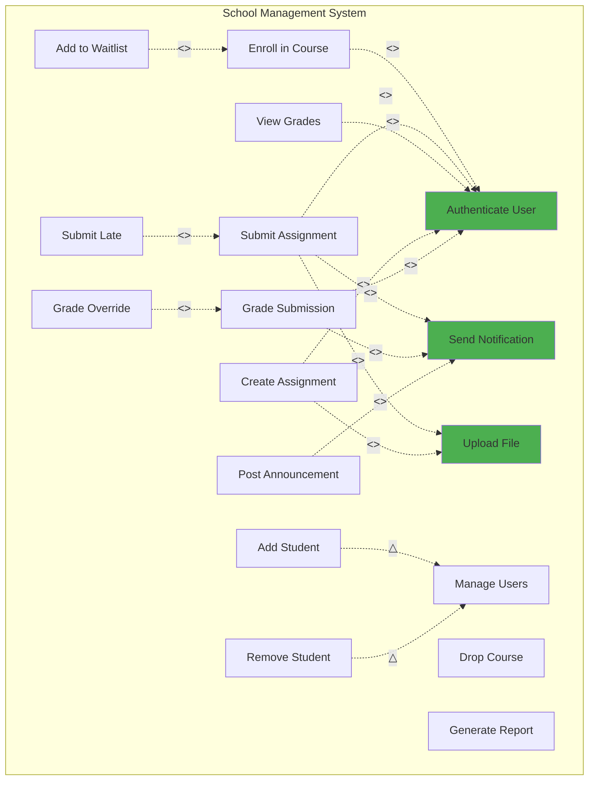

---

## ✏️ Practice Exercise

**Scenario:** Hospital Appointment System

**Use Cases Identified:**
- Book Appointment
- Cancel Appointment
- Reschedule Appointment
- Check-in for Appointment
- Emergency Booking
- Send Appointment Reminder
- Verify Insurance

**Your Task:**

1. Which use cases should use **include**?
2. Which should use **extend**?
3. Which should use **generalization**?
4. Draw the relationships.

**Try before looking at solution!**

---

<details>
<summary><strong>Click for Solution</strong></summary>

**Include Relationships:**
- Book Appointment --include--> Verify Insurance (always needed)
- Check-in --include--> Authenticate Patient (always needed)

**Extend Relationships:**
- Emergency Booking --extend--> Book Appointment (special case)
- Send Reminder --extend--> Book Appointment (conditional feature)

**Generalization:**
- Book In-Person --△--> Book Appointment
- Book Telemedicine --△--> Book Appointment

Or alternatively:
- Cancel within 24h --△--> Cancel Appointment
- Cancel with fee --△--> Cancel Appointment

</details>

---

## 💡 Key Takeaways

✅ **Include = Mandatory shared behavior (always happens)**

✅ **Extend = Optional behavior (conditional)**

✅ **Generalization = Inheritance (IS-A relationship)**

✅ **Use relationships sparingly - only when they add clarity**

✅ **Include points TO shared behavior**

✅ **Extend points FROM extending TO base**

✅ **Generalization points FROM child TO parent**

---

## 🚀 Next Steps

Now that you understand how to structure use case diagrams, let's learn how to write detailed descriptions of each use case.

**Continue to:** [3.5 Writing Use Case Descriptions →](./3_5-use-case-descriptions.md)

---

[← Previous: 3.3 Use Case Diagrams](./3_3-use-case-diagrams.md) | [Back to Chapter 3 README](./chapter-03-README.md) | [Next: 3.5 Writing Use Case Descriptions →](./3_5-use-case-descriptions.md)
