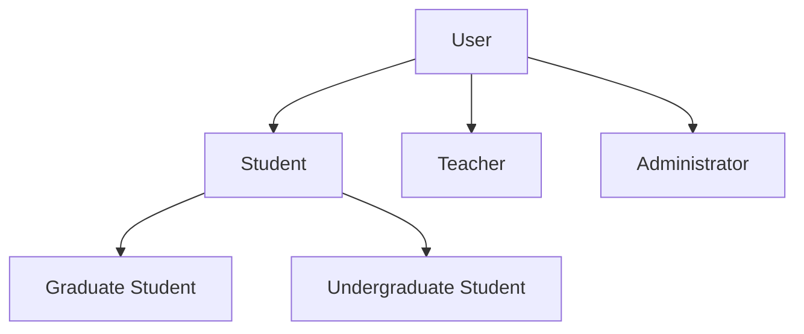
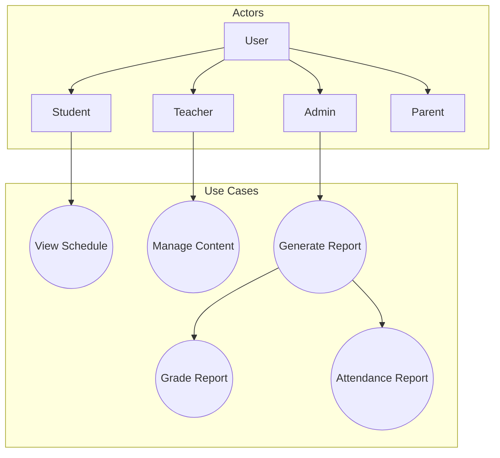

# 3.5 Generalization and Other Relationships

## Introduction

You've learned include and extend for managing use case behavior. Now we'll explore **generalization** - the inheritance relationship that lets you model hierarchies of actors and use cases. This is like object-oriented inheritance but at the requirements level.

**When you'll use this:** Modeling systems with different user types (free/premium), related use cases (search variants), or role hierarchies (employee/manager).

---

## Actor Generalization

### The Concept

**Actor Generalization:** A specialized actor inherits all associations and behaviors from a general actor.

**Notation:** Solid line with hollow triangle pointing to parent

```
       User (Parent)
         △
         │
    ┌────┴────┐
 Student   Teacher
```

### Example: School System Users



**Inheritance:**
- All can "Log In"
- All can "Update Profile"
- All can "View Announcements"
- Students additionally: Enroll, Submit
- Teachers additionally: Grade, Create Course

### Real-World Example: E-Commerce

```
           Customer
              △
              │
       ┌──────┴──────┐
  Guest User    Registered User
                      △
                      │
                Premium Member
```

**Capabilities:**
- **Customer (all):** Browse, Search
- **Guest:** Add to Cart
- **Registered:** + Save Wishlist, Track Orders
- **Premium:** + Free Shipping, Early Access

---

## Use Case Generalization

### The Concept

A specialized use case inherits behavior from a general use case but adds specific details.

**Example:**
```
     Search Products (Parent)
           △
           │
    ┌──────┴──────┐
Search by   Search by
Category    Keyword
```

### School System Example

```
      Generate Report
            △
            │
    ┌───────┼───────┐
Grade    Attendance  Financial
Report    Report     Report
```

**Common Behavior:** All reports need authentication, date range, format selection
**Specific Behavior:** Each report has unique data source and fields

---

## Complete School Management Example



---

## Best Practices

✅ **Do:**
- Use for clear hierarchies
- Keep inheritance simple (2-3 levels max)
- Document what's inherited

❌ **Don't:**
- Create deep hierarchies
- Mix with include/extend
- Over-complicate

---

## Coming Up Next

In **3.6 Detailed Specifications**, you'll learn to write complete use case descriptions with all flows and details.

---

**Navigation:**
- **Previous:** [3.4 Include and Extend](3_4-include-extend-relationships.md)
- **Next:** [3.6 Detailed Specifications](3_6-detailed-specifications.md)
- **Up:** [Chapter 3 README](chapter-03-README.md)
