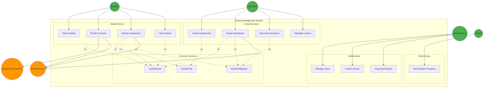

# Case Study: School Management System - Complete Use Case Model

## System Overview

The School Management System facilitates course administration, student enrollment, assignment submission, grading, and progress tracking for diploma-level software development programs.

---

## Complete Actor Catalog

### Primary Actors

**1. Student**
- **Description:** Enrolled learner accessing courses and submitting work
- **Goals:** Learn content, complete assignments, track progress
- **Characteristics:** 18-25 age range, varying technical skills
- **Volume:** 100-500 students per semester

**2. Instructor**
- **Description:** Faculty teaching courses and evaluating students
- **Goals:** Deliver content, assess learning, provide feedback
- **Characteristics:** Subject matter experts, busy schedules
- **Volume:** 10-30 instructors

**3. Administrator**
- **Description:** Staff managing system operations and user accounts
- **Goals:** Maintain system, generate reports, support users
- **Characteristics:** Technical proficiency, administrative authority
- **Volume:** 2-5 administrators

**4. Parent/Guardian**
- **Description:** Family member monitoring student progress
- **Goals:** Stay informed, communicate with instructors
- **Characteristics:** Non-technical users, limited access
- **Volume:** 50-300 parents

### Secondary Actors

**5. Email Service**
- **Type:** External system
- **Purpose:** Deliver notifications and confirmations
- **Integration:** SMTP API

**6. Student Information System (SIS)**
- **Type:** External system
- **Purpose:** Provide enrollment and demographic data
- **Integration:** REST API

---

## Complete Use Case Catalog

### Student Use Cases (10)

| ID | Use Case Name | Priority | Frequency |
|----|---------------|----------|-----------|
| UC-001 | View Course Catalog | High | Daily |
| UC-002 | Enroll in Course | High | Weekly |
| UC-003 | Submit Assignment | High | Daily |
| UC-004 | View Grades | High | Daily |
| UC-005 | Drop Course | Medium | Monthly |
| UC-006 | View Course Schedule | High | Daily |
| UC-007 | Download Course Materials | High | Daily |
| UC-008 | Send Message to Instructor | Medium | Weekly |
| UC-009 | Update Profile | Low | Semester |
| UC-010 | Request Grade Review | Medium | Monthly |

### Instructor Use Cases (8)

| ID | Use Case Name | Priority | Frequency |
|----|---------------|----------|-----------|
| UC-011 | Create Assignment | High | Weekly |
| UC-012 | Grade Submission | High | Daily |
| UC-013 | Post Announcement | High | Weekly |
| UC-014 | Manage Course Content | High | Weekly |
| UC-015 | View Student Roster | High | Daily |
| UC-016 | Generate Grade Report | Medium | Monthly |
| UC-017 | Respond to Messages | Medium | Daily |
| UC-018 | Configure Course Settings | Medium | Semester |

### Administrator Use Cases (6)

| ID | Use Case Name | Priority | Frequency |
|----|---------------|----------|-----------|
| UC-019 | Manage User Accounts | High | Weekly |
| UC-020 | Create Course | High | Semester |
| UC-021 | Generate System Reports | High | Weekly |
| UC-022 | Configure System Settings | Medium | Monthly |
| UC-023 | Monitor System Activity | Medium | Daily |
| UC-024 | Backup System Data | High | Daily |

### Parent Use Cases (3)

| ID | Use Case Name | Priority | Frequency |
|----|---------------|----------|-----------|
| UC-025 | View Student Progress | High | Weekly |
| UC-026 | View Student Schedule | High | Weekly |
| UC-027 | Contact Instructor | Medium | Monthly |

### Shared/Common Use Cases (3)

| ID | Use Case Name | Used By | Type |
|----|---------------|---------|------|
| UC-028 | Authenticate User | All primary actors | Included |
| UC-029 | Upload File | Students, Instructors | Included |
| UC-030 | Send Notification | System-triggered | Included |

---

## Sample Fully-Dressed Use Cases

### UC-003: Submit Assignment (Complete Example)

*See section 3.5 for full detailed description*

**Summary:**
Student submits completed coursework before deadline. System validates, stores, and confirms submission.

---

### UC-012: Grade Submission

```
USE CASE: Grade Submission
ID: UC-012
ACTORS: Primary: Instructor, Secondary: Email Service, Student
DESCRIPTION: Instructor evaluates student assignment and provides grade with feedback

PRECONDITIONS:
- Instructor is logged in
- Assignment has been submitted by student
- Instructor has permission to grade this course
- Assignment deadline has passed

POSTCONDITIONS (Success):
- Grade recorded in system
- Feedback saved with submission
- Student notified via email
- Grade visible to student

TRIGGER: Instructor selects ungraded submission

MAIN SUCCESS SCENARIO:
1. Instructor navigates to course gradebook
2. System displays list of submissions requiring grading
3. Instructor selects specific submission
4. System displays student submission with assignment details
5. System provides grading interface with rubric
6. Instructor downloads/views submitted file
7. Instructor enters numerical grade (0-100)
8. Instructor selects or enters grade level (A, B, C, D, F)
9. Instructor writes feedback comments
10. Instructor clicks "Submit Grade"
11. System validates grade is within valid range
12. System saves grade and feedback
13. System updates grade calculations
14. System sends notification email to student
15. System marks submission as "Graded"
16. System displays confirmation with next ungraded submission
17. Use case ends successfully

ALTERNATIVE FLOWS:
A1: Use rubric for grading (step 7)
  7a. Instructor clicks "Use Rubric"
  7b. System displays rubric criteria with point values
  7c. Instructor scores each criterion
  7d. System calculates total automatically
  7e. Continue to step 9

A2: Request revision (step 10)
  10a. Instructor selects "Request Revision" instead
  10b. Instructor enters revision requirements
  10c. System marks submission as "Needs Revision"
  10d. System notifies student with feedback
  10e. Use case ends (student can resubmit)

A3: Batch grading mode (step 3)
  3a. Instructor selects multiple submissions
  3b. System enables batch operations
  3c. Instructor can apply same grade/feedback to all
  3d. System prompts for confirmation
  3e. Continue with individual validation

EXCEPTION FLOWS:
E1: Invalid grade value (step 11)
  11a. System detects grade outside 0-100 range
  11b. System displays error: "Grade must be between 0 and 100"
  11c. Grade field highlighted in red
  11d. Return to step 7

E2: Missing required feedback (step 11)
  11a. System detects failing grade (<60) without feedback
  11b. System displays warning: "Feedback required for failing grades"
  11c. Feedback field marked as required
  11d. Return to step 9

E3: Submission file missing (step 6)
  6a. System cannot locate submitted file
  6b. System displays error: "File not found"
  6c. System logs error for administrator
  6d. Instructor can either:
      - Request resubmission from student
      - Contact administrator
  6e. Use case terminates

BUSINESS RULES:
BR1: Grades must be 0-100 (percentage)
BR2: Grade letters: A (90-100), B (80-89), C (70-79), D (60-69), F (<60)
BR3: Failing grades require written feedback (min 50 characters)
BR4: Grades cannot be changed after 48 hours without admin approval
BR5: Students cannot view grades until instructor releases them
BR6: Late submissions automatically flagged (10% penalty per day)

SPECIAL REQUIREMENTS:
SR1: Grading interface must load in under 3 seconds
SR2: File preview must support PDF, DOC, DOCX, images
SR3: All grade data encrypted at rest and in transit
SR4: Audit trail maintained for all grade changes
SR5: Mobile-responsive interface for tablet grading
```

---

### UC-002: Enroll in Course (Brief)

```
USE CASE: Enroll in Course
ID: UC-002
ACTORS: Primary: Student, Secondary: Email Service, SIS

Main Scenario:
1. Student browses course catalog
2. System displays available courses with details
3. Student selects desired course
4. System checks prerequisites via SIS
5. System verifies seat availability
6. System enrolls student
7. System sends confirmation email
8. Use case ends

Alternative: Waitlist if full (step 5)
Exception: Prerequisites not met (step 4)
```

---

## Use Case Diagram



---

## User Story Backlog (Sample)

### Epic 1: Course Enrollment
- US-001: As a student, I want to browse available courses so I can see what's offered
- US-002: As a student, I want to search courses by keyword so I can find specific topics
- US-003: As a student, I want to view course prerequisites so I know if I'm eligible
- US-004: As a student, I want to enroll in courses so I can attend classes
- US-005: As a student, I want to join a waitlist when course is full so I can enroll if space opens

### Epic 2: Assignment Management
- US-006: As a student, I want to view assignment details so I understand requirements
- US-007: As a student, I want to upload my completed work so I can submit assignments
- US-008: As a student, I want to save draft submissions so I can finish later
- US-009: As an instructor, I want to create assignments with rubrics so students know expectations
- US-010: As an instructor, I want to grade submissions efficiently so I can provide timely feedback

### Epic 3: Progress Tracking
- US-011: As a student, I want to view my grades so I can track my performance
- US-012: As a student, I want to see grade calculations so I understand my standing
- US-013: As a parent, I want to view my child's progress so I can support their learning
- US-014: As an instructor, I want to generate grade reports so I can analyze class performance

---

## Traceability Matrix

| Requirement | Use Case | User Story | Priority |
|-------------|----------|------------|----------|
| FR-001: Online enrollment | UC-002 | US-001-005 | High |
| FR-005: Assignment submission | UC-003 | US-006-008 | High |
| FR-008: Grading system | UC-012 | US-010 | High |
| NFR-001: Response time <3s | All | - | High |
| NFR-003: Email notifications | UC-003, UC-012 | - | Medium |

---

*This complete use case model serves as the foundation for Chapter 4 (Object-Oriented Analysis) where we'll identify classes and relationships from these use cases.*
