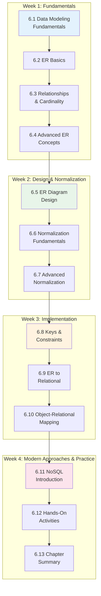
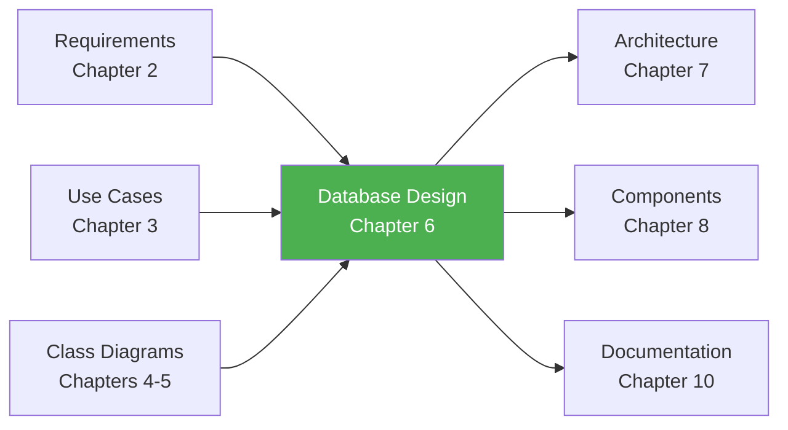

# Chapter 6: Database Design and Data Modeling

## 📖 Overview

Congratulations on reaching Chapter 6! Now that you've mastered requirements engineering, use case modeling, object-oriented analysis, and UML modeling, it's time to tackle one of the most critical aspects of software design: **how your application stores and retrieves data**.

A well-designed database is the foundation of any successful software system. Poor database design leads to data inconsistencies, slow performance, difficult maintenance, and frustrated users. Great database design enables your application to scale, perform efficiently, and maintain data integrity for years to come.

**Why This Chapter Matters:**
- 80% of enterprise applications are database-centric
- Database design decisions are expensive to change later
- Data integrity issues can cause serious business problems
- Understanding databases is essential for any software professional
- ER diagrams are a standard deliverable in software projects

---

## 🎯 Learning Objectives

By the end of this chapter, you will be able to:

1. **Design** efficient and normalized database schemas
2. **Create** Entity-Relationship (ER) diagrams using standard notation
3. **Identify** entities, attributes, and relationships from requirements
4. **Apply** normalization rules (1NF through BCNF)
5. **Understand** when denormalization is appropriate
6. **Implement** primary keys, foreign keys, and constraints
7. **Map** class diagrams to relational database tables
8. **Create** data dictionaries for documentation
9. **Recognize** NoSQL alternatives and when to use them
10. **Design** databases that support complex business rules

---

## 📚 Chapter Contents

### Core Learning Materials (11 sections)

| Section | Title | Duration | Description |
|---------|-------|----------|-------------|
| 6.1 | [Data Modeling Fundamentals](./6_1-data-modeling-fundamentals.md) | 30 min | What is data modeling? Types, purposes, and the three-schema architecture |
| 6.2 | [Entity-Relationship Basics](./6_2-er-basics.md) | 35 min | Entities, attributes, attribute types, and basic ER notation |
| 6.3 | [Relationships and Cardinality](./6_3-relationships-cardinality.md) | 40 min | One-to-one, one-to-many, many-to-many, participation constraints |
| 6.4 | [Advanced ER Concepts](./6_4-advanced-er-concepts.md) | 35 min | Weak entities, identifying relationships, generalization/specialization |
| 6.5 | [ER Diagram Design](./6_5-er-diagram-design.md) | 45 min | Creating ER diagrams from requirements, School System case study |
| 6.6 | [Normalization Fundamentals](./6_6-normalization-fundamentals.md) | 40 min | 1NF, 2NF, 3NF with step-by-step examples |
| 6.7 | [Advanced Normalization](./6_7-advanced-normalization.md) | 35 min | BCNF, 4NF, denormalization trade-offs |
| 6.8 | [Keys and Constraints](./6_8-keys-constraints.md) | 35 min | Primary keys, foreign keys, unique, check, and referential integrity |
| 6.9 | [ER to Relational Mapping](./6_9-er-to-relational.md) | 40 min | Converting ER diagrams to database tables step-by-step |
| 6.10 | [Object-Relational Mapping](./6_10-object-relational-mapping.md) | 35 min | Mapping class diagrams to databases, ORM concepts |
| 6.11 | [NoSQL Introduction](./6_11-nosql-introduction.md) | 30 min | Document, key-value, graph databases; when to use what |

### Practice & Assessment

| Section | Title | Duration | Description |
|---------|-------|----------|-------------|
| 6.12 | [Hands-On Activities](./6_12-hands-on-activities.md) | 90 min | 7 practical exercises with step-by-step solutions |
| 6.13 | [Chapter Summary](./6_13-chapter-summary.md) | 30 min | Key concepts recap, quiz, and assessment preparation |

### Supplementary Materials

| Resource | Description |
|----------|-------------|
| [Data Dictionary Template](./6_template-data-dictionary.md) | Standard template for documenting tables and columns |
| [School System Database](./6_case-study-school-database.md) | Complete database design for our ongoing case study |
| [Quick Reference Card](./6_quick-reference.md) | One-page summary of notation and rules |

---

## 🗺️ Chapter Roadmap

---

## 🔗 Prerequisites

Before starting this chapter, ensure you understand:

**From Chapter 1: SDLC**
- ✅ Software development lifecycle phases
- ✅ Where design fits in the process

**From Chapter 2: Requirements**
- ✅ Functional and non-functional requirements
- ✅ How to read requirements specifications

**From Chapter 3: Use Cases**
- ✅ Actors and use cases
- ✅ System boundary concept

**From Chapter 4: Object-Oriented Analysis**
- ✅ Classes, attributes, and methods
- ✅ Class relationships (association, aggregation, composition)
- ✅ UML class diagram notation

**From Chapter 5: UML Modeling**
- ✅ UML diagram basics
- ✅ Reading class diagrams

---

## 🔄 Connection to Other Chapters

### Builds On:
- **Chapter 2:** Requirements drive what data must be stored
- **Chapter 3:** Use cases reveal data needs for each interaction
- **Chapter 4:** Classes often map directly to database tables
- **Chapter 5:** Class diagrams provide input for database design

### Prepares For:
- **Chapter 7:** Architectural decisions about data layer
- **Chapter 8:** Component design includes data access patterns
- **Chapter 9:** UI design depends on data structures
- **Chapter 10:** Technical documentation includes database specs

---

## 🛠️ Tools You'll Use

### Required Tools

| Tool | Purpose | Access |
|------|---------|--------|
| **dbdiagram.io** | ER diagram creation | Free online: dbdiagram.io |
| **Draw.io** | General diagramming | Free online: draw.io |
| **SQLite** | Practice database | Free, built into many systems |

### Recommended Tools

| Tool | Purpose | Access |
|------|---------|--------|
| **MySQL Workbench** | Professional database design | Free download |
| **SQL Fiddle** | Online SQL practice | Free: sqlfiddle.com |
| **Lucidchart** | Professional diagrams | Free tier available |

---

## 📋 Chapter Deliverable

By completing this chapter, you will create:

### Complete Database Schema Package

**Components:**
1. **Entity-Relationship Diagram**
   - All entities identified from requirements
   - Proper relationships with cardinality
   - Primary and foreign keys indicated
   - Professional notation and layout

2. **Relational Schema**
   - Normalized tables (at least 3NF)
   - All constraints defined
   - Indexes for performance

3. **Data Dictionary**
   - Complete table documentation
   - Column specifications with data types
   - Business rules and constraints
   - Sample data examples

4. **Database Script**
   - CREATE TABLE statements
   - Constraints and relationships
   - Test data insertion

### School Management System Database
Throughout this chapter, we'll design the complete database for our ongoing School Management System project, including:
- User management (students, teachers, administrators, parents)
- Academic structure (classes, courses, sections)
- Grading and assessment
- Attendance tracking
- Communication system

---

## 💡 Study Tips

### For Visual Learners
- Draw every ER diagram by hand first, then use tools
- Create relationship maps on whiteboards
- Use color coding for different entity types
- Watch video tutorials on normalization

### For Hands-On Learners
- Create databases for every example
- Write SQL queries to test your designs
- Try different approaches and compare
- Break things on purpose to understand constraints

### For Conceptual Learners
- Understand WHY normalization rules exist
- Study real-world database schemas
- Connect database concepts to OOP concepts
- Trace data through entire use cases

### Best Practices
1. **Start simple** - Begin with obvious entities
2. **Iterate** - Database design improves through refinement
3. **Verify with data** - Test designs with realistic data
4. **Consider queries** - Think about how data will be accessed
5. **Document everything** - Future you will thank present you
6. **Review with stakeholders** - Ensure data model matches business

---

## ⚠️ Common Mistakes to Avoid

| Mistake | Consequence | Prevention |
|---------|-------------|------------|
| No normalization | Data redundancy, update anomalies | Apply normal forms systematically |
| Over-normalization | Poor query performance | Know when to denormalize |
| Missing constraints | Data integrity issues | Define all business rules as constraints |
| Unclear naming | Maintenance nightmares | Use consistent naming conventions |
| Ignoring indexes | Slow queries | Design indexes during schema creation |
| Skipping data dictionary | Knowledge loss | Document as you design |

---

## 📊 Assessment Criteria

Your database design will be evaluated on:

| Criterion | Weight | Description |
|-----------|--------|-------------|
| **Completeness** | 20% | All required entities and relationships |
| **Normalization** | 20% | Proper application of normal forms |
| **Integrity** | 20% | Keys, constraints, and referential integrity |
| **Documentation** | 15% | Clear data dictionary and comments |
| **Accuracy** | 15% | Correct ER notation and mapping |
| **Performance** | 10% | Appropriate indexes and design choices |

---

## 🚀 Ready to Begin?

Database design transforms your understanding of what the system needs to do (requirements) into how data will be structured and stored. This is where abstract concepts become concrete designs that developers can implement.

**Let's start designing databases!**

### 👉 **[Proceed to Section 6.1: Data Modeling Fundamentals →](./6_1-data-modeling-fundamentals.md)**

---

**Previous Chapter:** [← Chapter 5: System Modeling with UML](../chapter-05/chapter-05-README.md)

**Next Chapter:** [Chapter 7: Architectural Design Patterns →](../chapter-07/chapter-07-README.md)

**Course Home:** [Back to Course Overview](../README.md)

---

*Last Updated: December 2024*  
*Version: 1.0*  
*Estimated Study Time: 8-10 hours*  
*Hands-on Practice: 4-5 hours*
