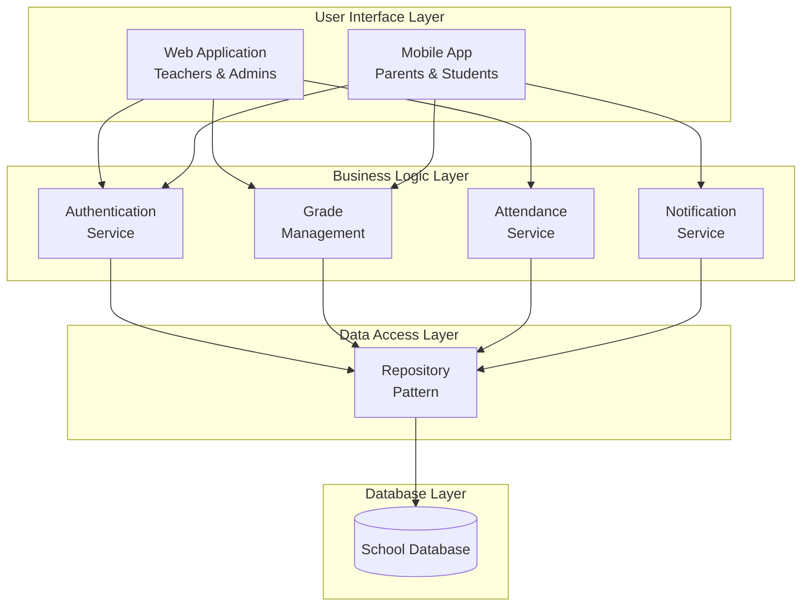
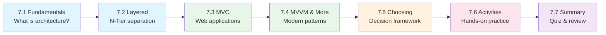

# Chapter 7: Architectural Design Patterns

## SA2025 - Software Analysis and Design

---

## 📋 Chapter Overview

**Welcome to Chapter 7!** In this chapter, you'll learn how to design the high-level structure of software systems using proven architectural patterns. Understanding architecture is crucial—it's the foundation that determines how your system will scale, perform, and evolve over time.

**Why This Matters:**
Every successful software system has a well-thought-out architecture. Whether you're building a simple web application or a complex enterprise system, choosing the right architectural pattern is one of the most important decisions you'll make.

---

## 🎯 Learning Objectives

By the end of this chapter, you will be able to:

1. **Understand** what software architecture is and why it matters
2. **Identify** common architectural patterns and their characteristics
3. **Apply** the Layered (N-Tier) architecture to organize code
4. **Implement** MVC and MVVM patterns for user interface applications
5. **Choose** appropriate architectures for different application types
6. **Recognize** architectural trade-offs and make informed decisions
7. **Create** architectural diagrams to communicate designs

---

## 📚 Chapter Contents

| Section | Topic | Time | Description |
|---------|-------|------|-------------|
| 7.1 | [Architecture Fundamentals](./7_1-architecture-fundamentals.md) | 25 min | What is architecture? Why does it matter? |
| 7.2 | [Layered Architecture](./7_2-layered-architecture.md) | 30 min | N-Tier architecture and separation of concerns |
| 7.3 | [MVC Pattern](./7_3-mvc-pattern.md) | 30 min | Model-View-Controller for web applications |
| 7.4 | [MVVM and Other Patterns](./7_4-mvvm-other-patterns.md) | 25 min | MVVM, Repository, and modern patterns |
| 7.5 | [Choosing an Architecture](./7_5-choosing-architecture.md) | 20 min | Decision framework and trade-offs |
| 7.6 | [Hands-On Activities](./7_6-hands-on-activities.md) | 45 min | Practical exercises |
| 7.7 | [Chapter Summary](./7_7-chapter-summary.md) | 15 min | Review, quiz, and assessment prep |

**Total Estimated Time:** 3-4 hours

---

## 🔗 Prerequisites

Before starting this chapter, ensure you have completed:

- **Chapter 1:** SDLC fundamentals
- **Chapter 4:** Object-Oriented Analysis (classes, objects, relationships)
- **Chapter 5:** UML Modeling (class diagrams, sequence diagrams)
- **Chapter 6:** Database Design (entity relationships)

**Recommended Skills:**
- Basic understanding of web applications
- Familiarity with at least one programming language
- Understanding of client-server concepts

---

## 🏫 School Management System Connection

Throughout this chapter, we'll apply architectural patterns to our School Management System:

**Architecture Goals for Our System:**
- **Separation of Concerns:** Each layer has a specific responsibility
- **Maintainability:** Easy to modify one part without affecting others
- **Testability:** Each component can be tested independently
- **Scalability:** Can handle growing number of users

---

## 🛠️ Tools You'll Need

| Tool | Purpose | Where to Get It |
|------|---------|-----------------|
| Draw.io/Lucidchart | Architecture diagrams | draw.io (free) |
| Visual Studio/VS Code | Code examples | code.visualstudio.com |
| Web browser | Testing examples | Already installed |

---

## 📖 How to Use This Chapter

### Recommended Approach

1. **Read sequentially** - Concepts build on each other
2. **Study the diagrams** - Visual understanding is crucial
3. **Try the code examples** - Even if you don't code, read them
4. **Complete the activities** - Hands-on practice reinforces learning
5. **Take the quiz** - Test your understanding

### Time Investment

| Activity | Minimum | Recommended |
|----------|---------|-------------|
| Reading all sections | 2 hours | 3 hours |
| Hands-on activities | 30 min | 45 min |
| Quiz and review | 15 min | 30 min |
| **Total** | **2.75 hours** | **4 hours** |

---

## 🎯 Chapter Deliverables

By the end of this chapter, you should be able to produce:

1. **Architectural Diagram** showing your project's structure
2. **Layer Specification** describing responsibilities of each layer
3. **Pattern Justification** explaining why you chose specific patterns
4. **Component Overview** showing major components and their interactions

---

## 💡 Key Concepts Preview

### What is Software Architecture?

> "Software architecture is the fundamental organization of a system, embodied in its components, their relationships to each other and the environment, and the principles governing its design and evolution."
> — IEEE Standard 1471-2000

**Simply put:** Architecture is the high-level structure that determines how your system is organized and how its parts work together.

### Why Architecture Matters

| Good Architecture | Poor Architecture |
|-------------------|-------------------|
| Easy to understand | Confusing structure |
| Simple to modify | Changes cause ripple effects |
| Scalable | Performance bottlenecks |
| Testable | Hard to test in isolation |
| Secure | Security vulnerabilities |

---

## 📊 Chapter at a Glance

---

## 🚀 Let's Begin!

Ready to learn about software architecture? 

**Start with:** [Section 7.1: Architecture Fundamentals →](./7_1-architecture-fundamentals.md)

---

## 📚 Quick Reference

### Patterns Covered in This Chapter

| Pattern | Best For | Key Benefit |
|---------|----------|-------------|
| **Layered (N-Tier)** | Enterprise applications | Separation of concerns |
| **MVC** | Web applications | Clear UI/logic separation |
| **MVVM** | Desktop/mobile apps | Data binding support |
| **Repository** | Data access | Abstraction from database |
| **Microservices** | Large systems | Independent deployment |

### Common Architectural Decisions

1. **Monolith vs. Distributed** - Start monolith, evolve as needed
2. **Which pattern?** - Depends on application type and team skills
3. **How many layers?** - Typically 3-4 for most applications
4. **Where to put logic?** - Business logic in middle tier, not UI or database

---

**Course Home:** [← Back to Course Overview](../software-analysis-design-course.md)

**Previous Chapter:** [← Chapter 6: Database Design](./chapter-06-README.md)

**Next Chapter:** [Chapter 8: Detailed Design →](./chapter-08-README.md)

---

*Chapter Version: 1.0*  
*Last Updated: January 2026*  
*Author: SA2025 Course Team*
