# 8.1 Component Design Fundamentals

[← Back to Chapter 8](./chapter-08-README.md) | [Next: 8.2 Cohesion and Coupling →](./8_2-cohesion-coupling.md)

---

## Learning Objectives

- Understand what software components are and why they matter
- Learn strategies for decomposing systems into components
- Identify characteristics of well-designed components
- Apply component thinking to the School Management System

**Estimated Time:** 30 minutes

---

## What is a Component?

### Definition

A **software component** is a modular, reusable, and replaceable unit of software that encapsulates a set of related functions and data.

Think of components like LEGO blocks: each block has a specific shape and purpose, connects to other blocks through standardized interfaces, and can be combined to build larger structures.

### Component vs. Class vs. Module

| Concept | Granularity | Purpose | Example |
|---------|-------------|---------|---------|
| **Class** | Fine | Blueprint for objects | `Student`, `Grade` |
| **Module** | Medium | Group of related classes | `GradeCalculations.cs` |
| **Component** | Coarse | Deployable unit with interface | Grade Management Service |

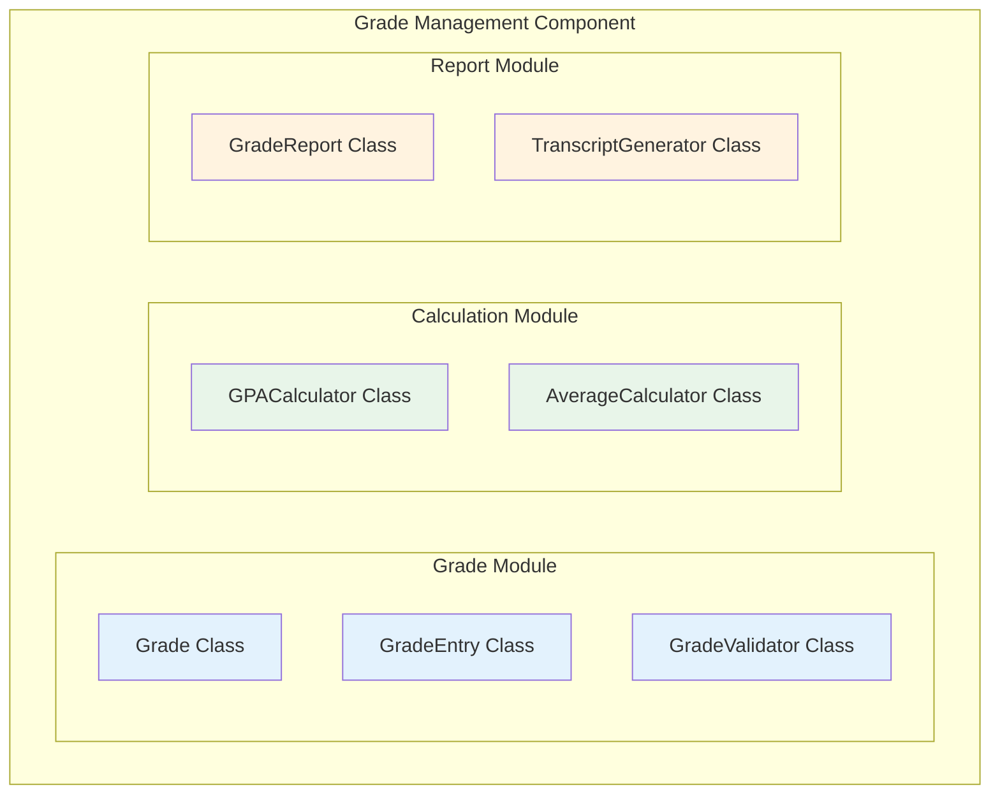

---

## Why Component-Based Design?

### The Problem with Monolithic Code

```
❌ Monolithic Application
┌─────────────────────────────────────────────────┐
│  Everything mixed together:                      │
│  - Student data handling                         │
│  - Grade calculations                            │
│  - Report generation                             │
│  - Email notifications                           │
│  - User authentication                           │
│  - Payment processing                            │
│                                                  │
│  Problems:                                       │
│  • Change one thing = risk breaking everything   │
│  • Can't test parts in isolation                 │
│  • Can't reuse functionality                     │
│  • Hard for teams to work in parallel            │
└─────────────────────────────────────────────────┘
```

### The Component Solution

```
✅ Component-Based Application
┌─────────────┐  ┌─────────────┐  ┌─────────────┐
│   Student   │  │    Grade    │  │   Report    │
│  Component  │  │  Component  │  │  Component  │
├─────────────┤  ├─────────────┤  ├─────────────┤
│ Interface   │  │ Interface   │  │ Interface   │
└──────┬──────┘  └──────┬──────┘  └──────┬──────┘
       │                │                │
       └────────────────┴────────────────┘
                        │
              ┌─────────┴─────────┐
              │   Orchestration   │
              └───────────────────┘

Benefits:
• Change one component without affecting others
• Test components in isolation
• Reuse components in other systems
• Teams work on different components
```

### Benefits of Component Design

| Benefit | Description | Real-World Impact |
|---------|-------------|-------------------|
| **Reusability** | Components can be used in multiple systems | Build faster, consistent quality |
| **Maintainability** | Changes isolated to single component | Faster bug fixes, lower risk |
| **Testability** | Test components independently | Better quality, faster testing |
| **Scalability** | Scale individual components | Cost-effective infrastructure |
| **Team Parallelism** | Teams work on different components | Faster delivery |
| **Replaceability** | Swap implementations without system changes | Technology flexibility |

---

## Component Characteristics

### The CRISP Qualities

Well-designed components should be **CRISP**:

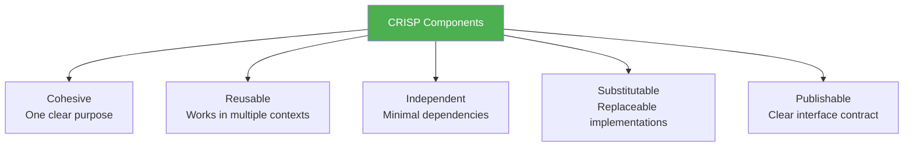

### 1. Cohesive

A component should have a **single, clear purpose**:

```
✅ Good: GradeCalculationComponent
   - Calculates final grades
   - Computes GPA
   - Determines grade letters

❌ Bad: StudentEverythingComponent
   - Student CRUD
   - Grade calculations
   - Report generation
   - Email notifications
```

### 2. Reusable

Components should work in **multiple contexts** without modification:

```csharp
// ✅ Reusable: Works for any entity
public interface IRepository<T>
{
    T GetById(int id);
    IEnumerable<T> GetAll();
    void Add(T entity);
    void Update(T entity);
    void Delete(int id);
}

// ❌ Not Reusable: Too specific to one use case
public class StudentGradeReportForSpring2025
{
    public void GenerateReportForStudentInMs {
    ...
    }
}
```

### 3. Independent

Components should have **minimal dependencies** on other components:

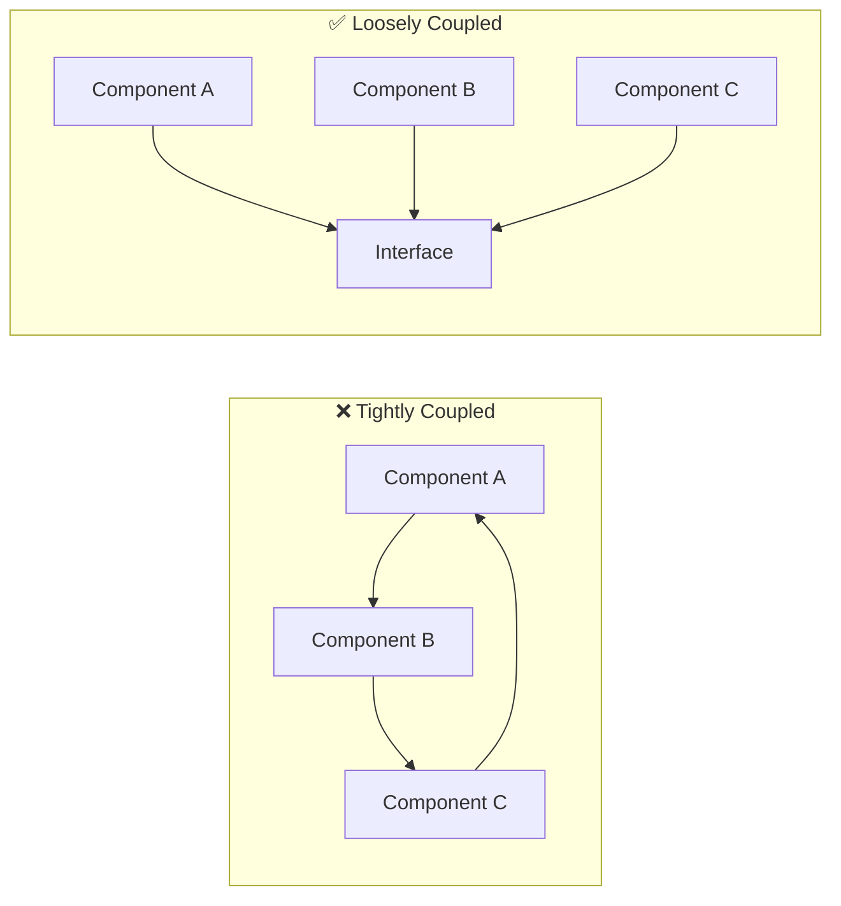

### 4. Substitutable

You should be able to **swap implementations** without changing dependent code:

```csharp
// Interface defines the contract
public interface INotificationService
{
    void SendNotification(string userId, string message);
}

// Implementation 1: Email
public class EmailNotificationService : INotificationService
{
    public void SendNotification(string userId, string message)
    {
        // Send via email
    }
}

// Implementation 2: SMS (can substitute without changing callers)
public class SmsNotificationService : INotificationService
{
    public void SendNotification(string userId, string message)
    {
        // Send via SMS
    }
}
```

### 5. Publishable

Components should have a **clear, documented interface**:

```csharp
/// <summary>
/// Manages grade calculations for students.
/// </summary>
public interface IGradeService
{
    /// <summary>
    /// Calculate final grade for a student in a course.
    /// </summary>
    /// <param name="studentId">The student's unique identifier</param>
    /// <param name="courseId">The course identifier</param>
    /// <returns>Final grade (0-100) or null if insufficient data</returns>
    /// <exception cref="StudentNotFoundException">If student doesn't exist</exception>
    decimal? CalculateFinalGrade(int studentId, int courseId);
    
    /// <summary>
    /// Calculate GPA for a student across all courses.
    /// </summary>
    decimal CalculateGPA(int studentId);
}
```

---

## Decomposition Strategies

How do you break a system into components? Here are four proven strategies:

### Strategy 1: By Business Capability

Organize components around **what the business does**:

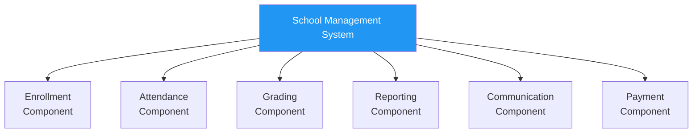

**When to use:** Most applications. Aligns with how the business thinks.

**School System Example:**
- Enrollment handles admissions, registrations, withdrawals
- Attendance handles daily tracking, reports, alerts
- Grading handles assignments, exams, calculations

### Strategy 2: By Domain Entity

Organize components around **core business entities**:

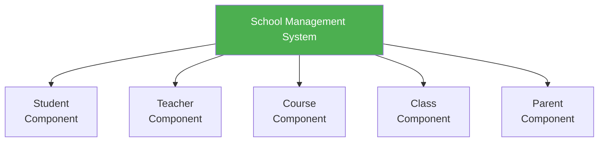

**When to use:** Systems with clear, distinct entities that need independent management.

**Caution:** Can lead to "CRUD components" that don't capture business logic well.

### Strategy 3: By Layer

Organize components by **technical responsibility**:

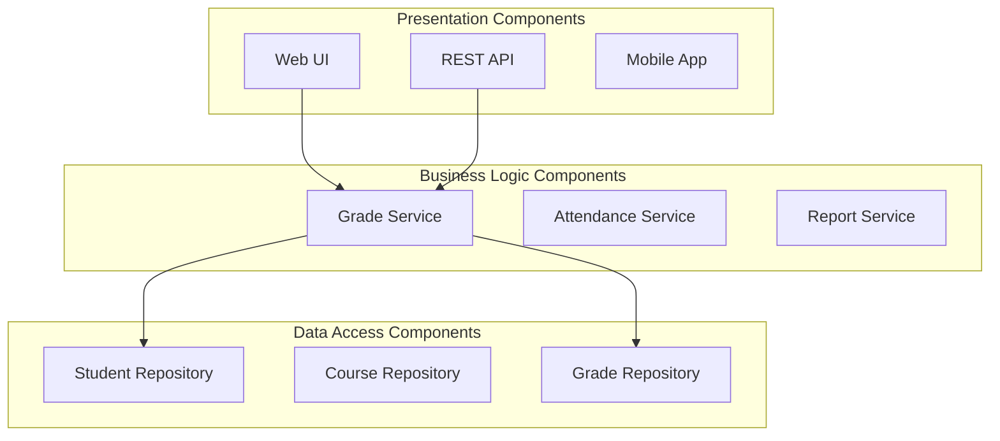

**When to use:** Often combined with other strategies. Good for clear separation of concerns.

### Strategy 4: By Volatility

Organize to **isolate parts that change frequently**:

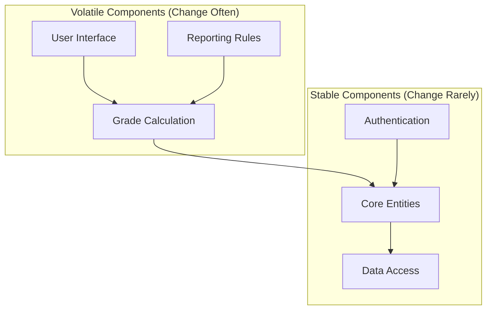

**When to use:** When you know some requirements change often. Protects stable code from frequent modifications.

---

## Component Interfaces

### What is an Interface?

An interface is the **contract** that defines how other components interact with yours. It specifies:

- **What operations** are available
- **What inputs** are required
- **What outputs** are returned
- **What errors** can occur

### Provided vs. Required Interfaces

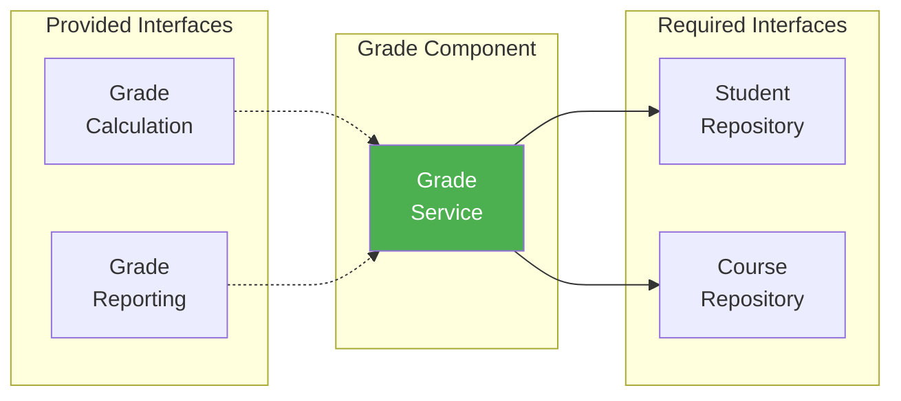

**Provided Interface:** What this component offers to others
**Required Interface:** What this component needs from others

### Interface Design Example

```csharp
// Provided Interface - what this component offers
public interface IGradeComponent
{
    // Grade Entry Operations
    void RecordGrade(int studentId, int assignmentId, decimal score);
    void UpdateGrade(int gradeId, decimal newScore, string reason);
    
    // Grade Calculation Operations
    decimal CalculateCourseGrade(int studentId, int courseId);
    decimal CalculateGPA(int studentId);
    GradeLetter GetLetterGrade(decimal percentage);
    
    // Grade Reporting Operations
    GradeReport GenerateStudentReport(int studentId);
    ClassGradeSummary GenerateClassReport(int classId);
}

// Required Interface - what this component needs
public interface IStudentRepository
{
    Student GetById(int studentId);
    IEnumerable<Student> GetByClass(int classId);
}

public interface ICourseRepository
{
    Course GetById(int courseId);
    GradeWeight GetGradeWeights(int courseId);
}
```

---

## School Management System: Component Decomposition

Let's apply component thinking to our case study:

### High-Level Components

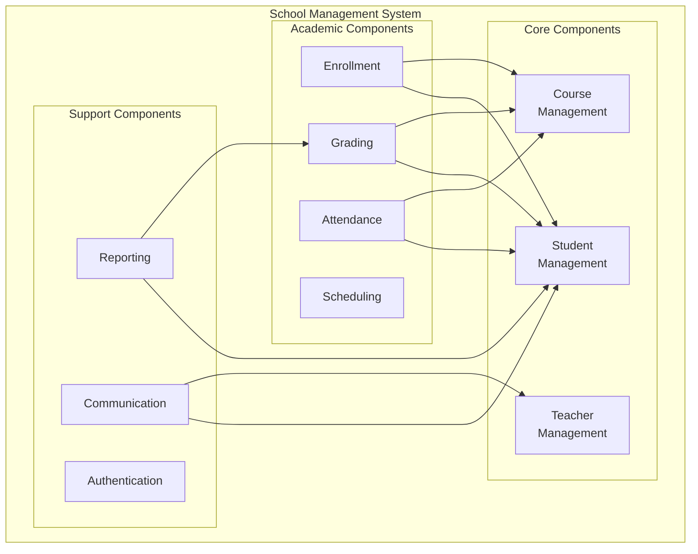

### Grade Component Deep Dive

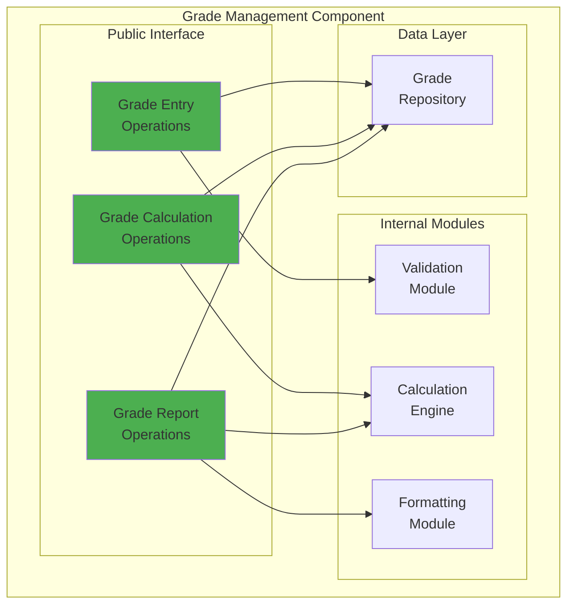

### Component Specification Example

Here's a partial specification for the Grading Component:

```
┌─────────────────────────────────────────────────────────┐
│ COMPONENT SPECIFICATION                                  │
├─────────────────────────────────────────────────────────┤
│ Name: Grade Management Component                         │
│ Version: 1.0                                             │
│ Owner: Academic Team                                     │
├─────────────────────────────────────────────────────────┤
│ PURPOSE                                                  │
│ Manages all grade-related operations including entry,    │
│ calculation, and reporting for the School Management     │
│ System.                                                  │
├─────────────────────────────────────────────────────────┤
│ PROVIDED INTERFACES                                      │
│ • IGradeEntry - Record and modify grades                 │
│ • IGradeCalculation - Calculate finals, GPA              │
│ • IGradeReport - Generate reports and transcripts        │
├─────────────────────────────────────────────────────────┤
│ REQUIRED INTERFACES                                      │
│ • IStudentRepository - Student data access               │
│ • ICourseRepository - Course and weight configuration    │
│ • IAssignmentRepository - Assignment details             │
├─────────────────────────────────────────────────────────┤
│ QUALITY ATTRIBUTES                                       │
│ • Performance: Calculate GPA in < 500ms                  │
│ • Accuracy: Grade calculations 100% accurate             │
│ • Audit: All grade changes logged with user and reason   │
└─────────────────────────────────────────────────────────┘
```

---

## Common Decomposition Mistakes

### Mistake #1: Too Many Small Components

```
❌ Problem: "Nano-services"
   - StudentNameComponent
   - StudentAddressComponent  
   - StudentPhoneComponent
   - StudentEmailComponent
   
   Result: Massive integration overhead, network calls for simple operations

✅ Fix: Group related functionality
   - StudentComponent (handles all student data)
```

### Mistake #2: God Components

```
❌ Problem: One component does everything
   - SchoolSystemComponent
     (enrollment, grading, attendance, reports, communication, payments...)
   
   Result: Changes are risky, can't scale, can't test

✅ Fix: Decompose by business capability
   - EnrollmentComponent
   - GradingComponent
   - AttendanceComponent
   - etc.
```

### Mistake #3: Circular Dependencies

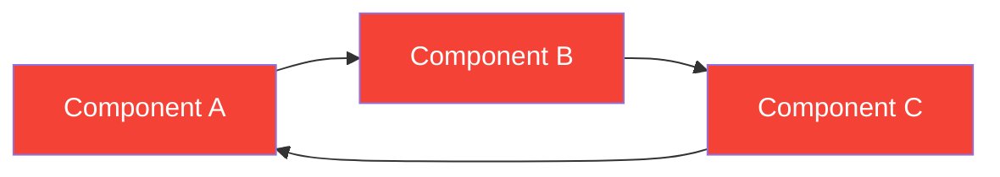

**Problem:** A needs B needs C needs A → Can't deploy or test independently

**Fix:** Introduce an interface or mediator to break the cycle

### Mistake #4: Leaky Abstractions

```csharp
// ❌ Bad: Exposes internal implementation details
public interface IGradeService
{
    SqlConnection GetDatabaseConnection();  // Why would caller need this?
    DataTable GetRawGradeData();            // Exposes internal storage format
}

// ✅ Good: Clean abstraction
public interface IGradeService
{
    Grade GetGrade(int studentId, int assignmentId);
    IEnumerable<Grade> GetStudentGrades(int studentId);
}
```

---

## Key Takeaways

✅ **Components are the building blocks of systems**
- More than classes, less than entire systems
- Connected through well-defined interfaces

✅ **Good components are CRISP**
- Cohesive, Reusable, Independent, Substitutable, Publishable

✅ **Multiple decomposition strategies exist**
- By business capability (most common)
- By domain entity
- By layer
- By volatility

✅ **Interfaces define the contract**
- Provided interfaces: what you offer
- Required interfaces: what you need
- Clear documentation essential

✅ **Avoid common mistakes**
- Too small (nano-services)
- Too large (god components)
- Circular dependencies
- Leaky abstractions

---

## Self-Check Questions

1. **What distinguishes a component from a class?**
   <details>
   <summary>Click to reveal answer</summary>
   A component is a larger, deployable unit that encapsulates multiple related classes and exposes a well-defined interface. Classes are fine-grained blueprints for objects; components are coarse-grained, reusable building blocks.
   </details>

2. **What does CRISP stand for in component design?**
   <details>
   <summary>Click to reveal answer</summary>
   Cohesive (single purpose), Reusable (works in multiple contexts), Independent (minimal dependencies), Substitutable (implementations can be swapped), Publishable (clear interface contract).
   </details>

3. **When would you use "decomposition by volatility"?**
   <details>
   <summary>Click to reveal answer</summary>
   When you know some parts of the system will change frequently (like UI or business rules) while others are stable. You isolate volatile parts so changes don't affect stable components.
   </details>

4. **What's wrong with this component design?**
   - StudentComponent
   - TeacherComponent
   - GradeCalculatorComponent
   - StudentGradeComponent
   
   <details>
   <summary>Click to reveal answer</summary>
   There's overlap and unclear boundaries. StudentGradeComponent likely duplicates functionality from GradeCalculatorComponent. Better: have a single GradeComponent that handles all grade operations, with clear interfaces to Student and Teacher components.
   </details>

---

## Practice Exercise

**Scenario:** Design components for an E-Commerce System with these features:
- Product catalog browsing
- Shopping cart
- User accounts
- Order processing
- Payment handling
- Inventory management
- Shipping/delivery tracking
- Customer reviews

**Task:**
1. Identify 5-7 major components
2. For each component, list its primary responsibilities
3. Draw a component diagram showing dependencies
4. Identify provided and required interfaces for the Order Processing component

<details>
<summary>Click for sample solution</summary>

**Components:**
1. **Catalog Component** - Product info, categories, search
2. **Cart Component** - Cart management, session handling
3. **User Component** - Accounts, profiles, authentication
4. **Order Component** - Order creation, status, history
5. **Payment Component** - Payment processing, refunds
6. **Inventory Component** - Stock levels, reservations
7. **Shipping Component** - Delivery tracking, carrier integration
8. **Review Component** - Customer reviews, ratings

**Order Component Interfaces:**

*Provided:*
- CreateOrder(cartId, userId) → Order
- GetOrderStatus(orderId) → OrderStatus
- CancelOrder(orderId) → bool

*Required:*
- ICartRepository - Get cart contents
- IInventoryService - Reserve/release stock
- IPaymentService - Process payment
- IShippingService - Create shipment
- INotificationService - Send confirmations

</details>

---

**Next:** [8.2 Cohesion and Coupling →](./8_2-cohesion-coupling.md)

---

*Estimated Reading Time: 30 minutes*
