# 8.2 Cohesion and Coupling

[← Previous: 8.1 Component Fundamentals](./8_1-component-fundamentals.md) | [Back to Chapter 8](./chapter-08-README.md) | [Next: 8.3 SOLID Principles →](./8_3-solid-principles.md)

---

## Learning Objectives

- Understand cohesion and why high cohesion is desirable
- Recognize the seven types of cohesion from best to worst
- Understand coupling and why loose coupling is desirable
- Identify different types of coupling
- Apply techniques to improve cohesion and reduce coupling

**Estimated Time:** 35 minutes

---

## The Two Pillars of Component Quality

Every component can be evaluated on two fundamental metrics:

```mermaid
graph LR
    subgraph "Component Quality"
        A[High Cohesion<br/>✓ Elements belong together]
        B[Low Coupling<br/>✓ Minimal dependencies]
    end
    
    C[Maintainable<br/>System] 
    
    A --> C
    B --> C
    
    style A fill:#4caf50,color:#fff
    style B fill:#4caf50,color:#fff
    style C fill:#2196f3,color:#fff
```



**The Goal:** High Cohesion + Low Coupling = Maintainable, Testable, Reusable Components

---

## What is Cohesion?

### Definition

**Cohesion** measures how closely related and focused the responsibilities of a single component are. High cohesion means everything in the component works toward a single purpose.

### The Cohesion Analogy

Think of a **toolbox**:

```
✅ High Cohesion: A toolkit for plumbing
   - Pipe wrench
   - Pipe cutter
   - Thread sealant
   - Plumber's tape
   Everything is related to plumbing!

❌ Low Cohesion: A junk drawer
   - Batteries
   - Old receipts
   - A screwdriver
   - Rubber bands
   - A phone charger
   Random stuff thrown together!
```

### Why High Cohesion Matters

| High Cohesion | Low Cohesion |
|---------------|--------------|
| Easy to name (single purpose) | Hard to name ("Utilities", "Helper") |
| Easy to understand | Confusing relationships |
| Easy to maintain | Changes ripple unpredictably |
| Easy to test | Tests are complex |
| Easy to reuse | Can't reuse parts |

---

## Types of Cohesion

Cohesion exists on a spectrum from **worst** (Coincidental) to **best** (Functional):

```mermaid
graph TB
    subgraph "Cohesion Types - Best to Worst"
        F[🟢 Functional<br/>BEST]
        S[🟢 Sequential]
        CM[🟡 Communicational]
        P[🟡 Procedural]
        T[🟠 Temporal]
        L[🔴 Logical]
        C[🔴 Coincidental<br/>WORST]
    end
    
    F --> S --> CM --> P --> T --> L --> C
```



### 1. Functional Cohesion (Best ✅)

**All elements contribute to a single, well-defined task.**

```csharp
// ✅ Functional Cohesion - Everything calculates GPA
public class GPACalculator
{
    public decimal CalculateGPA(IEnumerable<Grade> grades)
    {
        var totalPoints = CalculateTotalGradePoints(grades);
        var totalCredits = CalculateTotalCredits(grades);
        return totalPoints / totalCredits;
    }
    
    private decimal CalculateTotalGradePoints(IEnumerable<Grade> grades)
    {
        return grades.Sum(g => ConvertToPoints(g.Letter) * g.CreditHours);
    }
    
    private decimal CalculateTotalCredits(IEnumerable<Grade> grades)
    {
        return grades.Sum(g => g.CreditHours);
    }
    
    private decimal ConvertToPoints(GradeLetter letter)
    {
        // Convert A=4.0, B=3.0, etc.
    }
}
```

**Characteristics:**
- Can describe the component with a simple verb-noun phrase: "Calculate GPA"
- Removing any element would break the functionality
- Single reason to change

### 2. Sequential Cohesion (Good ✅)

**Output of one element is input to the next (pipeline).**

```csharp
// ✅ Sequential Cohesion - Data flows through stages
public class GradeReportGenerator
{
    public Report GenerateReport(int studentId)
    {
        var grades = FetchGrades(studentId);        // Step 1: Get data
        var calculated = CalculateStatistics(grades); // Step 2: Process
        var formatted = FormatReport(calculated);    // Step 3: Format
        return formatted;
    }
    
    private IEnumerable<Grade> FetchGrades(int studentId) { ... }
    private GradeStatistics CalculateStatistics(IEnumerable<Grade> grades) { ... }
    private Report FormatReport(GradeStatistics stats) { ... }
}
```

### 3. Communicational Cohesion (Acceptable ⚠️)

**Elements operate on the same data.**

```csharp
// ⚠️ Communicational - All work with student data
public class StudentDataManager
{
    private Student _student;
    
    public void LoadStudent(int id) { _student = db.GetStudent(id); }
    public void UpdateAddress(Address address) { _student.Address = address; }
    public void UpdatePhone(string phone) { _student.Phone = phone; }
    public void SaveStudent() { db.Save(_student); }
}
```

### 4. Procedural Cohesion (Weak ⚠️)

**Elements are related because they follow a specific sequence.**

```csharp
// ⚠️ Procedural - Steps in a process, but loosely related
public class SemesterStartup
{
    public void InitializeSemester()
    {
        BackupLastSemesterData();    // Related by timing, not function
        ResetAttendanceRecords();
        SendWelcomeEmails();
        GenerateSchedules();
    }
}
```

### 5. Temporal Cohesion (Poor ❌)

**Elements are grouped because they happen at the same time.**

```csharp
// ❌ Temporal - Only related by "happens at startup"
public class StartupInitializer
{
    public void OnApplicationStart()
    {
        InitializeLogger();
        LoadConfiguration();
        ConnectToDatabase();
        WarmupCache();
        SendHealthPing();
        CleanTempFolder();
    }
}
```

**Problem:** These have nothing in common except timing. Hard to name, test, or reuse.

### 6. Logical Cohesion (Poor ❌)

**Elements perform similar operations but are unrelated.**

```csharp
// ❌ Logical - All are "validators" but validate different things
public class Validators
{
    public bool ValidateEmail(string email) { ... }
    public bool ValidateStudentId(string id) { ... }
    public bool ValidateGrade(decimal grade) { ... }
    public bool ValidatePhoneNumber(string phone) { ... }
    public bool ValidateCourseCode(string code) { ... }
}
```

**Problem:** Unrelated validations grouped by category. Should be distributed to relevant components.

### 7. Coincidental Cohesion (Worst ❌)

**Elements have no meaningful relationship at all.**

```csharp
// ❌ Coincidental - Random stuff
public static class Utilities
{
    public static string FormatDate(DateTime date) { ... }
    public static decimal CalculateGPA(List<Grade> grades) { ... }
    public static void SendEmail(string to, string body) { ... }
    public static int GenerateRandomNumber() { ... }
    public static void LogError(Exception ex) { ... }
}
```

**Problem:** This is the "junk drawer" of code. Avoid at all costs!

---

## What is Coupling?

### Definition

**Coupling** measures how dependent components are on each other. Low coupling means components can be changed, tested, and deployed independently.

### The Coupling Analogy

Think of **appliances**:

```
✅ Low Coupling: A lamp plugged into an outlet
   - Lamp doesn't care what generates the electricity
   - Can swap the lamp without changing the outlet
   - Standard interface (plug)

❌ High Coupling: A hard-wired ceiling fan
   - Can't move without rewiring
   - Changes to wiring affect the fan
   - Must change both together
```

### Why Low Coupling Matters

| Low Coupling | High Coupling |
|--------------|---------------|
| Change A without changing B | Change A, must change B |
| Test components independently | Must test everything together |
| Reuse components elsewhere | Components locked together |
| Teams work independently | Teams constantly coordinating |
| Deploy components separately | Must deploy everything |

---

## Types of Coupling

From **best** (loosest) to **worst** (tightest):

```mermaid
graph TB
    subgraph "Coupling Types - Best to Worst"
        M[🟢 Message Coupling<br/>BEST]
        D[🟢 Data Coupling]
        S[🟡 Stamp Coupling]
        CT[🟠 Control Coupling]
        E[🔴 External Coupling]
        CM[🔴 Common Coupling]
        CN[🔴 Content Coupling<br/>WORST]
    end
    
    M --> D --> S --> CT --> E --> CM --> CN
```



### 1. Message Coupling (Best ✅)

**Components communicate only through messages/events.**

```csharp
// ✅ Message Coupling - Publish events, no direct dependency
public class GradeService
{
    private readonly IEventBus _eventBus;
    
    public void RecordGrade(Grade grade)
    {
        _gradeRepository.Save(grade);
        
        // Publish event - doesn't know who listens
        _eventBus.Publish(new GradeRecordedEvent(grade));
    }
}

// Separate component subscribes
public class NotificationService
{
    public NotificationService(IEventBus eventBus)
    {
        eventBus.Subscribe<GradeRecordedEvent>(OnGradeRecorded);
    }
    
    private void OnGradeRecorded(GradeRecordedEvent evt)
    {
        // Send notification
    }
}
```

### 2. Data Coupling (Good ✅)

**Components share only necessary data through parameters.**

```csharp
// ✅ Data Coupling - Pass only what's needed
public class GPACalculator
{
    // Takes only the data it needs
    public decimal Calculate(IEnumerable<Grade> grades)
    {
        return grades.Sum(g => g.Points * g.Credits) / grades.Sum(g => g.Credits);
    }
}

// Caller
var gpa = calculator.Calculate(student.Grades);
```

### 3. Stamp Coupling (Acceptable ⚠️)

**Components share composite data structures but use only parts.**

```csharp
// ⚠️ Stamp Coupling - Receives whole Student but only needs grades
public class GPACalculator
{
    public decimal Calculate(Student student)  // Gets whole Student object
    {
        return student.Grades.Sum(g => g.Points * g.Credits) 
             / student.Grades.Sum(g => g.Credits);
        // Doesn't use student.Name, student.Address, etc.
    }
}
```

**Better:** Pass only what's needed (data coupling)

### 4. Control Coupling (Weak ⚠️)

**One component passes control flags that affect another's logic.**

```csharp
// ⚠️ Control Coupling - Flag controls behavior
public class ReportGenerator
{
    public Report Generate(int studentId, bool includeGPA, bool includeAttendance)
    {
        var report = new Report();
        
        if (includeGPA)
            report.GPA = CalculateGPA(studentId);
            
        if (includeAttendance)
            report.Attendance = GetAttendance(studentId);
            
        return report;
    }
}
```

**Better:** Separate methods or use composition

### 5. External Coupling (Poor ❌)

**Components depend on external tools, formats, or protocols.**

```csharp
// ❌ External Coupling - Tied to specific external format
public class GradeImporter
{
    public void Import(string filename)
    {
        // Tightly coupled to specific CSV format
        var lines = File.ReadAllLines(filename);
        foreach (var line in lines)
        {
            var parts = line.Split(',');  // Assumes CSV
            var grade = new Grade
            {
                StudentId = int.Parse(parts[0]),  // Assumes column order
                CourseId = int.Parse(parts[1]),
                Score = decimal.Parse(parts[2])
            };
            Save(grade);
        }
    }
}
```

**Better:** Abstract the format behind an interface

### 6. Common Coupling (Poor ❌)

**Components share global data.**

```csharp
// ❌ Common Coupling - Shared global state
public static class GlobalState
{
    public static Student CurrentStudent;
    public static List<Grade> CurrentGrades;
    public static decimal CurrentGPA;
}

// Component A modifies global state
public class GradeLoader
{
    public void Load(int studentId)
    {
        GlobalState.CurrentStudent = db.GetStudent(studentId);
        GlobalState.CurrentGrades = db.GetGrades(studentId);
    }
}

// Component B depends on global state
public class GPADisplay
{
    public void Display()
    {
        Console.WriteLine($"GPA: {CalculateGPA(GlobalState.CurrentGrades)}");
    }
}
```

**Problem:** Any component can change global state, causing unpredictable behavior.

### 7. Content Coupling (Worst ❌)

**One component directly accesses another's internal data.**

```csharp
// ❌ Content Coupling - Directly accessing internals
public class GradeReporter
{
    public void PrintReport(GPACalculator calculator)
    {
        // Directly accessing private implementation details!
        var internalCache = calculator._gradeCache;  // BAD!
        var tempValue = calculator._tempCalculation; // BAD!
    }
}
```

**Problem:** Changes to GPACalculator internals break GradeReporter.

---

## Measuring Cohesion and Coupling

### LCOM (Lack of Cohesion in Methods)

A metric where **lower is better**:

```
LCOM = (# method pairs sharing no fields) - (# method pairs sharing fields)

If LCOM > 0: Consider splitting the class
If LCOM = 0: Good cohesion
```

### Afferent/Efferent Coupling


- **Afferent Coupling (Ca):** How many components depend ON yours (incoming)
- **Efferent Coupling (Ce):** How many components yours depends ON (outgoing)

**Instability = Ce / (Ca + Ce)**
- 0 = Stable (many depend on you, be careful changing)
- 1 = Unstable (you depend on many, easy to change)

---

## Improving Cohesion

### Strategy 1: Extract Class

```csharp
// ❌ Before: Low cohesion - does too much
public class Student
{
    public string Name { get; set; }
    public List<Grade> Grades { get; set; }
    
    // Student data operations
    public void UpdateAddress(Address address) { ... }
    
    // Grade operations (shouldn't be here!)
    public decimal CalculateGPA() { ... }
    public void AddGrade(Grade grade) { ... }
    public Report GenerateTranscript() { ... }
}

// ✅ After: Extract grade functionality
public class Student
{
    public string Name { get; set; }
    public List<Grade> Grades { get; set; }
    public void UpdateAddress(Address address) { ... }
}

public class GradeManager
{
    public decimal CalculateGPA(IEnumerable<Grade> grades) { ... }
    public void AddGrade(Student student, Grade grade) { ... }
}

public class TranscriptGenerator
{
    public Report Generate(Student student) { ... }
}
```

### Strategy 2: Move Method

```csharp
// ❌ Before: Method in wrong class
public class Student
{
    public decimal CalculateTuition(Course course)
    {
        return course.Credits * course.CostPerCredit * 
               GetScholarshipDiscount();
    }
}

// ✅ After: Move to where data lives
public class TuitionCalculator
{
    public decimal Calculate(Student student, Course course)
    {
        var baseCost = course.Credits * course.CostPerCredit;
        var discount = GetScholarshipDiscount(student);
        return baseCost * discount;
    }
}
```

---

## Reducing Coupling

### Strategy 1: Dependency Injection

```csharp
// ❌ Before: Tight coupling - creates own dependency
public class GradeService
{
    private SqlGradeRepository _repository = new SqlGradeRepository();
    
    public Grade GetGrade(int id)
    {
        return _repository.GetById(id);
    }
}

// ✅ After: Loose coupling - dependency injected
public class GradeService
{
    private readonly IGradeRepository _repository;
    
    public GradeService(IGradeRepository repository)
    {
        _repository = repository;
    }
    
    public Grade GetGrade(int id)
    {
        return _repository.GetById(id);
    }
}
```

### Strategy 2: Interface Segregation

```csharp
// ❌ Before: Depends on fat interface
public interface IStudentService
{
    Student GetStudent(int id);
    void UpdateStudent(Student student);
    decimal CalculateGPA(int studentId);
    void SendNotification(int studentId, string message);
    Report GenerateReport(int studentId);
}

// ✅ After: Depends only on what it needs
public interface IStudentReader
{
    Student GetStudent(int id);
}

public interface IGPACalculator
{
    decimal CalculateGPA(int studentId);
}

public class ReportService
{
    private readonly IStudentReader _studentReader;
    private readonly IGPACalculator _gpaCalculator;
    
    // Only depends on what it needs
}
```

### Strategy 3: Event-Based Communication

```csharp
// ❌ Before: Direct coupling
public class GradeService
{
    private readonly NotificationService _notificationService;
    private readonly ReportService _reportService;
    private readonly AuditService _auditService;
    
    public void RecordGrade(Grade grade)
    {
        _repository.Save(grade);
        _notificationService.NotifyParent(grade);  // Coupled
        _reportService.UpdateReport(grade);         // Coupled
        _auditService.LogGradeEntry(grade);         // Coupled
    }
}

// ✅ After: Event-based decoupling
public class GradeService
{
    private readonly IEventBus _eventBus;
    
    public void RecordGrade(Grade grade)
    {
        _repository.Save(grade);
        _eventBus.Publish(new GradeRecordedEvent(grade));
        // Doesn't know or care who handles the event
    }
}
```

---

## School Management System Example

### Before: Poor Design

```csharp
// ❌ Low cohesion, high coupling
public class SchoolManager
{
    private SqlConnection _connection = new SqlConnection("...");
    
    public void ProcessNewStudent(Student student)
    {
        // SQL coupled directly
        var cmd = new SqlCommand("INSERT INTO Students...", _connection);
        cmd.ExecuteNonQuery();
        
        // Grade logic mixed in
        var gpa = student.Grades.Sum(g => g.Points) / student.Grades.Count;
        
        // Email logic mixed in
        var smtp = new SmtpClient("smtp.school.edu");
        smtp.Send(new MailMessage("admin@school.edu", student.Email, 
            "Welcome!", $"Your GPA is {gpa}"));
        
        // Logging mixed in
        File.AppendAllText("log.txt", $"New student: {student.Name}");
    }
}
```

### After: Good Design

```csharp
// ✅ High cohesion, low coupling
public class StudentService
{
    private readonly IStudentRepository _repository;
    private readonly IEventBus _eventBus;
    
    public StudentService(IStudentRepository repository, IEventBus eventBus)
    {
        _repository = repository;
        _eventBus = eventBus;
    }
    
    public void EnrollStudent(Student student)
    {
        _repository.Add(student);
        _eventBus.Publish(new StudentEnrolledEvent(student));
    }
}

public class GPACalculator : IGPACalculator
{
    public decimal Calculate(IEnumerable<Grade> grades)
    {
        return grades.Sum(g => g.Points) / grades.Count();
    }
}

public class WelcomeEmailHandler : IEventHandler<StudentEnrolledEvent>
{
    private readonly IEmailService _emailService;
    private readonly IGPACalculator _gpaCalculator;
    
    public void Handle(StudentEnrolledEvent evt)
    {
        var gpa = _gpaCalculator.Calculate(evt.Student.Grades);
        _emailService.Send(evt.Student.Email, "Welcome!", $"Your GPA: {gpa}");
    }
}
```

---

## Key Takeaways

✅ **Cohesion = Internal quality**
- How focused is the component?
- Aim for functional cohesion
- Avoid coincidental and logical cohesion

✅ **Coupling = External quality**
- How dependent on other components?
- Aim for data and message coupling
- Avoid content and common coupling

✅ **High Cohesion + Low Coupling = Maintainable Code**
- Easy to change, test, reuse
- Teams can work independently

✅ **Techniques to improve:**
- Extract classes for cohesion
- Dependency injection for coupling
- Interfaces for abstraction
- Events for decoupling

---

## Self-Check Questions

1. **What's the difference between temporal and functional cohesion?**
   <details>
   <summary>Click to reveal answer</summary>
   Functional cohesion means all elements work toward a single task. Temporal cohesion means elements are grouped because they happen at the same time (like startup tasks). Functional is much better because the elements are related by purpose, not timing.
   </details>

2. **Why is content coupling the worst type?**
   <details>
   <summary>Click to reveal answer</summary>
   Content coupling means one component directly accesses another's internal data or implementation. This creates maximum dependency—any internal change breaks the coupled component. It violates encapsulation and makes independent testing impossible.
   </details>

3. **How does dependency injection reduce coupling?**
   <details>
   <summary>Click to reveal answer</summary>
   Instead of a component creating its dependencies (tight coupling to concrete classes), dependencies are passed in through constructors or setters. This allows passing interfaces instead of concrete classes, making it easy to substitute implementations for testing or future changes.
   </details>

---

## Practice Exercise

**Analyze this code for cohesion and coupling issues:**

```csharp
public class StudentProcessor
{
    public static List<Student> AllStudents = new List<Student>();
    
    public void Process(Student student, bool saveToDatabase, 
                        bool sendEmail, bool generateReport)
    {
        AllStudents.Add(student);
        
        if (saveToDatabase)
        {
            var conn = new SqlConnection("Server=...");
            var cmd = new SqlCommand("INSERT...", conn);
            cmd.ExecuteNonQuery();
        }
        
        if (sendEmail)
        {
            var smtp = new SmtpClient();
            smtp.Send(new MailMessage("admin@school.edu", student.Email));
        }
        
        if (generateReport)
        {
            File.WriteAllText($"{student.Id}_report.txt", 
                             $"Name: {student.Name}\nGPA: {CalculateGPA(student)}");
        }
    }
    
    private decimal CalculateGPA(Student student) { ... }
}
```

<details>
<summary>Click to reveal analysis</summary>

**Cohesion Issues:**
- **Logical cohesion**: Different operations grouped together (save, email, report)
- **Coincidental cohesion**: No clear single purpose
- **Control flags** suggest doing too many things

**Coupling Issues:**
- **Common coupling**: Static `AllStudents` global state
- **External coupling**: Direct SQL connection strings
- **Content-like**: Hardcoded email server
- **Control coupling**: Boolean flags control behavior

**Refactored Design:**
- Extract `StudentRepository` for persistence
- Extract `EmailService` for notifications  
- Extract `ReportGenerator` for reports
- Remove static state
- Inject dependencies through interfaces

</details>

---

**Previous:** [← 8.1 Component Fundamentals](./8_1-component-fundamentals.md)

**Next:** [8.3 SOLID Principles →](./8_3-solid-principles.md)

---

*Estimated Reading Time: 35 minutes*
