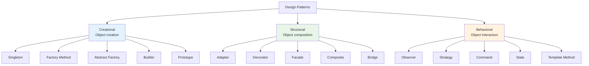
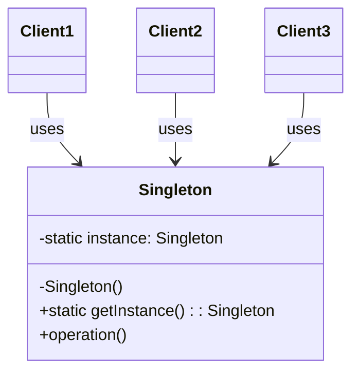
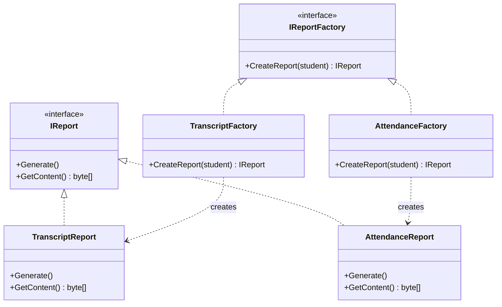
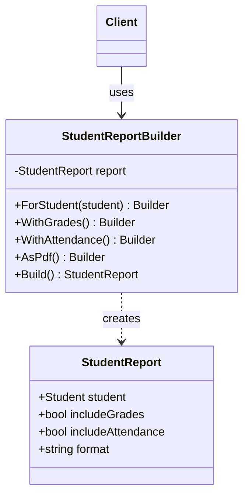

# 8.4 Creational Design Patterns

[← Previous: 8.3 SOLID Principles](./8_3-solid-principles.md) | [Back to Chapter 8](./chapter-08-README.md) | [Next: 8.5 Structural & Behavioral Patterns →](./8_5-design-patterns-structural-behavioral.md)

---

## Learning Objectives

- Understand what design patterns are and why they matter
- Implement the Singleton pattern for single-instance scenarios
- Use Factory patterns to create objects flexibly
- Apply the Builder pattern for complex object construction

**Estimated Time:** 35 minutes

---

## What Are Design Patterns?

### Definition

**Design patterns** are proven, reusable solutions to common problems in software design. They're not finished code, but templates that guide how to solve problems in different contexts.

### The Gang of Four (GoF)

In 1994, four authors (Gamma, Helm, Johnson, Vlissides) published "Design Patterns: Elements of Reusable Object-Oriented Software," cataloging 23 patterns in three categories:



### Why Use Patterns?

| Benefit | Description |
|---------|-------------|
| **Common vocabulary** | "Use a Factory here" is faster than explaining the concept |
| **Proven solutions** | Battle-tested approaches, not reinventing the wheel |
| **Maintainable code** | Other developers recognize patterns |
| **Flexible design** | Patterns support change and extension |

---

## Singleton Pattern

### Intent

> Ensure a class has only **one instance** and provide a **global point of access** to it.

### When to Use

- Configuration settings
- Logging service
- Database connection pool
- Cache manager
- Application state

### The Problem

```csharp
// ❌ Problem: Multiple instances created
var config1 = new AppConfiguration();
var config2 = new AppConfiguration();
// config1 and config2 are different objects!
// Changes to one don't affect the other
```

### Basic Implementation

```csharp
// ✅ Singleton Pattern
public class AppConfiguration
{
    // 1. Static instance holder
    private static AppConfiguration _instance;
    
    // 2. Private constructor prevents external instantiation
    private AppConfiguration()
    {
        // Load configuration from file
        LoadFromFile("appsettings.json");
    }
    
    // 3. Static method to get the instance
    public static AppConfiguration Instance
    {
        get
        {
            if (_instance == null)
            {
                _instance = new AppConfiguration();
            }
            return _instance;
        }
    }
    
    // Configuration properties
    public string DatabaseConnectionString { get; private set; }
    public int MaxRetries { get; private set; }
    public bool EnableLogging { get; private set; }
    
    private void LoadFromFile(string filename) { ... }
}

// Usage
var config = AppConfiguration.Instance;
Console.WriteLine(config.DatabaseConnectionString);
```

### Thread-Safe Singleton (Production Ready)

```csharp
// ✅ Thread-safe Singleton using Lazy<T>
public sealed class AppConfiguration
{
    private static readonly Lazy<AppConfiguration> _lazy =
        new Lazy<AppConfiguration>(() => new AppConfiguration());
    
    public static AppConfiguration Instance => _lazy.Value;
    
    private AppConfiguration()
    {
        LoadFromFile("appsettings.json");
    }
    
    public string DatabaseConnectionString { get; private set; }
    public int MaxRetries { get; private set; }
    
    private void LoadFromFile(string filename) { ... }
}
```

### School System Example

```csharp
// ✅ Singleton for School Configuration
public sealed class SchoolSettings
{
    private static readonly Lazy<SchoolSettings> _lazy =
        new Lazy<SchoolSettings>(() => new SchoolSettings());
    
    public static SchoolSettings Instance => _lazy.Value;
    
    private SchoolSettings()
    {
        // Load school-specific settings
        SchoolName = "Springfield High School";
        GradingScale = LoadGradingScale();
        SemesterDates = LoadSemesterDates();
    }
    
    public string SchoolName { get; }
    public GradingScale GradingScale { get; }
    public SemesterDates SemesterDates { get; }
    public int MaxClassSize { get; } = 30;
    public decimal PassingGrade { get; } = 60.0m;
}

// Usage throughout the application
var maxSize = SchoolSettings.Instance.MaxClassSize;
var passing = SchoolSettings.Instance.PassingGrade;
```

### Singleton Diagram



### ⚠️ Singleton Warnings

**Caution:** Singletons can be overused. Consider alternatives when:
- Testing is difficult (hard to mock)
- Global state causes hidden dependencies
- Parallel execution needs separate instances

**Better alternative for testability:** Dependency Injection with a scoped lifetime

---

## Factory Method Pattern

### Intent

> Define an interface for creating an object, but let **subclasses decide** which class to instantiate.

### When to Use

- Object type determined at runtime
- Complex creation logic
- Need to hide instantiation details
- Creating families of related objects

### The Problem

```csharp
// ❌ Problem: Client code knows too much about creation
public class ReportService
{
    public void GenerateReport(string type, Student student)
    {
        Report report;
        
        // Client must know all report types and how to create them
        if (type == "transcript")
        {
            report = new TranscriptReport(student, new PdfFormatter(), new HeaderStyle());
        }
        else if (type == "attendance")
        {
            report = new AttendanceReport(student, new PdfFormatter(), new TableStyle());
        }
        else if (type == "grades")
        {
            report = new GradeReport(student, new PdfFormatter(), new ChartStyle());
        }
        // Adding new report type requires modifying this code!
        
        report.Generate();
    }
}
```

### Factory Method Solution

```csharp
// ✅ Factory Method Pattern

// 1. Product interface
public interface IReport
{
    void Generate();
    byte[] GetContent();
}

// 2. Concrete products
public class TranscriptReport : IReport
{
    private readonly Student _student;
    
    public TranscriptReport(Student student)
    {
        _student = student;
    }
    
    public void Generate() { /* Create transcript */ }
    public byte[] GetContent() { /* Return PDF bytes */ }
}

public class AttendanceReport : IReport
{
    private readonly Student _student;
    
    public AttendanceReport(Student student)
    {
        _student = student;
    }
    
    public void Generate() { /* Create attendance report */ }
    public byte[] GetContent() { /* Return PDF bytes */ }
}

// 3. Factory interface
public interface IReportFactory
{
    IReport CreateReport(Student student);
}

// 4. Concrete factories
public class TranscriptReportFactory : IReportFactory
{
    public IReport CreateReport(Student student)
    {
        return new TranscriptReport(student);
    }
}

public class AttendanceReportFactory : IReportFactory
{
    public IReport CreateReport(Student student)
    {
        return new AttendanceReport(student);
    }
}

// 5. Client uses factory (doesn't know concrete types)
public class ReportService
{
    private readonly IReportFactory _factory;
    
    public ReportService(IReportFactory factory)
    {
        _factory = factory;
    }
    
    public byte[] GenerateReport(Student student)
    {
        var report = _factory.CreateReport(student);
        report.Generate();
        return report.GetContent();
    }
}
```

### Simple Factory (Not a GoF Pattern, but Common)

```csharp
// Simple Factory - often used in practice
public class ReportFactory
{
    public IReport CreateReport(string reportType, Student student)
    {
        return reportType.ToLower() switch
        {
            "transcript" => new TranscriptReport(student),
            "attendance" => new AttendanceReport(student),
            "grades" => new GradeReport(student),
            _ => throw new ArgumentException($"Unknown report type: {reportType}")
        };
    }
}

// Usage
var factory = new ReportFactory();
var report = factory.CreateReport("transcript", student);
report.Generate();
```

### Factory Method Diagram



---

## Abstract Factory Pattern

### Intent

> Provide an interface for creating **families of related objects** without specifying concrete classes.

### When to Use

- System needs to be independent of how products are created
- System should work with multiple families of products
- Products in a family are designed to work together

### School System Example: UI Themes

```csharp
// ✅ Abstract Factory for UI Components

// Abstract products
public interface IButton
{
    void Render();
}

public interface ITextBox
{
    void Render();
}

public interface IDataGrid
{
    void Render();
}

// Abstract factory
public interface IUIThemeFactory
{
    IButton CreateButton();
    ITextBox CreateTextBox();
    IDataGrid CreateDataGrid();
}

// Light Theme Family
public class LightButton : IButton
{
    public void Render() => Console.WriteLine("Light themed button");
}

public class LightTextBox : ITextBox
{
    public void Render() => Console.WriteLine("Light themed textbox");
}

public class LightDataGrid : IDataGrid
{
    public void Render() => Console.WriteLine("Light themed grid");
}

public class LightThemeFactory : IUIThemeFactory
{
    public IButton CreateButton() => new LightButton();
    public ITextBox CreateTextBox() => new LightTextBox();
    public IDataGrid CreateDataGrid() => new LightDataGrid();
}

// Dark Theme Family
public class DarkButton : IButton
{
    public void Render() => Console.WriteLine("Dark themed button");
}

public class DarkTextBox : ITextBox
{
    public void Render() => Console.WriteLine("Dark themed textbox");
}

public class DarkDataGrid : IDataGrid
{
    public void Render() => Console.WriteLine("Dark themed grid");
}

public class DarkThemeFactory : IUIThemeFactory
{
    public IButton CreateButton() => new DarkButton();
    public ITextBox CreateTextBox() => new DarkTextBox();
    public IDataGrid CreateDataGrid() => new DarkDataGrid();
}

// Client code - works with any theme
public class GradeEntryForm
{
    private readonly IButton _saveButton;
    private readonly ITextBox _gradeInput;
    private readonly IDataGrid _studentGrid;
    
    public GradeEntryForm(IUIThemeFactory themeFactory)
    {
        _saveButton = themeFactory.CreateButton();
        _gradeInput = themeFactory.CreateTextBox();
        _studentGrid = themeFactory.CreateDataGrid();
    }
    
    public void Render()
    {
        _studentGrid.Render();
        _gradeInput.Render();
        _saveButton.Render();
    }
}

// Usage
IUIThemeFactory factory = userPrefersDarkMode 
    ? new DarkThemeFactory() 
    : new LightThemeFactory();
    
var form = new GradeEntryForm(factory);
form.Render();
```

---

## Builder Pattern

### Intent

> Separate the **construction of a complex object** from its representation, allowing the same construction process to create different representations.

### When to Use

- Object has many optional parameters
- Object creation involves many steps
- Need to create different representations of the same object

### The Problem: Telescoping Constructor

```csharp
// ❌ Problem: Too many constructor parameters
public class StudentReport
{
    public StudentReport(
        Student student,
        bool includeGrades,
        bool includeAttendance,
        bool includeTranscript,
        bool includeSchedule,
        bool includeDisciplinary,
        bool includeActivities,
        DateTime? startDate,
        DateTime? endDate,
        string format,
        bool includeHeader,
        bool includeFooter,
        string watermark)
    {
        // Which parameter is which?
    }
}

// Usage is confusing
var report = new StudentReport(
    student, true, false, true, false, false, true, 
    null, null, "PDF", true, false, null);  // What do all these booleans mean?
```

### Builder Solution

```csharp
// ✅ Builder Pattern

public class StudentReport
{
    public Student Student { get; set; }
    public bool IncludeGrades { get; set; }
    public bool IncludeAttendance { get; set; }
    public bool IncludeTranscript { get; set; }
    public bool IncludeSchedule { get; set; }
    public DateTime? StartDate { get; set; }
    public DateTime? EndDate { get; set; }
    public string Format { get; set; }
    public bool IncludeHeader { get; set; }
    public string Watermark { get; set; }
}

public class StudentReportBuilder
{
    private readonly StudentReport _report = new StudentReport();
    
    public StudentReportBuilder ForStudent(Student student)
    {
        _report.Student = student;
        return this;
    }
    
    public StudentReportBuilder WithGrades()
    {
        _report.IncludeGrades = true;
        return this;
    }
    
    public StudentReportBuilder WithAttendance()
    {
        _report.IncludeAttendance = true;
        return this;
    }
    
    public StudentReportBuilder WithTranscript()
    {
        _report.IncludeTranscript = true;
        return this;
    }
    
    public StudentReportBuilder WithSchedule()
    {
        _report.IncludeSchedule = true;
        return this;
    }
    
    public StudentReportBuilder ForDateRange(DateTime start, DateTime end)
    {
        _report.StartDate = start;
        _report.EndDate = end;
        return this;
    }
    
    public StudentReportBuilder AsPdf()
    {
        _report.Format = "PDF";
        return this;
    }
    
    public StudentReportBuilder AsExcel()
    {
        _report.Format = "Excel";
        return this;
    }
    
    public StudentReportBuilder WithHeader()
    {
        _report.IncludeHeader = true;
        return this;
    }
    
    public StudentReportBuilder WithWatermark(string text)
    {
        _report.Watermark = text;
        return this;
    }
    
    public StudentReport Build()
    {
        // Validate the report configuration
        if (_report.Student == null)
            throw new InvalidOperationException("Student is required");
            
        return _report;
    }
}

// ✅ Usage is clear and readable (Fluent API)
var report = new StudentReportBuilder()
    .ForStudent(student)
    .WithGrades()
    .WithTranscript()
    .ForDateRange(semesterStart, semesterEnd)
    .AsPdf()
    .WithHeader()
    .WithWatermark("DRAFT")
    .Build();
```

### Builder Diagram



### Director (Optional Enhancement)

```csharp
// Director encapsulates common build configurations
public class ReportDirector
{
    private readonly StudentReportBuilder _builder;
    
    public ReportDirector(StudentReportBuilder builder)
    {
        _builder = builder;
    }
    
    // Predefined configurations
    public StudentReport BuildFullAcademicReport(Student student)
    {
        return _builder
            .ForStudent(student)
            .WithGrades()
            .WithTranscript()
            .WithAttendance()
            .WithSchedule()
            .AsPdf()
            .WithHeader()
            .Build();
    }
    
    public StudentReport BuildQuickGradeReport(Student student)
    {
        return _builder
            .ForStudent(student)
            .WithGrades()
            .AsPdf()
            .Build();
    }
}

// Usage
var director = new ReportDirector(new StudentReportBuilder());
var fullReport = director.BuildFullAcademicReport(student);
```

---

## Pattern Comparison

| Pattern | Use When | Example |
|---------|----------|---------|
| **Singleton** | Exactly one instance needed | Configuration, Logger |
| **Factory Method** | Class doesn't know exact type to create | Report generators |
| **Abstract Factory** | Need families of related objects | UI themes, DB providers |
| **Builder** | Complex object with many options | Report configuration |

---

## Key Takeaways

✅ **Singleton**: One instance, global access
- Use `Lazy<T>` for thread safety
- Consider testability concerns

✅ **Factory Method**: Delegate instantiation to subclasses
- Hides creation complexity
- Supports the Open/Closed Principle

✅ **Abstract Factory**: Create families of objects
- Ensures products work together
- Easy to swap entire families

✅ **Builder**: Step-by-step complex object creation
- Fluent API improves readability
- Separates construction from representation

---

## Self-Check Questions

1. **When would you choose Factory Method over Abstract Factory?**
   <details>
   <summary>Click to reveal answer</summary>
   Use Factory Method when you need to create one type of product and want subclasses to decide the specific type. Use Abstract Factory when you need to create families of related products that must work together (like UI components for a theme).
   </details>

2. **What problem does the Builder pattern solve?**
   <details>
   <summary>Click to reveal answer</summary>
   Builder solves the "telescoping constructor" problem where objects have many optional parameters. It makes construction readable, allows step-by-step building, and separates construction logic from the object itself.
   </details>

3. **Why might Singleton be considered an anti-pattern?**
   <details>
   <summary>Click to reveal answer</summary>
   Singletons create global state, making code harder to test (can't mock the singleton easily), hide dependencies (classes use it directly instead of receiving it), and can cause issues in multi-threaded environments if not implemented carefully.
   </details>

---

## Practice Exercise

**Task:** Create a `GradeEntryBuilder` for the School Management System that builds grade entries with these options:
- Required: Student, Course, Score
- Optional: Comments, Grader, SubmissionDate, IsLate, LateDeduction

Build it so usage looks like:
```csharp
var grade = new GradeEntryBuilder()
    .ForStudent(student)
    .InCourse(course)
    .WithScore(85.5m)
    .WithComments("Good work!")
    .GradedBy(teacher)
    .IsLate(deduction: 10)
    .Build();
```

<details>
<summary>Click for solution</summary>

```csharp
public class GradeEntry
{
    public Student Student { get; set; }
    public Course Course { get; set; }
    public decimal Score { get; set; }
    public string Comments { get; set; }
    public Teacher Grader { get; set; }
    public DateTime SubmissionDate { get; set; }
    public bool IsLate { get; set; }
    public decimal LateDeduction { get; set; }
    
    public decimal FinalScore => IsLate ? Score - LateDeduction : Score;
}

public class GradeEntryBuilder
{
    private readonly GradeEntry _entry = new GradeEntry
    {
        SubmissionDate = DateTime.Now
    };
    
    public GradeEntryBuilder ForStudent(Student student)
    {
        _entry.Student = student;
        return this;
    }
    
    public GradeEntryBuilder InCourse(Course course)
    {
        _entry.Course = course;
        return this;
    }
    
    public GradeEntryBuilder WithScore(decimal score)
    {
        _entry.Score = score;
        return this;
    }
    
    public GradeEntryBuilder WithComments(string comments)
    {
        _entry.Comments = comments;
        return this;
    }
    
    public GradeEntryBuilder GradedBy(Teacher teacher)
    {
        _entry.Grader = teacher;
        return this;
    }
    
    public GradeEntryBuilder OnDate(DateTime date)
    {
        _entry.SubmissionDate = date;
        return this;
    }
    
    public GradeEntryBuilder IsLate(decimal deduction)
    {
        _entry.IsLate = true;
        _entry.LateDeduction = deduction;
        return this;
    }
    
    public GradeEntry Build()
    {
        if (_entry.Student == null)
            throw new InvalidOperationException("Student is required");
        if (_entry.Course == null)
            throw new InvalidOperationException("Course is required");
        if (_entry.Score < 0 || _entry.Score > 100)
            throw new InvalidOperationException("Score must be 0-100");
            
        return _entry;
    }
}
```

</details>

---

**Previous:** [← 8.3 SOLID Principles](./8_3-solid-principles.md)

**Next:** [8.5 Structural & Behavioral Patterns →](./8_5-design-patterns-structural-behavioral.md)

---

*Estimated Reading Time: 35 minutes*
