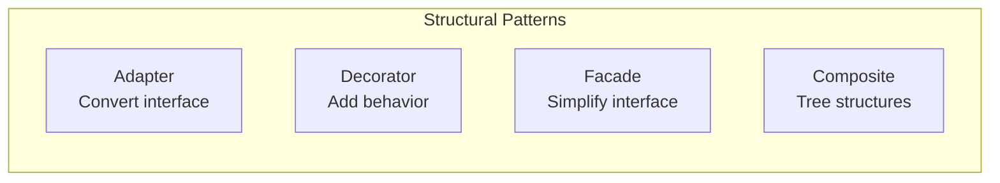
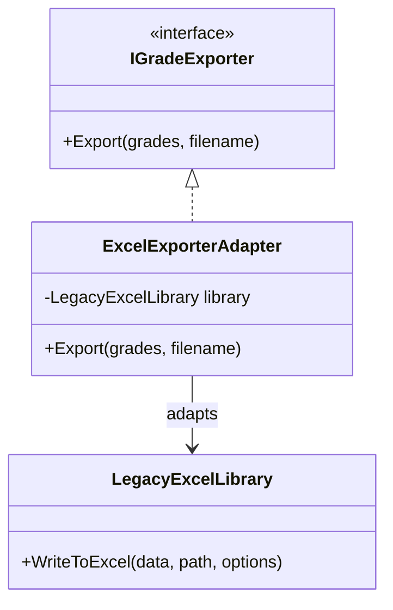
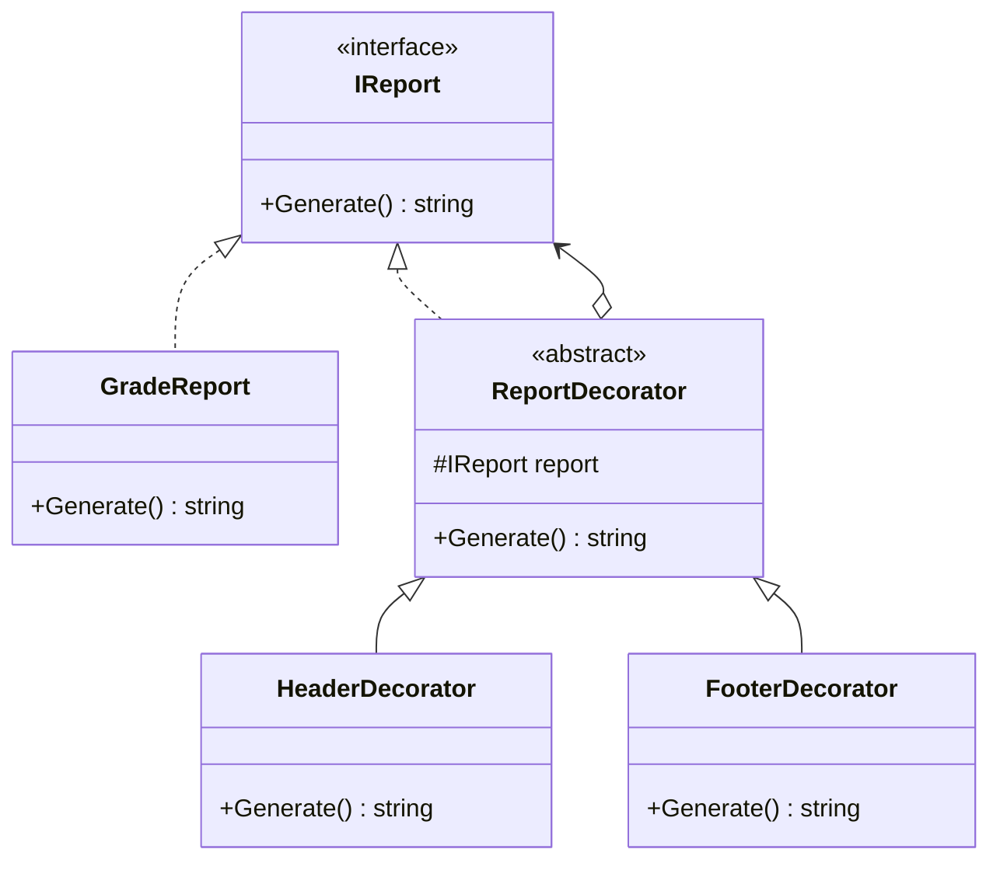
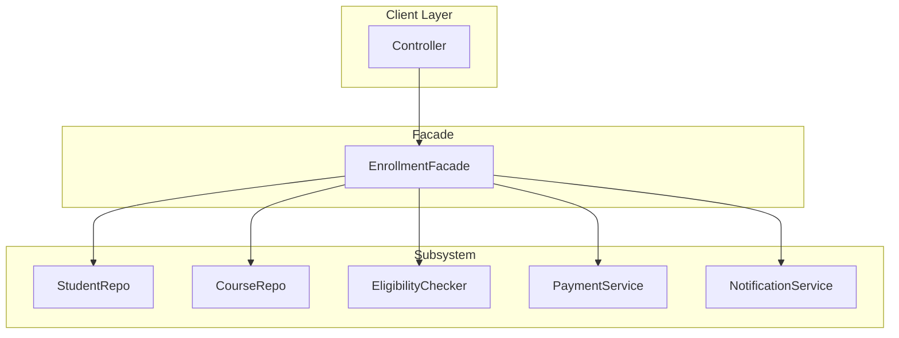
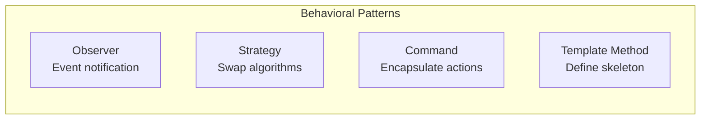
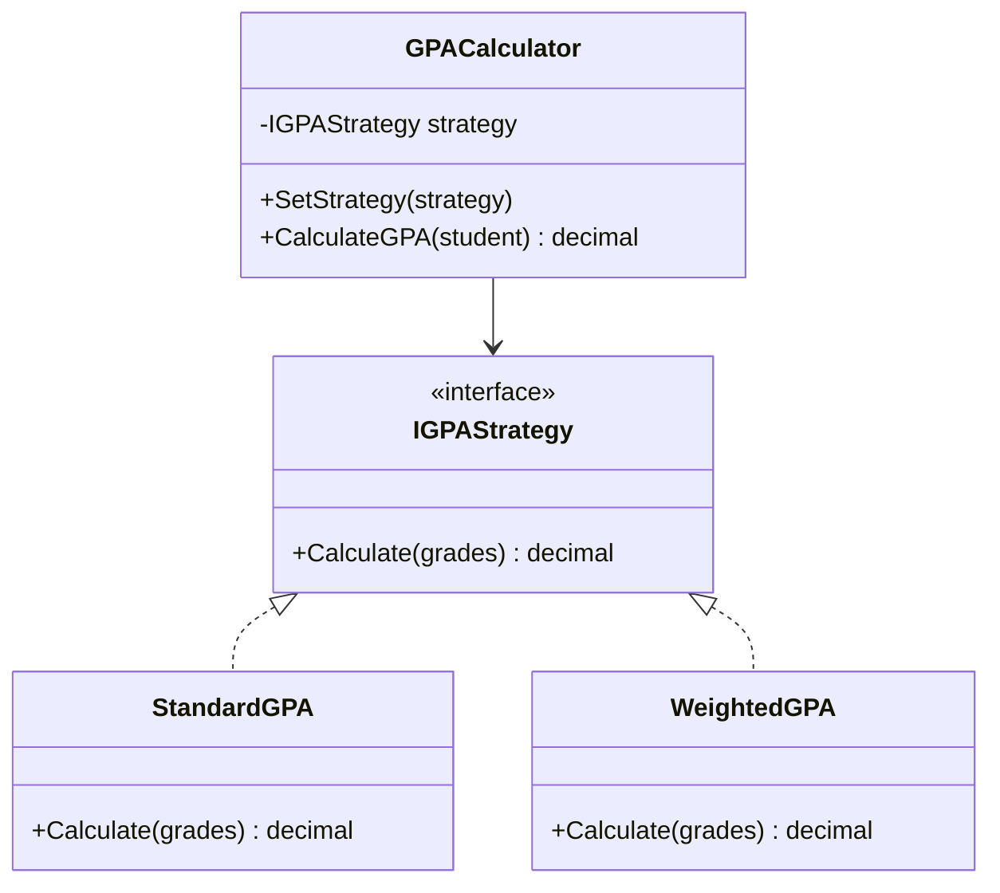

# 8.5 Structural and Behavioral Design Patterns

[← Previous: 8.4 Creational Patterns](./8_4-design-patterns-creational.md) | [Back to Chapter 8](./chapter-08-README.md) | [Next: 8.6 Interface and API Design →](./8_6-interface-api-design.md)

---

## Learning Objectives

- Implement Structural patterns to compose objects effectively
- Apply Behavioral patterns to manage object interactions
- Choose appropriate patterns for common design challenges
- Recognize pattern usage in real-world frameworks

**Estimated Time:** 40 minutes

---

## Structural Patterns Overview

Structural patterns deal with **how classes and objects are composed** to form larger structures.



---

## Adapter Pattern

### Intent

> Convert the interface of a class into another interface clients expect. Adapter lets classes work together that couldn't otherwise.

### When to Use

- Integrate with legacy code or third-party libraries
- Interface doesn't match what you need
- Can't modify the existing class

### The Problem

```csharp
// ❌ Problem: Third-party library has incompatible interface
// Your system expects:
public interface IGradeExporter
{
    void Export(IEnumerable<Grade> grades, string filename);
}

// But the library you want to use has:
public class LegacyExcelLibrary
{
    public void WriteToExcel(DataTable data, string path, ExcelOptions options)
    {
        // Complex Excel writing logic
    }
}

// These interfaces don't match!
```

### Adapter Solution

```csharp
// ✅ Adapter wraps the incompatible class
public class ExcelExporterAdapter : IGradeExporter
{
    private readonly LegacyExcelLibrary _excelLibrary;
    
    public ExcelExporterAdapter(LegacyExcelLibrary excelLibrary)
    {
        _excelLibrary = excelLibrary;
    }
    
    public void Export(IEnumerable<Grade> grades, string filename)
    {
        // Convert grades to DataTable (what the library expects)
        var dataTable = ConvertToDataTable(grades);
        
        // Create default options
        var options = new ExcelOptions { AutoFitColumns = true };
        
        // Call the adapted method
        _excelLibrary.WriteToExcel(dataTable, filename, options);
    }
    
    private DataTable ConvertToDataTable(IEnumerable<Grade> grades)
    {
        var table = new DataTable();
        table.Columns.Add("StudentId", typeof(int));
        table.Columns.Add("Course", typeof(string));
        table.Columns.Add("Score", typeof(decimal));
        
        foreach (var grade in grades)
        {
            table.Rows.Add(grade.StudentId, grade.CourseName, grade.Score);
        }
        
        return table;
    }
}

// Usage - client works with your interface
IGradeExporter exporter = new ExcelExporterAdapter(new LegacyExcelLibrary());
exporter.Export(grades, "grades.xlsx");
```

### Adapter Diagram



### Real-World Example

```csharp
// Adapting different notification services
public interface INotificationService
{
    Task SendAsync(string userId, string message);
}

// Adapting SendGrid
public class SendGridAdapter : INotificationService
{
    private readonly SendGridClient _client;
    
    public async Task SendAsync(string userId, string message)
    {
        var user = await GetUser(userId);
        var msg = new SendGridMessage
        {
            From = new EmailAddress("school@edu"),
            Subject = "Notification",
            PlainTextContent = message
        };
        msg.AddTo(user.Email);
        await _client.SendEmailAsync(msg);
    }
}

// Adapting Twilio SMS
public class TwilioSmsAdapter : INotificationService
{
    private readonly TwilioClient _client;
    
    public async Task SendAsync(string userId, string message)
    {
        var user = await GetUser(userId);
        await _client.SendSmsAsync(user.Phone, message);
    }
}
```

---

## Decorator Pattern

### Intent

> Attach additional responsibilities to an object **dynamically**. Decorators provide a flexible alternative to subclassing.

### When to Use

- Add behavior without modifying existing classes
- Combine behaviors in different ways
- Add/remove features at runtime

### The Problem

```csharp
// ❌ Problem: Explosion of subclasses
public class GradeReport { }
public class GradeReportWithHeader : GradeReport { }
public class GradeReportWithFooter : GradeReport { }
public class GradeReportWithHeaderAndFooter : GradeReport { }
public class GradeReportWithWatermark : GradeReport { }
public class GradeReportWithHeaderAndWatermark : GradeReport { }
// ... endless combinations!
```

### Decorator Solution

```csharp
// ✅ Decorator Pattern

// Base interface
public interface IReport
{
    string Generate();
}

// Concrete component
public class GradeReport : IReport
{
    private readonly Student _student;
    
    public GradeReport(Student student)
    {
        _student = student;
    }
    
    public string Generate()
    {
        var sb = new StringBuilder();
        sb.AppendLine($"Grade Report for: {_student.Name}");
        foreach (var grade in _student.Grades)
        {
            sb.AppendLine($"  {grade.CourseName}: {grade.Score}");
        }
        return sb.ToString();
    }
}

// Base decorator
public abstract class ReportDecorator : IReport
{
    protected readonly IReport _report;
    
    protected ReportDecorator(IReport report)
    {
        _report = report;
    }
    
    public virtual string Generate() => _report.Generate();
}

// Concrete decorators
public class HeaderDecorator : ReportDecorator
{
    private readonly string _headerText;
    
    public HeaderDecorator(IReport report, string headerText) : base(report)
    {
        _headerText = headerText;
    }
    
    public override string Generate()
    {
        return $"=== {_headerText} ===\n{base.Generate()}";
    }
}

public class FooterDecorator : ReportDecorator
{
    public FooterDecorator(IReport report) : base(report) { }
    
    public override string Generate()
    {
        return $"{base.Generate()}\n---\nGenerated: {DateTime.Now}";
    }
}

public class WatermarkDecorator : ReportDecorator
{
    private readonly string _watermark;
    
    public WatermarkDecorator(IReport report, string watermark) : base(report)
    {
        _watermark = watermark;
    }
    
    public override string Generate()
    {
        var content = base.Generate();
        return $"[{_watermark}]\n{content}\n[{_watermark}]";
    }
}

// ✅ Usage - combine decorators as needed
IReport report = new GradeReport(student);
report = new HeaderDecorator(report, "Springfield High School");
report = new FooterDecorator(report);
report = new WatermarkDecorator(report, "CONFIDENTIAL");

Console.WriteLine(report.Generate());
```

### Decorator Diagram



---

## Facade Pattern

### Intent

> Provide a **unified interface** to a set of interfaces in a subsystem. Facade defines a higher-level interface that makes the subsystem easier to use.

### When to Use

- Simplify complex subsystem
- Decouple client from subsystem details
- Provide entry point to layered architecture

### The Problem

```csharp
// ❌ Problem: Client must know too many classes
public class EnrollmentController
{
    public void EnrollStudent(int studentId, int courseId)
    {
        // Client knows all these subsystems
        var student = _studentRepository.GetById(studentId);
        var course = _courseRepository.GetById(courseId);
        
        var eligibility = _eligibilityChecker.Check(student, course);
        if (!eligibility.IsEligible) throw new Exception(eligibility.Reason);
        
        var prerequisiteChecker = new PrerequisiteChecker();
        if (!prerequisiteChecker.HasPrerequisites(student, course))
            throw new Exception("Prerequisites not met");
            
        var paymentService = new PaymentService();
        if (!paymentService.HasPaidTuition(studentId))
            throw new Exception("Tuition not paid");
            
        var enrollment = new Enrollment(student, course);
        _enrollmentRepository.Add(enrollment);
        
        var notificationService = new NotificationService();
        notificationService.SendEnrollmentConfirmation(student, course);
        
        var scheduleService = new ScheduleService();
        scheduleService.AddToSchedule(student, course);
    }
}
```

### Facade Solution

```csharp
// ✅ Facade hides complexity
public class EnrollmentFacade
{
    private readonly IStudentRepository _studentRepository;
    private readonly ICourseRepository _courseRepository;
    private readonly IEligibilityChecker _eligibilityChecker;
    private readonly IPrerequisiteChecker _prerequisiteChecker;
    private readonly IPaymentService _paymentService;
    private readonly IEnrollmentRepository _enrollmentRepository;
    private readonly INotificationService _notificationService;
    private readonly IScheduleService _scheduleService;
    
    public EnrollmentFacade(/* inject all dependencies */) { }
    
    public EnrollmentResult EnrollStudent(int studentId, int courseId)
    {
        try
        {
            var student = _studentRepository.GetById(studentId);
            var course = _courseRepository.GetById(courseId);
            
            // Validate eligibility
            var eligibility = _eligibilityChecker.Check(student, course);
            if (!eligibility.IsEligible)
                return EnrollmentResult.Fail(eligibility.Reason);
            
            // Check prerequisites
            if (!_prerequisiteChecker.HasPrerequisites(student, course))
                return EnrollmentResult.Fail("Prerequisites not met");
            
            // Check payment
            if (!_paymentService.HasPaidTuition(studentId))
                return EnrollmentResult.Fail("Tuition not paid");
            
            // Create enrollment
            var enrollment = new Enrollment(student, course);
            _enrollmentRepository.Add(enrollment);
            
            // Post-enrollment actions
            _notificationService.SendEnrollmentConfirmation(student, course);
            _scheduleService.AddToSchedule(student, course);
            
            return EnrollmentResult.Success(enrollment);
        }
        catch (Exception ex)
        {
            return EnrollmentResult.Fail(ex.Message);
        }
    }
    
    public bool DropCourse(int studentId, int courseId) { ... }
    public Schedule GetStudentSchedule(int studentId) { ... }
}

// ✅ Client uses simple interface
public class EnrollmentController
{
    private readonly EnrollmentFacade _facade;
    
    public IActionResult Enroll(int studentId, int courseId)
    {
        var result = _facade.EnrollStudent(studentId, courseId);
        return result.IsSuccess ? Ok(result) : BadRequest(result.Error);
    }
}
```

### Facade Diagram



---

## Behavioral Patterns Overview

Behavioral patterns deal with **how objects interact and communicate**.



---

## Observer Pattern

### Intent

> Define a **one-to-many dependency** between objects so that when one object changes state, all dependents are notified automatically.

### When to Use

- Event handling systems
- UI updates when data changes
- Notification systems
- Decoupling event producers from consumers

### School System Example

```csharp
// ✅ Observer Pattern for Grade Notifications

// Subject interface
public interface IGradeSubject
{
    void Attach(IGradeObserver observer);
    void Detach(IGradeObserver observer);
    void Notify(GradeEvent gradeEvent);
}

// Observer interface
public interface IGradeObserver
{
    void Update(GradeEvent gradeEvent);
}

// Concrete Subject
public class GradeService : IGradeSubject
{
    private readonly List<IGradeObserver> _observers = new();
    private readonly IGradeRepository _repository;
    
    public void Attach(IGradeObserver observer) => _observers.Add(observer);
    public void Detach(IGradeObserver observer) => _observers.Remove(observer);
    
    public void Notify(GradeEvent gradeEvent)
    {
        foreach (var observer in _observers)
        {
            observer.Update(gradeEvent);
        }
    }
    
    public void RecordGrade(Grade grade)
    {
        _repository.Save(grade);
        
        // Notify all observers
        Notify(new GradeEvent
        {
            Type = GradeEventType.GradeRecorded,
            Grade = grade,
            Timestamp = DateTime.Now
        });
    }
}

// Concrete Observers
public class ParentNotifier : IGradeObserver
{
    private readonly IEmailService _emailService;
    
    public void Update(GradeEvent gradeEvent)
    {
        if (gradeEvent.Type == GradeEventType.GradeRecorded)
        {
            var parent = gradeEvent.Grade.Student.Parent;
            _emailService.Send(parent.Email, 
                $"New grade recorded: {gradeEvent.Grade.Score}");
        }
    }
}

public class GPAUpdater : IGradeObserver
{
    private readonly IGPAService _gpaService;
    
    public void Update(GradeEvent gradeEvent)
    {
        if (gradeEvent.Type == GradeEventType.GradeRecorded)
        {
            _gpaService.Recalculate(gradeEvent.Grade.StudentId);
        }
    }
}

public class GradeAuditLogger : IGradeObserver
{
    private readonly IAuditLog _auditLog;
    
    public void Update(GradeEvent gradeEvent)
    {
        _auditLog.Log($"Grade event: {gradeEvent.Type} for student {gradeEvent.Grade.StudentId}");
    }
}

// Setup
var gradeService = new GradeService(repository);
gradeService.Attach(new ParentNotifier(emailService));
gradeService.Attach(new GPAUpdater(gpaService));
gradeService.Attach(new GradeAuditLogger(auditLog));

// When a grade is recorded, all observers are notified
gradeService.RecordGrade(newGrade);
```

### Modern C# Events Approach

```csharp
// ✅ Using C# events (built-in observer pattern)
public class GradeService
{
    public event EventHandler<GradeEventArgs> GradeRecorded;
    
    public void RecordGrade(Grade grade)
    {
        _repository.Save(grade);
        OnGradeRecorded(new GradeEventArgs { Grade = grade });
    }
    
    protected virtual void OnGradeRecorded(GradeEventArgs e)
    {
        GradeRecorded?.Invoke(this, e);
    }
}

// Subscribers
gradeService.GradeRecorded += (sender, e) => 
    emailService.NotifyParent(e.Grade);

gradeService.GradeRecorded += (sender, e) => 
    gpaService.Recalculate(e.Grade.StudentId);
```

---

## Strategy Pattern

### Intent

> Define a family of algorithms, encapsulate each one, and make them **interchangeable**. Strategy lets the algorithm vary independently from clients.

### When to Use

- Multiple algorithms for same task
- Need to switch algorithms at runtime
- Avoid complex conditional statements

### School System Example

```csharp
// ✅ Strategy Pattern for GPA Calculation

// Strategy interface
public interface IGPACalculationStrategy
{
    decimal Calculate(IEnumerable<Grade> grades);
    string Name { get; }
}

// Concrete strategies
public class StandardGPAStrategy : IGPACalculationStrategy
{
    public string Name => "Standard 4.0 Scale";
    
    public decimal Calculate(IEnumerable<Grade> grades)
    {
        if (!grades.Any()) return 0;
        
        var totalPoints = grades.Sum(g => ConvertToPoints(g.Score) * g.Credits);
        var totalCredits = grades.Sum(g => g.Credits);
        
        return totalPoints / totalCredits;
    }
    
    private decimal ConvertToPoints(decimal score) => score switch
    {
        >= 90 => 4.0m,
        >= 80 => 3.0m,
        >= 70 => 2.0m,
        >= 60 => 1.0m,
        _ => 0.0m
    };
}

public class WeightedGPAStrategy : IGPACalculationStrategy
{
    public string Name => "Weighted (Honors/AP)";
    
    public decimal Calculate(IEnumerable<Grade> grades)
    {
        if (!grades.Any()) return 0;
        
        var totalPoints = grades.Sum(g => 
        {
            var basePoints = ConvertToPoints(g.Score);
            var bonus = g.CourseType switch
            {
                CourseType.Honors => 0.5m,
                CourseType.AP => 1.0m,
                _ => 0m
            };
            return (basePoints + bonus) * g.Credits;
        });
        
        return totalPoints / grades.Sum(g => g.Credits);
    }
    
    private decimal ConvertToPoints(decimal score) { ... }
}

public class PercentageGPAStrategy : IGPACalculationStrategy
{
    public string Name => "Percentage Average";
    
    public decimal Calculate(IEnumerable<Grade> grades)
    {
        if (!grades.Any()) return 0;
        return grades.Average(g => g.Score);
    }
}

// Context
public class StudentGPACalculator
{
    private IGPACalculationStrategy _strategy;
    
    public StudentGPACalculator(IGPACalculationStrategy strategy)
    {
        _strategy = strategy;
    }
    
    public void SetStrategy(IGPACalculationStrategy strategy)
    {
        _strategy = strategy;
    }
    
    public decimal CalculateGPA(Student student)
    {
        return _strategy.Calculate(student.Grades);
    }
    
    public string GetMethodName() => _strategy.Name;
}

// ✅ Usage - swap strategies easily
var calculator = new StudentGPACalculator(new StandardGPAStrategy());
Console.WriteLine($"Standard GPA: {calculator.CalculateGPA(student)}");

calculator.SetStrategy(new WeightedGPAStrategy());
Console.WriteLine($"Weighted GPA: {calculator.CalculateGPA(student)}");
```

### Strategy Diagram



---

## Command Pattern

### Intent

> Encapsulate a request as an object, allowing you to parameterize clients with different requests, queue requests, and support undo operations.

### When to Use

- Undo/Redo functionality
- Queue operations
- Log operations for replay
- Macro recording

### School System Example

```csharp
// ✅ Command Pattern for Grade Operations with Undo

// Command interface
public interface IGradeCommand
{
    void Execute();
    void Undo();
    string Description { get; }
}

// Concrete commands
public class RecordGradeCommand : IGradeCommand
{
    private readonly IGradeRepository _repository;
    private readonly Grade _grade;
    private int? _savedGradeId;
    
    public RecordGradeCommand(IGradeRepository repository, Grade grade)
    {
        _repository = repository;
        _grade = grade;
    }
    
    public string Description => $"Record grade {_grade.Score} for student {_grade.StudentId}";
    
    public void Execute()
    {
        _savedGradeId = _repository.Add(_grade);
    }
    
    public void Undo()
    {
        if (_savedGradeId.HasValue)
        {
            _repository.Delete(_savedGradeId.Value);
        }
    }
}

public class UpdateGradeCommand : IGradeCommand
{
    private readonly IGradeRepository _repository;
    private readonly int _gradeId;
    private readonly decimal _newScore;
    private decimal? _previousScore;
    
    public UpdateGradeCommand(IGradeRepository repository, int gradeId, decimal newScore)
    {
        _repository = repository;
        _gradeId = gradeId;
        _newScore = newScore;
    }
    
    public string Description => $"Update grade {_gradeId} to {_newScore}";
    
    public void Execute()
    {
        var grade = _repository.GetById(_gradeId);
        _previousScore = grade.Score;
        grade.Score = _newScore;
        _repository.Update(grade);
    }
    
    public void Undo()
    {
        if (_previousScore.HasValue)
        {
            var grade = _repository.GetById(_gradeId);
            grade.Score = _previousScore.Value;
            _repository.Update(grade);
        }
    }
}

// Invoker with history
public class GradeCommandInvoker
{
    private readonly Stack<IGradeCommand> _history = new();
    private readonly Stack<IGradeCommand> _redoStack = new();
    
    public void ExecuteCommand(IGradeCommand command)
    {
        command.Execute();
        _history.Push(command);
        _redoStack.Clear();  // Clear redo when new command executed
    }
    
    public void Undo()
    {
        if (_history.Count > 0)
        {
            var command = _history.Pop();
            command.Undo();
            _redoStack.Push(command);
        }
    }
    
    public void Redo()
    {
        if (_redoStack.Count > 0)
        {
            var command = _redoStack.Pop();
            command.Execute();
            _history.Push(command);
        }
    }
    
    public IEnumerable<string> GetHistory() =>
        _history.Select(c => c.Description);
}

// ✅ Usage
var invoker = new GradeCommandInvoker();

// Record a grade
var recordCmd = new RecordGradeCommand(repository, newGrade);
invoker.ExecuteCommand(recordCmd);

// Update the grade
var updateCmd = new UpdateGradeCommand(repository, gradeId, 95.0m);
invoker.ExecuteCommand(updateCmd);

// Oops! Undo the update
invoker.Undo();

// Actually, it was right - redo
invoker.Redo();
```

---

## Pattern Selection Guide

| Problem | Pattern | Key Benefit |
|---------|---------|-------------|
| Incompatible interfaces | **Adapter** | Make them work together |
| Add behavior dynamically | **Decorator** | Flexible combinations |
| Complex subsystem | **Facade** | Simple interface |
| Notify multiple objects | **Observer** | Loose coupling |
| Multiple algorithms | **Strategy** | Swap at runtime |
| Undo/redo, queuing | **Command** | Encapsulate actions |

---

## Key Takeaways

✅ **Structural Patterns compose objects**
- Adapter: Convert incompatible interfaces
- Decorator: Add behavior without inheritance
- Facade: Simplify complex subsystems

✅ **Behavioral Patterns manage interactions**
- Observer: One-to-many notifications
- Strategy: Interchangeable algorithms
- Command: Encapsulate actions with undo

✅ **Patterns work together**
- Facade often uses other patterns internally
- Strategy and Factory often pair together
- Decorator chains can use multiple decorators

---

## Self-Check Questions

1. **When would you use Decorator instead of inheritance?**
   <details>
   <summary>Click to reveal answer</summary>
   Use Decorator when you need to add behavior dynamically at runtime, when you need multiple combinations of behaviors (avoiding class explosion), or when you can't modify the original class. Inheritance is static and creates rigid hierarchies.
   </details>

2. **What's the difference between Observer and direct method calls?**
   <details>
   <summary>Click to reveal answer</summary>
   Observer decouples the subject from observers—the subject doesn't know or care who's listening. Direct calls create tight coupling. Observer allows adding/removing observers at runtime without modifying the subject.
   </details>

3. **How does Strategy differ from simple if-else?**
   <details>
   <summary>Click to reveal answer</summary>
   Strategy encapsulates algorithms in separate classes, making them reusable, testable, and swappable at runtime. If-else creates monolithic code that violates OCP—adding new algorithms requires modifying existing code.
   </details>

---

**Previous:** [← 8.4 Creational Patterns](./8_4-design-patterns-creational.md)

**Next:** [8.6 Interface and API Design →](./8_6-interface-api-design.md)

---

*Estimated Reading Time: 40 minutes*
