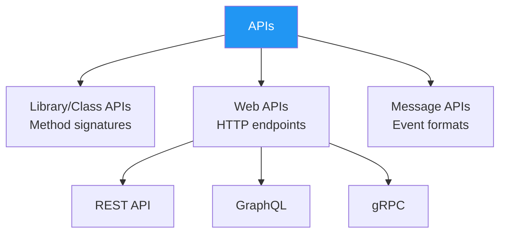

# 8.6 Interface and API Design

[← Previous: 8.5 Structural & Behavioral Patterns](./8_5-design-patterns-structural-behavioral.md) | [Back to Chapter 8](./chapter-08-README.md) | [Next: 8.7 Error Handling and Logging →](./8_7-error-handling-logging.md)

---

## Learning Objectives

- Design clean, intuitive interfaces and APIs
- Apply Design by Contract principles
- Document APIs effectively using OpenAPI/Swagger
- Understand API versioning strategies

**Estimated Time:** 40 minutes

---

## What is an API?

### Definition

An **API (Application Programming Interface)** is a contract that defines how software components communicate. It specifies:

- What operations are available
- What inputs are required
- What outputs are returned
- What errors can occur

### Types of APIs



---

## Design by Contract

### The Concept

**Design by Contract (DbC)** treats software components like legal contracts with:

- **Preconditions**: What must be true BEFORE calling
- **Postconditions**: What will be true AFTER calling
- **Invariants**: What is ALWAYS true

### Example

```csharp
/// <summary>
/// Records a grade for a student in a course.
/// </summary>
/// <param name="studentId">The student's ID (must exist in system)</param>
/// <param name="courseId">The course ID (student must be enrolled)</param>
/// <param name="score">The grade score (0-100)</param>
/// <returns>The created grade record</returns>
/// <exception cref="StudentNotFoundException">If student doesn't exist</exception>
/// <exception cref="NotEnrolledException">If student not enrolled in course</exception>
/// <exception cref="ArgumentOutOfRangeException">If score not 0-100</exception>
public interface IGradeService
{
    // PRECONDITIONS:
    // - studentId must reference an existing student
    // - courseId must reference a course the student is enrolled in
    // - score must be between 0 and 100 inclusive
    
    // POSTCONDITIONS:
    // - A new grade record exists in the database
    // - The returned Grade has a valid ID
    // - Student's GPA may have changed
    
    Grade RecordGrade(int studentId, int courseId, decimal score);
}
```

### Implementing Contracts in C#

```csharp
public class GradeService : IGradeService
{
    public Grade RecordGrade(int studentId, int courseId, decimal score)
    {
        // PRECONDITION CHECKS
        if (score < 0 || score > 100)
            throw new ArgumentOutOfRangeException(nameof(score), 
                "Score must be between 0 and 100");
        
        var student = _studentRepository.GetById(studentId)
            ?? throw new StudentNotFoundException(studentId);
        
        var enrollment = _enrollmentRepository.Find(studentId, courseId)
            ?? throw new NotEnrolledException(studentId, courseId);
        
        // BUSINESS LOGIC
        var grade = new Grade
        {
            StudentId = studentId,
            CourseId = courseId,
            Score = score,
            RecordedAt = DateTime.UtcNow
        };
        
        _gradeRepository.Add(grade);
        
        // POSTCONDITION: grade.Id is set by repository
        Debug.Assert(grade.Id > 0, "Grade ID should be set after save");
        
        return grade;
    }
}
```

---

## Interface Design Principles

### 1. Be Minimal and Complete

```csharp
// ❌ Too minimal - missing essential operations
public interface IGradeRepository
{
    Grade GetById(int id);
    // Can't add, update, or delete!
}

// ❌ Too bloated - includes unrelated operations
public interface IGradeRepository
{
    Grade GetById(int id);
    void Add(Grade grade);
    void Update(Grade grade);
    void Delete(int id);
    
    // These don't belong here!
    void SendGradeNotification(int gradeId);
    Report GenerateGradeReport(int studentId);
    decimal CalculateGPA(int studentId);
}

// ✅ Just right - focused and complete
public interface IGradeRepository
{
    Grade GetById(int id);
    IEnumerable<Grade> GetByStudent(int studentId);
    IEnumerable<Grade> GetByCourse(int courseId);
    void Add(Grade grade);
    void Update(Grade grade);
    void Delete(int id);
}
```

### 2. Use Clear, Consistent Naming

```csharp
// ❌ Inconsistent naming
public interface IStudentService
{
    Student GetStudent(int id);          // Get
    Student FetchStudentById(int id);    // Fetch
    Student RetrieveStudent(int id);     // Retrieve
    void AddStudent(Student s);          // Add
    void CreateNewStudent(Student s);    // Create
}

// ✅ Consistent naming convention
public interface IStudentService
{
    Student GetById(int id);
    IEnumerable<Student> GetAll();
    IEnumerable<Student> GetByClass(int classId);
    void Add(Student student);
    void Update(Student student);
    void Delete(int id);
}
```

### 3. Prefer Immutability

```csharp
// ❌ Mutable - caller can accidentally modify
public class GradeResult
{
    public decimal Score { get; set; }
    public string Letter { get; set; }
    public List<string> Comments { get; set; }
}

// ✅ Immutable - safe to share
public class GradeResult
{
    public decimal Score { get; }
    public string Letter { get; }
    public IReadOnlyList<string> Comments { get; }
    
    public GradeResult(decimal score, string letter, IEnumerable<string> comments)
    {
        Score = score;
        Letter = letter;
        Comments = comments.ToList().AsReadOnly();
    }
}

// Or use C# records
public record GradeResult(decimal Score, string Letter, IReadOnlyList<string> Comments);
```

### 4. Return Meaningful Types

```csharp
// ❌ Returns primitive with no context
public interface IEnrollmentService
{
    bool Enroll(int studentId, int courseId);  // What does false mean?
}

// ✅ Returns rich result type
public interface IEnrollmentService
{
    EnrollmentResult Enroll(int studentId, int courseId);
}

public class EnrollmentResult
{
    public bool IsSuccess { get; }
    public Enrollment Enrollment { get; }
    public EnrollmentFailureReason? FailureReason { get; }
    public string Message { get; }
    
    public static EnrollmentResult Success(Enrollment enrollment) =>
        new EnrollmentResult { IsSuccess = true, Enrollment = enrollment };
        
    public static EnrollmentResult Fail(EnrollmentFailureReason reason, string message) =>
        new EnrollmentResult { IsSuccess = false, FailureReason = reason, Message = message };
}

public enum EnrollmentFailureReason
{
    StudentNotFound,
    CourseNotFound,
    CourseFull,
    PrerequisitesNotMet,
    AlreadyEnrolled,
    TuitionNotPaid
}
```

---

## RESTful API Design

### REST Principles

REST (Representational State Transfer) uses HTTP methods and resources:

| HTTP Method | Purpose | Example |
|-------------|---------|---------|
| GET | Read resource | GET /students/123 |
| POST | Create resource | POST /students |
| PUT | Update (replace) | PUT /students/123 |
| PATCH | Update (partial) | PATCH /students/123 |
| DELETE | Delete resource | DELETE /students/123 |

### Resource Naming

```
✅ Good RESTful URLs:
GET    /students                    # List all students
GET    /students/123                # Get student 123
POST   /students                    # Create new student
PUT    /students/123                # Update student 123
DELETE /students/123                # Delete student 123

GET    /students/123/grades         # Get grades for student 123
POST   /students/123/grades         # Add grade for student 123
GET    /courses/456/students        # Get students in course 456

❌ Bad URLs:
GET    /getStudentById?id=123       # Don't use verbs
POST   /createNewStudent            # Action in URL
GET    /students/getGrades/123      # Verb in path
```

### School System API Example

```csharp
[ApiController]
[Route("api/v1/[controller]")]
public class GradesController : ControllerBase
{
    private readonly IGradeService _gradeService;
    
    /// <summary>
    /// Get all grades for a student
    /// </summary>
    /// <param name="studentId">Student ID</param>
    /// <returns>List of grades</returns>
    /// <response code="200">Returns the grades</response>
    /// <response code="404">Student not found</response>
    [HttpGet("students/{studentId}/grades")]
    [ProducesResponseType(typeof(IEnumerable<GradeDto>), 200)]
    [ProducesResponseType(404)]
    public async Task<IActionResult> GetStudentGrades(int studentId)
    {
        var grades = await _gradeService.GetByStudentAsync(studentId);
        if (grades == null)
            return NotFound(new { message = $"Student {studentId} not found" });
            
        return Ok(grades.Select(g => new GradeDto(g)));
    }
    
    /// <summary>
    /// Record a new grade
    /// </summary>
    /// <param name="request">Grade details</param>
    /// <returns>Created grade</returns>
    /// <response code="201">Grade created successfully</response>
    /// <response code="400">Invalid request data</response>
    /// <response code="404">Student or course not found</response>
    [HttpPost]
    [ProducesResponseType(typeof(GradeDto), 201)]
    [ProducesResponseType(400)]
    [ProducesResponseType(404)]
    public async Task<IActionResult> RecordGrade([FromBody] RecordGradeRequest request)
    {
        if (!ModelState.IsValid)
            return BadRequest(ModelState);
            
        try
        {
            var grade = await _gradeService.RecordGradeAsync(
                request.StudentId,
                request.CourseId,
                request.Score,
                request.Comments);
                
            return CreatedAtAction(
                nameof(GetGrade),
                new { id = grade.Id },
                new GradeDto(grade));
        }
        catch (StudentNotFoundException)
        {
            return NotFound(new { message = "Student not found" });
        }
        catch (NotEnrolledException)
        {
            return BadRequest(new { message = "Student not enrolled in course" });
        }
    }
}
```

### Request/Response DTOs

```csharp
// Request DTO with validation
public class RecordGradeRequest
{
    [Required]
    public int StudentId { get; set; }
    
    [Required]
    public int CourseId { get; set; }
    
    [Required]
    [Range(0, 100, ErrorMessage = "Score must be between 0 and 100")]
    public decimal Score { get; set; }
    
    [MaxLength(500)]
    public string Comments { get; set; }
}

// Response DTO
public class GradeDto
{
    public int Id { get; set; }
    public int StudentId { get; set; }
    public string StudentName { get; set; }
    public int CourseId { get; set; }
    public string CourseName { get; set; }
    public decimal Score { get; set; }
    public string Letter { get; set; }
    public DateTime RecordedAt { get; set; }
    
    public GradeDto(Grade grade)
    {
        Id = grade.Id;
        StudentId = grade.StudentId;
        StudentName = grade.Student?.FullName;
        CourseId = grade.CourseId;
        CourseName = grade.Course?.Name;
        Score = grade.Score;
        Letter = GradeConverter.ToLetter(grade.Score);
        RecordedAt = grade.RecordedAt;
    }
}
```

---

## API Documentation with OpenAPI

### What is OpenAPI/Swagger?

**OpenAPI** (formerly Swagger) is a specification for describing REST APIs. It enables:

- Auto-generated documentation
- Client code generation
- API testing tools

### Example OpenAPI Specification

```yaml
openapi: 3.0.3
info:
  title: School Management System API
  description: API for managing students, courses, and grades
  version: 1.0.0
  contact:
    name: API Support
    email: api@school.edu

servers:
  - url: https://api.school.edu/v1
    description: Production server

paths:
  /grades:
    post:
      summary: Record a new grade
      operationId: recordGrade
      tags:
        - Grades
      requestBody:
        required: true
        content:
          application/json:
            schema:
              $ref: '#/components/schemas/RecordGradeRequest'
      responses:
        '201':
          description: Grade created successfully
          content:
            application/json:
              schema:
                $ref: '#/components/schemas/GradeResponse'
        '400':
          description: Invalid request
        '404':
          description: Student or course not found

  /students/{studentId}/grades:
    get:
      summary: Get all grades for a student
      operationId: getStudentGrades
      tags:
        - Grades
      parameters:
        - name: studentId
          in: path
          required: true
          schema:
            type: integer
      responses:
        '200':
          description: List of grades
          content:
            application/json:
              schema:
                type: array
                items:
                  $ref: '#/components/schemas/GradeResponse'

components:
  schemas:
    RecordGradeRequest:
      type: object
      required:
        - studentId
        - courseId
        - score
      properties:
        studentId:
          type: integer
          example: 123
        courseId:
          type: integer
          example: 456
        score:
          type: number
          minimum: 0
          maximum: 100
          example: 85.5
        comments:
          type: string
          maxLength: 500
          
    GradeResponse:
      type: object
      properties:
        id:
          type: integer
        studentId:
          type: integer
        studentName:
          type: string
        courseId:
          type: integer
        courseName:
          type: string
        score:
          type: number
        letter:
          type: string
        recordedAt:
          type: string
          format: date-time
```

### Setting Up Swagger in ASP.NET Core

```csharp
// Program.cs
builder.Services.AddSwaggerGen(c =>
{
    c.SwaggerDoc("v1", new OpenApiInfo
    {
        Title = "School Management API",
        Version = "v1",
        Description = "API for managing grades, students, and courses"
    });
    
    // Include XML comments
    var xmlFile = $"{Assembly.GetExecutingAssembly().GetName().Name}.xml";
    var xmlPath = Path.Combine(AppContext.BaseDirectory, xmlFile);
    c.IncludeXmlComments(xmlPath);
});

// In the middleware pipeline
app.UseSwagger();
app.UseSwaggerUI(c =>
{
    c.SwaggerEndpoint("/swagger/v1/swagger.json", "School API v1");
});
```

---

## API Versioning

### Why Version?

APIs evolve, but clients depend on existing behavior. Versioning lets you:
- Add new features without breaking clients
- Deprecate old features gracefully
- Support multiple client versions simultaneously

### Versioning Strategies

```
1. URL Path Versioning (Recommended)
   GET /api/v1/students
   GET /api/v2/students

2. Query Parameter
   GET /api/students?version=1
   GET /api/students?version=2

3. Header Versioning
   GET /api/students
   X-API-Version: 1

4. Media Type Versioning
   Accept: application/vnd.school.v1+json
```

### Implementation Example

```csharp
// Startup configuration
builder.Services.AddApiVersioning(options =>
{
    options.DefaultApiVersion = new ApiVersion(1, 0);
    options.AssumeDefaultVersionWhenUnspecified = true;
    options.ReportApiVersions = true;
});

// V1 Controller
[ApiController]
[ApiVersion("1.0")]
[Route("api/v{version:apiVersion}/grades")]
public class GradesV1Controller : ControllerBase
{
    [HttpGet("{id}")]
    public GradeDto Get(int id) => ...
}

// V2 Controller with new features
[ApiController]
[ApiVersion("2.0")]
[Route("api/v{version:apiVersion}/grades")]
public class GradesV2Controller : ControllerBase
{
    [HttpGet("{id}")]
    public GradeDetailedDto Get(int id) => ...  // Returns more data
    
    [HttpGet("{id}/history")]  // New endpoint in V2
    public IEnumerable<GradeHistory> GetHistory(int id) => ...
}
```

---

## API Response Standards

### Consistent Response Format

```csharp
// Standard response wrapper
public class ApiResponse<T>
{
    public bool Success { get; set; }
    public T Data { get; set; }
    public string Message { get; set; }
    public Dictionary<string, string[]> Errors { get; set; }
    public ApiMetadata Meta { get; set; }
}

public class ApiMetadata
{
    public DateTime Timestamp { get; set; }
    public string RequestId { get; set; }
    public int? TotalCount { get; set; }
    public int? Page { get; set; }
    public int? PageSize { get; set; }
}

// Success response
{
    "success": true,
    "data": {
        "id": 123,
        "score": 85.5,
        "letter": "B"
    },
    "message": null,
    "meta": {
        "timestamp": "2026-01-10T10:30:00Z",
        "requestId": "abc-123"
    }
}

// Error response
{
    "success": false,
    "data": null,
    "message": "Validation failed",
    "errors": {
        "score": ["Score must be between 0 and 100"],
        "studentId": ["Student not found"]
    },
    "meta": {
        "timestamp": "2026-01-10T10:30:00Z",
        "requestId": "abc-124"
    }
}
```

### HTTP Status Codes

| Code | Meaning | When to Use |
|------|---------|-------------|
| 200 | OK | Successful GET, PUT, PATCH |
| 201 | Created | Successful POST that creates resource |
| 204 | No Content | Successful DELETE |
| 400 | Bad Request | Validation errors |
| 401 | Unauthorized | Missing/invalid authentication |
| 403 | Forbidden | Authenticated but not authorized |
| 404 | Not Found | Resource doesn't exist |
| 409 | Conflict | Duplicate or conflicting state |
| 422 | Unprocessable Entity | Business rule violation |
| 500 | Internal Server Error | Unexpected server error |

---

## Key Takeaways

✅ **Design by Contract**
- Define preconditions, postconditions, invariants
- Document expectations clearly
- Validate inputs, guarantee outputs

✅ **Interface Design**
- Be minimal and complete
- Use consistent naming
- Return meaningful types

✅ **RESTful APIs**
- Use HTTP methods correctly
- Design around resources, not actions
- Use proper status codes

✅ **Documentation**
- Use OpenAPI/Swagger
- Document all parameters and responses
- Include examples

✅ **Versioning**
- Plan for change from the start
- URL path versioning is clearest
- Support graceful deprecation

---

## Self-Check Questions

1. **What are preconditions and postconditions?**
   <details>
   <summary>Click to reveal answer</summary>
   Preconditions are what must be true BEFORE a method is called (caller's responsibility). Postconditions are what will be true AFTER the method executes (method's guarantee). Together they form the contract.
   </details>

2. **Why return a result object instead of throwing exceptions?**
   <details>
   <summary>Click to reveal answer</summary>
   Result objects make expected failures explicit in the return type, allow pattern matching, don't have the performance overhead of exceptions, and force callers to handle failure cases. Exceptions should be for truly exceptional circumstances.
   </details>

3. **What HTTP status code for "student already enrolled"?**
   <details>
   <summary>Click to reveal answer</summary>
   409 Conflict is appropriate for duplicate or conflicting state. 422 Unprocessable Entity is also acceptable for business rule violations. 400 would work but is less specific.
   </details>

---

**Previous:** [← 8.5 Structural & Behavioral Patterns](./8_5-design-patterns-structural-behavioral.md)

**Next:** [8.7 Error Handling and Logging →](./8_7-error-handling-logging.md)

---

*Estimated Reading Time: 40 minutes*
