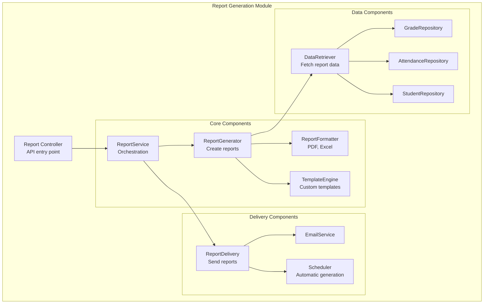

# 8.8 Hands-on Activities

[← Previous: 8.7 Error Handling and Logging](./8_7-error-handling-logging.md) | [Back to Chapter 8](./chapter-08-README.md) | [Next: 8.9 Chapter Summary →](./8_9-chapter-summary.md)

---

## Overview

This section contains practical exercises to reinforce the concepts covered in Chapter 8. Complete these activities to build your component design skills.

**Total Time:** 50 minutes

---

## Activity 1: Component Decomposition (15 minutes)

### Scenario

The School Management System needs a **Report Generation Module** with these requirements:

- Generate student transcripts (PDF and Excel)
- Generate class grade reports
- Generate attendance reports
- Send reports via email
- Schedule automatic report generation
- Support custom report templates

### Task

1. Decompose this into components
2. Define the interfaces between components
3. Identify which design patterns would be useful

### Your Solution

Draw or write your component decomposition here:

```
Component 1: _______________
  - Responsibility: _______________
  - Interface: _______________

Component 2: _______________
  - Responsibility: _______________
  - Interface: _______________

(continue for all components)
```

<details>
<summary>Click for Sample Solution</summary>



**Interfaces:**

```csharp
public interface IReportService
{
    Task<Report> GenerateReportAsync(ReportRequest request);
    Task ScheduleReportAsync(ScheduleRequest request);
}

public interface IReportGenerator
{
    Task<ReportContent> GenerateAsync(ReportType type, ReportData data);
}

public interface IReportFormatter
{
    byte[] Format(ReportContent content, OutputFormat format);
}

public interface IReportDelivery
{
    Task DeliverAsync(Report report, DeliveryOptions options);
}
```

**Patterns Used:**
- **Strategy Pattern**: Different formatters (PDF, Excel)
- **Factory Pattern**: Create different report types
- **Template Method**: Common report generation steps
- **Observer**: Notify when scheduled reports complete

</details>

---

## Activity 2: SOLID Principle Refactoring (15 minutes)

### The Problem Code

Refactor this code to follow SOLID principles:

```csharp
public class StudentManager
{
    private SqlConnection _connection = new SqlConnection("...");
    
    public void ProcessStudent(Student student, string operation)
    {
        if (operation == "add")
        {
            // Add to database
            var cmd = new SqlCommand("INSERT INTO Students...", _connection);
            cmd.ExecuteNonQuery();
            
            // Send welcome email
            var smtp = new SmtpClient("smtp.school.edu");
            smtp.Send(new MailMessage("admin@school.edu", student.Email, 
                "Welcome!", "Welcome to our school!"));
            
            // Log the action
            File.AppendAllText("log.txt", $"Added student: {student.Name}");
        }
        else if (operation == "update")
        {
            // Update database
            var cmd = new SqlCommand("UPDATE Students...", _connection);
            cmd.ExecuteNonQuery();
            
            // Log the action
            File.AppendAllText("log.txt", $"Updated student: {student.Name}");
        }
        else if (operation == "delete")
        {
            // Delete from database
            var cmd = new SqlCommand("DELETE FROM Students...", _connection);
            cmd.ExecuteNonQuery();
            
            // Send goodbye email
            var smtp = new SmtpClient("smtp.school.edu");
            smtp.Send(new MailMessage("admin@school.edu", student.Email, 
                "Goodbye", "We're sad to see you go."));
            
            // Log the action
            File.AppendAllText("log.txt", $"Deleted student: {student.Name}");
        }
    }
    
    public decimal CalculateGPA(int studentId)
    {
        var cmd = new SqlCommand("SELECT * FROM Grades WHERE StudentId = @id", _connection);
        // ... calculate GPA
        return 0;
    }
    
    public void GenerateTranscript(int studentId)
    {
        // ... generate PDF transcript
    }
}
```

### SOLID Violations to Fix

1. **SRP**: Class does too many things
2. **OCP**: Adding new operations requires modifying the class
3. **DIP**: Directly depends on concrete implementations

### Your Refactored Solution

Write your refactored code here:

```csharp
// Your solution...
```

<details>
<summary>Click for Sample Solution</summary>

```csharp
// Interfaces (Dependency Inversion)
public interface IStudentRepository
{
    void Add(Student student);
    void Update(Student student);
    void Delete(int studentId);
    Student GetById(int studentId);
}

public interface IEmailService
{
    Task SendAsync(string to, string subject, string body);
}

public interface ILogger
{
    void Log(string message);
}

// Single Responsibility: Only student data operations
public class StudentRepository : IStudentRepository
{
    private readonly IDbConnection _connection;
    
    public StudentRepository(IDbConnection connection)
    {
        _connection = connection;
    }
    
    public void Add(Student student)
    {
        // Database insert only
    }
    
    public void Update(Student student)
    {
        // Database update only
    }
    
    public void Delete(int studentId)
    {
        // Database delete only
    }
    
    public Student GetById(int studentId)
    {
        // Database select only
    }
}

// Single Responsibility: Only student-related business operations
public class StudentService
{
    private readonly IStudentRepository _repository;
    private readonly IEmailService _emailService;
    private readonly ILogger _logger;
    
    public StudentService(
        IStudentRepository repository,
        IEmailService emailService,
        ILogger logger)
    {
        _repository = repository;
        _emailService = emailService;
        _logger = logger;
    }
    
    public async Task EnrollStudentAsync(Student student)
    {
        _repository.Add(student);
        await _emailService.SendAsync(student.Email, "Welcome!", "Welcome to our school!");
        _logger.Log($"Added student: {student.Name}");
    }
    
    public void UpdateStudent(Student student)
    {
        _repository.Update(student);
        _logger.Log($"Updated student: {student.Name}");
    }
    
    public async Task WithdrawStudentAsync(int studentId)
    {
        var student = _repository.GetById(studentId);
        _repository.Delete(studentId);
        await _emailService.SendAsync(student.Email, "Goodbye", "We're sad to see you go.");
        _logger.Log($"Deleted student: {student.Name}");
    }
}

// Separate class for GPA (Single Responsibility)
public class GPACalculator
{
    private readonly IGradeRepository _gradeRepository;
    
    public GPACalculator(IGradeRepository gradeRepository)
    {
        _gradeRepository = gradeRepository;
    }
    
    public decimal Calculate(int studentId)
    {
        var grades = _gradeRepository.GetByStudent(studentId);
        // Calculate GPA
        return grades.Average(g => g.Points);
    }
}

// Separate class for Transcripts (Single Responsibility)
public class TranscriptGenerator
{
    private readonly IStudentRepository _studentRepository;
    private readonly IGradeRepository _gradeRepository;
    
    public byte[] Generate(int studentId)
    {
        // Generate PDF transcript
    }
}
```

</details>

---

## Activity 3: Design Pattern Implementation (15 minutes)

### Task: Implement the Strategy Pattern

Create a **grading strategy** system that supports different grading scales:

1. **Standard Scale**: A=90+, B=80+, C=70+, D=60+, F=below 60
2. **Curved Scale**: Top 10%=A, next 20%=B, next 40%=C, next 20%=D, bottom 10%=F
3. **Pass/Fail**: 60+ = Pass, below = Fail

### Requirements

- Define a strategy interface
- Implement three concrete strategies
- Create a context class that uses the strategies
- Show usage example

### Your Implementation

```csharp
// Write your implementation here...
```

<details>
<summary>Click for Sample Solution</summary>

```csharp
// Strategy Interface
public interface IGradingStrategy
{
    string GetLetterGrade(decimal score);
    string Name { get; }
}

// Concrete Strategy 1: Standard Scale
public class StandardGradingStrategy : IGradingStrategy
{
    public string Name => "Standard Scale";
    
    public string GetLetterGrade(decimal score)
    {
        return score switch
        {
            >= 90 => "A",
            >= 80 => "B",
            >= 70 => "C",
            >= 60 => "D",
            _ => "F"
        };
    }
}

// Concrete Strategy 2: Pass/Fail
public class PassFailStrategy : IGradingStrategy
{
    public string Name => "Pass/Fail";
    
    public string GetLetterGrade(decimal score)
    {
        return score >= 60 ? "Pass" : "Fail";
    }
}

// Concrete Strategy 3: Curved Scale
public class CurvedGradingStrategy : IGradingStrategy
{
    private readonly List<decimal> _allScores;
    
    public CurvedGradingStrategy(IEnumerable<decimal> allScores)
    {
        _allScores = allScores.OrderByDescending(s => s).ToList();
    }
    
    public string Name => "Curved Scale";
    
    public string GetLetterGrade(decimal score)
    {
        if (_allScores.Count == 0) return "N/A";
        
        var rank = _allScores.Count(s => s > score);
        var percentile = (decimal)rank / _allScores.Count;
        
        return percentile switch
        {
            <= 0.10m => "A",  // Top 10%
            <= 0.30m => "B",  // Next 20%
            <= 0.70m => "C",  // Next 40%
            <= 0.90m => "D",  // Next 20%
            _ => "F"          // Bottom 10%
        };
    }
}

// Context
public class GradeConverter
{
    private IGradingStrategy _strategy;
    
    public GradeConverter(IGradingStrategy strategy)
    {
        _strategy = strategy;
    }
    
    public void SetStrategy(IGradingStrategy strategy)
    {
        _strategy = strategy;
    }
    
    public string Convert(decimal score)
    {
        return _strategy.GetLetterGrade(score);
    }
    
    public string CurrentStrategy => _strategy.Name;
}

// Usage Example
public class Program
{
    public static void Main()
    {
        var scores = new List<decimal> { 95, 88, 76, 82, 91, 65, 73, 84, 79, 68 };
        var studentScore = 82m;
        
        // Using Standard Scale
        var converter = new GradeConverter(new StandardGradingStrategy());
        Console.WriteLine($"{converter.CurrentStrategy}: {converter.Convert(studentScore)}");
        // Output: Standard Scale: B
        
        // Switch to Pass/Fail
        converter.SetStrategy(new PassFailStrategy());
        Console.WriteLine($"{converter.CurrentStrategy}: {converter.Convert(studentScore)}");
        // Output: Pass/Fail: Pass
        
        // Switch to Curved
        converter.SetStrategy(new CurvedGradingStrategy(scores));
        Console.WriteLine($"{converter.CurrentStrategy}: {converter.Convert(studentScore)}");
        // Output: Curved Scale: C (82 is in middle 40%)
    }
}
```

</details>

---

## Activity 4: API Design Exercise (5 minutes)

### Task

Design a RESTful API for the **Attendance** feature with these requirements:

- Record attendance for a class session
- Get attendance for a student
- Get attendance for a class
- Mark bulk attendance (multiple students at once)
- Get attendance statistics

### Define Your Endpoints

| Method | Endpoint | Description | Request Body | Response |
|--------|----------|-------------|--------------|----------|
| | | | | |
| | | | | |
| | | | | |
| | | | | |
| | | | | |

<details>
<summary>Click for Sample Solution</summary>

| Method | Endpoint | Description | Request Body | Response |
|--------|----------|-------------|--------------|----------|
| POST | /classes/{classId}/attendance | Record single attendance | `{studentId, status, date}` | 201 + attendance |
| POST | /classes/{classId}/attendance/bulk | Record bulk attendance | `{date, records: [{studentId, status}]}` | 201 + count |
| GET | /students/{studentId}/attendance | Get student attendance | Query: ?from=&to=&courseId= | List of attendance |
| GET | /classes/{classId}/attendance | Get class attendance | Query: ?date= | List of attendance |
| GET | /students/{studentId}/attendance/stats | Get attendance statistics | Query: ?courseId= | Stats object |

**Example Request - Bulk Attendance:**
```json
POST /classes/101/attendance/bulk
{
    "date": "2026-01-10",
    "records": [
        { "studentId": 1, "status": "present" },
        { "studentId": 2, "status": "absent" },
        { "studentId": 3, "status": "tardy" }
    ]
}
```

**Example Response - Statistics:**
```json
GET /students/123/attendance/stats
{
    "studentId": 123,
    "totalDays": 90,
    "present": 82,
    "absent": 5,
    "tardy": 3,
    "attendanceRate": 91.1,
    "byCourse": [
        { "courseId": 101, "courseName": "Math", "rate": 95.0 },
        { "courseId": 102, "courseName": "English", "rate": 88.0 }
    ]
}
```

</details>

---

## Submission Checklist

Before submitting your activities, verify:

- [ ] Activity 1: Component diagram with clear responsibilities
- [ ] Activity 1: Interfaces defined for each component
- [ ] Activity 1: At least 2 design patterns identified
- [ ] Activity 2: Code refactored to follow SRP
- [ ] Activity 2: Dependencies injected through interfaces
- [ ] Activity 2: No direct instantiation of SqlConnection, SmtpClient
- [ ] Activity 3: Strategy interface defined
- [ ] Activity 3: At least 3 concrete strategies implemented
- [ ] Activity 3: Context class allows strategy swapping
- [ ] Activity 4: All 5 endpoints defined
- [ ] Activity 4: Appropriate HTTP methods used
- [ ] Activity 4: Clear request/response formats

---

## Bonus Challenge

If you finish early, try this advanced exercise:

**Implement the Observer pattern** for the grading system:
- When a grade is recorded, notify:
  - The student (email)
  - The parent (email)
  - The GPA calculator (recalculate)
  - The audit log (record change)

The grade service should NOT directly depend on any of these—use the Observer pattern to decouple them.

---

**Previous:** [← 8.7 Error Handling and Logging](./8_7-error-handling-logging.md)

**Next:** [8.9 Chapter Summary →](./8_9-chapter-summary.md)

---

*Estimated Time: 50 minutes*
